# Конструкция



- ПНСТ 542-2021 {#pnst-542-2021}

  

  На данной вкладке создаются и редактируются характеристики конструктивных слоев дорожной одежды.

  В верхней части данного окна расположены пиктограммы позволяющие добавлять конструктивные слои, а также удалять их, изменять их параметры или местоположение относительно других слоев дорожной одежды:

  

  Доступна функция [подбора](#542-2021-rezhim-rascheta) толщин слоя конструкции дорожной одежды, по критерию минимальной стоимости. Расчет может содержать несколько [вариантов](../../additionally/work_with_variants.md).

  {#542-2021-redaktirovanie}

  **Добавление слоя** {#542-2021-redaktirovanie-dobavlenie}

  Для добавления нового конструктивного слоя выполните следующие действия:

  1. Нажмите кнопку **Добавить слой**  Откроется следующие окно: 

     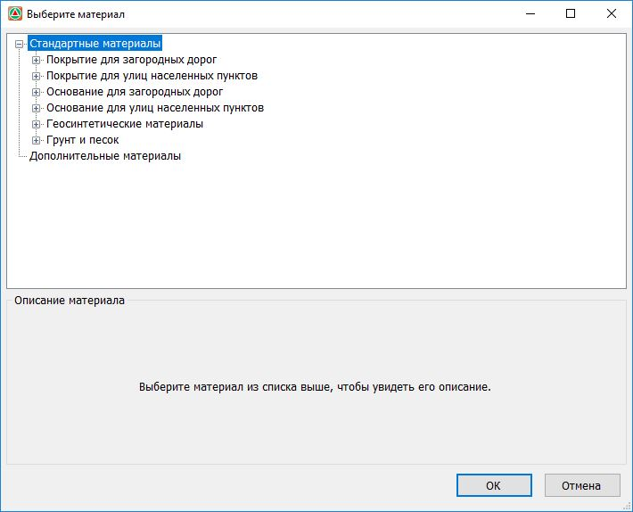

     В окне выбора материала, в группе **Стандартные материалы** представлен перечень материалов с расчетными характеристиками, указанными в данной нормативной методике. В других группах также представлены материалы с привязкой к соответствующему нормативному документу.

     В группе **Дополнительные материалы** может быть представлен набор индивидуальных конструктивных слоев добавленных пользователем самостоятельно. Последовательность действий по созданию слоев с индивидуальными характеристиками будет описана далее, в разделе **Библиотека материалов**.

  2. Раскройте список с наименованием **Стандартные материалы** и выберите из него требуемый материал слоя, щелкнув по его наименованию дважды левой кнопкой мыши:

     

     В результате выбранный слой отобразится в поле **Наименование**:
     

     

     При выделенном слое в списке, все его расчетные характеристики отображаются в поле **Свойства материала**:

     

     При необходимости данные характеристики могут быть отредактированы пользователем. Последовательность действий по редактированию параметров стандартных материалов будет описана ниже в разделе **Свойства материала**.

     

  3. Задайте толщину добавленного конструктивного слоя в поле **Расчетная толщина**;

     

     Если поле **Расчетная толщина** не доступно для ввода данных, в списке с наименованием **Режим расчета** выставите режим **Проверка**: 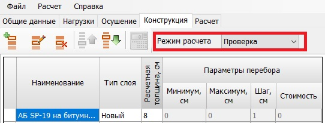 В данном случае станет не активна группа столбцов с наименованием Параметры перебора. Последовательность действий по подбору толщин конструктивных слоев дорожной одежды будет описана ниже в разделе [Режим расчета](#542-2021-rezhim-rascheta).

     

  4. Используя аналогичную последовательность действий, добавьте остальные конструктивные слои дорожной одежды:

     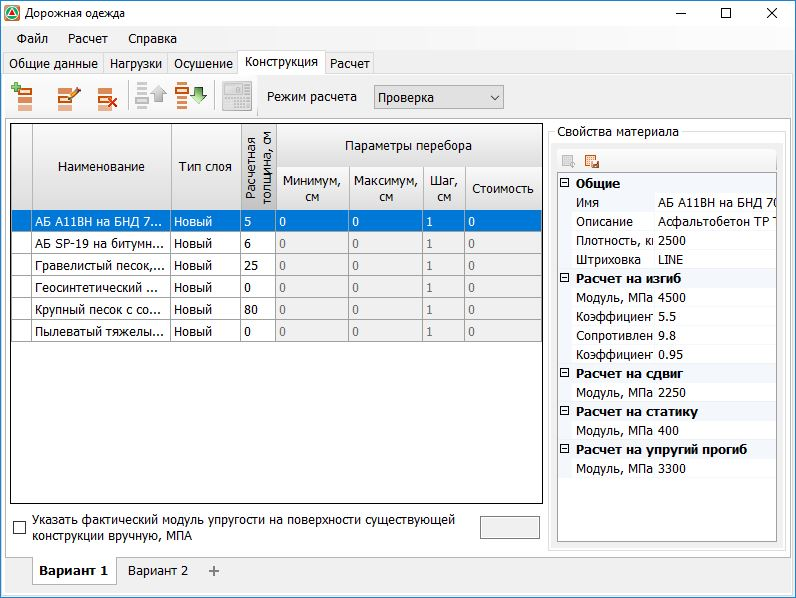

     

     Для грунта и геосинтетического материала толщины, шаг перебора и условная стоимость должны быть равны нулю.

     

  **Изменение слоя** {#542-2021-redaktirovanie-izmenenie}

  Для того чтобы изменить какой либо слой конструкции на другой, имеющийся в библиотеке материалов, выполните следующие действия:

  1. Выберите данный слой из общего списка слоев конструкции дорожной одежды и нажмите кнопку **Редактировать слой** . Откроется окно выбора материала: 

      

  2. Выберите из библиотеки другой конструктивный слой, который нужно назначить вместо текущего и нажмите **ОК**.

  После изменения слоя при необходимости измените значения его толщины и условной стоимости.

  **Удаление слоя** {#542-2021-redaktirovanie-udalenie}

  Для удаления какого-либо слоя из конструкции дорожной одежды:

  Выберите данный слой из общего списка слоев и нажмите кнопку **Удалить слой** . В результате выбранный слой будет удален из дорожной конструкции.

  **Перемещение слоя** {#542-2021-redaktirovanie-peremeshchenie}

  Если необходимо изменить положение какого-либо конструктивного слоя относительно других:

  1. Выберите данный слой из общего списка и нажмите кнопку **Переместить слой вниз** , либо **Переместить слой вверх**;

  2. Выбранный слой будет перемещен на один уровень вверх, либо вниз. Для перемещения слоя еще на несколько уровней повторно воспользуйтесь данной функцией.

  

  {#542-2021-rezhim-rascheta}

  В программе имеется возможность подбора оптимальной конструкции дорожной одежды по критерию минимальной стоимости. Для подбора конструкции дорожной одежды выполните следующие действия:

  1. Убедитесь, что на вкладке **Конструкция** в поле **Наименование** заданы все конструктивные слои дорожной одежды:

     

     

     До подбора конструкции не обязательно задавать значение толщин конструктивных слоев в поле **Расчетная толщина**.

     

  2. В выпадающем списке установите режим **Подбор**: 

     

     После установления данного режима станут активны для ввода столбцы группы **Параметры подбора**.

  3. В столбцах **Параметры подбора** задайте значения **Минимальной** и **Максимальной толщины** конструктивных слоев дорожной одежды, а также шаг перебора от минимума до максимума.

  * **Шаг перебора** задается индивидуально для каждого конструктивного слоя.

    

     Не рекомендуется задавать очень малый шаг перебора для слоев, у которых сильно отличается значение Минимальной и Максимально допустимой толщины, т.к. в этом случае будет рассчитываться очень большое количество вариантов, в результате чего процедура подбора может занять долгое время.

    

  * Если какой либо конструктивный слой не участвует в подборе, то значение его **Минимальной** и **Максимальной толщины** задается одинаковой.
  * Для грунта и геосинтетического материала толщины, шаг перебора и условная стоимость не задаются, т.к. они (грунт и геосетка) не участвуют в процедуре подбора конструкции.
  * Если конструкция будет подбираться по критерию минимальной приведенной стоимости, то для каждого конструктивного слоя, также должно быть задано значение его условной стоимости. Данное значение задается в столбце **Стоимость**, в рублях или других условных единицах, для слоя толщиной 1 см. на единицу площади покрытия.

  4. После задания всех необходимых параметров для подбора конструкции нажмите кнопку **Подобрать**, расположенную в верхней части окна: 

     

     В открывшемся окне установите опции напротив критериев расчета, которые будут учитываться при подборе конструкции и нажмите **ОК**: 

     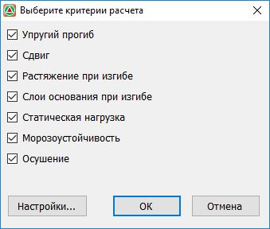

     

     [Настройки расчета](../../road_tasks.md?tabs=road-tasks_pnst-542-2021) были описаны ранее в соответствующем разделе.

     

  5. В результате, начнется процесс подбора вариантов конструкции:

     

  По окончании данного процесса откроется список вариантов конструкции прошедших процедуру подбора: 

  

  При подборе конструкции происходит расчет всех возможных вариантов толщин слоев, с учетом заданного шага перебора. Варианты не удовлетворяющие какому либо критерию прочности отбраковываются.

  Для сортировки всех отображаемых вариантов по какому-либо критерию, щелкните левой кнопкой мыши по наименованию соответствующего столбца. К примеру, если щелкнуть по столбцу **Стоимость**, то варианты конструкций будут сгруппированы в списке в порядке нарастания суммарной условной стоимости конструкции. Если же щелкнуть по столбцу с наименованием какого-то конструктивного слоя, то будет выполнена сортировка вариантов, в порядке нарастания его толщины.

  В результате, в качестве расчетных толщин будут приняты значения соответствующие выбранному (подобранному) варианту конструкции:

  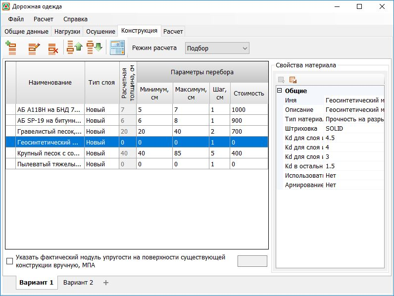

  

  {#542-2021-usilenie-sloya}

  Согласно п. 6.13.1 ПНСТ 542-2021 величина общего модуля упругости на поверхности рабочего слоя земляного полотна (при расчетной влажности грунта земляного полотна) в зависимости от ДКЗ должна быть не ниже следующих значений:

  * 60 МПа – в ДКЗ I и II;
  * 53 МПа – в ДКЗ III;
  * 45 МПа – в ДКЗ IV, V.

  

  В ДКЗ I в зоне распространения многолетнемерзлых грунтов дополнительно должны быть учтены характер многолетнемерзлых грунтов, их температурный и водный режим, а также влияние толщины деятельного слоя и многолетнемерзлого грунта на прочность дорожной одежды.

  

  Если при расчете фактический модуль упругости рабочего слоя окажется ниже требуемого программа отобразит предупреждение в программе (если включена соответствующая [настройка](../../road_tasks.md#542-2021-preduprezhdeniya)), а также в отчете отобразит не соответствие по п. 6.13.1.

  Для увеличения общего модуля на поверхности рабочего слоя земполотна в программе предусмотрены следующие мероприятия (п. 6.13.2 ПНСТ 542-2021):

  * **Укрепление грунта верхней части рабочего слоя вяжущими или местными материалами.**

    Для этого, в окне свойств материла в разделе с наименованием Рабочий слой выберите параметр Укрепление. После этого станут доступны следующие параметры:

    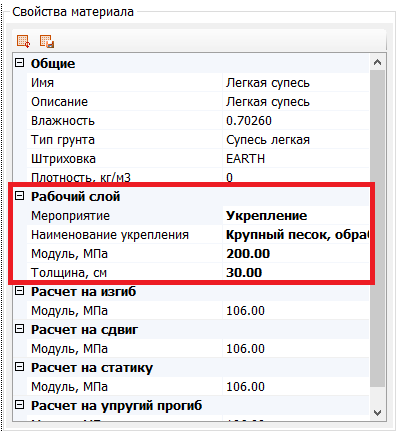

    **Наименование укрепления** – в данном поле задается материал, которым укрепляют грунт. Данный материал можно выбрать из библиотеки или ввести его название самостоятельно.

    **Модуль, Мпа** – в данном поле задаётся модуль упругости материала, которым укрепляем грунт. Если материл был выбран из библиотеки, то его модуль назначается автоматически.

    **Толщина, см** - в данном поле задаётся толщина слоя укрепления.

    После здания данных параметров программа автоматически рассчитает модуль на поверхности укрепленного рабочего слоя. Расчет на морозоустойчивость также производится с учетом толщины укрепления рабочего слоя. Расчет конструкции дорожной одежды по условию сдвигоустойчивости грунта рабочего слоя, укрепленного вяжущим, не проводится.

  * **Стабилизация грунта рабочего слоя.**

    В окне свойств материла в разделе с наименованием Рабочий слой выберите вариант Стабилизация. После этого станут доступны следующие параметры:

    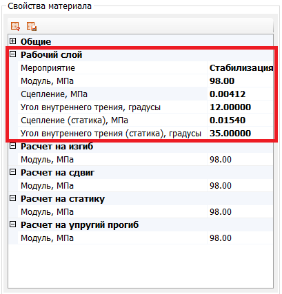

    В данных полях задаются расчетные характеристики стабилизированного грунта. Их назначают в зависимости от примененного стабилизатора в соответствии с действующими нормативными документами или по данным лабораторных испытаний.

  

  {#542-2021-modul-uprugosti-fakt}

  Согласно **ПНСТ 542-2021** возможны два варианта задания исходных данных для расчета конструкции усиления – если имеются данные о фактических модулях упругости, и если нет достоверных данных.

  Если данная опция установлена, и значение фактического модуля упругости на поверхности существующей конструкции задано вручную, то программа выполняем расчет на упругий прогиб с учетом соответствующего заданного значения. Расчеты на изгиб и сдвиг выполняются только для новых слоев дорожной одежды. При этом для расчета на сдвиг используется тоже же значение фактического модуля упругости существующей конструкции.

  Если же данная опция не установлена и значение фактического модуля упругости не задано, то конструкция дорожной одежды (включая существующие слои) рассчитывается целиком. Значения прочностных характеристик для каждого слоя (как нового, так и существующего) принимается индивидуально, в соответствии со значениями заданными в библиотеки материалов программы.

  

  При наличии в конструкции слоев усиления, не зависимо от настройки задания значения существующего модуля упругости, расчет выполняется по критерию упругого прогиба, сдвига, статики и растяжение при изгибе. Расчет на морозоустойчивость и осушение не производится.

  

  

  {#542-2021-sloi-iznosa}

  Расчет по **ПНСТ 542-2021** может осуществляться с учетом последующей величины износа верхнего слоя покрытия. Для этого в поле **Слои износа на поверхности покрытия** нужно установить соответствующую настройку и самостоятельно задать значение величины износа.

  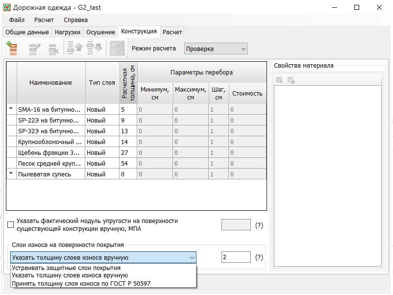

  В данном случае, при расчете толщина верхнего слоя будет приниматься за вычетом назначенной величины износа. Эта информация также будет отображена в выходных отчетах, где будет указана как полная толщина слоя, так и расчетная толщина с учетом износа.

  Опция **Устраивать защитные слои на поверхности покрытия** является информационной и не влияет на результаты расчета. При установлении данной настройки в выходных отчетах будут дополнительно добавлены требования о необходимости устройства дополнительных защитных слоев.

  Опция **Принять толщину слоя износа по ГОСТ Р 50597** - в данном случае толщина слоя износа принимается в соответствии с п.6.5 ПНСТ 542-2021 из таблицы 5.3 ГОСТ Р 50597.

  

- ПНСТ 265-2018 {#pnst-265-2018}

  

  На данной вкладке создаются и редактируются характеристики конструктивных слоев дорожной одежды.

  В верхней части данного окна расположены пиктограммы позволяющие добавлять конструктивные слои, а также удалять их, изменять их параметры или местоположение относительно других слоев дорожной одежды:

  

  Доступна функция [подбора](#265-2018-rezhim-rascheta) толщин слоя конструкции дорожной одежды, по критерию минимальной стоимости. Расчет может содержать несколько [вариантов](../../additionally/work_with_variants.md).

  {#265-2018-redaktirovanie}

  **Добавление слоя** {#265-2018-redaktirovanie-dobavlenie}

  Для добавления нового конструктивного слоя выполните следующие действия:

  1. Нажмите кнопку **Добавить слой**  Откроется следующие окно: 

     

     В окне выбора материала, в группе **Стандартные материалы** представлен перечень материалов с расчетными характеристиками, указанными в данной нормативной методике. В других группах также представлены материалы с привязкой к соответствующему нормативному документу.

     В группе **Дополнительные материалы** может быть представлен набор индивидуальных конструктивных слоев добавленных пользователем самостоятельно. Последовательность действий по созданию слоев с индивидуальными характеристиками будет описана далее, в разделе **Библиотека материалов**.

  2. Раскройте список с наименованием **Стандартные материалы** и выберите из него требуемый материал слоя, щелкнув по его наименованию дважды левой кнопкой мыши: 

     

     В результате выбранный слой отобразится в поле **Наименование**:

      

     

     При выделенном слое в списке, все его расчетные характеристики отображаются в поле **Свойства материала**:

     

     При необходимости данные характеристики могут быть отредактированы пользователем. Последовательность действий по редактированию параметров стандартных материалов будет описана ниже в разделе **Свойства материала**.

     

  3. Задайте толщину добавленного конструктивного слоя в поле **Расчетная толщина**;

     

     Если поле **Расчетная толщина** не доступно для ввода данных, в списке с наименованием **Режим расчета** выставите режим **Проверка**: 

      

     В данном случае станет не активна группа столбцов с наименованием Параметры перебора. Последовательность действий по подбору толщин конструктивных слоев дорожной одежды будет описана ниже в разделе [Режим расчета](#265-2018-rezhim-rascheta).

     

  4. Используя аналогичную последовательность действий, добавьте остальные конструктивные слои дорожной одежды:

     

     

     Для грунта и геосинтетического материала толщины, шаг перебора и условная стоимость должны быть равны нулю.

     

  **Изменение слоя** {#265-2018-redaktirovanie-izmenenie}

  Для того чтобы изменить какой либо слой конструкции на другой, имеющийся в библиотеке материалов, выполните следующие действия:

  1. Выберите данный слой из общего списка слоев конструкции дорожной одежды и нажмите кнопку **Редактировать слой**. Откроется окно выбора материала:

      

  2. Выберите из библиотеки другой конструктивный слой, который нужно назначить вместо текущего и нажмите **ОК**.

  После изменения слоя при необходимости измените значения его толщины и условной стоимости.

  **Удаление слоя** {#265-2018-redaktirovanie-udalenie}

  Для удаления какого-либо слоя из конструкции дорожной одежды:

  Выберите данный слой из общего списка слоев и нажмите кнопку **Удалить слой** В результате выбранный слой будет удален из дорожной конструкции.

  **Перемещение слоя** {#265-2018-redaktirovanie-peremeshchenie}

  Если необходимо изменить положение какого-либо конструктивного слоя относительно других:

  1. Выберите данный слой из общего списка и нажмите кнопку **Переместить слой вниз** , либо **Переместить слой вверх** ;

  2. Выбранный слой будет перемещен на один уровень вверх, либо вниз. Для перемещения слоя еще на несколько уровней повторно воспользуйтесь данной функцией.

  

  {#265-2018-rezhim-rascheta}

  В программе имеется возможность подбора оптимальной конструкции дорожной одежды по критерию минимальной стоимости. Для подбора конструкции дорожной одежды выполните следующие действия:

  1. Убедитесь, что на вкладке **Конструкция** в поле **Наименование** заданы все конструктивные слои дорожной одежды: 

     

     

     До подбора конструкции не обязательно задавать значение толщин конструктивных слоев в поле **Расчетная толщина**.

     

  2. В выпадающем списке установите режим **Подбор**: 

     

     После установления данного режима станут активны для ввода столбцы группы **Параметры подбора**.

  3. В столбцах **Параметры подбора** задайте значения **Минимальной** и **Максимальной толщины** конструктивных слоев дорожной одежды, а также шаг перебора от минимума до максимума.

  * **Шаг перебора** задается индивидуально для каждого конструктивного слоя.

    

     Не рекомендуется задавать очень малый шаг перебора для слоев, у которых сильно отличается значение Минимальной и Максимально допустимой толщины, т.к. в этом случае будет рассчитываться очень большое количество вариантов, в результате чего процедура подбора может занять долгое время.

    

  * Если какой либо конструктивный слой не участвует в подборе, то значение его **Минимальной** и **Максимальной толщины** задается одинаковой.
  * Для грунта и геосинтетического материала толщины, шаг перебора и условная стоимость не задаются, т.к. они (грунт и геосетка) не участвуют в процедуре подбора конструкции.
  * Если конструкция будет подбираться по критерию минимальной приведенной стоимости, то для каждого конструктивного слоя, также должно быть задано значение его условной стоимости. Данное значение задается в столбце **Стоимость**, в рублях или других условных единицах, для слоя толщиной 1 см. на единицу площади покрытия.

  4. После задания всех необходимых параметров для подбора конструкции нажмите кнопку **Подобрать**, расположенную в верхней части окна: 

     

     В открывшемся окне установите опции напротив критериев расчета, которые будут учитываться при подборе конструкции и нажмите **ОК**: 

     

     

     [Настройки расчета](../../road_tasks.md?tabs=road-tasks_pnst-265-2018) были описаны ранее в соответствующем разделе.

     

  5. В результате, начнется процесс подбора вариантов конструкции: 

     

  По окончании данного процесса откроется список вариантов конструкции прошедших процедуру подбора: 

  

  При подборе конструкции происходит расчет всех возможных вариантов толщин слоев, с учетом заданного шага перебора. Варианты не удовлетворяющие какому либо критерию прочности отбраковываются.

  Для сортировки всех отображаемых вариантов по какому-либо критерию, щелкните левой кнопкой мыши по наименованию соответствующего столбца. К примеру, если щелкнуть по столбцу **Стоимость**, то варианты конструкций будут сгруппированы в списке в порядке нарастания суммарной условной стоимости конструкции. Если же щелкнуть по столбцу с наименованием какого-то конструктивного слоя, то будет выполнена сортировка вариантов, в порядке нарастания его толщины.

  В результате, в качестве расчетных толщин будут приняты значения соответствующие выбранному (подобранному) варианту конструкции:

  

  

  {#265-2018-modul-uprugosti-fakt}

  Согласно **ПНСТ 265-2014** возможны два варианта задания исходных данных для расчета конструкции усиления – если имеются данные о фактических модулях упругости, и если нет достоверных данных.

  Если данная опция установлена, и значение фактического модуля упругости на поверхности существующей конструкции задано вручную, то программа выполняем расчет на упругий прогиб с учетом соответствующего заданного значения. Расчеты на изгиб и сдвиг выполняются только для новых слоев дорожной одежды. При этом для расчета на сдвиг используется тоже же значение фактического модуля упругости существующей конструкции.

  Если же данная опция не установлена и значение фактического модуля упругости не задано, то конструкция дорожной одежды (включая существующие слои) рассчитывается целиком. Значения прочностных характеристик для каждого слоя (как нового, так и существующего) принимается индивидуально, в соответствии со значениями заданными в библиотеки материалов программы.

  

  При наличии в конструкции слоев усиления, не зависимо от настройки задания значения существующего модуля упругости, расчет выполняется по критерию упругого прогиба, сдвига, статики и растяжение при изгибе. Расчет на морозоустойчивость и осушение не производится.

  

  

  {#265-2018-sloi-iznosa}

  Расчете по **ПНСТ265-2018** может осуществляться с учетом последующей величина износа верхнего слоя покрытия. Для этого в поле **Слои износа на поверхности покрытия** нужно установить соответствующую настройку и самостоятельно задать значение величины износа. 

  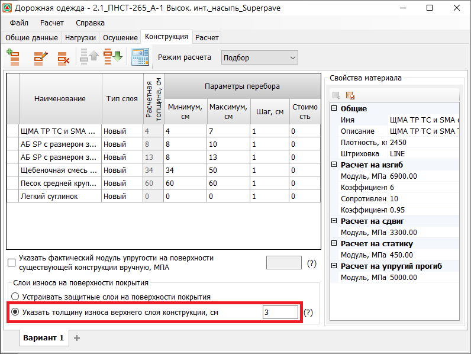

  В данном случае, при расчете толщина верхнего слоя будет приниматься за вычетом назначенной величины износа. Эта информация также будет отображена в выходных отчетах, где будет указана как полная толщина слоя, так и расчетная толщина с учетом износа.

  Опция **Устраивать защитные слои на поверхности покрытия** является информационной и не влияет на результаты расчета. При установлении данной настройки в выходных отчетах будут дополнительно добавлены требования о необходимости устройства дополнительных защитных слоев.

  

- ОДН 218.046-01, МР (взамен ВСН 197-91) {#odn-218-046-01}

  

  На данной вкладке создаются и редактируются характеристики конструктивных слоев дорожной одежды.

  В верхней части данного окна расположены пиктограммы позволяющие добавлять конструктивные слои, а также удалять их, изменять их параметры или местоположение относительно других слоев дорожной одежды:

  

  Доступна функция [подбора](#218-046-01-rezhim-rascheta) толщин слоя конструкции дорожной одежды, по критерию минимальной стоимости. Расчет может содержать несколько [вариантов](../../additionally/work_with_variants.md).

  В случае проектирования дорожной одежды жесткого и полужесткого типа дополнительно могут быть назначены следующие характеристики:

  - [Тип армирования плиты](#218-046-01-armirovanie)
  - [Принимать минимальную толщину плиты с учетом МР](#218-046-01-min-tolshina)
  - [Штыри в поперечных швах](#218-046-01-shtyri)
  - [Использовать в конструкции пропаренный бетон](#218-046-01-proparennyi-beton)

  {#218-046-01-redaktirovanie}

  **Добавление слоя** {#218-046-01-redaktirovanie-dobavlenie}

  Для добавления нового конструктивного слоя выполните следующие действия:

  1. Нажмите кнопку **Добавить слой** . Откроется следующее окно:

     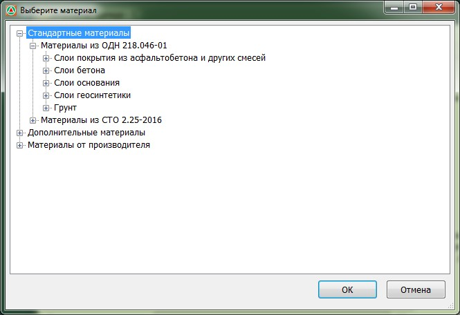

     В окне выбора материала, в группе **Материалы из ОДН 218.046-01**, представлен перечень материалов с расчетными характеристиками, указанными в данной нормативной методике. В других группах также представлены материалы с привязкой к соответствующему нормативному документу.

     В группе **Дополнительные материалы** может быть представлен набор индивидуальных конструктивных слоев, добавленных пользователем самостоятельно. Последовательность действий по созданию слоев с индивидуальными характеристиками будет описана далее, в разделе **Библиотека материалов**.

  2. Раскройте список с наименованием **Стандартные материалы** и выберите из него требуемый материал слоя, щелкнув по его наименованию дважды левой кнопкой мыши:

     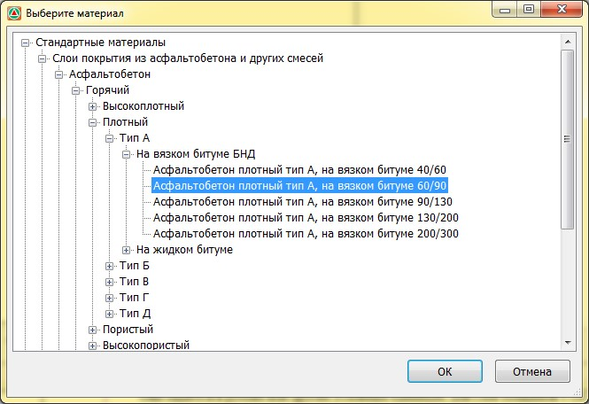

     В результате выбранный слой отобразится в поле **Наименование**:

     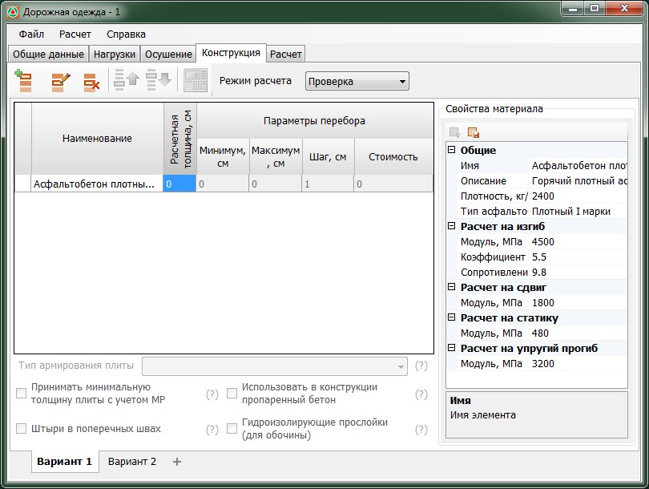

     

     При выделенном слое в списке все его расчетные характеристики отображаются в поле **Свойства материала**:

     

     При необходимости данные характеристики могут быть отредактированы пользователем. Последовательность действий по редактированию параметров стандартных материалов будет описана ниже, в разделе Свойства материала.

     

  3. Задайте толщину добавленного конструктивного слоя в поле **Расчетная толщина**;

     

     Если поле Расчетная толщина недоступно для ввода данных, в списке с наименованием Режим расчета выставите режим Проверка: 

     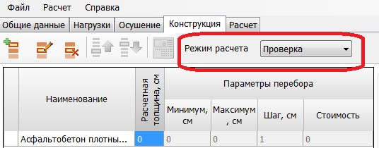 

     В данном случае группа столбцов с наименованием Параметры перебора станет неактивной. Последовательность действий по подбору толщин конструктивных слоев дорожной одежды будет описана ниже, в разделе [Режим расчета](#218-046-01-rezhim-rascheta).

     

  4. Используя аналогичную последовательность действий, добавьте остальные конструктивные слои дорожной одежды: 

     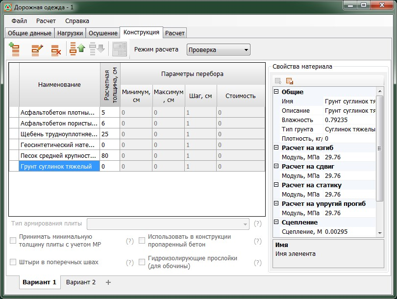

     

     Для грунта и геосинтетического материала толщины шаг перебора и условная стоимость должны быть равны нулю.

     

  **Изменение слоя** {#218-046-01-redaktirovanie-izmenenie}

  Для того чтобы заменить какой-либо слой конструкции на другой, имеющийся в библиотеке материалов, выполните следующие действия:

  1. Выберите данный слой из общего списка слоев конструкции дорожной одежды и нажмите кнопку **Редактировать слой**. Откроется окно выбора материала:

     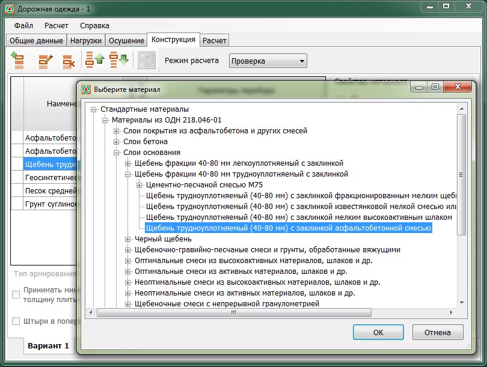

  2. Выберите из библиотеки другой конструктивный слой, который нужно назначить вместо текущего и нажмите **ОК**.

  После изменения слоя при необходимости измените значения его толщины и условной стоимости.

  **Удаление слоя** {#218-046-01-redaktirovanie-udalenie}

  Для удаления какого-либо слоя из конструкции дорожной одежды:

  Выберите данный слой из общего списка слоев и нажмите кнопку **Удалить слой** . В результате выбранный слой будет удален из дорожной конструкции.

  **Перемещение слоя** {#218-046-01-redaktirovanie-peremeshchenie}

  Если необходимо изменить положение какого-либо конструктивного слоя относительно других:

  1. Выберите данный слой из общего списка и нажмите кнопку **Переместить слой вниз** или **Переместить слой вверх**;

  2. Выбранный слой будет перемещен на один уровень вверх или вниз. Для перемещения слоя еще на несколько уровней повторно воспользуйтесь данной функцией.

  

  {#218-046-01-rezhim-rascheta}

  В программе имеется возможность подбора оптимальной конструкции дорожной одежды по критерию минимальной стоимости. Для подбора конструкции дорожной одежды выполните следующие действия:

  1. Убедитесь, что на вкладке **Конструкция** в поле **Наименование** заданы все конструктивные слои дорожной одежды:

     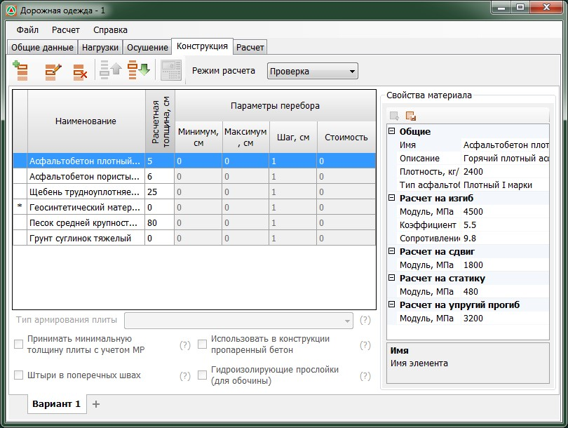

     

     До подбора конструкции не обязательно задавать значение толщин конструктивных слоев в поле Расчетная толщина.

     

  2. В выпадающем списке установите режим **Подбор**: 

     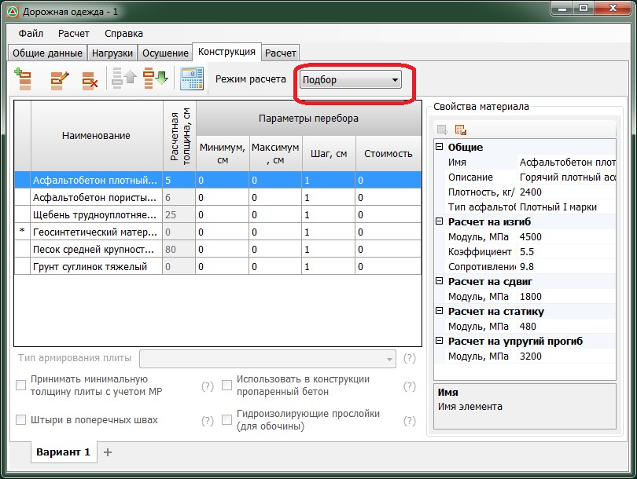

     После установления данного режима станут активны для ввода столбцы группы **Параметры подбора**.

  3. В столбцах **Параметры подбора** задайте значения **Минимальной** и **Максимальной толщины** конструктивных слоев дорожной одежды, а также шаг перебора от минимума до максимума.

  * **Шаг перебора** задается индивидуально для каждого конструктивного слоя.

    

    Не рекомендуется задавать очень малый шаг перебора для слоев, у которых сильно отличается значение Минимальной и Максимально допустимой толщины, т.к. в этом случае будет рассчитываться очень большое количество вариантов, в результате чего процедура подбора может занять долгое время.

    

  * Если какой-либо конструктивный слой не участвует в подборе, то значение его **Минимальной** и **Максимальной толщины** задается одинаковой.
  * Для грунта и геосинтетического материала толщины шаг перебора и условная стоимость не задаются, т.к. они (грунт и геосетка) не участвуют в процедуре подбора конструкции.
  * Если конструкция будет подбираться по критерию минимальной приведенной стоимости, то для каждого конструктивного слоя также должно быть задано значение его условной стоимости. Данное значение задается в столбце **Стоимость**, в рублях или других условных единицах для слоя толщиной 1 см. на единицу площади покрытия.

  4. После задания всех необходимых параметров для подбора конструкции нажмите кнопку **Подобрать**, расположенную в верхней части окна: 

     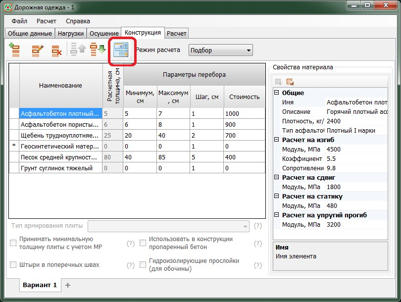

     В открывшемся окне установите опции напротив критериев расчета, которые будут учитываться при подборе конструкции и нажмите **ОК**: 

     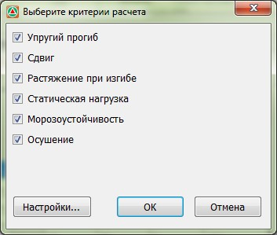

     

     [Настройки расчета](../../road_tasks.md?tabs=road-tasks_odn-218-046-01) были описаны ранее в соответствующем разделе.

     

  5. В результате начнется процесс подбора вариантов конструкции:

     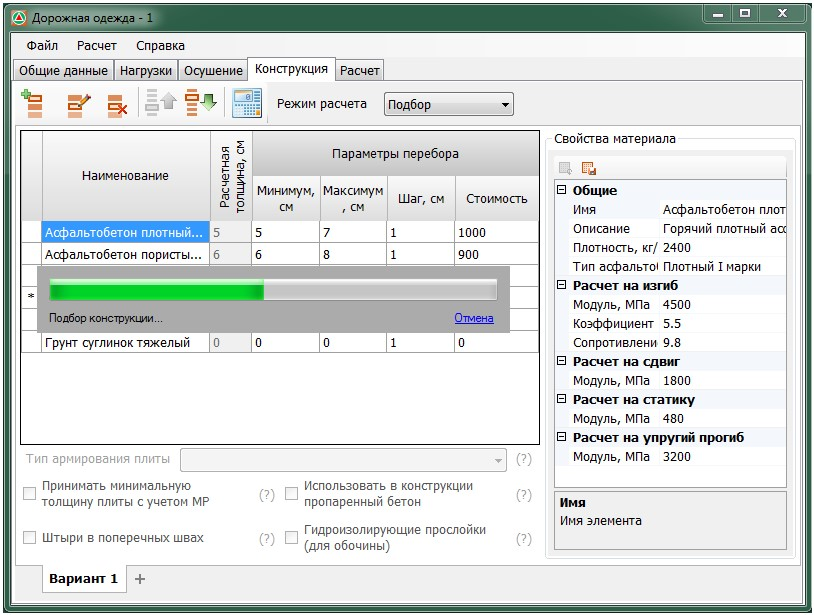

  По окончании данного процесса откроется список вариантов конструкции, прошедших процедуру подбора:

  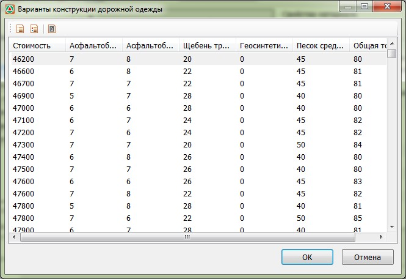

  При подборе конструкции происходит расчет всех возможных вариантов толщин слоев с учетом заданного шага перебора. Варианты, не удовлетворяющие какому-либо критерию прочности, отбраковываются. Проверка происходит по всем критериям прочности, соответствующим данному типу расчета и типу дорожной одежды (нежесткая дорожная, жесткая дорожная одежда, расчет слоев усиления и т.п.).

  Для сортировки всех отображаемых вариантов по какому-либо критерию, щелкните левой кнопкой мыши по наименованию соответствующего столбца. К примеру, если щелкнуть по столбцу **Стоимость**, то варианты конструкций будут сгруппированы в списке в порядке нарастания суммарной условной стоимости конструкции. Если же щелкнуть по столбцу с наименованием какого-либо конструктивного слоя, то будет выполнена сортировка вариантов в порядке нарастания его толщины.

  В результате в качестве расчетных толщин будут приняты значения, соответствующие выбранному (подобранному) варианту конструкции:

  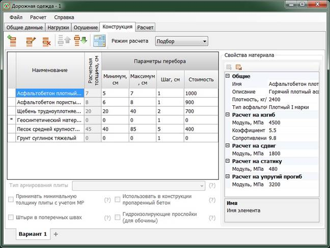

  

  {#218-046-01-armirovanie}

  Данная характеристика задается в нижней части вкладки **Конструкция**. Имеется возможность выбрать **Тип армирования** из соответствующего селектора:

  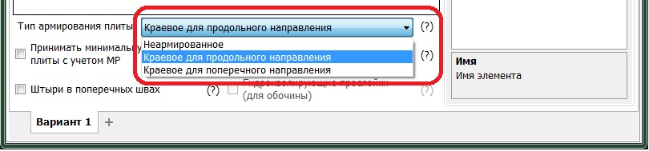

  Выбор вариантов армирования используется при расчете растягивающих напряжений при изгибе плиты c помощью коэффициента $К\_м$, учитывающего влияние месторасположения нагрузки (согласно МР, формула 3.9).

  $$\sigma_{pt}=\frac{Q \cdot K_{м} \cdot 60 \cdot K_{y} \cdot K_{шт}}{h^2 \cdot K_{т}}\left ( 0.0592-0.21371\lg\frac{R}{1_{y}} \right)$$

  Возможны следующие варианты армирования покрытия:

  * Неармированное покрытие ($К_м$ = 1,5);
  * Покрытие с краевым армированием или площадка с расположением полос наката не ближе чем 0,8 м. от внешнего продольного края покрытия, для продольного направления ($К_м$ = 1.0);
  * Покрытие с краевым армированием или площадка с расположением полос наката не ближе чем 0,8 м от внешнего продольного края покрытия, для поперечного направления ($К_м$ = 1.5).

  

  {#218-046-01-min-tolshina}

  Включение опции позволяет принять минимальную толщину плиты не менее указанной в таблице 2.1 **МР**.

  #|
  || **Основание** {.cell-align-center} | **Минимальная толщина, см, покрытия при интенсивности движения расчетной нагрузки, ед/сут на полосу** {.cell-align-center} |>|>|>|>||
  ||^| **более 2000** {.cell-align-center} | **1000 - 2000** {.cell-align-center} | **500 - 1000** {.cell-align-center} | **100 - 500** {.cell-align-center} | **менее 100$\ast\ast$** {.cell-align-center} ||
  || Бетонное (мелкозернистый бетон, шлакобетон) | 22 {.cell-align-center} | 20 {.cell-align-center} | 18 (16) {.cell-align-center} | 18\* (16) {.cell-align-center} | 15\* {.cell-align-center} ||
  || Из материалов, укрепленных неорганическими вяжущими | 22 {.cell-align-center} | 20 {.cell-align-center} | 18 (16) {.cell-align-center} | 18\* (16) {.cell-align-center} | 15\* {.cell-align-center} ||
  || Из щебня, гравия, шлака | - {.cell-align-center} | 22 {.cell-align-center} | 20 (18) {.cell-align-center} | 18\* (16) {.cell-align-center} | 16\* {.cell-align-center} ||
  || Из песка, песчано-гравийной смеси | - {.cell-align-center} | - {.cell-align-center} | 20 (18) {.cell-align-center} | 18 (16) {.cell-align-center} | 16 {.cell-align-center} ||
  |#

  

  1. Если толщина плиты на вкладке Конструкция дорожной одежды задана меньше, чем в таблице 2.1 **МР**, то при включенной опции программа произведет подбор вариантов конструкции дорожной одежды и примет минимальную толщину плиты, исходя из таблицы 2.1 **МР**.
  2. В скобках приведена толщина покрытия для облегченных условий движения.
  3. Если в поперечных швах штыри не применяются, толщину покрытия увеличивают на 2 см.

  

  

  {#218-046-01-shtyri}

  Выбор вариантов армирования используется при расчете растягивающих напряжений при изгибе плиты c помощью коэффициента $К_{шт}$, при этом учитывается влияние штыревых соединений на условия контактирования плиты с основанием (согласно **МР**, формула 3.9).

  $$\sigma_{pt}=\frac{Q \cdot K_{м} \cdot 60 \cdot K_{y} \cdot K_{шт}}{h^2 \cdot K_{т}}\left ( 0.0592-0.21371\lg\frac{R}{1_{y}} \right)$$

  Учет штыревых соединений осуществляется следующим образом:

  * При наличии штырей в поперечных швах ($К_{шт}$=1.00);
  * При отсутствии штырей в поперечных швах ($К_{шт}$=1.05).

  

  {#218-046-01-proparennyi-beton}

  Включение данной опции используется при определении расчетного сопротивления бетона на растяжение при изгибе (согласно **МР**, формула 3.7).

  $$R_{рн}^{расч}=B_{tb}\cdot K_{н.п}\cdot K_{y}\cdot K_{F}$$

  Учитывается с помощью коэффициента набора прочности со временем Кн.п. следующим образом:

  * Для пропаренного бетона ($К_{н.п}$=1);
  * Для непропаренного бетона $К_{н.п}$ определяется исходя из дорожно-климатической зоны (вкладка [Общие данные](common_data.md?tabs=common-data-archive_odn-218-046-01)). $К_{н.п}$ = 1.2 - для районов с умеренным климатом и $К_{н.п}$ = 1.0 - для условий сухого и жаркого климата.

  

  {#218-046-01-gidroizolyaciya}

  Данная опция используется при определении расчетной влажности грунта для расчета конструкции остановочной полосы обочины (согласно **ОДН 218.3.039-2003**, п.3.10).

  

- ОДН 218.1.052-2002 {#odn-218-1-052-2002}

  

  На данной вкладке в верхнем поле задаются конструктивные слои существующей дорожной одежды, в нижнем поле задаются проектные слои, используемые для усиления существующей конструкции.

  В каждом поле расположены пиктограммы позволяющие добавлять конструктивные слои, а также удалять их, изменять их параметры или местоположение относительно других слоев дорожной одежды:

  

  Доступна функция [подбора](#218-1-052-2002-rezhim-rascheta) толщин слоя конструкции дорожной одежды, по критерию минимальной стоимости. Расчет может содержать несколько [вариантов](../../additionally/work_with_variants.md).

  Также, здесь могут быть назначены следующие настройки расчета: В случае проектирования дорожной одежды жесткого и полужесткого типа дополнительно могут быть назначены следующие характеристики:

  - [Оценка расчета конструкции по соотношению коэффициентов прочности](#218-1-052-2002-ocenka)
  - [Указать фактический модуль упругости, МПа](#218-1-052-2002-modul-fakt)
  - [Глубина фрезерования (разборки) покрытия, см](#218-1-052-2002-frezerovanie)
  - [Указать требуемый модуль упругости, МПа](#218-1-052-2002-modul-treb)

  {#218-1-052-2002-redaktirovanie}

  **Добавление слоя** {#218-1-052-2002-redaktirovanie-dobavlenie}

  Для добавления нового конструктивного слоя выполните следующие действия:

  1. Нажмите кнопку **Добавить слой** . Откроется следующие окно:

     

     В окне выбора материала, в группе **Материалы из ОДН 218.046-01**, представлен перечень материалов с расчетными характеристиками, указанными в данной нормативной методике. В других группах также представлены материалы с привязкой к соответствующему нормативному документу.

     В группе **Дополнительные материалы** может быть представлен набор индивидуальных конструктивных слоев, добавленных пользователем самостоятельно. Последовательность действий по созданию слоев с индивидуальными характеристиками будет описана далее, в разделе **Библиотека материалов**.

  2. Раскройте список с наименованием **Стандартные материалы** и выберите из него требуемый материал слоя, щелкнув по его наименованию дважды левой кнопкой мыши:

     

     В результате выбранный слой отобразится в поле **Наименование**:

     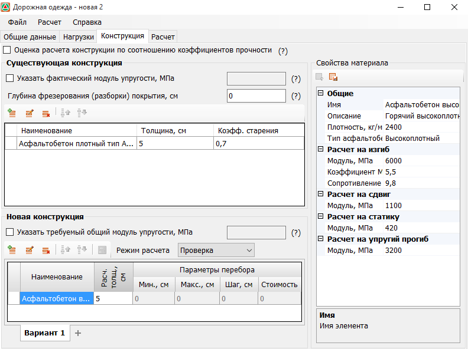

     

     При выделенном слое в списке все его расчетные характеристики отображаются в поле **Свойства материала**:

     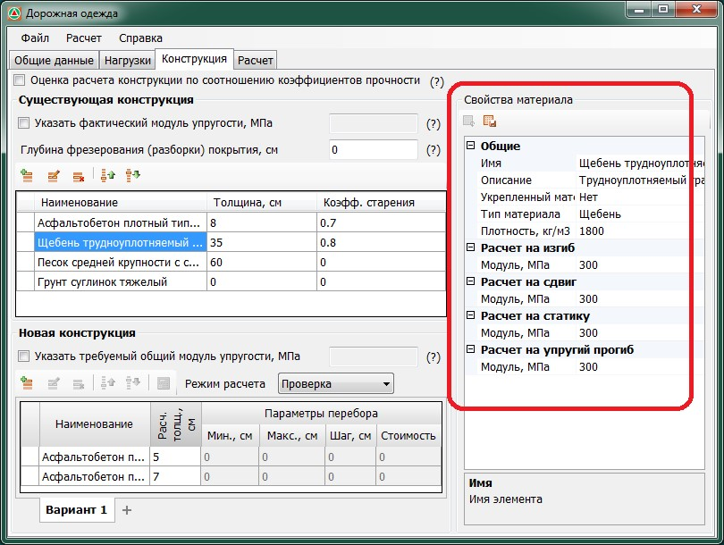

     При необходимости данные характеристики могут быть отредактированы пользователем. Последовательность действий по редактированию параметров стандартных материалов будет описана ниже, в разделе Свойства материала.

     

  3. Задайте толщину добавленного конструктивного слоя в поле **Расчетная толщина**;

     

     Если поле Расчетная толщина недоступно для ввода данных, в списке с наименованием Режим расчета выставите режим Проверка:
     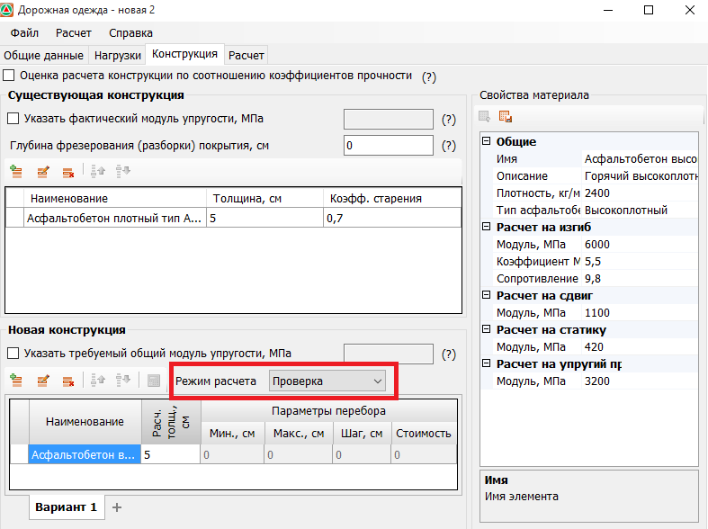 

     В данном случае станет неактивна группа столбцов с наименованием Параметры перебора. Последовательность действий по подбору толщин конструктивных слоев дорожной одежды будет описана ниже в разделе [Режим расчета](#218-1-052-2002-rezhim-rascheta).

     

  4. Используя аналогичную последовательность действий, добавьте остальные конструктивные слои дорожной одежды:

     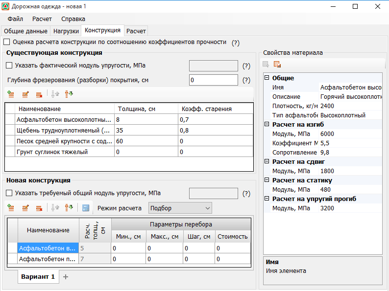

     

     Для грунта и геосинтетического материала толщины шаг перебора и условная стоимость должны быть равны нулю.

     

  **Изменение слоя** {#218-1-052-2002-redaktirovanie-izmenenie}

  Для того чтобы изменить какой либо слой конструкции на другой, имеющийся в библиотеке материалов, выполните следующие действия:

  1. Выберите данный слой из общего списка слоев конструкции дорожной одежды и нажмите кнопку **Редактировать слой** . Откроется окно выбора материала:

     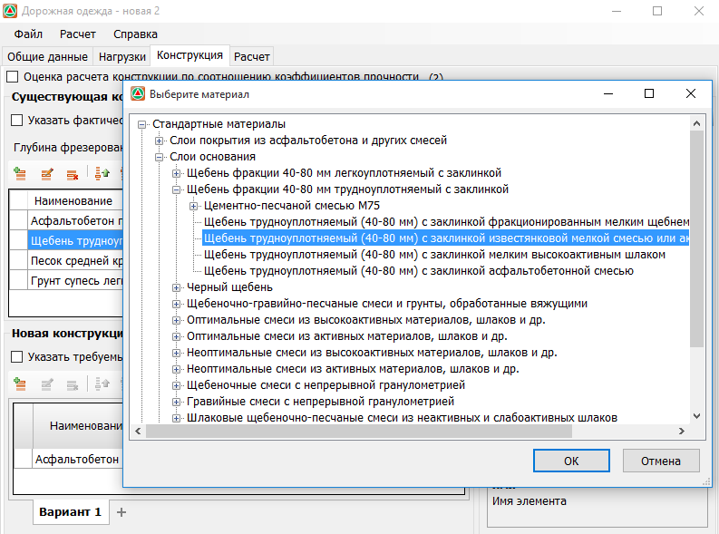

  2. Выберите из библиотеки другой конструктивный слой, который нужно назначить вместо текущего и нажмите **ОК**.

  После изменения слоя при необходимости измените значения его толщины и условной стоимости.

  **Удаление слоя** {#218-1-052-2002-redaktirovanie-udalenie}

  Для удаления какого-либо слоя из конструкции дорожной одежды:

  Выберите данный слой из общего списка слоев и нажмите кнопку **Удалить слой** . В результате выбранный слой будет удален из дорожной конструкции.

  **Перемещение слоя** {#218-1-052-2002-redaktirovanie-peremeshchenie}

  Если необходимо изменить положение какого-либо конструктивного слоя относительно других:

  1. Выберите данный слой из общего списка и нажмите кнопку **Переместить слой вниз** или **Переместить слой вверх** ;

  2. Выбранный слой будет перемещен на один уровень вверх или вниз. Для перемещения слоя еще на несколько уровней повторно воспользуйтесь данной функцией.

  

  {#218-1-052-2002-rezhim-rascheta}

  В программе имеется возможность подбора оптимальной конструкции дорожной одежды по критерию минимальной стоимости. Для подбора конструкции дорожной одежды выполните следующие действия:

  1. Убедитесь, что на вкладке **Новая конструкция** в поле **Наименование** заданы все конструктивные слои дорожной одежды:

     

     

     До подбора конструкции не обязательно задавать значение толщин конструктивных слоев в поле Расчетная толщина.

     

  2. В выпадающем списке установите режим **Подбор**:

     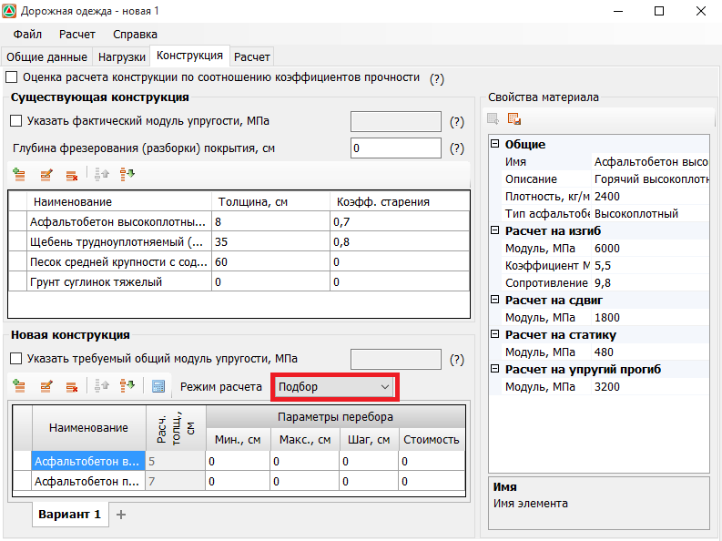

     После установления данного режима станут активны для ввода столбцы группы **Параметры подбора**.

  3. В столбцах **Параметры подбора** задайте значения **Минимальной** и **Максимальной толщины** конструктивных слоев дорожной одежды, а также шаг перебора от минимума до максимума.

  * **Шаг перебора** задается индивидуально для каждого конструктивного слоя.

    

    Не рекомендуется задавать очень малый шаг перебора для слоев, у которых сильно отличается значение Минимальной и Максимально допустимой толщины, т.к. в этом случае будет рассчитываться очень большое количество вариантов, в результате чего процедура подбора может занять долгое время.

    

  * Если какой либо конструктивный слой не участвует в подборе, то значение его **Минимальной** и **Максимальной толщины** задается одинаковой.
  * Для грунта и геосинтетического материала толщины, шаг перебора и условная стоимость не задаются, т.к. они (грунт и геосетка) не участвуют в процедуре подбора конструкции.
  * Если конструкция будет подбираться по критерию минимальной приведенной стоимости, то для каждого конструктивного слоя, также должно быть задано значение его условной стоимости. Данное значение задается в столбце **Стоимость**, в рублях или других условных единицах, для слоя толщиной 1 см. на единицу площади покрытия.

  4. После задания всех необходимых параметров для подбора конструкции нажмите кнопку **Подобрать**, расположенную в верхней части окна:

     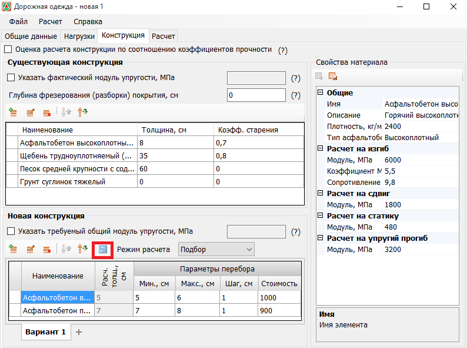

  5. В результате, начнется процесс подбора вариантов конструкции:

     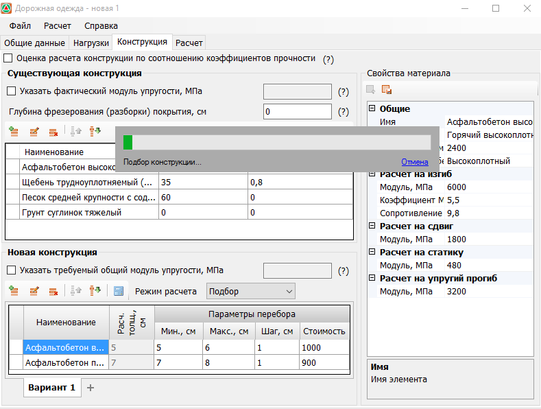

  По окончании данного процесса откроется список вариантов конструкции прошедших процедуру подбора:

  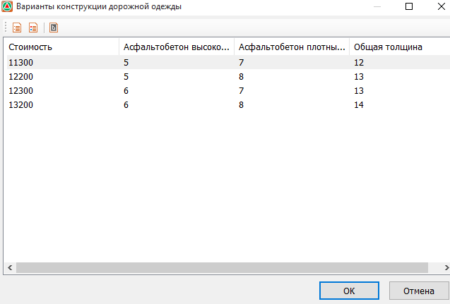

  При подборе конструкции происходит расчет всех возможных вариантов толщин слоев, с учетом заданного шага перебора. Варианты не удовлетворяющие какому либо критерию прочности отбраковываются. Проверка происходит по всем критериям прочности соответствующим данному типу расчета и типу дорожной одежды (нежесткая дорожная, жесткая дорожная одежда, расчет слоев усиления и т.п.).

  Для сортировки всех отображаемых вариантов по какому-либо критерию, щелкните левой кнопкой мыши по наименованию соответствующего столбца. К примеру, если щелкнуть по столбцу **Стоимость**, то варианты конструкций будут сгруппированы в списке в порядке нарастания суммарной условной стоимости конструкции. Если же щелкнуть по столбцу с наименованием какого-то конструктивного слоя, то будет выполнена сортировка вариантов, в порядке нарастания его толщины.

  В результате, в качестве расчетных толщин будут приняты значения соответствующие выбранному (подобранному) варианту конструкции:

  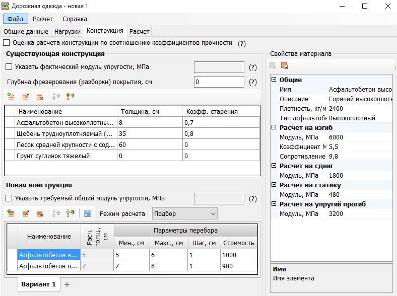

  

  {#218-1-052-2002-modul-fakt}

  Величина модуля упругости может быть задана по результатам испытаний. Для этого установите данную опцию и задайте значение модуля в соответствующем поле. Если же нет возможности указать общий фактический модуль упругости на поверхности существующей дорожной одежды, то программа подбирает его на основе прочностных характеристик слоев существующей конструкции, с учетом коэффициентов старения слоев.

  

  {#218-1-052-2002-ocenka}

  В соответствии с **ОДН 218.1.052-2002** , п.5.1, усиление дорожной одежды должно производиться всегда, когда ее фактический модуль упругости меньше требуемого. Однако, согласно **ОДН 218.046-01** расчет конструкции дорожной одежды выполняется в случае, если:

  $$К_{пр.} < К_{пр.тр.}$$

  где:

  * $К_{пр}$ — это коэффициент прочности дорожной одежды по расчету, а $К_{пр. тр.}$ - требуемый коэффициент прочности с учетом заданного уровня надежности. С помощью этой опции можно указать, в соответствии с какой методикой будет проводиться расчет конструкции дорожной одежды.

  

  {#218-1-052-2002-frezerovanie}

  При установлении данной опции в соответствующем поле задается величина фрезерование или разборки существующей конструкции дорожной одежды. Данная величина задается в том случае, когда перед устройством слоев усиления, часть слоев существующей конструкции (покрытия или даже основания) должна быть предварительно снята.

  

  {#218-1-052-2002-modul-treb}

  Для самостоятельного задания требуемого модуля упругости дорожной конструкции установите данную опцию и введите его значение в соответствующем поле. По умолчанию данная опция не установлена, и значение требуемого модуля рассчитывается согласно **ОДН 218.1.052-2002**, форм. 4.1.

  $$E_{mр}=E_{min} \cdot K_{np} \cdot K_{pвг} \cdot K_{cu} \cdot K_{z} \cdot \frac{1}{X_j}$$

  

