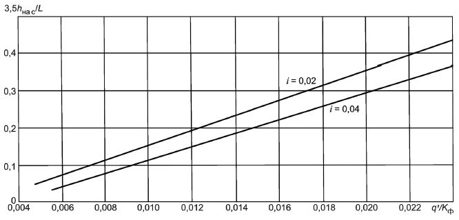
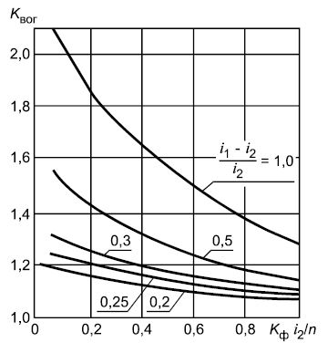
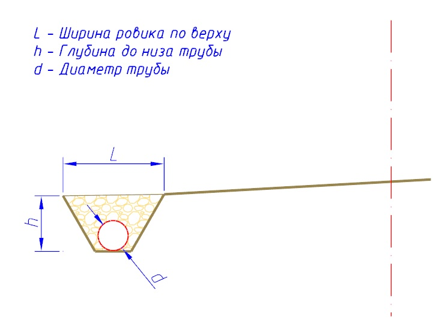
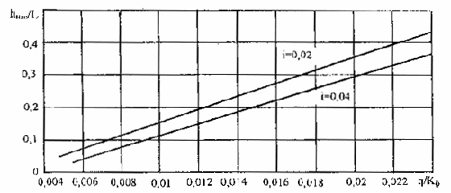
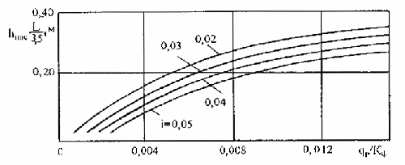
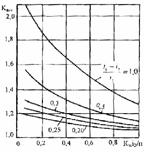

# Осушение



- ПНСТ 542-2021 {#pnst-542-2021}

  

  На данной вкладке выбираются способы расчета по критерию Осушение. Также задаются характеристики, используемые для расчета требуемой толщины дренирующего слоя.

  {#542-2021-raschet-metod}

  В зависимости от конкретных условий дренажная конструкция может быть рассчитана на один из вариантов работы (согласно **ПНСТ 542-2021**, пункт 11.4 и 11.10):

  * Работа на осушение;
  * Работа на осушение по способу поглощения;
  * Работа на осушение в дренажом в ровике.

  Критерии расчета выбираются в поле **Способ расчета** установлением соответствующей опции.

  

  {#542-2021-otmetka-nasypi}

  Используется при определении объема воды, поступающей в основание дорожной одежды за сутки (согласно **ПНСТ 542-2021**,примечание к табл.13)

  #|
  || **Дорожно-климатическая зона** {.cell-align-center} | **Схема увлажнения рабочего слоя** {.cell-align-center} | **Объем воды, поступающей в основание дорожной одежды из грунта Q/q** {.cell-align-center} |>|>|>||
  || ^ | ^ | **супеси легкой и песка пылеватого** {.cell-align-center} | **суглинка легкого и тяжелого и глины** {.cell-align-center} | **суглинка легкого пылеватого и тяжелого пылеватого** {.cell-align-center} | **супеси пылеватой и супеси тяжелой пылеватой** {.cell-align-center} ||
  || II {.cell-align-center} | 1 {.cell-align-center} | 15/2,5 {.cell-align-center} | 20/2 {.cell-align-center} | 35/3 {.cell-align-center} | 80/3,5 {.cell-align-center} ||
  || ^ | 2 {.cell-align-center} | 25/3 {.cell-align-center} | 50/3 {.cell-align-center} | 80/4 {.cell-align-center} | 130/4,5 {.cell-align-center} ||
  || ^ | 3 {.cell-align-center} | 60/3,5 {.cell-align-center} | 90/4 {.cell-align-center} | 130/4,5 {.cell-align-center} | 180/5 {.cell-align-center} ||
  || III {.cell-align-center} | 1 {.cell-align-center} | 10/1,5 {.cell-align-center} | 10/1,5 {.cell-align-center} | 15/2 {.cell-align-center} | 30/3 {.cell-align-center} ||
  || ^ | 2 {.cell-align-center} | 15/2 {.cell-align-center} | 25/2 {.cell-align-center} | 30/2,5 {.cell-align-center} | 40/3 {.cell-align-center} ||
  || ^ | 3 {.cell-align-center} | 25/2,5 {.cell-align-center} | 40/2,5 {.cell-align-center} | 50/3,5 {.cell-align-center} | 60/4 {.cell-align-center} ||
  || IV и V {.cell-align-center} | 3 {.cell-align-center} | 20/2 {.cell-align-center} | 20/2 {.cell-align-center} | 30/2,5 {.cell-align-center} | 40/3 {.cell-align-center} ||
  |#

  

  1. В числителе приведен объем воды $Q$ (л/м^2^) покрытия, поступающей в основание дорожной одежды за весь расчетный период, в знаменателе $q$ л/(м^2^·сут).
  2. Для насыпей, возведенных из непылеватых грунтов, высотой более требуемой (см. таблицу 9) во II ДКЗ принимают средний приток воды на 1 м^2^ проезжей части в сутки q, равный 1,5 л/(м^2^·сут).
  3. При наличии разделительной полосы для участков, проходящих в нулевых отметках, насыпей высотой менее требуемой (см. таблицу 9) в ДКЗ II, расчетные значения среднего притока воды на 1 м^2^ проезжей части в сутки q повышают на 20 %..

  

  

  {#542-2021-uklon-niz}

  В данном поле задается значение поперечного уклона низа дренирующего слоя. Данная величина используются для расчета толщины дренирующего слоя (согласно **ПНСТ 542-2021**, рис. 14, рис. 15).

  #|
  ||  {.cell-align-center}||
  || $i$ — поперечный уклон низа дренирующего слоя; $L$ — длина пути фильтрации; $q'$ — погонный приток воды; $К_ф$ — коэффициент фильтрации песка, м/сут. 
  
  **Номограмма для расчета толщины дренирующего слоя, полностью насыщенного водой,$h_{нас}$ из мелких песков, песков средней крупности и крупных песков с коэффициентом фильтрации менее 10 м/сут**||
  |#

  #|
  ||  {.cell-align-center}||
  || $i$ — поперечный уклон низа дренирующего слоя; $L$ — длина пути фильтрации; $q_p$ — расчетный объем притока воды, м^3^/м^2^ в сутки; $К_ф$ — коэффициент фильтрации песка, м/сут. 
  
  **Номограмма для расчета толщины дренирующего слоя, полностью насыщенного водой, $h_{нас}$ из крупных песков с коэффициентом фильтрации более 10 м/сут**||
  |#

  

  {#542-2021-regulirovanie}

  Выбираются установлением соответствующих опций, в зависимости от конструктивных особенностей обочин или слоев основания дорожной одежды. Данные опции используются при определении коэффициента снижения притока воды в дренирующий слой ( согласно **ПНСТ 542-2021**, табл. 15).

  Значения коэффициента $К_{p}$ учитывающего снижение притока воды в дренирующий слой.

  #|
  || **Мероприятие** {.cell-align-center} | **Схема увлажнения** {.cell-align-center} | **$К_{p}$ для грунта рабочего слоя** {.cell-align-center} |>|>||
  || ^ | ^ | **легкой супеси** {.cell-align-center} | **легкого суглинка** {.cell-align-center} | **тяжелого суглинка,глины** {.cell-align-center} ||
  || Укрепление обочин | 1 {.cell-align-center} | 0,70 {.cell-align-center} | 0,75 {.cell-align-center} | 0,80 {.cell-align-center} ||
  || ^ | 2 и 3 {.cell-align-center} | 0,85 {.cell-align-center} | 0,95 {.cell-align-center} | 0,95 {.cell-align-center} ||
  || Монолитные слои основания с содержанием воздушных пустот материала до 5 % | 1 {.cell-align-center} | 0,80 {.cell-align-center} | 0,80 {.cell-align-center} | 0,80 {.cell-align-center} ||
  || ^ | 2 и 3 {.cell-align-center} | 0,90 {.cell-align-center} | 0,90 {.cell-align-center} | 0,90 {.cell-align-center} ||
  ||Монолитные слои основания с содержанием воздушных пустот материала от 5 % до 10% | 1 {.cell-align-center} | 0,90 {.cell-align-center} | 0,90 {.cell-align-center} | 0,90 {.cell-align-center} ||
  || ^ | 2 и 3 {.cell-align-center} | 0,95 {.cell-align-center} | 0,95 {.cell-align-center} | 0,95 {.cell-align-center} ||
  |#

  

  1. При применении пылеватых грунтов коэффициент $К_{p}$ = 1,0.
  2. Если предусмотрено несколько мероприятий, то каждое из них учитывают в отдельности по формуле (29).

  

  

  {#542-2021-uklon-prodolnyi}

  В данных полях могут задаваться значения продольных уклонов до перелома и после перелома продольного профиля. Продольные уклоны направленные вниз вводятся со знаком «+», а вверх со знаком «–». Данные величины используются для расчета коэффициента увеличения объема воды в дренирующем слое (согласно **ПНСТ 542-2021**, рис. 12).

  #|
  ||  {.cell-align-center}||
  || $i_1$ и $i_2$ — продольные уклоны выше и ниже перелома продольного профиля; $К_ф$ — коэффициент фильтрации, м/сут; $n$ — пористость дренирующего слоя в долях единицы (значения уклонов принимаются по абсолютной величине).
  
  **Номограмма для определения коэффициента $К_{вог}$, учитывающего накопление воды в местах изменения вогнутого профиля**||
  |#

  

  {#542-2021-filtraciya}

  Используется для расчета параметров осушения (согласно **ПНСТ 542-2021**, рис. 12, рис. 14, рис. 15).

  #|
  ||  {.cell-align-center}||
  || $i_1$ и $i_2$ — продольные уклоны выше и ниже перелома продольного профиля; $К_ф$ — коэффициент фильтрации, м/сут; $n$ — пористость дренирующего слоя в долях единицы (значения уклонов принимаются по абсолютной величине).
  
  **Номограмма для определения коэффициента $К_{вог}$, учитывающего накопление воды в местах изменения вогнутого профиля**||
  |#

  #|
  ||  {.cell-align-center}||
  || $i$ — поперечный уклон низа дренирующего слоя; $L$ — длина пути фильтрации; $q'$ — погонный приток воды; $К_ф$ — коэффициент фильтрации песка, м/сут.
  
  **Номограмма для расчета толщины дренирующего слоя, полностью насыщенного водой, $h_{нас}$ из мелких песков, песков средней крупности и крупных песков с коэффициентом фильтрации менее 10 м/сут**||
  |#

  #|
  ||  {.cell-align-center}||
  || $i$ — поперечный уклон низа дренирующего слоя; $L$ — длина пути фильтрации; $q_p$ — расчетный объем притока воды, м^3^/м^2^ в сутки; $К_ф$ — коэффициент фильтрации песка, м/сут.
  
  **Номограмма для расчета толщины дренирующего слоя, полностью насыщенного водой, $h_{нас}$ из крупных песков с коэффициентом фильтрации более 10 м/сут**||
  |#

  

  {#542-2021-zapazdyvanie}

  В данном поле задается средняя продолжительность задержки начала работы водоотводящих устройств. Для II дорожно-климатической зоны она принимается 4-6 сут, а для III дорожно-климатической зоны 3-4 сут. (большее значение - для мелких песков). Данные величины приняты согласно **ПНСТ 542-2021**, п.11.6.

  

  {#542-2021-poristost}

  Используется для расчета параметров осушения (согласно **ПНСТ 542-2021**, рис. 12).

  #|
  ||  {.cell-align-center}||
  || $i_1$ и $i_2$ — продольные уклоны выше и ниже перелома продольного профиля; $К_ф$ — коэффициент фильтрации, м/сут; $n$ — пористость дренирующего слоя в долях единицы (значения уклонов принимаются по абсолютной величине).
  
  **Номограмма для определения коэффициента $К_{вог}$, учитывающего накопление воды в местах изменения вогнутого профиля**||
  |#

  

  {#542-2021-poperechnik}

  Используется для расчета параметров осушения (согласно **ПНСТ 542-2021**, рис. 14, рис. 15).

  #|
  ||  {.cell-align-center}||
  || $i$ — поперечный уклон низа дренирующего слоя; $L$ — длина пути фильтрации; $q'$ — погонный приток воды; $К_ф$ — коэффициент фильтрации песка, м/сут.
  
  **Номограмма для расчета толщины дренирующего слоя, полностью насыщенного водой, $h_{нас}$ из мелких песков, песков средней крупности и крупных песков с коэффициентом фильтрации менее 10 м/сут**||
  |#

  #|
  ||  {.cell-align-center}||
  || $i$ — поперечный уклон низа дренирующего слоя; $L$ — длина пути фильтрации; $q_p$ — расчетный объем притока воды, м^3^/м^2^ в сутки; $К_ф$ — коэффициент фильтрации песка, м/сут.
  
  **Номограмма для расчета толщины дренирующего слоя, полностью насыщенного водой, $h_{нас}$ из крупных песков с коэффициентом фильтрации более 10 м/сут**||
  |#

  

  {#542-2021-put-filtracii}

  Используется для расчета параметров осушения (согласно **ПНСТ 542-2021**, рис. 14, рис. 15).

  #|
  ||  {.cell-align-center}||
  || $i$ — поперечный уклон низа дренирующего слоя; $L$ — длина пути фильтрации; $q'$ — погонный приток воды; $К_ф$ — коэффициент фильтрации песка, м/сут.
  
  **Номограмма для расчета толщины дренирующего слоя, полностью насыщенного водой, $h_{нас}$ из мелких песков, песков средней крупности и крупных песков с коэффициентом фильтрации менее 10 м/сут**||
  |#

  #|
  ||  {.cell-align-center}||
  || $i$ — поперечный уклон низа дренирующего слоя; 
  $L$ — длина пути фильтрации; $q_p$ — расчетный объем притока воды, м^3^/м^2^ в сутки; $К_ф$ — коэффициент фильтрации песка, м/сут.
  
  **Номограмма для расчета толщины дренирующего слоя, полностью насыщенного водой, $h_{нас}$ из крупных песков с коэффициентом фильтрации более 10 м/сут**||
  |#

  

  {#542-2021-metodika-osusheniya}

  При включенной опции расчет по принципу осушения в ровике ведется согласно методики Союздорнии от 1974, формула 14.

  $$K_ф=\frac{q_р Z^2}{\bigtriangleup H(h_{нас}+h_{зап}\beta_1)}$$

  * $Z$ - наибольшая длина пути фильтрации, м;
  * $q_p$ - расчетная величина притока воды в дренирующий слой, м^3^/м^2^/сутки;
  * $\bigtriangleup H$ - разность напоров, м;

  $$\bigtriangleup H = h_{нас}+(L^\prime - в_о)i+h-h_0$$

  * $i$ - поперечный уклон низа дренирующего слоя в долях единицы;
  * $L^\prime$ - расстояние от оси дороги до внешней бровки ровика, м;
  * $в_о$ - ширина ровика поверху, м;
  * $h_0$ - глубина фильтрационного потока в дренирующем слое непосредственно у продольной дрены; для песков средней крупности $h_0$ = 0,03 м, для мелких песков $h_0$ = 0,05 м;
  * $h$ - глубина ровика.
  * $h_{нac}$ - глубина фильтрационного потока по оси проезжей части, м;
  * $h_{зап}$ - дополнительная толщина дренирующего слоя, м;
  * $\beta_1$ - коэффициент расхода воды в капиллярной зоне; для мелких песков = 0,3, а для песков средней крупности = 0,4.

  

  Если данная опция выключена, то расчет производится согласно номограммам ПНСТ 542-2021.

  

  

  {#542-2021-rovik}

  **Конструкция дренажа с ровиком**
  
  
  
  * 1 — дренажная труба;
  * 2 — зона движения свободной воды;
  * 3 — зона движения капиллярной воды,
  * 4 — щебеночная (песчаная) подготовка под дренажную трубу;
  * $h_к$ — высота капиллярного поднятия воды в материале дренирующего слоя
  
  

  

- ПНСТ 265-2018 {#pnst-265-2018}

  

  На данной вкладке выбираются способы расчета по критерию Осушение. Также задаются характеристики, используемые для расчета требуемой толщины дренирующего слоя.

  {#265-2018-raschet-metod}

  В зависимости от конкретных условий дренажная конструкция может быть рассчитана на один из вариантов работы (согласно **ПНСТ 265-2018**, пункт 12.4 и 12.10):

  * Работа на осушение;
  * Работа на осушение по способу поглощения;
  * Работа на осушение в дренажом в ровике.

  Критерии расчета выбираются в поле **Способ расчета** установлением соответствующей опции.

  

  {#265-2018-otmetka-nasypi}

  Используется при определении объема воды, поступающей в основание дорожной одежды за сутки (согласно **ПНСТ 265-2018**,примечание к табл.21)

  #|
  || **Дорожно-климатическая зона** {.cell-align-center} | **Схема увлажнения рабочего слоя** {.cell-align-center} | **Объем воды, поступающей в основание дорожной одежды из грунта Q/q** {.cell-align-center} |>|>|>||
  || ^ | ^ | **легкой супеси и пылеватого песка** {.cell-align-center} | **легкого и тяжелого суглинка и глины** {.cell-align-center} | **легкого и тяжелого пылеватого суглинка** {.cell-align-center} | **пылеватой супеси и тяжелой пылеватой супеси** {.cell-align-center} ||
  || II {.cell-align-center} | 1 {.cell-align-center} | 15/2,5 {.cell-align-center} | 20/2 {.cell-align-center} | 35/3 {.cell-align-center} | 80/3,5 {.cell-align-center} ||
  || ^ | 2 {.cell-align-center} | 25/3 {.cell-align-center} | 50/3 {.cell-align-center} | 80/4 {.cell-align-center} | 130/4,5 {.cell-align-center} ||
  || ^ | 3 {.cell-align-center} | 60/3,5 {.cell-align-center} | 90/4 {.cell-align-center} | 130/4,5 {.cell-align-center} | 180/5 {.cell-align-center} ||
  || III {.cell-align-center} | 1 {.cell-align-center} | 10/1,5 {.cell-align-center} | 10/1,5 {.cell-align-center} | 15/2 {.cell-align-center} | 30/3 {.cell-align-center} ||
  || ^ | 2 {.cell-align-center} | 15/2 {.cell-align-center} | 25/2 {.cell-align-center} | 30/2,5 {.cell-align-center} | 40/3 {.cell-align-center} ||
  || ^ | 3 {.cell-align-center} | 25/2,5 {.cell-align-center} | 40/2,5 {.cell-align-center} | 50/3,5 {.cell-align-center} | 60/4 {.cell-align-center} ||
  || IV и V {.cell-align-center} | 3 {.cell-align-center} | 20/2 {.cell-align-center} | 20/2 {.cell-align-center} | 30/2,5 {.cell-align-center} | 40/3 {.cell-align-center} ||
  |#

  

  1. В числителе приведен объем воды $Q$ (л/м^2^) покрытия, поступающей в основание дорожной одежды за весь расчетный период, в знаменателе $q$ л/(м^2^·сут).
  2. Для насыпей, возведенных из непылеватых грунтов, высотой более требуемой (см. таблицу 16) во II ДКЗ принимают средний приток воды на 1 м^2^ проезжей части в сутки q, равный 1,5 л/(м^2^·сут).
  3. При наличии разделительной полосы для участков, проходящих в нулевых отметках, насыпей высотой меньше требуемой (см. таблицу 16) во II ДКЗ, расчетные значения среднего притока воды на 1 м^2^ проезжей части в сутки $q$ повышают на 20 %.

  

  

  {#265-2018-uklon-niz}

  В данном поле задается значение поперечного уклона низа дренирующего слоя. Данная величина используются для расчета толщины дренирующего слоя (согласно **ПНСТ 265-2018**, рис. 19, рис. 20).

  #|
  ||  {.cell-align-center}||
  || $i$ — поперечный уклон низа дренирующего слоя; $L$ — длина пути фильтрации; $q'$ — погонный приток воды; $К_ф$ — коэффициент фильтрации песка, м/сут.
  
  **Номограмма для расчета толщины дренирующего слоя, полностью насыщенного водой, $h_{нас}$ из мелких песков, песков средней крупности и крупных песков с коэффициентом фильтрации менее 10 м/сут**||
  |#

  #|
  ||  {.cell-align-center}||
  || $i$ — поперечный уклон низа дренирующего слоя; $L$ — длина пути фильтрации; $q_p$ — расчетный объем притока воды, м^3^/м^2^ в сутки; $К_ф$ — коэффициент фильтрации песка, м/сут.
  
  **Номограмма для расчета толщины дренирующего слоя, полностью насыщенного водой, $h_{нас}$ из крупных песков с коэффициентом фильтрации более 10 м/сут**||
  |#

  

  {#265-2018-regulirovanie}

  Выбираются установлением соответствующих опций, в зависимости от конструктивных особенностей обочин или слоев основания дорожной одежды. Данные опции используются при определении коэффициента снижения притока воды в дренирующий слой ( согласно **ПНСТ 265-2018**, табл. 23).

  Значения коэффициента $К_{p}$ учитывающего снижение притока воды в дренирующий слой.

  #|
  || **Мероприятие** {.cell-align-center} | **Схема увлажнения** {.cell-align-center} | **$К_{p}$ для грунта рабочего слоя** {.cell-align-center} |>|>||
  || ^ | ^ | легкой супеси {.cell-align-center} | легкого суглинка {.cell-align-center} | тяжелого суглинка,глины {.cell-align-center} ||
  || Укрепление обочин | 1 {.cell-align-center} | 0,70 {.cell-align-center} | 0,75 {.cell-align-center} | 0,80 {.cell-align-center} ||
  || ^ | 2 и 3 {.cell-align-center} | 0,89 {.cell-align-center} | 0,90 {.cell-align-center} | 0,95 {.cell-align-center} ||
  || Монолитные слои основания с содержа нием воздушных пустот материала до 5 % | 1 {.cell-align-center} | 0,80 {.cell-align-center} | 0,80 {.cell-align-center} | 0,80 {.cell-align-center} ||
  || ^ | 2 и 3 {.cell-align-center} | 0,90 {.cell-align-center} | 0,90 {.cell-align-center} | 0,90 {.cell-align-center} ||
  |#

  

  При применении пылеватых грунтов коэффициент $К_{p}$ = 1,0.

  

  

  {#265-2018-uklon-prodolnyi}

  В данных полях могут задаваться значения продольных уклонов до перелома и после перелома продольного профиля. Продольные уклоны направленные вниз вводятся со знаком «+», а вверх со знаком «–». Данные величины используются для расчета коэффициента увеличения объема воды в дренирующем слое (согласно **ПНСТ 265-2018**, рис. 17).

  #|
  ||  {.cell-align-center}||
  || $i_1$ и $i_2$ — продольные уклоны выше и ниже перелома продольного профиля; $К_ф$ — коэффициент фильтрации, м/сут; $n$ — пористость дренирующего слоя в долях единицы (значения уклонов принимаются по абсолютной величине).
  
  **Номограмма для определения коэффициента $К_{вог}$, учитывающего накопление воды в местах изменения вогнутого профиля**||
  |#

  

  {#265-2018-filtraciya}

  Используется для расчета параметров осушения (согласно **ПНСТ 265-2018**, рис. 17, рис. 19, рис. 20).

  #|
  ||  {.cell-align-center}||
  || $i_1$ и $i_2$ — продольные уклоны выше и ниже перелома продольного профиля; $К_ф$ — коэффициент фильтрации, м/сут; $n$ — пористость дренирующего слоя в долях единицы (значения уклонов принимаются по абсолютной величине).
  
  **Номограмма для определения коэффициента $К_{вог}$, учитывающего накопление воды в местах изменения вогнутого профиля**||
  |#

  #|
  ||  {.cell-align-center}||
  || $i$ — поперечный уклон низа дренирующего слоя; $L$ — длина пути фильтрации; $q'$ — погонный приток воды; $К_ф$ — коэффициент фильтрации песка, м/сут.
  
  **Номограмма для расчета толщины дренирующего слоя, полностью насыщенного водой, $h_{нас}$ из мелких песков, песков средней крупности и крупных песков с коэффициентом фильтрации менее 10 м/сут**||
  |#

  #|
  ||  {.cell-align-center}||
  || $i$ — поперечный уклон низа дренирующего слоя; $L$ — длина пути фильтрации; $q_p$ — расчетный объем притока воды, м^3^/м^2^ в сутки; $К_ф$ — коэффициент фильтрации песка, м/сут.
  
  **Номограмма для расчета толщины дренирующего слоя, полностью насыщенного водой, $h_{нас}$ из крупных песков с коэффициентом фильтрации более 10 м/сут**||
  |#

  

  {#265-2018-zapazdyvanie}

  В данном поле задается средняя продолжительность задержки начала работы водоотводящих устройств. Для II дорожно-климатической зоны она принимается 4-6 сут, а для III дорожно-климатической зоны 3-4 сут. (большее значение - для мелких песков). Данные величины приняты согласно **ПНСТ 265-2018**, п.12.6.

  

  {#265-2018-poristost}

  Используется для расчета параметров осушения (согласно **ПНСТ 265-2018**, рис. 17).

  #|
  ||  {.cell-align-center}||
  || $i_1$ и $i_2$ — продольные уклоны выше и ниже перелома продольного профиля; $К_ф$ — коэффициент фильтрации, м/сут; $n$ — пористость дренирующего слоя в долях единицы (значения уклонов принимаются по абсолютной величине).
  
  **Номограмма для определения коэффициента $К_{вог}$, учитывающего накопление воды в местах изменения вогнутого профиля**||
  |#

  **Номограмма для определения коэффициента $К_{вог}$, учитывающего накопление воды в местах изменения вогнутого профиля**

  

  {#265-2018-poperechnik}

  Используется для расчета параметров осушения (согласно **ПНСТ 265-2018**, рис. 19, рис. 20).

  #|
  ||  {.cell-align-center}||
  || $i$ — поперечный уклон низа дренирующего слоя; $L$ — длина пути фильтрации; $q'$ — погонный приток воды; $К_ф$ — коэффициент фильтрации песка, м/сут.
  
  **Номограмма для расчета толщины дренирующего слоя, полностью насыщенного водой, $h_{нас}$ из мелких песков, песков средней крупности и крупных песков с коэффициентом фильтрации менее 10 м/сут**||
  |#

  #|
  ||  {.cell-align-center}||
  || $i$ — поперечный уклон низа дренирующего слоя; $L$ — длина пути фильтрации; $q_p$ — расчетный объем притока воды, м^3^/м^2^ в сутки; $К_ф$ — коэффициент фильтрации песка, м/сут.
  
  **Номограмма для расчета толщины дренирующего слоя, полностью насыщенного водой, $h_{нас}$ из крупных песков с коэффициентом фильтрации более 10 м/сут**||
  |#

  

  {#265-2018-put-filtracii}

  Используется для расчета параметров осушения (согласно **ПНСТ 265-2018**, рис. 19, рис. 20).

  #|
  ||  {.cell-align-center}||
  || $i$ — поперечный уклон низа дренирующего слоя; $L$ — длина пути фильтрации; $q'$ — погонный приток воды; $К_ф$ — коэффициент фильтрации песка, м/сут.
  
  **Номограмма для расчета толщины дренирующего слоя, полностью насыщенного водой, $h_{нас}$ из мелких песков, песков средней крупности и крупных песков с коэффициентом фильтрации менее 10 м/сут**||
  |#

  #|
  ||  {.cell-align-center}||
  || $i$ — поперечный уклон низа дренирующего слоя; $L$ — длина пути фильтрации; $q_p$ — расчетный объем притока воды, м^3^/м^2^ в сутки; $К_ф$ — коэффициент фильтрации песка, м/сут.
  
  **Номограмма для расчета толщины дренирующего слоя, полностью насыщенного водой, $h_{нас}$ из крупных песков с коэффициентом фильтрации более 10 м/сут**||
  |#

  

  {#265-2018-metodika-osusheniya}

  Уточнить

  

  {#265-2018-rovik}

  Данные параметры используется при расчете на осушение, на городских улицах и участках дорог с закрытыми водоотводами (согласно **ПНСТ 265-2018**, рис.16).

  **Конструкция дренажа с ровиком**

  

  * 1 — дренажная труба;
  * 2 — зона движения свободной воды;
  * 3 — зона движения капиллярной воды,
  * 4 — щебеночная (песчаная) подготовка под дренажную трубу;
  * $h_к$ — высота капиллярного поднятия воды в материале дренирующего слоя.

  

- ОДН 218.046-01, МР (взамен ВСН 197-91) {#odn-218-046-01}

  

  На данной вкладке выбираются способы расчета по критерию Осушение. Также задаются характеристики, используемые для расчета требуемой толщины дренирующего слоя.

  {#218-046-01-raschet-metod}

  В зависимости от конкретных условий дренажная конструкция может быть рассчитана на один из вариантов работы (согласно **ОДН 218.046-01**, пункт 5.10 и 5.14):

  * Работа на осушение;
  * Работа на осушение с периодом запаздывания отвода воды;
  * Работа на поглощение;
  * Работа на осушение с дренажом в ровике.

  Критерии расчета выбираются в поле **Способ расчета** установлением соответствующей опции.

  

  {#218-046-01-otmetka-nasypi}

  Используется при определении объема воды, поступающей в основание дорожной одежды за сутки (согласно **ОДН 218.046-01**, табл. 5.3, прим. 1).

  #|
  || **Дорожно-климатическая зона** {.cell-align-center} | **Схема увлажнения рабочего слоя земляного полотна** {.cell-align-center} | **Объем воды, поступающей в основание дорожной одежды** {.cell-align-center} |>|>|>||
  ||^|^| **Супесь легкая и песок пылеватый** {.cell-align-center} | **Суглинок и глина** {.cell-align-center} | **Суглинок пылеватый** {.cell-align-center} | **Супесь пылевата**я {.cell-align-center} ||
  || II {.cell-align-center} | 2 {.cell-align-center} | 15/2,5 {.cell-align-center} | 20/2 {.cell-align-center} | 35/3 {.cell-align-center} | 80/3,5 {.cell-align-center} ||
  ||^| 3 {.cell-align-center} | 25/3 {.cell-align-center} | 50/3 {.cell-align-center} | 80/4 {.cell-align-center} | 130/4,5 {.cell-align-center} ||
  ||^| 1 {.cell-align-center} | 60/3,5 {.cell-align-center} | 90/4 {.cell-align-center} | 130/4,5 {.cell-align-center} | 180/5 {.cell-align-center} ||
  || III {.cell-align-center} | 2 {.cell-align-center} | 10/1,5 {.cell-align-center} | 10/1,5 {.cell-align-center} | 15/2 {.cell-align-center} | 30/3 {.cell-align-center} ||
  ||^| 3 {.cell-align-center} | 15/2 {.cell-align-center} | 25/2 {.cell-align-center} | 30/2,5 {.cell-align-center} | 40/3 {.cell-align-center} ||
  ||^| 3 {.cell-align-center} | 25/2,5 {.cell-align-center} | 40/2,5 {.cell-align-center} | 50/3,5 {.cell-align-center} | 60/4 {.cell-align-center} ||
  || IV и V {.cell-align-center} |  {.cell-align-center} | 20/2 {.cell-align-center} | 20/2 {.cell-align-center} | 30/2,5 {.cell-align-center} | 40/3 {.cell-align-center} ||
  |#

  

  1. В числителе дан общий объем воды $Q$ (в литрах на квадратный метр), поступающей в основание за весь расчетный период, в знаменателе - за сутки ($q$). Для насыпей, возведенных из непылеватых грунтов, высотой более, чем требуется по СНиП (табл. 5.2), во II дорожно-климатической зоне принимают $q$ = 1,5 л/(м^2^×сут).

  2. При наличии разделительной полосы для участков, проходящих в нулевых отметках, насыпей высотой менее, чем требуется по СНиП, во II зоне расчетные значения q повышают на 20%.

  

  

  {#218-046-01-uklon-niz}

  В данном поле задается значение поперечного уклона низа дренирующего слоя. Данная величина используется для расчета толщины дренирующего слоя (согласно **ОДН 218.046-01**, рис 5.1, 5.2).

  #|
  ||  {.cell-align-center}||
  || При односкатном поперечном профиле $q’ = q_pB$ [м^3^/м]; при двухскатном поперечном профиле $q’ = 0,5q_pB$ [м^3^/м]; _В_ - ширина проезжей части, м; _L_ - длина пути фильтрации, равная _В_ при односкатном профиле и _0,5В_ при двухскатном.
  
  **Номограмма для расчета толщины $h_{нас}$ дренирующего слоя из песков мелкой и средней крупности, а также крупнозернистых с коэффициентом фильтрации менее 10 м/сут**||
  |#

  #|
  ||  {.cell-align-center}||
  || _L_ - длина пути фильтрации в м, равная _В_ при односкатном профиле и _0,5В_ при двухскатном; _I_ - поперечный уклон низа дренирующего слоя; $К_ф$ - коэффициент фильтрации, м/сут. 
  
  **Номограмма для расчета дренирующего слоя из крупных песков с коэффициентом фильтрации более 10 м/сут**||
  |#

  

  {#218-046-01-regulirovanie}

  Выбираются установлением соответствующих опций, в зависимости от конструктивных особенностей обочин или слоев основания дорожной одежды. Данные опции используются при определении коэффициента снижения притока воды в дренирующий слой (согласно **ОДН 218.046-01** табл. 5.5).

  Коэффициент уменьшения притока воды в дренирующий слой $К_{p}$.

  #|
  || **Мероприятие** {.cell-align-center} | **Дорожно-климатическая зона** {.cell-align-center} | **Грунт** {.cell-align-center} |>|>||
  ||^|^| **Супесь** {.cell-align-center} | **Легкий суглинок** {.cell-align-center} | **Тяжелый суглинок, глины** {.cell-align-center} ||
  || 1 {.cell-align-center} | 2 {.cell-align-center} | 3 {.cell-align-center} | 4 {.cell-align-center} | 5 {.cell-align-center} ||
  || Укрепление обочин (по отношению к неукрепленным) в условиях 1-й схемы увлажнения | II {.cell-align-center} | 0,45 {.cell-align-center} | 0,30 {.cell-align-center} | 0,15 {.cell-align-center} ||
  ||^| III {.cell-align-center} | 0,40 {.cell-align-center} | - {.cell-align-center} | - {.cell-align-center} ||
  ||^| IV {.cell-align-center} | 0,35 {.cell-align-center} | - {.cell-align-center} | - {.cell-align-center} ||
  || Монолитные слои основания с пористостью материала до 5% | I, II, III {.cell-align-center} | 0,10 {.cell-align-center} | 0,10 {.cell-align-center} | 0,10 {.cell-align-center} ||
  |#

  

  {#218-046-01-uklon-prodolnyi}

  В данных полях могут задаваться значения продольных уклонов до перелома и после перелома продольного профиля. Продольные уклоны, направленные вниз, вводятся со знаком «+», а вверх - со знаком «–».
  
  Данные величины используются для расчета коэффициента увеличения объема воды в дренирующем слое (согласно **ОДН 218.046-01**, рис 5.3).

  #|
  ||  {.cell-align-center}||
  || $i_1$ и $i_2$ - продольные уклоны выше и ниже перелома профиля; $К_ф$ - коэффициент фильтрации, м/сут; _n_ - пористость дренирующего слоя. 
  
  **Номограмма для определения коэффициента $К_{вог}$ увеличения объема воды в дренирующем слое в местах изменения вогнутого профиля**||
  |#

  

  В полях Коэффициент фильтрации, Пористость дренирующего слоя, Тип поперечника, Длина пути фильтрации, Ширина проезжей части также задаются значения, используемые для расчета параметров осушения (Согласно **ОДН 218.046-01**, рис 5.1, рис. 5.2, рис. 5.3).

  

  

  {#218-046-01-filtraciya}

  Используется для расчета параметров осушения (согласно **ОДН 218.046-01**, рис 5.1, рис. 5.2, рис. 5.3):

  #|
  ||  {.cell-align-center}||
  || При односкатном поперечном профиле $q’ = q_pB$ [м^3^/м]; При двухскатном поперечном профиле $q’ = 0,5q_pB$ [м^3^/м]; _В_ - ширина проезжей части, м; _L_ - длина пути фильтрации, равная _В_ при односкатном профиле и _0,5В_ при двухскатном.
  
  **Номограмма для расчета толщины $h_{нас}$ дренирующего слоя из песков мелкой и средней крупности, а также крупнозернистых с коэффициентом фильтрации менее 10 м/сут**||
  |#

  #|
  ||  {.cell-align-center}||
  || _L_ - длина пути фильтрации в м, равная _В_ при односкатном профиле и _0,5В_ при двухскатном; _I_ - поперечный уклон низа дренирующего слоя; $К_ф$ - коэффициент фильтрации, м/сут.
  
  **Номограмма для расчета дренирующего слоя из крупных песков с коэффициентом фильтрации более 10 м/сут**||
  |#

  #|
  ||  {.cell-align-center}||
  || $i_1$ и $i_2$ - продольные уклоны выше и ниже перелома профиля; $К_ф$ - коэффициент фильтрации, м/сут; $n$ - пористость дренирующего слоя. 
  
  **Номограмма для определения коэффициента $К_{вог}$ увеличения объема воды в дренирующем слое в местах изменения вогнутого профиля**||
  |#

  

  {#218-046-01-zapazdyvanie}

  В данном поле задается средняя продолжительность задержки начала работы водоотводящих устройств. Для II дорожно-климатической зоны она принимается 4-6 сут, а для III дорожно-климатической зоны - 3-4 сут. (большее значение - для мелких песков). Согласно **ОДН 218.046-01**, пункт 5.15.

  

  {#218-046-01-poristost}

  Используется для расчета параметров осушения. Согласно **ОДН 218.046-01**, рис. 5.3:

  #|
  ||  {.cell-align-center}||
  || $i_1$ и $i_2$ - продольные уклоны выше и ниже перелома профиля; $К_ф$ - коэффициент фильтрации, м/сут; $n$ - пористость дренирующего слоя. 
  
  **Номограмма для определения коэффициента $К_{вог}$ увеличения объема воды в дренирующем слое в местах изменения вогнутого профиля**||
  |#

  

  {#218-046-01-poperechnik}

  Используется для расчета параметров осушения. Согласно **ОДН 218.046-01**, рис. 5.1, рис. 5.2:

  #|
  ||  {.cell-align-center}||
  || При односкатном поперечном профиле $q’ = q_pB$ [м^3^/м]; при двухскатном поперечном профиле $q’ = 0,5q_pB$ [м^3^/м];  _В_ - ширина проезжей части, м; _L_ - длина пути фильтрации, равная _В_ при односкатном профиле и _0,5В_ при двухскатном.
  
  **Номограмма для расчета толщины $h_{нас}$ дренирующего слоя из песков мелкой и средней крупности, а также крупнозернистых с коэффициентом фильтрации менее 10 м/сут**||
  |#

  #|
  ||  {.cell-align-center}||
  || _L_ - длина пути фильтрации в м, равная _В_ при односкатном профиле и _0,5В_ при двухскатном; _I_ - поперечный уклон низа дренирующего слоя; $К_ф$ - коэффициент фильтрации, м/сут.
  
  **Номограмма для расчета дренирующего слоя из крупных песков с коэффициентом фильтрации более 10 м/сут**||
  |#

  

  {#218-046-01-put-filtracii}

  Используется для расчета параметров осушения. Согласно **ОДН 218.046-01**, рис. 5.1, рис. 5.2:

  #|
  ||  {.cell-align-center}||
  || При односкатном поперечном профиле $q’ = q_pB$ [м^3^/м]; при двухскатном поперечном профиле $q’ = 0,5q_pB$ [м^3^/м];  _В_ - ширина проезжей части, м; _L_ - длина пути фильтрации, равная _В_ при односкатном профиле и _0,5В_ при двухскатном.
  
  **Номограмма для расчета толщины $h_{нас}$ дренирующего слоя из песков мелкой и средней крупности, а также крупнозернистых с коэффициентом фильтрации менее 10 м/сут**||
  |#

  #|
  ||  {.cell-align-center}||
  || _L_ - длина пути фильтрации в м, равная _В_ при односкатном профиле и _0,5В_ при двухскатном; _I_ - поперечный уклон низа дренирующего слоя; $К_ф$ - коэффициент фильтрации, м/сут.
  
  **Номограмма для расчета дренирующего слоя из крупных песков с коэффициентом фильтрации более 10 м/сут**||
  |#

  

  {#218-046-01-rovik}

  Данные параметры используются при расчете на осушение на городских улицах и участках дорог с закрытыми водоотводами (согласно п. 5.14, **ОДН 218.046-01**).

  

  

  {#218-046-01-nomogrammi}

  Для расчета на осушение используются следующие номограммы (**ОДН 218.046-01**, рис 5.1, рис. 5.2, рис. 5.3, а также формула **МОДН** 5.2)

  #|
  ||  {.cell-align-center}||
  || При односкатном поперечном профиле $q’ = q_pB$ [м^3^/м]; при двухскатном поперечном профиле $q’ = 0,5q_pB$ [м^3^/м];  _В_ - ширина проезжей части, м; _L_ - длина пути фильтрации, равная _В_ при односкатном профиле и _0,5В_ при двухскатном.
  
  **Номограмма для расчета толщины $h_{нас}$ дренирующего слоя из песков мелких и средней крупности, а также крупнозернистых с коэффициентом фильтрации менее 10 м/сут**||
  |#

  #|
  ||  {.cell-align-center}||
  || _L_ - длина пути фильтрации в м, равная _В_ при односкатном профиле и _0,5В_ при двухскатном; _I_ - поперечный уклон низа дренирующего слоя; $К_ф$ - коэффициент фильтрации, м/сут.
  
  **Номограмма для расчета дренирующего слоя из крупных песков с коэффициентом фильтрации более 10 м/сут**||
  |#

  #|
  ||  {.cell-align-center}||
  || $i_1$ и $i_2$ - продольные уклоны выше и ниже перелома профиля; $К_ф$ - коэффициент фильтрации, м/сут;
  $п$ - пористость дренирующего слоя. 
  
  **Номограмма для определения коэффициента $К_{вог}$ увеличения объема воды в дренирующем слое в местах изменения вогнутого профиля**||
  |#

  Формула **МОДН** 5.2

  $$K = 1 + [К_ф (Т_{зап} + 1)\cdot(i_1 + i_2)]/2_n$$

  где:

  $К_ф$ - коэффициент фильтрации, м/сут;
  $Т_{зап}$ - время запаздывания, сут;
  $i_1$ и $i_2$ - абсолютная величина уклонов, доли единицы;
  $n$ - пористость дренирующего слоя, доли единицы.

  

