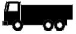
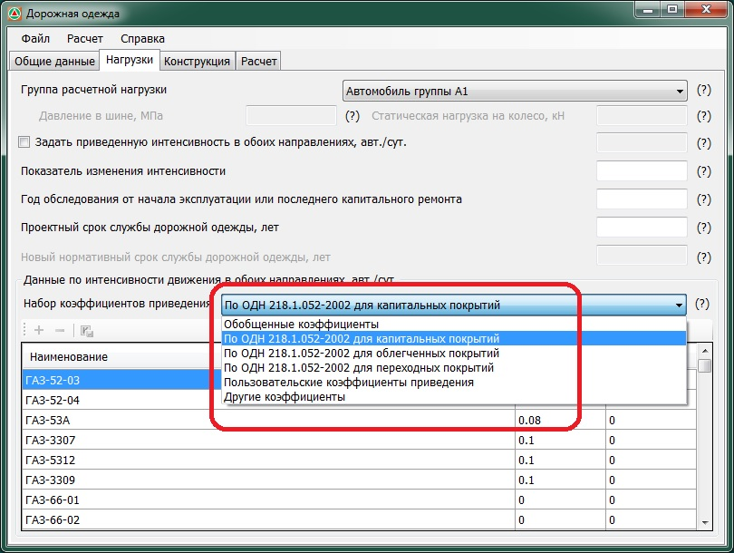

# Нагрузки



- ПНСТ 542-2021 {#pnst-542-2021}

  
  
  На данной вкладке задаются характеристики нагрузок, а также способ вычисления суммарного числа приложений расчетной нагрузки за срок службы дорожной одежды.

  {#542-2021-gruppa-nagruzki}

  Расчетная нагрузка выбирается из выпадающего списка. Предусмотрены следующие типы нагрузок (согласно **ПНСТ 541-2021**):

  * **А-11.5** – (с нормированной статической нагрузкой на ось 115 кН и давлением в шине 0,8 Мпа, для автомобильных дорог с капитальными дорожными одеждами);
  * **А-10** – (с нормированной статической нагрузкой на ось 100 кН и давлением в шине 0,6 Мпа, для автомобильных дорог с облегчёнными и переходного типа дорожными одеждами).

  В качестве расчетной нагрузки также может быть выбрана другая нагрузка, в случае, когда в составе движения проектируемой дороги предусматривается регулярное обращение автомобилей с осевой нагрузкой, превышающей нормативную нагрузку АК более чем на 5 %, в количестве более 5 %. В данном случае, за расчетную осевую нагрузку допускается принимать максимальную нагрузку на наиболее нагруженную ось автомобиля.

  Для другой нагрузки необходимо задать соответствующие ей расчетные параметры:

  * Номинальная статическая нагрузка на колесо
  * Давление воздуха в шинах.

  По этим данным определяются статические и динамические диаметры отпечатка шины (согласно **ПНСТ 542-2021**, формула 1 и 2).

  $$D_{ст}=\sqrt \frac{40Q_{ст}}{\pi p}$$

  $$D_{Д}=\sqrt {k_{дин}D_{ст}}$$

  где:

  * $Q_{ст}$ — нагрузка на колесо наиболее загруженной оси, кН;
  * $р$ — давление на покрытие, МПа;
  * $k_{дин}$ — коэффициент динамичности, равный 1,3.

  

  {#542-2021-koleso}

  Данное значение учитывается при расчете растягивающего напряжения, с помощью дополнительного коэффициента Кв (согласно **ПНСТ 542-2021**, п.9.6.3. ), учитывающего особенности напряженного состояния покрытия конструкции под спаренным баллоном. Его принимают равным 0,85 для спаренного баллона, а при расчете на однобаллонное колесо данный коэффициент принимают равным 1,00.

  

  {#542-2021-nagruzka-stat}

  Величина для задания Другой нагрузки и определения статических и динамических диаметров отпечатка шины (Согласно **ПНСТ 542-2021**, формула 1 и 2). Для другой нагрузки необходимо задать соответствующие ей расчетные параметры:

  * $Q_n$ - номинальная статическая нагрузка на колесо наиболее загруженной оси, кН;
  * $p$ - давление воздуха в шинах, МПа.

  По этим данным $Q_n$ и $p$ определяются $D_{ст}$ и $D_{Д}$ статические и динамические диаметры отпечатка шины, приведенного к кругу отпечатка следа соответственно неподвижного и подвижного автомобилей:

  $$D_{ст}=\sqrt \frac{40Q_{ст}}{\pi p}$$

  $$D_{Д}=\sqrt {k_{дин}D_{ст}}$$

  где:

  * $Q_{ст}$ — нагрузка на колесо наиболее загруженной оси, кН;
  * $р$ — давление на покрытие, МПа;
  * $k_{дин}$ — коэффициент динамичности, равный 1,3.

  

  {#542-2021-davlenie}

  Величина для задания Другой нагрузки и определения статических и динамических диаметров отпечатка шины (Согласно **ПНСТ 542-2021**, формула 1 и 2). Для другой нагрузки необходимо задать соответствующие ей расчетные параметры:

  * $Q_n$ - номинальная статическая нагрузка на колесо наиболее загруженной оси, кН;
  * $p$ - давление воздуха в шинах, МПа.

  По этим данным $Q_n$ и $p$ определяются $D_{ст}$ и $D_{Д}$ статические и динамические диаметры отпечатка шины, приведенного к кругу отпечатка следа соответственно неподвижного и подвижного автомобилей:

  $$D_{ст}=\sqrt \frac{40Q_{ст}}{\pi p}$$

  $$D_{Д}=\sqrt {k_{дин}D_{ст}}$$

  где:

  * $Q_{ст}$ — нагрузка на колесо наиболее загруженной оси, кН;
  * $р$ — давление на покрытие, МПа;
  * $k_{дин}$ — коэффициент динамичности, равный 1,3.

  

  {#542-2021-intensivnost-izmen}

  Показатель изменения интенсивности $q$ – знаменатель геометрической прогрессии, характеризующий прирост интенсивности движения, определяемый по формуле:

  $$q=1±r/100$$

  где:
  
  * $r$ – ежегодный прирост интенсивности движения в долях единицы (“+” – при ежегодном увеличении интенсивности движения, “–“ – при ежегодном уменьшении интенсивности движения).

  

  {#542-2021-srok-kaprem}

  Срок службы дорожной одежды между капитальными ремонтами в годах. Срок службы указывается в задании на проектирование или принимается согласно **ГОСТ Р 58861-2020**, табл. 2.

  Используется при определении величины расчетного числа приложений приведенной расчетной нагрузки на полосу движения (согласно **ПНСТ 542-2021**, формула 6).

  

  {#542-2021-srok-rem}

  Срок службы дорожной одежды между ремонтами в годах. Срок службы указывается в задании на проектирование или принимается согласно **ГОСТ Р 58861-2020**, табл.2.

  Учитывается при определении марки вяжущего согласно методике **ПНСТ 542-2021** прил. А, формула 6.

  

  {#542-2021-summa-prilozheniy}

  Определяется следующими способами:
  
  * Непосредственным заданием  величины $Σ N_р$ суммарного расчетного числа приложений приведенной расчетной нагрузки к точке на поверхности покрытия за нормативный срок службы дорожной одежды, авт;

    
  
    Имеется возможность определения суммарного расчетного числа приложений расчетной нагрузки за срок службы, при задании величины требуемого модуля упругости. Для этого нажмите кнопку [Подобрать по модулю](#542-2021-modul).

    
  
  * Заданием $N_р$ приведенной к расчетной нагрузки интенсивности движения на одну полосу, на произвольный год , авт/сут;
  
  На основе этой приведенной суточной интенсивности движения далее рассчитывается суммарное число приложений расчетной нагрузки, согласно **ПНСТ 542-2021**, формула 6:
  
  $$\sum N_p = 0,7N_p \frac{K_c}{q^{(T_{сл}-1)}}T_{рдг}k_n$$
  
  * Заданием состава движения (грузовых автомобилей и автобусов) для любого года эксплуатации дорожной одежды, от первого до последнего (перед капитальным ремонтом). Фактическая интенсивность задается по следующим группам автомобилей (согласно **ПНСТ 541-2021**, приложение Б табл.Б1 и Б2):
  
  #|
  || **Категория транспортного средства** {.cell-align-center}| **Схема** {.cell-align-center}| **Тип транспортного средства** {.cell-align-center}| **$S_i$ для капитального типа дорожной одежды (для нагрузки А-11,5)** {.cell-align-center}| **$S_i$ для облегченного и переходного типов дорожной одежды (для нагрузки А-10)** {.cell-align-center}||
  || B {.cell-align-center}|  | Легковые автомобили, небольшие грузовики (фургоны) и другие автомобили с прицепом и без него | 0,0015 {.cell-align-center}| 0,013 {.cell-align-center}||
  || C1 {.cell-align-center}|  | Двухосные грузовые автомобили | 1,51 {.cell-align-center}| 1,76 {.cell-align-center}||
  || С2 {.cell-align-center}|  | Трехосные грузовые автомобили | 2,33 {.cell-align-center}| 2,43 {.cell-align-center}||
  || С3 {.cell-align-center}|  | Четырехосные грузовые автомобили | 2,56 {.cell-align-center}| 2,72 {.cell-align-center}||
  || С4 {.cell-align-center}|  | Четырехосные автопоезда (двухосный грузовой автомобиль с прицепом) | 2,54 {.cell-align-center}| 3,67 {.cell-align-center}||
  || С5 {.cell-align-center}|  | Пятиосные автопоезда (трехосный грузовой автомобиль с прицепом) | 2,13 {.cell-align-center}| 3,92 {.cell-align-center}||
  || С6 {.cell-align-center}|  | Трехосные седельные автопоезда (двухосный седельный тягач с полуприцепом) | 2,36 {.cell-align-center}| 3,14 {.cell-align-center}||
  || С7 {.cell-align-center}|  | Четырехосные седельные автопоезда(двухосный седельный тягач с полуприцепом) | 2,96 {.cell-align-center}| 3,25 {.cell-align-center}||
  || С8 {.cell-align-center}|  | Пятиосные седельные автопоезда(двухосный седельный тягач с полуприцепом) | 2,83 {.cell-align-center}| 3,69 {.cell-align-center}||
  || С9 {.cell-align-center}|  | Пятиосные седельные автопоезда (трехосный седельный тягач с полуприцепом) | 3,01 {.cell-align-center}| 3,73 {.cell-align-center}||
  || С10 {.cell-align-center}|  | Шестиосные седельные автопоезда | 2,12 {.cell-align-center}| 4,03 {.cell-align-center}||
  || С11 {.cell-align-center}|  | Автомобили с семью и более осями и др. | 1,58 {.cell-align-center}| 3,41 {.cell-align-center}||
  || D {.cell-align-center}|  | Автобусы | 1,16 {.cell-align-center}| 1,96 {.cell-align-center}||
  |#
  
  Далее, на основе этих данных, происходит расчет приведенной интенсивности, согласно **ПНСТ 542-2021**, формула 3:
  
  $$N_p = f_{пол} \sum\limits^{n}_{i=1} {N_i S_i}$$
  
  где:
  
  * $f_{пол}$ — коэффициент распределения интенсивности движения для самой нагруженной полосы движения, зависящий от числа полос движения, принимаемый при отсутствии данных натурных наблюдений по таблице 2.
  * $N_i$ — число автомобилей i-й марки в одном или в обоих направлениях на конец срока службы дорожных одежд, авт/сут;
  * $S_i$ — коэффициент приведения воздействия на дорожную одежду транспортного средства i-й марки с нагрузкой на колесо $P_i$ к расчетной нагрузке в соответствии с **ПНСТ 541 – 2021**;
  * $n$ – общее число различных марок транспортных средств в составе транспортного потока.
  
  А затем, рассчитывается суммарное число приложений приведенной нагрузки, согласно **ПНСТ 542-2021**, формула. 6:
  
  $$\sum N_p = 0,7N_p \frac{K_c}{q^{(T_{сл}-1)}}T_{рдг}k_n$$
  
  В двух последних случаях одновременно задаются следующие данные:
  
  * [Срок работ по капитальному ремонту, лет](#542-2021-srok-kaprem) – нормативный межремонтный срок службы дорожной одежды между капитальными ремонтами в годах;
  * [Год, на который задана интенсивность](#542-2021-intensivnost-god) – номер года, для которого задана интенсивность движения;
  * [Показатель изменения интенсивности](#542-2021-intensivnost-izmen) – знаменатель геометрической прогрессии, характеризующий прирост интенсивности движения.

  

  {#542-2021-modul}

  Данной опцией определяется суммарное число приложенной расчетной нагрузки за срок службы, при заданной величине требуемого модуля упругости (Согласно **ПНСТ 542-2021**, формула 9).

  $$Е_{min} = \sqrt {\frac{p}{0.6}} 98,65 [lg\sum N_p - c], (МПа)$$

  где:

  * $p$ — расчетное давление на покрытие в соответствии с ГОСТ 32960;
  * $ΣN_p$ — суммарное расчетное число приложений приведенной расчетной нагрузки на полосу движения за нормативный межремонтный срок службы проведения работ по капитальному ремонту [см. формулы (4) и (6)];
  * $c$ — эмпирический параметр, равный для расчетной нагрузки: А-10 — 3,55; А-11,5 — 3,20.

  Расчет по допускаемому упругому прогибу не проводят при нагрузке на ось 115 кН и более.

  

  При нагрузке, отличной от А-10 и А-11,5, коэффициент с находят по интерполяции.

  

  

  {#542-2021-intensivnost-priv}

  На основе этой приведенной суточной интенсивности движения далее рассчитывается суммарное число приложений расчетной нагрузки, согласно **ПНСТ 542-2021**, формула 6:
  
  $$\sum N_p = 0,7N_p \frac{K_c}{q^{(T_{сл}-1)}}T_{рдг}k_n$$
  
  В двух последних случаях одновременно задаются следующие данные:
  
  * [Срок работ по капитальному ремонту, лет](#542-2021-srok-kaprem) – нормативный межремонтный срок службы дорожной одежды между капитальными ремонтами в годах;
  * [Год, на который задана интенсивность](#542-2021-intensivnost-god) – номер года, для которого задана интенсивность движения;
  * [Показатель изменения интенсивности](#542-2021-intensivnost-izmen) – знаменатель геометрической прогрессии, характеризующий прирост интенсивности движения.

  

  {#542-2021-intensivnost-god}

  Номер года, для которого задана интенсивность движения (может задаваться в пределах от 1 и до расчетного года наступления капитального ремонта).

  

  {#542-2021-koeff-priv}

  Фактическая интенсивность задается по следующим группам автомобилей (согласно **ПНСТ 541-2021**, приложение Б табл. Б1 и Б2):

  #|
  || **Категория транспортного средства** {.cell-align-center}| **Схема** {.cell-align-center}| **Тип транспортного средства** {.cell-align-center}| **$S_i$ для капитального типа дорожной одежды (для нагрузки А-11,5)** {.cell-align-center}| **$S_i$ для облегченного и переходного типов дорожной одежды (для нагрузки А-10)** {.cell-align-center}||
  || B {.cell-align-center}|  | Легковые автомобили, небольшие грузовики (фургоны) и другие автомобили с прицепом и без него | 0,0015 {.cell-align-center}| 0,013 {.cell-align-center}||
  || C1 {.cell-align-center}|  | Двухосные грузовые автомобили | 1,51 {.cell-align-center}| 1,76 {.cell-align-center}||
  || С2 {.cell-align-center}|   | Трехосные грузовые автомобили | 2,33 {.cell-align-center}| 2,43 {.cell-align-center}||
  || С3 {.cell-align-center}|  | Четырехосные грузовые автомобили | 2,56 {.cell-align-center}| 2,72 {.cell-align-center}||
  || С4 {.cell-align-center}|  | Четырехосные автопоезда (двухосный грузовой автомобиль с прицепом) | 2,54 {.cell-align-center}| 3,67 {.cell-align-center}||
  || С5 {.cell-align-center}|  | Пятиосные автопоезда (трехосный грузовой автомобиль с прицепом) | 2,13 {.cell-align-center}| 3,92 {.cell-align-center}||
  || С6 {.cell-align-center}|  | Трехосные седельные автопоезда (двухосный седельный тягач с полуприцепом) | 2,36 {.cell-align-center}| 3,14 {.cell-align-center}||
  || С7 {.cell-align-center}|  | Четырехосные седельные автопоезда(двухосный седельный тягач с полуприцепом) | 2,96 {.cell-align-center}| 3,25 {.cell-align-center}||
  || С8 {.cell-align-center}|  | Пятиосные седельные автопоезда(двухосный седельный тягач с полуприцепом) | 2,83 {.cell-align-center}| 3,69 {.cell-align-center}||
  || С9 {.cell-align-center}|  | Пятиосные седельные автопоезда (трехосный седельный тягач с полуприцепом) | 3,01 {.cell-align-center}| 3,73 {.cell-align-center}||
  || С10 {.cell-align-center}|  | Шестиосные седельные автопоезда | 2,12 {.cell-align-center}| 4,03 {.cell-align-center}||
  || С11 {.cell-align-center}|  | Автомобили с семью и более осями и др. | 1,58 {.cell-align-center}| 3,41 {.cell-align-center}||
  || D {.cell-align-center}|  | Автобусы | 1,16 {.cell-align-center}| 1,96 {.cell-align-center}||
  |#

  

  1. Согласно данной таблицы принимаются коэффициенты приведения каждой группы автомобилей к расчетному автомобилю A-11.5 или А-10
  2. В случаях расчета на нагрузку, отличную от А-11,5 или A-10 расчет приведенной интенсивности движения, осуществляется тоже с помощью коэффициентов приведения для соответствующей расчетной нагрузки.
  3. При необходимости приведения фактической суточной интенсивности движения к расчетной нагрузке, стандартные категории автомобилей по грузоподъемности и соответствующие им коэффициенты приведения могут быть отредактированы. Для этого перейдите на вкладку Другие коэффициенты и внесите необходимые изменения.

  

  Далее, на основе этих данных, происходит расчет приведенной интенсивности, согласно **ПНСТ 542-2021**, формула 3:

  $$N_p = f_{пол} \sum\limits^{n}_{i=1} {N_i K_i}$$

  где:

  * $f_{пол}$ — коэффициент распределения интенсивности движения для самой нагруженной полосы движения, зависящий от числа полос движения, принимаемый при отсутствии данных натурных наблюдений по таблице 2;
  * $N_i$ — число автомобилей i-й марки в одном или в обоих направлениях на конец срока службы дорожных одежд, авт/сут;
  * $K_i$ — коэффициент приведения воздействия на дорожную одежду транспортного средства i-й марки с нагрузкой на колесо $P_i$ к расчетной нагрузке в соответствии с ПНСТ 541 – 2021;
  * $n$ – общее число различных марок транспортных средств в составе транспортного потока.

  А затем, рассчитывается суммарное число приложений приведенной нагрузки, согласно **ПНСТ 542-2021**, формула. 6:

  $$\sum N_p = 0,7N_p \frac{K_c}{q^{(T_{сл}-1)}}T_{рдг}k_n$$

  В данном случае также задаются следующие данные:

  * [Срок работ по капитальному ремонту, лет](#542-2021-srok-kaprem) – нормативный межремонтный срок службы дорожной одежды между капитальными ремонтами в годах;
  * [Год, на который задана интенсивность](i#542-2021-intensivnost-god) – номер года, для которого задана интенсивность движения;
  * [Показатель изменения интенсивности](#542-2021-intensivnost-izmen) – знаменатель геометрической прогрессии, характеризующий прирост интенсивности движения.

  

  {#542-2021-koeff-drugie}

  Уточнить

  

- ПНСТ 265-2018 {#pnst-265-2018}

  

  На данной вкладке задаются характеристики нагрузок, а также способ вычисления суммарного числа приложений расчетной нагрузки за срок службы дорожной одежды.

  {#265-2018-gruppa-nagruzki}

  Расчетная нагрузка выбирается из выпадающего списка. Предусмотрены следующие типы нагрузок (согласно **ГОСТ 32960**):

  * **А-11.5** – (с нормированной статической нагрузкой на ось 115 кН и давлением в шине 0,8 Мпа, для автомобильных дорог с капитальными дорожными одеждами);
  * **А-10** – (с нормированной статической нагрузкой на ось 100 кН и давлением в шине 0,6 Мпа, для автомобильных дорог с облегчёнными и переходного типа дорожными одеждами).

  В качестве расчетной нагрузки также может быть выбрана другая нагрузка, в случае, когда в составе движения проектируемой дороги предусматривается регулярное обращение автомобилей с осевой нагрузкой, превышающей нормативную нагрузку АК более чем на 5 %, в количестве более 5 %. В данном случае, за расчетную осевую нагрузку допускается принимать максимальную нагрузку на наиболее нагруженную ось автомобиля.

  Для другой нагрузки необходимо задать соответствующие ей расчетные параметры:

  * Номинальная статическая нагрузка на колесо
  * Давление воздуха в шинах.

  По этим данным определяются статические и динамические диаметры отпечатка шины (согласно **ПНСТ 265-2018**, формула 1 и 2).

  $$D_{ст}=\sqrt \frac{40P_{ст}}{\pi p}$$

  $$D_{Д}=\sqrt {k_{дин}D_{ст}}$$

  где:

  * $Р_{ст}$ — нагрузка на колесо наиболее загруженной оси, кН;
  * $р$ — давление на покрытие, МПа;
  * $k_{дин}$ — коэффициент динамичности, равный 1,3.

  

  {#265-2018-koleso}

  Данное значение учитывается при расчете растягивающего напряжения, с помощью дополнительного коэффициента Кв (согласно **ПНСТ 265-2018**, п.10.6.3. ), учитывающего особенности напряженного состояния покрытия конструкции под спаренным баллоном. Его принимают равным 0,85 для спаренного баллона, а при расчете на однобаллонное колесо данный коэффициент принимают равным 1,00.

  

  {#265-2018-nagruzka-stat}

  Величина для задания Другой нагрузки и определения статических и динамических диаметров отпечатка шины (Согласно **ПНСТ 265-2018**, формула 1 и 2). Для другой нагрузки необходимо задать соответствующие ей расчетные параметры:

  * $Q_n$ - номинальная статическая нагрузка на колесо наиболее загруженной оси, кН;
  * $P_{ст}$ - давление воздуха в шинах, МПа.

  По этим данным $Q_n$ и $P_{ст}$ определяются $D_{ст}$ и $D_{Д}$ статические и динамические диаметры отпечатка шины, приведенного к кругу отпечатка следа соответственно неподвижного и подвижного автомобилей:

  $$D_{ст}=\sqrt \frac{40P_{ст}}{\pi p}$$

  $$D_{Д}=\sqrt {k_{дин}D_{ст}}$$

  где:

  * $Р_{ст}$ — нагрузка на колесо наиболее загруженной оси, кН;
  * $р$ — давление на покрытие, МПа;
  * $k_{дин}$ — коэффициент динамичности, равный 1,3.

  

  {#265-2018-davlenie}

  Величина для задания Другой нагрузки и определения статических и динамических диаметров отпечатка шины (Согласно **ПНСТ 265-2018**, формула 1 и 2). Для другой нагрузки необходимо задать соответствующие ей расчетные параметры:

  * $Q_n$ - номинальная статическая нагрузка на колесо наиболее загруженной оси, кН;
  * $P_{ст}$ - давление воздуха в шинах, МПа.

  По этим данным $Q_n$ и $P_{ст}$ определяются $D_{ст}$ и $D_{Д}$ статические и динамические диаметры отпечатка шины, приведенного к кругу отпечатка следа соответственно неподвижного и подвижного автомобилей:

  $$D_{ст}=\sqrt \frac{40P_{ст}}{\pi p}$$

  $$D_{Д}=\sqrt {k_{дин}D_{ст}}$$

  где:

  * $Р_{ст}$ — нагрузка на колесо наиболее загруженной оси, кН;
  * $р$ — давление на покрытие, МПа;
  * $k_{дин}$ — коэффициент динамичности, равный 1,3.

  

  {#265-2018-intensivnost-izmen}

  Показатель изменения интенсивности $q$ – знаменатель геометрической прогрессии, характеризующий прирост интенсивности движения, определяемый по формуле:

  $$q=(1±r)$$

  где:
  
  * $r$ – ежегодный прирост интенсивности движения в долях единицы (“+” – при ежегодном увеличении интенсивности движения, “–“ – при ежегодном уменьшении интенсивности движения).

  

  {#265-2018-srok-kaprem}

  Срок службы дорожной одежды между капитальными ремонтами в годах. Срок службы указывается в задании на проектирование или принимается согласно **ПНСТ 265-2018**, табл. 8.

  #|
  || **Категория дороги** {.cell-align-center}| **Нормативный межремонтный срок проведения работ по капитальному ремонту $Т_{сл}$** {.cell-align-center}| **Нормативный межремонтный срок проведения работ по ремонту** {.cell-align-center}||
  || I {.cell-align-center}| 24 года {.cell-align-center}| 12 лет {.cell-align-center}||
  || II {.cell-align-center}| 24 года {.cell-align-center}| 12 лет {.cell-align-center}||
  || III {.cell-align-center}| 24 года {.cell-align-center}| 12 лет {.cell-align-center}||
  || IV {.cell-align-center}| 24 года {.cell-align-center}| 12 лет {.cell-align-center}||
  || V {.cell-align-center}| 10 лет {.cell-align-center}| 5 лет {.cell-align-center}||
  |#

  Используется при определении величины расчетного числа приложений приведенной расчетной нагрузки на полосу движения (согласно **ПНСТ 265-2018**, формула 6).

  

  {#265-2018-srok-rem}

  Срок службы дорожной одежды между ремонтами в годах. Срок службы указывается в задании на проектирование или принимается согласно **ПНСТ 265-2018**, табл.8.

  #|
  || **Категория дороги** {.cell-align-center}| **Нормативный межремонтный срок проведения работ по капитальному ремонту $Т_{сл}$** {.cell-align-center}| **Нормативный межремонтный срок проведения работ по ремонту** {.cell-align-center}||
  || I {.cell-align-center}| 24 года {.cell-align-center}| 12 лет {.cell-align-center}||
  || II {.cell-align-center}| 24 года {.cell-align-center}| 12 лет {.cell-align-center}||
  || III {.cell-align-center}| 24 года {.cell-align-center}| 12 лет {.cell-align-center}||
  || IV {.cell-align-center}| 24 года {.cell-align-center}| 12 лет {.cell-align-center}||
  || V {.cell-align-center}| 10 лет {.cell-align-center}| 5 лет {.cell-align-center}||
  |#

  Учитывается при определении значения коэффициента снижения прочности вследствие усталостных явлений при многократном приложении нагрузки (согласно **ПНСТ 265-2018**, формула 19).

  

  {#265-2018-summa-prilozheniy}

  Определяется следующими способами:

  * Непосредственным заданием  величины $Σ N_р$ суммарного расчетного числа приложений приведенной расчетной нагрузки к точке на поверхности покрытия за нормативный срок службы дорожной одежды, авт;

    

    Имеется возможность определения суммарного расчетного числа приложений расчетной нагрузки за срок службы, при задании величины требуемого модуля упругости. Для этого нажмите кнопку [Подобрать по модулю](#265-2018-modul).

    

  * Заданием $N_р$ приведенной к расчетной нагрузки интенсивности движения на одну полосу, на произвольный год , авт/сут;
  
  На основе этой приведенной суточной интенсивности движения далее рассчитывается суммарное число приложений расчетной нагрузки, согласно **ПНСТ 265-2018**, формула 6:

  $$\sum N_p = 0,7N_p \frac{K_c}{q^{(T_{сл}-1)}}T_{рдг}k_n$$

  * Заданием состава движения (грузовых автомобилей и автобусов) для любого года эксплуатации дорожной одежды, от первого до последнего (перед капитальным ремонтом). Фактическая интенсивность задается по следующим группам автомобилей (согласно **ПНСТ 265-2018**, табл.6):
  
  #|
  || **Категория транспортного средства** {.cell-align-center}| **Схема** {.cell-align-center}| **Тип транспортного средства** {.cell-align-center}| **$K_i$ для капитального типа дорожной одежды (для нагрузки А-11,5)** {.cell-align-center}| **$K_i$ для облегченного и переходного типов дорожной одежды (для нагрузки А-10)** {.cell-align-center}||
  || B {.cell-align-center}|  | Легковые автомобили, небольшие грузовики (фургоны) и другие автомобили с прицепом и без него | 0,01 {.cell-align-center}| 0,02 {.cell-align-center}||
  || C {.cell-align-center}|  | Двухосные грузовые автомобили | 0,60 {.cell-align-center}| 1,11 {.cell-align-center}||
  || ^ |  | Трехосные грузовые автомобили | 2,49 {.cell-align-center}| 3,18 {.cell-align-center}||
  || ^ |  | Четырехосные грузовые автомобили | 3,62 {.cell-align-center}| 4,41 {.cell-align-center}||
  || ^ |  | Четырехосные автопоезда (двухосный грузовой автомобиль с прицепом) | 1,81 {.cell-align-center}| 2,98 {.cell-align-center}||
  || ^ |  | Пятиосные автопоезда (трехосный грузовой автомобиль с прицепом) | 2,15 {.cell-align-center}| 4,03 {.cell-align-center}||
  || ^ |  | Трехосные седельные автопоезда (двухосный седельный тягач с полуприцепом) | 2,39 {.cell-align-center}| 3,62 {.cell-align-center}||
  || ^ |  | Четырехосные седельные автопоезда(двухосный седельный тягач с полуприцепом) | 4,13 {.cell-align-center}| 5,56 {.cell-align-center}||
  || ^ |  | Пятиосные седельные автопоезда(двухосный седельный тягач с полуприцепом) | 6,48 {.cell-align-center}| 7,42 {.cell-align-center}||
  || ^ |  | Пятиосные седельные автопоезда (трехосный седельный тягач с полуприцепом) | 4,70 {.cell-align-center}| 6,15 {.cell-align-center}||
  || ^ |  | Шестиосные седельные автопоезда | 7,94 {.cell-align-center}| 8,93 {.cell-align-center}||
  || ^ |  | Автомобили с семью и более осями и др. | 8,47 {.cell-align-center}| 9,94 {.cell-align-center}||
  || D {.cell-align-center}|  | Автобусы | 0,75 {.cell-align-center}| 1,46 {.cell-align-center}||
  |#

  Далее, на основе этих данных, происходит расчет приведенной интенсивности, согласно **ПНСТ 265-2018**, формула 3:

  $$N_p = f_{пол} \sum\limits^{n}_{i=1} {N_i K_i}$$

  где:

  * $f_{пол}$ — коэффициент распределения интенсивности движения для самой нагруженной полосы движения, зависящий от числа полос движения, принимаемый при отсутствии данных натурных наблюдений по таблице 4;
  * $N_i$ — число автомобилей i-й марки в одном или в обоих направлениях на конец срока службы дорожных одежд, авт/сут;
  * $K_i$ — коэффициент приведения воздействия на дорожную одежду транспортного средства i-й марки с нагрузкой на колесо $P_i$ к расчетной нагрузке.

  А затем, рассчитывается суммарное число приложений приведенной нагрузки, согласно **ПНСТ 265-2018**, формула. 6:

  $$\sum N_p = 0,7N_p \frac{K_c}{q^{(T_{сл}-1)}}T_{рдг}k_n$$

  В двух последних случаях одновременно задаются следующие данные:

  * [Срок работ по капитальному ремонту, лет](#265-2018-srok-kaprem) – нормативный межремонтный срок службы дорожной одежды между капитальными ремонтами в годах (**ПНСТ 265-2018**, табл.8);
  * [Год, на который задана интенсивность](#265-2018-intensivnost-god) – номер года, для которого задана интенсивность движения;
  * [Показатель изменения интенсивности](#265-2018-intensivnost-izmen) – знаменатель геометрической прогрессии, характеризующий прирост интенсивности движения.

  

  {#265-2018-modul}

  Данной опцией определяется суммарное число приложенной расчетной нагрузки за срок службы, при заданной величине требуемого модуля упругости (Согласно **ПНСТ 265-2018**, формула 10).

  $$Е_{min}=\sqrt{\frac{p}{0.6}} 98,65 [lg\sum N_p-c], (МПа)$$

  где:

  * $p$ — расчетное давление на покрытие;
  * $ΣN_p$ — суммарное расчетное число приложений приведенной расчетной нагрузки на полосу движения за нормативный межремонтный срок службы проведения работ по капитальному ремонту [см. формулу (6)];
  * $c$ — эмпирический параметр, равный для расчетной нагрузки: А-10 — 3,55; А-11,5 — 3,20.

  Расчет по допускаемому упругому прогибу не проводят при нагрузке на ось 120 кН и более.

  

  {#265-2018-intensivnost-priv}

  На основе этой приведенной суточной интенсивности движения далее рассчитывается суммарное число приложений расчетной нагрузки, согласно **ПНСТ 265-2018**, формула 6:
  
  $$\sum N_p = 0,7N_p \frac{K_c}{q^{(T_{сл}-1)}}T_{рдг}k_n$$
  
  В двух последних случаях одновременно задаются следующие данные:
  
  * [Срок работ по капитальному ремонту, лет](#265-2018-srok-kaprem) – нормативный межремонтный срок службы дорожной одежды между капитальными ремонтами в годах (**ПНСТ 265-2018**, табл.8);
  * [Год, на который задана интенсивность](#265-2018-intensivnost-god) – номер года, для которого задана интенсивность движения;
  * [Показатель изменения интенсивности](#265-2018-intensivnost-izmen) – знаменатель геометрической прогрессии, характеризующий прирост интенсивности движения.
  
  

  {#265-2018-intensivnost-god}

  Номер года, для которого задана интенсивность движения (может задаваться в пределах от 1 и до расчетного года наступления капитального ремонта).
  
  

  {#265-2018-koeff-priv}

  Фактическая интенсивность задается по следующим группам автомобилей (согласно **ПНСТ 265-2018**, табл. 6):
  
  #|
  || **Категория транспортного средства** {.cell-align-center}| **Схема** {.cell-align-center}| **Тип транспортного средства** {.cell-align-center}| **$K_i$ для капитального типа дорожной одежды (для нагрузки А-11,5)** {.cell-align-center}| **$K_i$ для облегченного и переходного типов дорожной одежды (для нагрузки А-10)** {.cell-align-center}||
  || B {.cell-align-center}|  {.cell-align-center}| Легковые автомобили, небольшие грузовики (фургоны) и другие автомобили с прицепом и без него | 0,01 {.cell-align-center}| 0,02 {.cell-align-center}||
  || C {.cell-align-center}|  | Двухосные грузовые автомобили | 0,60 {.cell-align-center}| 1,11 {.cell-align-center}||
  || ^ |  | Трехосные грузовые автомобили | 2,49 {.cell-align-center}| 3,18 {.cell-align-center}||
  || ^ |  | Четырехосные грузовые автомобили | 3,62 {.cell-align-center}| 4,41 {.cell-align-center}||
  || ^ |  | Четырехосные автопоезда (двухосный грузовой автомобиль с прицепом) | 1,81 {.cell-align-center}| 2,98 {.cell-align-center}||
  || ^ |   | Пятиосные автопоезда (трехосный грузовой автомобиль с прицепом) | 2,15 {.cell-align-center}| 4,03 {.cell-align-center}||
  || ^ |  | Трехосные седельные автопоезда (двухосный седельный тягач с полуприцепом) | 2,39 {.cell-align-center}| 3,62 {.cell-align-center}||
  || ^ |  | Четырехосные седельные автопоезда(двухосный седельный тягач с полуприцепом) | 4,13 {.cell-align-center}| 5,56 {.cell-align-center}||
  || ^ |  | Пятиосные седельные автопоезда(двухосный седельный тягач с полуприцепом) | 6,48 {.cell-align-center}| 7,42 {.cell-align-center}||
  || ^ |  | Пятиосные седельные автопоезда (трехосный седельный тягач с полуприцепом) | 4,70 {.cell-align-center}| 6,15 {.cell-align-center}||
  || ^ |  | Шестиосные седельные автопоезда | 7,94 {.cell-align-center}| 8,93 {.cell-align-center}||
  || ^ |  | Автомобили с семью и более осями и др. | 8,47 {.cell-align-center}| 9,94 {.cell-align-center}||
  || D {.cell-align-center}|  | Автобусы | 0,75 {.cell-align-center}| 1,46 {.cell-align-center}||
  |#
  
  
  
  1. Согласно данной таблицы принимаются коэффициенты приведения каждой группы автомобилей к расчетному автомобилю A-11.5 или А-10
  2. В случаях расчета на нагрузку, отличную от А-11,5 или A-10 расчет приведенной интенсивности движения, осуществляется то же с помощью коэффициентов приведения для соответствующей расчетной нагрузки.
  3. При необходимости приведения фактической суточной интенсивности движения к расчетной нагрузке, стандартные категории автомобилей по грузоподъемности и соответствующие им коэффициенты приведения могут быть отредактированы. Для этого перейдите на вкладку Другие коэффициенты и внесите необходимые изменения.
  
  
  
  Далее, на основе этих данных, происходит расчет приведенной интенсивности, согласно **ПНСТ 265-2018**, формула 3:
  
  $$N_p=f_{пол}\sum\limits^{n}_{i=1}{N_i K_i}$$

  где:

  * $f_{пол}$ — коэффициент распределения интенсивности движения для самой нагруженной полосы движения, зависящий от числа полос движения, принимаемый при отсутствии данных натурных наблюдений по таблице 4;
  * $N_i$ — число автомобилей i-й марки в одном или в обоих направлениях на конец срока службы дорожных одежд, авт/сут;
  * $K_i$ — коэффициент приведения воздействия на дорожную одежду транспортного средства i-й марки с нагрузкой на колесо $P_i$ к расчетной нагрузке.

  А затем, рассчитывается суммарное число приложений приведенной нагрузки, согласно **ПНСТ 265-2018**, формула. 6:

  $$\sum N_p = 0,7N_p\frac{K_c}{q^{(T_{сл}-1)}}T_{рдг}k_n$$

  В данном случае также задаются следующие данные:

  * [Срок работ по капитальному ремонту, лет](#265-2018-srok-kaprem) – нормативный межремонтный срок службы дорожной одежды между капитальными ремонтами в годах (**ПНСТ 265-2018**, табл.8);
  * [Год, на который задана интенсивность](#265-2018-intensivnost-god) – номер года, для которого задана интенсивность движения;
  * [Показатель изменения интенсивности](#265-2018-intensivnost-izmen) – знаменатель геометрической прогрессии, характеризующий прирост интенсивности движения.

  

  {#265-2018-koeff-drugie}

  УТОЧНИТЬ

  

- ОДН 218.046-01, МР (взамен ВСН 197-91) {#odn-218-046-01}

  
  
  На данной вкладке задаются характеристики нагрузок, а также способ вычисления суммарного числа приложений расчетной нагрузки за срок службы дорожной одежды.

  {#218-046-01-gruppa-nagruzki}

  Группа расчетной нагрузки выбирается из выпадающего списка. Предусмотрено несколько стандартных групп нагрузок, согласно:
  
  * **ОДН 218.046-01** (прил. 1, табл. П 1.1);
  * **ГОСТ 32960-2014** (пункт 3.3).
  
  При выборе **Типа расчета** (вкладка [Общие данные](common_data.md#218-046-01-raschet)) – Краевая или Остановочная полоса обочины, согласно **ОДН 218.3.039-2003** (п. 4.1) в качестве расчетной нагрузки принимается А1 (АК10).
  
  **Группа расчетной нагрузки, соответствующая ОДН 218.046- 01 (табл. П.1.1)**
  
  * **А11,5** – (с нормированной статической нагрузкой на ось 115 кН и давлением в шине 0,6 МПа);
  * **А1** – (с нормированной статической нагрузкой на ось 100 кН и давлением в шине 0,6 МПа);
  * **А2** – (с нормированной статической нагрузкой на ось 110 кН и давлением в шине 0,6 МПа);
  * **А3** – (с нормированной статической нагрузкой на ось 130 кН и давлением в шине 0,6 МПа);
  * **Другая**.

  **Группы расчетной нагрузки, определяемые по ГОСТ 32960-2014 (пункт 3.3 и 4.2.3)**

  * **АК11.5** – (с нормированной статической нагрузкой на ось 115 кН и давлением в шине 0,8 Мпа, для автомобильных дорог с капитальными дорожными одеждами);
  * **АК10** – (с нормированной статической нагрузкой на ось 100 кН и давлением в шине 0,6 Мпа, для автомобильных дорог с облегчёнными и переходного типа дорожными одеждами).

  

  В качестве расчетной нагрузки также может быть выбрана другая нагрузка с индивидуальными расчетными параметрами, если в составе движения имеется автомобиль с нагрузкой на ось, отличающейся от приведенных выше в большую сторону, из систематически обращающихся по дороге, доля которых составляет не менее 10% от состава грузового и автобусного движения, а также в случае расчета конструкции дорожной одежды для движения специализированного транспорта. Для другой нагрузки необходимо задать соответствующие ей расчетные параметры: номинальную статическую нагрузку на колесо и давление воздуха в шинах. По этим данным определяются статические и динамические диаметры отпечатка шины (Согласно **ОДН 218.046-01**, формула 3.4 и П 1.3). 

  

  

  {#218-046-01-nagruzka-stat}

  Величина для задания **Другой нагрузки** и определения статических и динамических диаметров отпечатка шины (Согласно **ОДН 218.046-01, формула 3.4 и П 1.3**).

  Для другой нагрузки необходимо задать соответствующие ей расчетные параметры:

  *  $Q_{n}$ - номинальная статическая нагрузка на колесо наиболее загруженной оси, кН;
  *  $P$ - давление воздуха в шинах, МПа.

  По этим данным $Q_n$ и $P$ определяются $Д_{ст}$ и $Д$ статические и динамические диаметры отпечатка шины, приведенные к кругу отпечатка следа соответственно неподвижного и подвижного автомобиля по формулам (Согласно **ОДН 218.046-01**, формула 3.4 и П 1.3):

  $$Д_{ст}=\sqrt{\frac{40 {Q_n}}{{\pi}{P}}};$$

  $$Д=\sqrt{1,3 {Д_{ст}}}$$

  

  {#218-046-01-davlenie}

  Величина для задания **Другой нагрузки** и определения статических и динамических диаметров отпечатка шины (Согласно **ОДН 218.046-01, формула 3.4 и П 1.3**).

  Для другой нагрузки необходимо задать соответствующие ей расчетные параметры:

  *  $Q_{n}$ - номинальная статическая нагрузка на колесо наиболее загруженной оси, кН;
  *  $P$ - давление воздуха в шинах, МПа.

  По этим данным $Q_n$ и $P$ определяются $Д_{ст}$ и $Д$ статические и динамические диаметры отпечатка шины, приведенного к кругу отпечатка следа соответственно неподвижного и подвижного автомобиля по формулам (Согласно **ОДН 218.046-01**, формула 3.4 и П 1.3):

  $$Д_{ст}=\sqrt{\frac{40 {Q_n}}{{\Pi}{P}}};$$
  
  $$Д=\sqrt{1,3 {Д_{ст}}}$$

  

  {#218-046-01-koleso}

  Данное значение учитывается при расчете растягивающего напряжения с помощью дополнительного коэффициента $К_в$ (**Согласно ОДН 218.046-01, п.3.40** ). Учитывая особенности напряженного состояния покрытия конструкции под спаренным баллоном, коэффициент принимают равным 0,85 (при расчете на однобаллонное колесо - равным 1,00).

  

  {#218-046-01-srok-kaprem}

  Срок службы дорожной одежды между капитальными ремонтами в годах. Срок службы указывается в задании на проектирование. При отсутствии региональных норм расчетный срок службы дорожной одежды допускается назначать в соответствии с табл. П.6.2,**ОДН 218.046-01**.

  Рекомендуемый расчетный срок службы конструкции:

  #|
  || Категория дороги | Тип дорожной одежды | Срок службы в дорожно-климатических зонах Тсл , лет |>|>||
  ||^|^| I, II {.cell-align-center}| III {.cell-align-center}| IV, V {.cell-align-center}||
  || 1 {.cell-align-center}| 2 {.cell-align-center}| 3 {.cell-align-center}| 4 {.cell-align-center}| 5 {.cell-align-center}||
  || I {.cell-align-center}| Капитальные {.cell-align-center}| 14-15-18 {.cell-align-center}| 15-19 {.cell-align-center}| 16-20 {.cell-align-center}||
  || II {.cell-align-center}| Капитальные {.cell-align-center}| 11-15 {.cell-align-center}| 12-16 {.cell-align-center}| 13-16 {.cell-align-center}||
  || III {.cell-align-center}| Капитальные {.cell-align-center}| 11-15 {.cell-align-center}| 12-16 {.cell-align-center}| 13-16 {.cell-align-center}||
  ||^| Облегченные {.cell-align-center}| 10-13 {.cell-align-center}| 11-14 {.cell-align-center}| 12-15 {.cell-align-center}||
  || IV {.cell-align-center}| Капитальные {.cell-align-center}| 11-15 {.cell-align-center}| 12-16 {.cell-align-center}| 13-16 {.cell-align-center}||
  ||^| Облегченные {.cell-align-center}| 8-10 {.cell-align-center}| 9-11 {.cell-align-center}| 10-12 {.cell-align-center}||
  || V {.cell-align-center}| Облегченные {.cell-align-center}| 8-10 {.cell-align-center}| 9-11 {.cell-align-center}| 10-12 {.cell-align-center}||
  ||^| Переходные {.cell-align-center}| 3-8 {.cell-align-center}| 3-9 {.cell-align-center}| 3-9 {.cell-align-center}||
  |#

  Также срок службы дорожной одежды может приниматься согласно Приложению 3 приказа № 157 (от 01 ноября 2007 г.).

  

  {#218-046-01-summa-prilozheniy}

  Определяется следующими способами:

  * Непосредственным заданием  величины $Σ N_р$ суммарного расчетного числа приложений приведенной расчетной нагрузки на одну полосу за срок службы, авт.;

    

    Имеется возможность определения суммарного расчетного числа приложений расчетной нагрузки за срок службы при задании величины требуемого модуля упругости. Для этого нажмите кнопку [Подобрать по модулю](#218-046-01-modul).

    

  * Заданием $N_р$ приведенной к расчетной нагрузке интенсивности движения на одну полосу, на произвольный год, авт/сут;

  На основе этой приведенной суточной интенсивности движения далее рассчитывается суммарное число приложений расчетной нагрузки согласно **ОДН 218.046-01**, форм. 3.7:

  $$\sum N_p = 0,7N_p \frac{K_c}{q^{(T_{сл}-1)}}T_{рдг}k_n$$

  * Заданием состава движения (грузовых автомобилей и автобусов) для любого года эксплуатации дорожной одежды, от первого до последнего (перед капитальным ремонтом). Согласно **ОДН 218.046-01** фактическая интенсивность задается по следующим группам автомобилей:

  * легкие грузовые автомобили с грузоподъемностью от 1 до 2 т;
  * средние автомобили с грузоподъемностью от 2 до 5 т;
  * тяжелые автомобили с грузоподъемностью от 5 до 8 т;
  * очень тяжелые автомобили с грузоподъемностью более 8 т;
  * тягачи с прицепами;
  * автобусы.

  Далее, на основе этих данных, происходит расчет приведенной интенсивности согласно **ОДН 218.046-01**, форм. 3.5:

  $$N_p = f_{пол} \sum\limits^{n}_{m=1} {N_m S_{mсум}}$$

  Затем рассчитывается суммарное число приложений приведенной нагрузки согласно **ОДН 218.046-01**, форм. 3.7:

  $$\sum N_p = 0,7N_p \frac{K_c}{q^{(T_{сл}-1)}}T_{рдг}k_n$$

  В двух последних случаях одновременно задаются следующие параметры нагрузки:
  
  * [Срок службы, лет](#218-046-01-srok-kaprem) – срок службы дорожной одежды между капитальными ремонтами в годах;
  * [Год, на который задана интенсивность](#218-046-01-intensivnost-god) – номер года, для которого задана интенсивность движения;
  * [Показатель изменения интенсивности](#218-046-01-intensivnost-izmen) – знаменатель геометрической прогрессии, характеризующий прирост интенсивности движения, определяемый по формуле:

  $$q = (1 ± r),$$

  где:
  
  * $r$ – ежегодный прирост интенсивности движения в долях единицы (“+” – при ежегодном увеличении интенсивности движения, “–“ – при ежегодном уменьшении интенсивности движения).

  

  {#218-046-01-modul}

  Данной опцией определяется суммарное число приложенной расчетной нагрузки за срок службы при заданной величине требуемого модуля упругости (Согласно **ОДН 218.046-01**, формула 3.10).

  $Е_{тiп}$ = 98,65 [$lg(\sum N_p) - c$],(МПа)

  

  {#218-046-01-intensivnost-priv}

  На основе заданной приведенной суточной интенсивности движения рассчитывается суммарное число приложений расчетной нагрузки согласно **ОДН 218.046-01**, форм. 3.7:

  $$\sum N_p = 0,7N_p \frac{K_c}{q^{(T_{сл}-1)}}T_{рдг}k_n$$

  В данном случае также задаются следующие данные:
  
  * [Срок службы, лет](#218-046-01-srok-kaprem) – срок службы дорожной одежды между капитальными ремонтами в годах;
  * [Год, на который задана интенсивность](#218-046-01-intensivnost-god) – номер года, для которого задана интенсивность движения;
  * [Показатель изменения интенсивности](#218-046-01-intensivnost-izmen) – знаменатель геометрической прогрессии, характеризующий прирост интенсивности движения.

  

  {#218-046-01-intensivnost-god}

  Номер года, для которого задана интенсивность движения, может задаваться в пределах от 1 и до конца срока службы дорожной одежды.

  

  {#218-046-01-intensivnost-izmen}

  Показатель изменения интенсивности $q$ – знаменатель геометрической прогрессии, характеризующий прирост интенсивности движения, определяемый по формуле:

  $$q = (1 ± r)$$

  где: 
  
  * $r$ – ежегодный прирост интенсивности движения в долях единицы (“+” – при ежегодном увеличении интенсивности движения, “–“ – при ежегодном уменьшении интенсивности движения).

  

  {#218-046-01-koeff-priv}

  Согласно **ОДН 218.046-01**, фактическая интенсивность задается по следующим группам автомобилей:

  * легкие грузовые автомобили с грузоподъемностью от 1 до 2 т.;
  * средние автомобили с грузоподъемностью от 2 до 5 т.;
  * тяжелые автомобили с грузоподъемностью от 5 до 8 т.;
  * очень тяжелые автомобили с грузоподъемностью более 8 т.;
  * тягачи с прицепами;
  * автобусы.

  

  1. В данном случае деление фактического состава движения по грузоподъемности, а также соответствующие каждой группе коэффициенты приведения к расчетному автомобилю гр. $A_1$ принимаются согласно **ОДН 218.046-01**, табл. П. 1.3.
  2. В случаях расчета на нагрузку, отличную от нагрузки гр. $А_1$, расчет приведенной интенсивности движения осуществляется также с помощью коэффициентов приведения для нагрузки $А_1$, но требуемый модуль определяется по формуле (3.10) **ОДН 218.046-01** при значениях коэффициента $С$, отличных от 3,55.

  

  Далее на основе этих данных происходит расчет приведенной интенсивности согласно **ОДН 218.046-01**, форм. 3.5:

  $$N_p = f_{пол} \sum\limits^{n}_{m=1}{N_m S_{mсум}}$$

  Затем рассчитывается суммарное число приложений приведенной нагрузки согласно **ОДН 218.046-01**, форм. 3.7:

  $$\sum N_p = 0,7N_p \frac{K_c}{q^{(T_{сл}-1)}}T_{рдг}k_n$$

  В данном случае также задаются следующие данные:

  * [Срок службы, лет](#218-046-01-srok-kaprem) – срок службы дорожной одежды между капитальными ремонтами в годах;
  * [Год, на который задана интенсивность](#218-046-01-intensivnost-god) – номер года, для которого задана интенсивность движения;
  * [Показатель изменения интенсивности](#218-046-01-intensivnost-izmen) – знаменатель геометрической прогрессии, характеризующий прирост интенсивности движения.

  

  {#218-046-01-koeff-drugie}

  При необходимости приведения фактической суточной интенсивности движения к расчетной нагрузке, стандартные категории автомобилей по грузоподъемности и соответствующие им коэффициенты приведения (задаваемые согласно **ОДН 218.046-01**, табл. П. 1.3) могут быть отредактированы. Для этого выберите из выпадающего списка с наименованием **Набор коэффициентов приведения** пункт **Другие коэффициенты**.
  
  В данном случае помимо поля Значение для редактирования станут доступны поля **Наименование** и **Коэффициент**.
  
  Также над списком групп автомобилей станет активна панель.
  
  * Для создания дополнительной группы автомобилей нажмите кнопку . Новая группа появится внизу списка. Задайте ей соответствующие наименование, коэффициент приведения к расчетной нагрузки и значение суточной интенсивности движения.
  * Для удаления какой - либо группы автомобилей из списка выделите ее и нажмите клавишу;
  * Отредактированный список групп автомобилей сохраняется в текущем расчете. При необходимости он может быть сохранен в стандартную библиотеку коэффициентов приведения и использоваться в других расчетах. Для сохранения текущего списка в библиотеку нажмите кнопку.
  
  
  
  1. Работа с типовыми библиотеками подробно описана в соответствующем разделе документации
  2. Коэффициент приведения группы автомобилей или конкретного автомобиля имеющегося в составе потока к расчетному может быть рассчитан на основе его технических характеристик (нагрузки на ось, количество осей и расстояния между ними).

  

  

- ВСН-21-83 {#vsn-21-83}

  

  Характеристики нагрузок задаются на вкладке Общие данные.

  {#21-83-intensivnost-fakt}

  Фактическая или прогнозируемая интенсивность движения в обоих направлениях в начальном или каком-либо промежуточном году, в пределах срока срока сравнения вариантов.

  

  {#21-83-intensivnost-god}

  Номер года, для которого задана интенсивность движения, может задаваться в пределах от 1 и до конца срока службы дорожной одежды.

  

  {#21-83-intensivnost-izmen}

  Показатель изменения интенсивности $q$ – знаменатель геометрической прогрессии, характеризующий прирост интенсивности движения, определяемый по формуле:

  $$q = (1 ± r)$$

  где:
  
  $r$ – ежегодный прирост интенсивности движения в долях единицы (“+” – при ежегодном увеличении интенсивности движения, “–“ – при ежегодном уменьшении интенсивности движения).

  

  {#21-83-srok-sravneniya}

  Срок сравнения $Т_{ср}$ (20, 25 лет или любой другой). 

  

  Cрок сравнения может задаваться больше срока службы дорожной одежды.

  

  

- ОДН 218.1.052-2002 {#odn-218-1-052-2002}

  
  
  На данной вкладке задаются характеристики нагрузок, а также способ вычисления приведенной суточной интенсивности движения.

  {#218-1-052-2002-gruppa-nagruzki}

  Группа расчетной нагрузки выбирается из выпадающего списка.

  Согласно **ОДН 218.1.052-2002**, для оценки прочности и расчета усиления нежестких дорожных одежд в качестве расчетной нагрузки следует использовать нагрузку $А_1$ (расчетная нагрузка 100 кН, удельное давление – 0,6 МПа; Расчетный диаметр: Д = 37 см);

  

  Согласно **ОДН 218.046-01**, в качестве расчетной нагрузки также может быть выбрана другая нагрузка, с индивидуальными расчетными параметрами, если в составе движения имеется автомобиль с нагрузкой на ось отличающейся от приведенных выше в большую сторону, из систематически обращающихся по дороге, доля которых составляет не менее 10 % от состава грузового и автобусного движения, а также в случае расчета конструкции дорожной одежды для движения специализированного транспорта.

  Для другой нагрузки необходимо задать соответствующие ей расчетные параметры: номинальная статическая нагрузка на колесо и давление воздуха в шинах. По этим данным определяются статические и динамические диаметры отпечатка шины (Согласно **ОДН 218.046-01**, формула 3.4 и П. 1.3). 

  

  

  {#218-1-052-2002-davlenie}

  Величина для задания **Другой нагрузки** и определения статических и динамических диаметров отпечатка шины (Согласно **ОДН 218.046-01, формула 3.4 и П 1.3**).

  Для другой нагрузки необходимо задать соответствующие ей расчетные параметры:

  *  $Q_{n}$ - номинальная статическая нагрузка на колесо наиболее загруженной оси, кН;
  *  $P$ - давление воздуха в шинах, МПа.

  По этим данным $Q_n$ и $P$ определяются $Д_{ст}$ и $Д$ статические и динамические диаметры отпечатка шины, приведенного к кругу отпечатка следа соответственно неподвижного и подвижного автомобиля по формулам (Согласно **ОДН 218.046-01**, формула 3.4 и П 1.3):

  $$Д_{ст} = \sqrt{\frac{40 {Q_n}}{{\Pi}{P}}}$$
  
  $$Д = \sqrt{1,3 {Д_{ст}}}$$

  

  {#218-1-052-2002-nagruzka-stat}

  Величина для задания **Другой нагрузки** и определения статических и динамических диаметров отпечатка шины (Согласно **ОДН 218.046-01, формула 3.4 и П 1.3**).

  Для другой нагрузки необходимо задать соответствующие ей расчетные параметры:

  *  $Q_{n}$ - номинальная статическая нагрузка на колесо наиболее загруженной оси, кН;
  *  $P$ - давление воздуха в шинах, МПа.

  По этим данным $Q_n$ и $P$ определяются $Д_{ст}$ и $Д$ статические и динамические диаметры отпечатка шины, приведенные к кругу отпечатка следа соответственно неподвижного и подвижного автомобиля по формулам (Согласно **ОДН 218.046-01**, формула 3.4 и П 1.3):

  $$Д_{ст}=\sqrt{\frac{40 {Q_n}}{{\pi}{P}}}$$
  
  $$Д =\sqrt{1,3{Д_{ст}}}$$

  

  {#218-1-052-2002-intensivnost-priv}

  Приведенная к расчетной нагрузке интенсивность движения определяется следующими способами:
  
  * Заданием значения приведенной интенсивности движения в обоих направлениях, на год обследования от начала эксплуатации или последнего капитального ремонта t, авт/сут.
  * Заданием данных по фактической интенсивности в обоих направлениях , т.е. состава движения (грузовых автомобилей и автобусов), на год обследования от начала эксплуатации или последнего капитального ремонта.
  
  В этом случае также необходимо задать следующие параметры:
  
  * [Показатель изменения интенсивности](#218-1-052-2002-intensivnost-izmen)
  * [Год обследования от начала эксплуатации или последнего капитального ремонта t](#218-1-052-2002-god-obsledovaniya)
  * [Проектный срок службы дорожной одежды, лет Т](#218-1-052-2002-srok-proektnyy)

  

  {#218-1-052-2002-intensivnost-izmen}

  Показатель изменения интенсивности $q$ – знаменатель геометрической прогрессии, характеризующий прирост интенсивности движения, определяемый по формуле:

  $$q = (1 ± r)$$

  где:
  
  $r$ – ежегодный прирост интенсивности движения в долях единицы (“+” – при ежегодном увеличении интенсивности движения, “–“ – при ежегодном уменьшении интенсивности движения).

  

  {#218-1-052-2002-god-obsledovaniya}

  Номер года обследования от начала эксплуатации или последнего капитального ремонта, для которого задано значение интенсивности движения.

  

  {#218-1-052-2002-srok-proektnyy}

  Проектный срок службы дорожной одежды между капитальными ремонтами в годах. Срок службы указывается в задании на проектирование или принимается по табл.6, прил. 6 **ОДН 218.1.052-2002**;

  #|
  || **Категория дороги** {.cell-align-center} | **Тип дорожной одежды** {.cell-align-center} | **Сроки службы нежестких дорожных одежд ($T_o$) и уровни их надежности ($K_н$) для дорожно-климатических зон** {.cell-align-center} |>|>|>|>|>||
  || ^ | ^ | I-II {.cell-align-center} |>| III {.cell-align-center} |>| IV-V {.cell-align-center} |>||
  || ^ | ^ | $T_o$ (лет) {.cell-align-center} | $K_н$ {.cell-align-center} | $T_o$ (лет) {.cell-align-center} | $K_н$ {.cell-align-center} | $T_o$ (лет) {.cell-align-center} | $K_н$ {.cell-align-center} ||
  || I {.cell-align-center} | Капитальный {.cell-align-center} | 18 {.cell-align-center} | 0,90 {.cell-align-center} | 19 {.cell-align-center} | 0,88 {.cell-align-center} | 20 {.cell-align-center} | 0,86 {.cell-align-center} ||
  || II {.cell-align-center} | Капитальный {.cell-align-center} | 15 {.cell-align-center} | 0,89 {.cell-align-center} | 16 {.cell-align-center} | 0,87 {.cell-align-center} | 16 {.cell-align-center} | 0,85 {.cell-align-center} ||
  || III {.cell-align-center} | Капитальный {.cell-align-center} | 15 {.cell-align-center} | 0,87 {.cell-align-center} | 16 {.cell-align-center} | 0,85 {.cell-align-center} | 16 {.cell-align-center} | 0,83 {.cell-align-center} ||
  || ^ | Облегченный {.cell-align-center} | 13 {.cell-align-center} | 0,84 {.cell-align-center} | 14 {.cell-align-center} | 0,82 {.cell-align-center} | 15 {.cell-align-center} | 0,80 {.cell-align-center} ||
  || IV {.cell-align-center} | Капитальный {.cell-align-center} | 15 {.cell-align-center} | 0,82 {.cell-align-center} | 16 {.cell-align-center} | 0,80 {.cell-align-center} | 16 {.cell-align-center} | 0,78 {.cell-align-center} ||
  || ^ | Облегченный {.cell-align-center} | 10 {.cell-align-center} | 0,83 {.cell-align-center} | 11 {.cell-align-center} | 0,81 {.cell-align-center} | 12 {.cell-align-center} | 0,80 {.cell-align-center} ||
  || ^ | Переходный {.cell-align-center} | 8 {.cell-align-center} | 0,82 {.cell-align-center} | 9 {.cell-align-center} | 0,80 {.cell-align-center} | 9 {.cell-align-center} | 0,77 {.cell-align-center} ||
  || V {.cell-align-center} | Облегченный {.cell-align-center} | 10 {.cell-align-center} | 0,80 {.cell-align-center} | 11 {.cell-align-center} | 0,78 {.cell-align-center} | 12 {.cell-align-center} | 0,75 {.cell-align-center} ||
  || ^ | Переходный {.cell-align-center} | 8 {.cell-align-center} | 0,65 {.cell-align-center} | 9 {.cell-align-center} | 0,60 {.cell-align-center} | 9 {.cell-align-center} | 0,58 {.cell-align-center} ||
  |#

  

  {#218-1-052-2002-srok-normativnyy}

  Данный параметр задается в случае если разница между проектным сроком службы дорожной одежды и годом обследования от начала эксплуатации или последнего капитального ремонта составляет не более 1 года (Согласно **ОДН 218.1.052-2002**, п.4.5). Нормативный срок службы дорожной одежды и соответствующий ему нормативный уровень надежности конструкции принимают по табл.5 прил.6.

  

  {#218-1-052-2002-koeff-priv}

  В поле **Данные по интенсивности движения в обоих направлениях, авт./сут**, из выпадающего списка с наименованием **Набор коэффициентов приведения** можно выбирать необходимый состав транспортного потока с соответствующими ему коэффициентами приведения к расчетной нагрузке: 
  
  
  
  Фактическая интенсивность задается по следующим группам автомобилей:
  
  * Согласно **ОДН 218.046-01**, табл. П. 1.3;
  * Согласно **ОДН 218.1.052-2002**, прил.1, табл.2.
  
  
  
  В поле Группа расчетной нагрузки имеется возможность задания нагрузки отличной от $A_1$, однако, пересчет фактического состава движения к расчетному, осуществляется также с помощью коэффициентов приведения для нагрузки $А_1$.
  
  Также, имеется возможность создания собственных групп нагрузок или марок автомобилей с соответствующими им коэффициентами приведения к расчетной нагрузке. Для этого выберите из выпадающего списка с наименованием Набор коэффициентов приведения пункт [Другие коэффициенты](#218-1-052-2002-koeff-drugie).
  
  
  
  Далее, на основе этих данных, происходит расчет приведенной интенсивности движения:
  
  $$N_p=f_{пол}\sum\limits^{n}_{m=1}{N_m S_{mсум}}$$

  

  {#218-1-052-2002-koeff-drugie}

  Уточнить про ссылку

  

