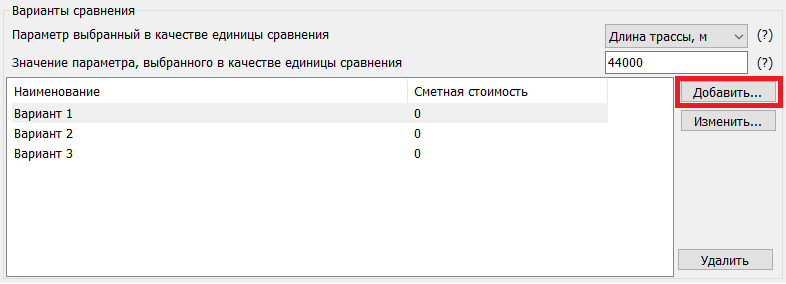
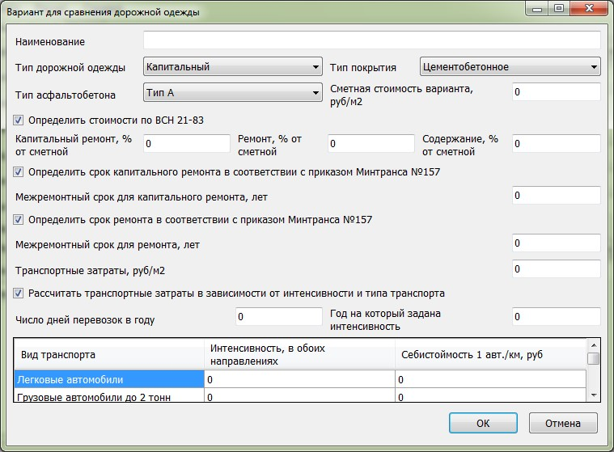
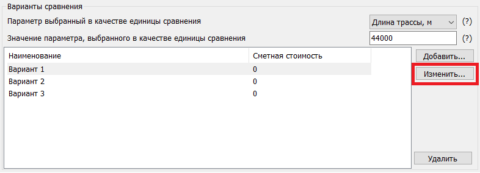
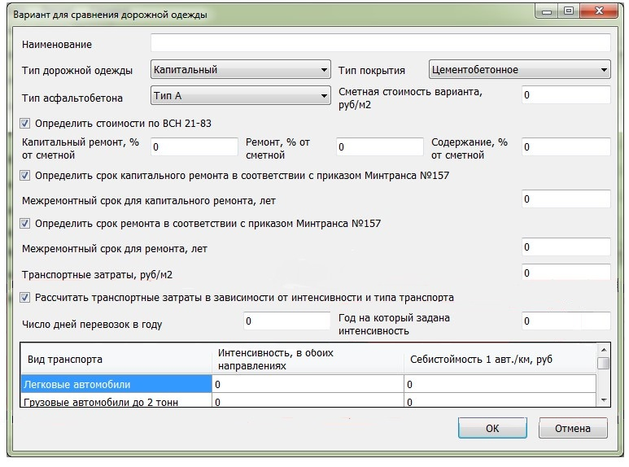
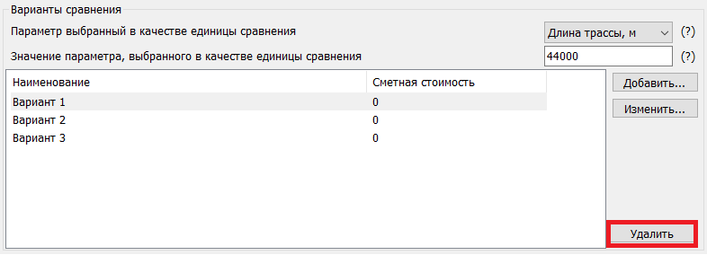

# Варианты сравнения



- ВСН-21-83 {#vsn-21-83}

  

  Параметры для сравнения вариантов задаются на вкладке Общие данныеи в области Варианты сравнения.

  {#21-83-parametr-sravneniya}

  В качестве единицы сравнения может быть выбрана Длина трассы или Площадь покрытия.

  

  Единица сравнения по вариантам дорожных одежд подлежащих сравнению принимается одинаковая.

  

  

  {#21-83-znachenie-sravneniya}

  В данном поле задается значение выбранного критерия сравнения.

  

  {#21-83-redaktirovanie}

  **Добавить** {#21-83-redaktirovanie-dobavlenie}

  Для создания нового варианта конструкции нажмите кнопку Добавить:

  

  В открывшемся окне задайте основные технико-экономические показатели нового [варианта сравнения](#21-83-construction-variants)

  

  **Изменить** {#21-83-redaktirovanie-izmenenie}

  Для изменения параметров предварительно созданного варианта конструкции, выберите его из общего списка и нажмите кнопку **Изменить**:

  

  В открывшемся окне измените необходимые технико-экономические показатели выбранного [варианта сравнения](#21-83-construction-variants)

  

  **Удалить** {#21-83-redaktirovanie-udalenie}

  Для удаления какого-либо варианта сравнения, выберите его из общего списка и нажмите кнопку **Удалить**.
  
  
  
  

  {#21-83-construction-variants}

  
  
  Для каждого сравниваемого варианта конструкции дорожной одежды могут быть заданы следующие технико-экономические показатели.

  {#21-83-naimenovanie}

  В данном поле задается название сравниваемого варианта дорожной одежды.

  

  {#21-83-odezhda}

  Возможны следующие варианты (согласно **ОДН 218.046-01**, табл 1.1):

  * **Капитальный**;
  * **Облегченный**;
  * **Переходный**.

  #|
  || **Типы дорожных одежд** {.cell-align-center} | **Виды покрытий, материал и способы его укладки** {.cell-align-center} ||
  || 1 {.cell-align-center} | 2 {.cell-align-center} ||
  || Усовершенствованные покрытия {.cell-align-center} |>||
  || Капитальные | из горячих асфальтобетонных смесей ||
  || Облегченные | а. из горячих асфальтобетонных смесей ||
  || ^ | б. из холодных асфальтобетонных смесей ||
  || ^ | в. из органоминеральных смесей с жидкими, органическими, вяжущими; с жидкими, органическими, вяжущими совместно с минеральными; с вязкими, в том числе эмульгированными, органическими, вяжущими; с эмульгированными, органическими, вяжущими совместно с минеральными; из каменных материалов и грунтов, обработанных методами пропитки или битумом по способу смешения на дороге; из каменных материалов, обработанных органическими, вяжущими методами пропитки; черного щебня, приготовленного в установке и уложенного по способу заклинки; из пористой и высокопористой асфальтобетонной смеси с поверхностной обработкой; из прочного щебня с двойной поверхностной обработкой ||
  || Покрытия переходные {.cell-align-center} |>||
  || Переходные | из щебня прочных пород, устроенные по способу заклинки без применения вяжущих материалов; из фунтов и малопрочных каменных материалов, укрепленных вяжущими; булыжного и колотого камня (мостовые) ||
  || Низшие | из щебеночно-гравийно-песчаных смесей; малопрочных каменных материалов и шлаков; грунтов, укрепленных или улучшенных различными местными материалами; древесных материалов и др. ||
  |#

  

  Если необходимо выполнить расчет для дорожной одежды низшего типа, то в данном поле следует выбрать тип **Переходный**. 

  

  

  {#21-83-pokrytie}

  * Асфальтобетонное;
  * Цементобетонное;
  * Щебеночное;
  * Гравийное.

  

  Тип дорожной одежды и Тип покрытия используется для определения расчетных показателей затрат на капитальный и текущий ремонт, содержание проектируемых автомобильных дорог (согласно **ВСН 21-83**, прил.1, табл.19.), а также для определения нормативных межремонтных сроков.

  

  #|
  || **Категория проектируемой дороги** {.cell-align-center} | **Покрытие дороги** {.cell-align-center} | **Стоимость одного ремонта, % к стоимости строительства дороги** {.cell-align-center} |>| **Ежегодные затраты на текущий ремонт и содержание, % к стоимости строительства дороги** {.cell-align-center} ||
  || ^ | ^ | капитального {.cell-align-center} | среднего {.cell-align-center} | ^ ||
  || I {.cell-align-center} | Цементобетонное | 33,0 {.cell-align-center} | 3,5 {.cell-align-center} | 0,300 {.cell-align-center} ||
  || ^ | Асфальтобетонное | 40,0 {.cell-align-center} | 4,0 {.cell-align-center} | 0,500 {.cell-align-center} ||
  || II {.cell-align-center} | Цементобетонное | 34,0 {.cell-align-center} | 4,0 {.cell-align-center} | 0,320 {.cell-align-center} ||
  || ^ | Асфальтобетонное | 42,0 {.cell-align-center} | 5,0 {.cell-align-center} | 0,550 {.cell-align-center} ||
  || III {.cell-align-center} | Асфальтобетонное | 43,0 {.cell-align-center} | 7,0 {.cell-align-center} | 0,720 {.cell-align-center} ||
  || ^ | Черное щебеночное с поверхностной обработкой | 49,0 {.cell-align-center} | 8,0 {.cell-align-center} | 0,980 {.cell-align-center} ||
  || IV {.cell-align-center} | Гравийное, обработанное битумом на месте, с поверхностной обработкой | 50,0 {.cell-align-center} | 8,5 {.cell-align-center} | 1,920 {.cell-align-center} ||
  || ^ | Щебеночное с двойной поверхностной обработкой | 53,0 {.cell-align-center} | 9,0 {.cell-align-center} | 1,590 {.cell-align-center} ||
  |#

  

  {#21-83-asfaltobeton}

  * А;
  * Б;
  * В;
  * Г;
  * Д;
  * ЩМА;
  * С полимерными добавками.

  

  Тип асфальтобетона может использоваться для определения межремонтных сроков проведения работ.

  

  

  {#21-83-smetnaya-stoimost}

  Задается общая сметная стоимость одного квадратного метра сравниваемого варианта конструкции дорожной одежды на принятую единицу сравнения.

  

  {#21-83-stoimost-po-vsn}

  Если данная опция установлена, то расчетные показатели затрат на капитальный ремонт, ремонт и содержание сравниваемого участка конструкции принимаются согласно **ВСН 21-83**, прил.1, табл.19. Показатели принимаются в процентном отношении от сметной стоимости строительства дорожной одежды.

  #|
  || **Категория проектируемой дороги** {.cell-align-center} | **Покрытие дороги** {.cell-align-center} | **Стоимость одного ремонта, % к стоимости строительства дороги** {.cell-align-center} |>| **Ежегодные затраты на текущий ремонт и содержание, % к стоимости строительства дороги** {.cell-align-center} ||
  || ^ | ^ | капитального {.cell-align-center} | среднего {.cell-align-center} | ^ ||
  || I {.cell-align-center} | Цементобетонное | 33,0 {.cell-align-center} | 3,5 {.cell-align-center} | 0,300 {.cell-align-center} ||
  || ^ | Асфальтобетонное | 40,0 {.cell-align-center} | 4,0 {.cell-align-center} | 0,500 {.cell-align-center} ||
  || II {.cell-align-center} | Цементобетонное | 34,0 {.cell-align-center} | 4,0 {.cell-align-center} | 0,320 {.cell-align-center} ||
  || ^ | Асфальтобетонное | 42,0 {.cell-align-center} | 5,0 {.cell-align-center} | 0,550 {.cell-align-center} ||
  || III {.cell-align-center} | Асфальтобетонное | 43,0 {.cell-align-center} | 7,0 {.cell-align-center} | 0,720 {.cell-align-center} ||
  || ^ | Черное щебеночное с поверхностной обработкой | 49,0 {.cell-align-center} | 8,0 {.cell-align-center} | 0,980 {.cell-align-center} ||
  || IV {.cell-align-center} | Гравийное, обработанное битумом на месте, с поверхностной обработкой | 50,0 {.cell-align-center} | 8,5 {.cell-align-center} | 1,920 {.cell-align-center} ||
  || ^ | Щебеночное с двойной поверхностной обработкой | 53,0 {.cell-align-center} | 9,0 {.cell-align-center} | 1,590 {.cell-align-center} ||
  |#

  Если же данная опция не установлена, то для ввода станут доступными поля **Стоимости в % от сметной**.

  В этом случае нужно задавать пользовательские значения расчетных показателей по затратам на ремонты и содержание также в процентах от сметной стоимости строительства рассматриваемой конструкции.

  

  {#21-83-kaprem}

  Сроки проведения капитального ремонта могут определятся автоматически, если установлена данная опция. Cогласно данному документу (прил.3), межремонтные сроки проведения работ по капитальному ремонту нежестких дорожных одежд автомобильных дорог принимаются следующими:

  #|
  || **Категория дорог** {.cell-align-center} | **Тип дорожной одежды** {.cell-align-center} | **Дорожно-климатическая зона** {.cell-align-center} |>|>|>|>|>||
  || ^ | ^ | I - II {.cell-align-center} |>| III {.cell-align-center} |>| IV-V {.cell-align-center} |>||
  || ^ | ^ | межремонтный срок, лет {.cell-align-center} | коэффициент надежности дорожной одежды {.cell-align-center} | межремонтный срок, лет {.cell-align-center} | {.cell-align-center} |коэффициент надежности дорожной одежды {.cell-align-center} | межремонтный срок, лет {.cell-align-center} | коэффициент надежности дорожной одежды {.cell-align-center} ||
  || IА, IБ, IB {.cell-align-center} | капитальный | 12 {.cell-align-center} | 0,98 {.cell-align-center} | 14 {.cell-align-center} | 0,95 {.cell-align-center} | 18 {.cell-align-center} | 0,88 {.cell-align-center} ||
  || II {.cell-align-center} | капитальный | 12 {.cell-align-center} | 0,95 {.cell-align-center} | 12 {.cell-align-center} | 0,92 {.cell-align-center} | 15 {.cell-align-center} | 0,88 {.cell-align-center} ||
  || III {.cell-align-center} | капитальный | 12 {.cell-align-center} | 0,92 {.cell-align-center} | 12 {.cell-align-center} | 0,90 {.cell-align-center} | 15 {.cell-align-center} | 0,85 {.cell-align-center} ||
  || ^ | облегченный | 12 {.cell-align-center} | 0,86 {.cell-align-center} | 12 {.cell-align-center} | 0,85 {.cell-align-center} | 12 {.cell-align-center} | 0,84 {.cell-align-center} ||
  || IV {.cell-align-center} | капитальный | 12 {.cell-align-center} | 0,85 {.cell-align-center} | 12 {.cell-align-center} | 0,84 {.cell-align-center} | 12 {.cell-align-center} | 0,83 {.cell-align-center} ||
  || ^ | облегченный | 10 {.cell-align-center} | 0,85 {.cell-align-center} | 10 {.cell-align-center} | 0,84 {.cell-align-center} | 12 {.cell-align-center} | 0,82 {.cell-align-center} ||
  || ^ | переходный | 5 {.cell-align-center} | 0,82 {.cell-align-center} | 5 {.cell-align-center} | 0,80 {.cell-align-center} | 5 {.cell-align-center} | 0,77 {.cell-align-center} ||
  || V {.cell-align-center} | облегченный | 10 {.cell-align-center} | 0,82 {.cell-align-center} | 10 {.cell-align-center} | 0,80 {.cell-align-center} | 12 {.cell-align-center} | 0,79 {.cell-align-center} ||
  || ^ | переходный | 5 {.cell-align-center} | 0,65 {.cell-align-center} | 5 {.cell-align-center} | 0,60 {.cell-align-center} | 5 {.cell-align-center} | 0,58 {.cell-align-center} ||
  || ^ | низший | 3 | 0,65 {.cell-align-center} | 3 {.cell-align-center} | 0,60 {.cell-align-center} | 3 {.cell-align-center} | 0,58 {.cell-align-center} ||
  |#

  

  1. Для автомобильных дорог с дорожными одеждами из асфальтобетонов типа А на основе полимерно-битумного вяжущего срок проведения работ по капитальному ремонту увеличивают на 8 - 10 % с округлением до целого количества лет.
  2. Межремонтный срок проведения работ по капитальному ремонту автомобильных дорог федерального значения с жёсткими дорожными одеждами (с цементобетонным покрытием) принимают равным 25 годам.

  

  Если опция **Определить сроки капитального ремонта в соответствии с приказом Минтранса №157** не установлена, то, срок проведения работ может задаваться индивидуально пользователем. В этом случае для ввода станет доступным поле **Межремонтный срок для капитального ремонта** и указывается срок капитального ремонта для данного варианта.

  Аналогично, можно автоматически определить сроки работ по ремонту.

  Для этого необходимо установить опцию **Определить сроки ремонта в соответствии с приказом Минтранса №157**. Cогласно данному документу (прил.1 таб. 2), межремонтные сроки проведения работ по ремонту капитальных нежестких с асфальтобетонным покрытием и облегченных дорожных одежд автомобильных дорог принимаются следующими:

  #|
  || **Дорожно-климатическая зона** {.cell-align-center} | **Фактическая интенсивность транспортного потока по крайней правой полосе движения, авт./сут.** {.cell-align-center} | **Периодичность проведения работ** {.cell-align-center} ||
  || I-II {.cell-align-center} | ≥4501 {.cell-align-center} | один раз в 2 года ||
  || III {.cell-align-center} | ≥4001 {.cell-align-center} | ^ ||
  || IV-V {.cell-align-center} | ≥3001 {.cell-align-center} | ^ ||
  || I-II {.cell-align-center} | 2501-4500 {.cell-align-center} | один раз в 3 года ||
  || III {.cell-align-center} | 2001-4000 {.cell-align-center} | ^ ||
  || IV-V {.cell-align-center} | 1501-3000 {.cell-align-center} | ^ ||
  || I-II {.cell-align-center} | ≤2500 {.cell-align-center} | один раз в 4 года ||
  || III {.cell-align-center} | ≤2000 {.cell-align-center} | ^ ||
  || IV-V {.cell-align-center} | 201-1500 {.cell-align-center} | ^ ||
  || I-V {.cell-align-center} | ≤200 {.cell-align-center} | один раз в 6 лет ||
  |#

  

  1. Для верхних слоев дорожного покрытия из асфальтобетона типа А, из щебеночно-мастичного асфальтобетона (ЩМА), асфальтобетона с полимерными добавками, при устройстве слоев износа, срок проведения работ по ремонту автомобильных дорог увеличивают на 40 - 45 % с округлением до целого количества лет.
  2. Срок проведения работ по ремонту автомобильных дорог федерального значения с жёсткими дорожными одеждами (с цементобетонным покрытием) принимают равным 12 годам.
  3. Срок проведения работ по ремонту автомобильных дорог IV - V категории с переходными и низшими типами дорожной одежды принимают равным 3 годам.

  

  Если интенсивность движения в пределах срока сравнения вариантов не остается постоянной (задан показатель изменения интенсивности), то сроки проведения ремонтов (в пределах срока сравнения), могут быть различными. В этом случае определяется интенсивность движения на 1-год по крайней правой полосе и устанавливается первый срок ремонта по вышеприведенной табл.

  Если опция **Определить сроки ремонта в соответствии с приказом Минтранса №157** не установлена, то, срок проведения работ может задаваться индивидуально пользователем. В этом случае для ввода станет доступным поле **Межремонтный срок для ремонта**. В этом случае межремонтые сроки в пределах общего срока сравнения вариантов принимаются постоянными.

  

  {#21-83-srok-kaprem}

  Если опция **Определить сроки капитального ремонта в соответствии с приказом Минтранса №157** не установлена, то срок проведения работ может задаваться индивидуально пользователем. В этом случае для ввода станет доступным поле **Межремонтный срок для капитального ремонта**, где нужно указать срок капитального ремонта для данного варианта.

  

  {#21-83-rem}

  Согласно данному документу (прил.3) межремонтные сроки проведения работ по ремонту капитальных нежестких с асфальтобетонным покрытием и облегченных дорожных одежд автомобильных дорог принимаются следующими:

  #|
  || **Дорожно-климатическая зона** | **Фактическая интенсивность транспортного потока по крайней правой полосе движения, авт./сут.** | **Межремонтный срок, лет** ||
  || I – II {.cell-align-center} | ≥4501 {.cell-align-center} | 2 {.cell-align-center} ||
  || III {.cell-align-center} | ≥4001 {.cell-align-center} | ^ ||
  || IV - V {.cell-align-center} | ≥3001 {.cell-align-center} | ^ ||
  || I – II {.cell-align-center} | 2501 – 4500 {.cell-align-center} | 3 {.cell-align-center} ||
  || III {.cell-align-center} | 2001 – 4000 {.cell-align-center} | ^ ||
  || IV - V {.cell-align-center} | 1501 - 3000 {.cell-align-center} | ^ ||
  || I – II {.cell-align-center} | ≤2500 {.cell-align-center} | 4 {.cell-align-center} ||
  || III {.cell-align-center} | ≤2000 {.cell-align-center} | ^ ||
  || IV - V {.cell-align-center} | 201 -1500 {.cell-align-center} | ^ ||
  || I – V {.cell-align-center} | ≤200 {.cell-align-center} | 6 {.cell-align-center} ||
  |#

  

  1. Для верхних слоев дорожного покрытия из асфальтобетона типа А, покрытия из щебеночно-мастичного асфальтобетона (ЩМА), асфальтобетона с полимерными добавками, при устройстве слоев износа срок проведения работ по ремонту автомобильных дорог увеличивают на 40-45% с округлением до целого количества лет.
  2. Срок проведения работ по ремонту автомобильных дорог федерального значения с жёсткими дорожными одеждами (с цементобетонным покрытием) принимают равным 12 годам. 3. Срок проведения работ по ремонту автомобильных дорог IV- V категории с переходными и низшими типами дорожной одежды принимают равным 3 годам.

  

  

  {#21-83-srok-rem}

  Если опция **Определить сроки ремонта в соответствии с приказом Минтранса №157** не установлена, то срок проведения работ может задаваться индивидуально пользователем в данном поле. В этом случае межремонтые сроки в пределах общего срока сравнения вариантов принимаются постоянными.

  

  {#21-83-transport}

  Себестоимость транспортных перевозок задается в поле **Транспортные затраты**. Если этот показатель одинаков для сравниваемых вариантов, то его можно не учитывать при сравнении вариантов. В этом случае в данное поле необходимо ввести нулевое значение. Можно этот показатель рассчитать заранее и ввести это значение в данное поле.

  

  {#21-83-transport-raschet}

  Данная опция используется только в том случае, если себестоимость перевозок учитывается в расчете и в составе потока имеются автомобили, имеющие различные показатели транспортных затрат.
  
  Данные по составу потока и транспортным затратам в этом случае вводятся в поле **Затраты в зависимости от интенсивности**. Интенсивность движения по видам транспорта для определения транспортных затрат задается на любой год, указанный в поле [Год, на который задана интенсивность.](#21-83-intensivnost-god).

  

  {#21-83-dni-perevozok}

  В данном поле вводится число дней $D$ в году: 365 дней или меньше (только рабочие дни).

  

  {#21-83-intensivnost-god}

  Номер года, для которого задана интенсивность движения, может задаваться в пределах от 1 и до конца срока службы дорожной одежды.

  

  

