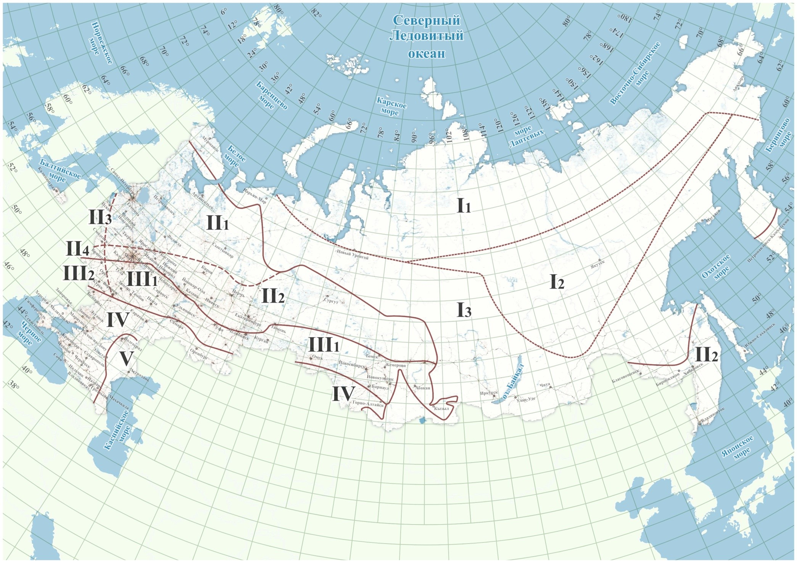
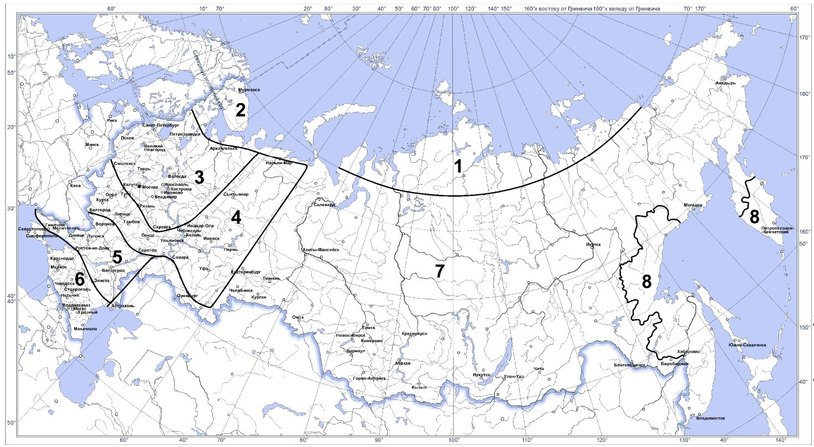
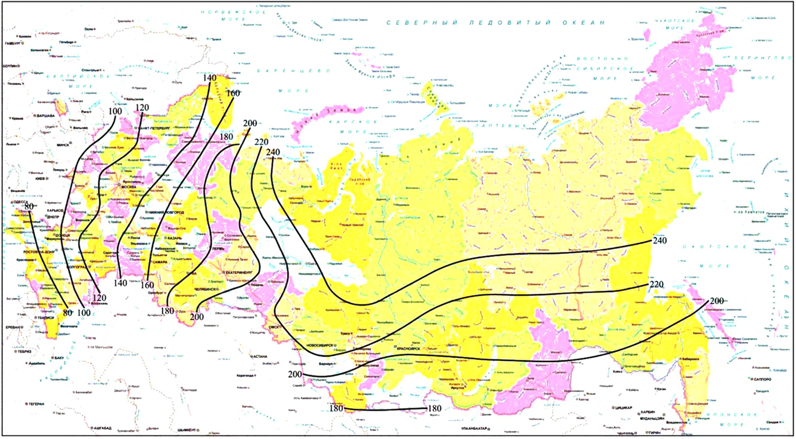
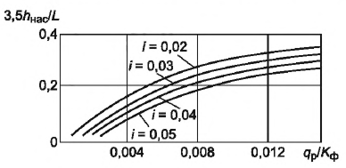
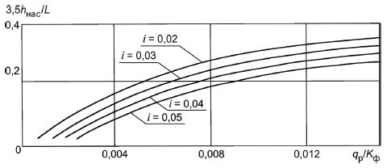

# Общие данные



- ГОСТ Р 71404-2024 {#gost-71404-2024}

  

  На вкладке **Общие данные** задаются основные параметры дороги, а также характеристики района ее проектирования.

  {#71404-2024-raion}

  В данном поле вводится название района проектируемого объекта. Его заполнение не является обязательным, т.к. не влияет на результат расчета, а лишь заносится в названия выходных документов и ведомостей.

  

  {#71404-2024-obekt}

  В данном поле задается название объекта (участка) рассчитываемой дорожной одежды. Его заполнение также не является обязательным.

  

  {#71404-2024-relef}

  Возможны следующие типы местности по рельефу:

  * **Равнинные районы;**
  * **Предгорные районы (до 1000 м над у.м.);**
  * **Горные районы (более 1000 м над у.м.)**

  Учитывается в качестве первой поправки на влажность при определении расчетных характеристик грунта земляного полотна (согласно **ГОСТ Р 71404-2024**, прил. В, формула В.1).

  $$W_p = (\overline{W}_{табл}+Δ + Δ_{1}W – Δ_{2}W)(1 + V_{r}t) – Δ_3,$$

  где:

  * $W_{табл}$ — среднее многолетнее значение относительной (в долях от влажности на границе текучести) влажности грунта в наиболее неблагоприятный (весенний) период года в рабочем слое земляного полотна, определяемое по таблице В.1 в зависимости от ДКЗ и подзоны (см. рисунок В.1), схемы увлажнения грунта рабочего слоя и типа грунта;
  * $Δ$ — поправка, равная 0,00 – для участков насыпей и 0,03 - для участков дороги, проходящих в выемке или в низкой насыпи с рабочей отметкой менее руководящей отметки для данного типа грунта и типа местности по характеру увлажнения;
  * $Δ_{1}W$ — поправка на особенности рельефа территории, принимаемая для равнинных условий - 0,00, предгорных - 0,03, горных - 0,05;
  * $Δ_{2}W$ — поправка на конструктивное мероприятие проезжей части и обочин, определяемая по таблице В.2;
  * $V_r$ — коэффициент вариации, равный 0,10;
  * $t$ — коэффициент нормированного отклонения, принимаемый в зависимости от уровня надежности $K_н$ (см. таблицу В.3);
  * $Δ_3$ — поправка, на влияние суммарной толщины слоев из непучинистых материалов дорожной одежды и рабочего слоя, превышающей 0,75 м, определяемая по рисунку В.2 (если суммарная толщина слоев менее 0,75 м, поправку не принимают).

  

  {#71404-2024-klimat}

  Выбор дорожно - климатической зоны осуществляется по карте (**ГОСТ Р 71404-2024**, прил. В, рис. В.1).

  **Дорожно-климатические зоны и подзоны Российской Федерации**

  

   - Границы дорожно-климатических зон; 
   - Границы дорожно-климатических подзон

  

  1. При обосновании общее дорожно-климатическое районирование территории Российской Федерации может уточняться в рамках отдельных субъектов.
  2. Краснодарский край и западную часть Северного Кавказа следует относить к ДКЗ III, Крым – к ДКЗ IV.
  3. При проектировании участков дорог в приграничных зонах при обосновании данных о грунтово-гидрологических и почвенных условиях, а также исходя из практики эксплуатации дорог в районе, допускается принимать проектные решения как для смежной (северной или южной) зоны.
  4. В горных районах ДКЗ следует определять с учетом высотного расположения объектов проектирования, принимая во внимание природные условия на данной высоте.
  5. Разделение на подзоны следует учитывать при определении расчетной влажности при расчетах на прочность и морозоустойчивость дорожных одежд.

  

  

  {#71404-2024-raschetnye-dni}

  Принимается согласно **ГОСТ Р 71404-2024** , табл.3 или рис.1. Используется при определении суммарного числа приложений расчетной нагрузки, к точке на поверхности конструкции, за срок ее службы.

  #|
  || **Номера районов на карте** {.cell-align-center}| **Географические границы районов** {.cell-align-center}| **Рекомендуемое количество расчётных дней в году ($Т_{РДГ}$)** {.cell-align-center}||
  || 1 {.cell-align-center} | 2 {.cell-align-center} | 3 {.cell-align-center} ||
  || 1 {.cell-align-center}| Зона распространения вечномёрзлых грунтов севернее семидесятой параллели | 70 {.cell-align-center}||
  || 2 {.cell-align-center}| Севернее линии, соединяющей Онегу - Архангельск - Мезень - Нарьян-Мар - шестидесятый меридиан - до побережья Европейской части | 145 {.cell-align-center}||
  || 3 {.cell-align-center}| Севернее линии, соединяющей Смоленск - Калугу - Рязань - Саранск - сорок восьмой меридиан - до линии, соединяющей Онегу - Архангельск - Мезень - Нарьян-Мар | 125 {.cell-align-center}||
  || 4 {.cell-align-center}| Севернее линии, соединяющей Белгород - Воронеж - Саратов - Самару - Оренбург - шестидесятый меридиан, до линии районов 2 и 3 | 135 {.cell-align-center}||
  || 5 {.cell-align-center}| Севернее линии, соединяющей Ростов-на-Дону - Элисту - Астрахань - Белгород - Воронеж - Саратов - Самару | 145 {.cell-align-center}||
  || 6 {.cell-align-center}| Южнее линии Ростов-на-Дону, Элиста, Астрахань для Европейской части, южнее сорок шестой параллели - для остальных территорий, полуостров Крым | 205 {.cell-align-center}||
  || 7 {.cell-align-center}| Восточная и Западная Сибирь, Дальний Восток (кроме Хабаровского и Приморского краев, Камчатской области), ограниченные с севера семидесятой параллелью, с юга - государственной границей | 130-150 (меньшие значения для центральной части) {.cell-align-center}||
  || 8 {.cell-align-center}| Хабаровский и Приморский края, Камчатская область | 140 {.cell-align-center}||
  |#
  
  
  
  Значения величины $Т_{РДГ}$ на границах районов следует принимать по наибольшему из значений.
  
  
  
  **Карта районирования по количеству расчетных дней в году, $Т_{РДГ}$**
  
  

  

  {#71404-2024-uvlazhnenie}

  Принимается согласно **ГОСТ Р 71404-2024** , табл. 10. Учитывается при определении расчетной влажности грунта земляного полотна (прил. В, формула В.1).

  Возможны следующие схемы увлажнения:

  1 - **сухие места** (источники увлажнения- атмосферные осадки);
  2 – **сырые места с избыточным увлажнением в отдельные периоды года** (источники увлажнения - кратковременно стоящие (до 30 сут) поверхностные воды, атмосферные осадки);
  3 – **мокрые места с постоянным избыточным увлажнением** (источники увлажнения- грунтовые или длительно стоящие (более 30 сут) поверхностные воды, атмосферные осадки).

  #|
  || **Схема увлажнения рабочего слоя** {.cell-align-center}| **Источники увлажнения** {.cell-align-center}| **Условия отнесения к данному типу увлажнения** {.cell-align-center}||
  || 1 {.cell-align-center}| 2 {.cell-align-center}| 3 {.cell-align-center}||
  || 1 {.cell-align-center}| Атмосферные осадки {.cell-align-center}| Для насыпей на участках 1-го типа местности по условиям увлажнения. ||
  || ^ | ^ | Для насыпей на участках местности 2-го и 3-го типов по условиям увлажнения при возвышении поверхности покрытия над расчетным УГВ и уровнем поверхностных вод или над поверхностью земли, более чем в 1,5 раза превышающем требования таблицы 9 ГОСТ Р 71404-2024 . ||
  || ^ | ^ | Для насыпей на участках 2-го типа при расстоянии от уреза поверхностной воды (отсутствующей не менее 2/3 летнего периода) более 5 - 10 м при супесях; 2 - 5 м при легких пылеватых суглинках и 2 м при тяжелых пылеватых суглинках и глинах (меньшие значения принимают для грунтов с бо́льшим числом пластичности; при залегании различных грунтов следует принимать наибольшее значение). ||
  || ^ | ^ | В выемках в песчаных и глинистых грунтах при уклонах кюветов более 20 % (в ДКЗ I, II и III) и при возвышении поверхности покрытия над расчетным УГВ, более чем в 1,5 раза превышающем требования таблицы 9 ГОСТ Р 71404-2024 . ||
  || ^ | ^ | При применении специальных методов регулирования водно-теплового режима (капилляропрерывающие, гидроизолирующие, теплоизолирующие и армирующие прослойки, дренаж и т. п.), назначаемых по специальным расчетам. ||
  || 2 {.cell-align-center}| Кратковременно стоящие (до 30 сут) поверхностные воды, атмосферные осадки {.cell-align-center}| Для насыпей на участках 2-го типа местности по условиям увлажнения при возвышении поверхности покрытия не менее требуемого по таблице 16 и не более чем в 1,5 раза превышающего эти требования и при крутизне откосов не менее 1:1,5 и простом (без берм) поперечном профиле насыпи. ||
  || ^ | ^ | Для насыпей на участках 3-го типа местности при применении специальных мероприятий по защите от грунтовых вод (капилляропрерывающие и гидроизолирующие слои, дренаж), назначаемых по специальным расчетам, при отсутствии длительно (более 30 сут) стоящих поверхностных вод и выполнении условий, указанных в предыдущем абзаце. ||
  || ^ | ^ | В выемках в песчаных и глинистых грунтах при уклонах кюветов менее 20 % (ДКЗ II) и возвышении поверхности покрытия над расчетным УГВ, более чем в 1,5 раза превышающем требования таблицы 9 ГОСТ Р 71404-2024 ||
  || 3 {.cell-align-center}| Грунтовые или длительно (более 30 сут) стоящие поверхностные воды, атмосферные осадки {.cell-align-center}| Для насыпей на участках 3-го типа местности по условиям увлажнения при возвышении поверхности покрытия, отвечающем требованиям таблицы 9 ГОСТ Р 71404-2024 , но не превышающем их более чем в 1,5 раза. ||
  || ^ | ^ | То же для выемок, в основании которых имеется УГВ, расположение которого по глубине не превышает требования таблицы 9 ГОСТ Р 71404-2024 более чем в 1,5 раза. ||
  |#

  Таблица 9 ГОСТ Р 71404-2024 - Возвышение поверхности покрытия над уровнем грунтовых или поверхностных вод.

  #|
  || **Грунт рабочего слоя** {.cell-align-center}| **Наименьшее возвышение поверхности покрытия в пределах ДКЗ, м** {.cell-align-center}|> |> |> ||
  || ^ | II {.cell-align-center}| III {.cell-align-center}| IV {.cell-align-center}| V {.cell-align-center}||
  || Мелкий песок, легкая крупная супесь, легкая супесь | $\frac{1,1}{0,9}$ {.cell-align-center}| $\frac{0,9}{0,7}$ {.cell-align-center}| $\frac{0,75}{0,55}$ {.cell-align-center}| $\frac{0,5}{0,3}$ {.cell-align-center}||
  || Пылеватый песок, пылеватая супесь | $\frac{1,5}{1,2}$ {.cell-align-center}| $\frac{1,2}{1,0}$ {.cell-align-center}| $\frac{1,1}{0,8}$ {.cell-align-center}| $\frac{0,8}{0,5}$ {.cell-align-center}||
  || Легкий суглинок, тяжелый суглинок, глины | $\frac{2,2}{1,6}$ {.cell-align-center}| $\frac{1,8}{1,4}$ {.cell-align-center}| $\frac{1,5}{1,1}$ {.cell-align-center}| $\frac{1,1}{0,8}$ {.cell-align-center}||
  || Тяжелая пылеватая супесь, легкий пылеватый суглинок, тяжелый пылеватый суглинок | $\frac{2,4}{1,8}$ {.cell-align-center}| $\frac{2,1}{1,5}$ {.cell-align-center}| $\frac{1,8}{1,3}$ {.cell-align-center}| $\frac{1,2}{0,8}$ {.cell-align-center}||
  |#

  

  В числителе - возвышение поверхности покрытия над УГВ, верховодки или длительно (более 30 сут) стоящих поверхностных вод, в знаменателе – то же над поверхностью земли на участках с необеспеченным поверхностным стоком или над уровнем кратковременно (менее 30 сут) стоящих поверхностных вод.

  

  

  {#71404-2024-kategoriya}

  Принимается от 1 до 4 по заданию на проектирование.

  Также имеется возможность задания подкатегорий согласно п. 5.9 ГОСТ Р 71404-2024 Дорожные одежды переходного и низшего типов на автомобильных дорогах с низкой интенсивностью движения конструируют и рассчитывают в соответствии с ГОСТ Р 58818.

  Категории дорог с низкой интенсивностью капитального и облегченного типов:

  * IVА-р,
  * IVБ-р,
  * IVА-п,
  * IVБ-п
  * VА

  

  {#71404-2024-vlazhnost}

  Принимается согласно **ГОСТ Р 71404-2024**, (прил. В, табл. В.2).

  #|
  || **Номер пункта** {.cell-align-center}| **Конструктивная особенность** {.cell-align-center}| **Поправка $Δ_2W$ в дорожно-климатических зонах** {.cell-align-center}|> |> |> ||
  || ^ | ^ | II {.cell-align-center}| III {.cell-align-center}| IV {.cell-align-center}| V {.cell-align-center}||
  || 1 {.cell-align-center}| Основание дорожной одежды и грунт рабочего слоя из монолитных слоев: |> |> |> |> ||
  || ^ | ОМС, обработанные ЩГПС, укрепленный крупнообломочный грунт и песок | 0,04 {.cell-align-center}| 0,04 {.cell-align-center}| 0,03 {.cell-align-center}| 0,03 {.cell-align-center}||
  || ^ | укрепленные супеси | 0,05 {.cell-align-center}| 0,05 {.cell-align-center}| 0,05 {.cell-align-center}| 0,04 {.cell-align-center}||
  || ^ | укрепленные пылеватые пески, тяжелый и легкий суглинок и др. | 0,08 {.cell-align-center}| 0,08 {.cell-align-center}| 0,06 {.cell-align-center}| 0,05 {.cell-align-center}||
  || 2 {.cell-align-center}| Укрепление обочин (не менее 2/3 их ширины): |> |> |> |> ||
  || ^ | асфальтобетоном или монолитными слоями | 0,05 {.cell-align-center}| 0,04 {.cell-align-center}| 0,03 {.cell-align-center}| 0,02 {.cell-align-center}||
  || ^ | каменными материалами без применения вяжущего (ЩГПС, щебень и т.д.) | 0,02 {.cell-align-center}| 0,02 {.cell-align-center}| 0,02 {.cell-align-center}| 0,02 {.cell-align-center}||
  || 3 {.cell-align-center}| Дренаж с продольными трубчатыми дренами | 0,05 {.cell-align-center}| 0,03 {.cell-align-center}| - {.cell-align-center}| - {.cell-align-center}||
  || 4 {.cell-align-center}| Устройство гидроизолирующих прослоек из полимерных материалов | 0,05 {.cell-align-center}| 0,05 {.cell-align-center}| 0,03 {.cell-align-center}| 0,03 {.cell-align-center}||
  || 5 {.cell-align-center}| Устройство теплоизолирующего слоя, предотвращающего промерзание | Снижение расчетной влажности до полной влагоемкости при требуемом коэффициенте уплотнения грунта $К_{упл}$ |> |> |> ||
  || 6 {.cell-align-center}| Грунт рабочего слоя земляного полотна в «обойме» | Снижение расчетной влажности до оптимальной |> |> |> ||
  || 7 {.cell-align-center}| Грунт рабочего слоя, уплотненный до значения коэффициента уплотнения более 1,00 в слое толщиной до 0,5 м от низа дорожной одежды, если он расположен ниже границы промерзания | - {.cell-align-center}| 0,03 {.cell-align-center}| 0,03 {.cell-align-center}| 0,03 {.cell-align-center}||
  |#

  

  1. При применении нескольких конструктивных мероприятий поправки $Δ_{2}W$ допускается суммировать.
  2. При наличии нескольких мероприятий в пределах пункта 1 принимают наибольшее значение поправки.

  

  Учитывается в качестве второй поправки на влажность при определении расчетных характеристик грунта земляного полотна (прил. В, формула В.1).

  

  {#71404-2024-odezhda}

  Возможны следующие варианты (согласно **ГОСТ Р 71404-2024**, п.6.11 и п.6.12):

  * **Капитальный**;
  * **Облегченный**;
  * **Переходный**.

  

  Дорожные одежды низшего типа конструируются и рассчитываются в соответствии с ГОСТ Р 58818, регламентирующими проектирование дорожных одежд с низкой интенсивностью движения. 

  

  

  {#71404-2024-polosy}

  Принимается согласно заданию на проектирование.

  В зависимости от количества полос движения назначается коэффициент полостности (согласно **ГОСТ Р 71404-2024**, табл. 2)

  #|
  || **Количество полос движения** {.cell-align-center}| **Коэффициент распределения интенсивности движения для самой нагруженной полосы движения $f_{пол}$** {.cell-align-center}|> ||
  || ^ | **Движение в обоих направлениях** {.cell-align-center}| **Одностороннее движение** {.cell-align-center}||
  || 1 {.cell-align-center}| 1,00 {.cell-align-center}| 1,00 {.cell-align-center}||
  || 2 {.cell-align-center}| 0,55 {.cell-align-center}| 0,90 {.cell-align-center}||
  || 3 {.cell-align-center}| 0,50 {.cell-align-center}| 0,70 {.cell-align-center}||
  || 4 {.cell-align-center}| 0,45 {.cell-align-center}| 0,70 {.cell-align-center}||
  || 5 {.cell-align-center}| 0,40 {.cell-align-center}| - {.cell-align-center}||
  || 6 и более {.cell-align-center}| 0.35 {.cell-align-center}| - {.cell-align-center}||
  |#

  

  Допускается назначать коэффициенты распределения интенсивности по данным фактических замеров.

  На перекрестках и подходах к ним (в местах перестройки потока автомобилей для выполнения левых поворотов и др.) при расчете одежды в пределах всех полос движения следует принимать $f_{пол}$ = 0,50, если общее число полос проезжей части проектируемой дороги три и более.

  

  Данный коэффициент учитывается при определении приведенной интенсивности движения к воздействию расчетной нагрузки на полосу движения на конец межремонтного срока проведения работ по капитальному ремонту (формула 3).

  

  {#71404-2024-nadezhnost}
  
  Требуемый уровень надежности указан в задании на проектирование в зависимости от категории дороги и типа дорожных одежд или выбирается согласно **ГОСТ Р 71404-2024**, табл.5.
  
  #|
  || **Тип дорожных одежд** {.cell-align-center}| **Категория дороги** {.cell-align-center}| **Требуемый коэффициент прочности $K_{пр}^{тр}$ по критерию** {.cell-align-center}|> | **Коэффициент надежности $K_н$** {.cell-align-center}||
  || ^ | ^ | **упругого прогиба** {.cell-align-center}| **сдвигоустойчивости и растяжения при изгибе** {.cell-align-center}| ^ ||
  || Капитальный | IА, IБ, IВ {.cell-align-center}| 1,50 {.cell-align-center}| 1,10 {.cell-align-center}| 0,98 {.cell-align-center}||
  || ^ | II {.cell-align-center}| 1,20 {.cell-align-center}| 1,00 {.cell-align-center}| 0,95 {.cell-align-center}||
  || ^ | III {.cell-align-center}| 1,17 {.cell-align-center}| 1,00 {.cell-align-center}| 0,92 {.cell-align-center}||
  || ^ | IV {.cell-align-center}| 1,15 {.cell-align-center}| 1,00 {.cell-align-center}| 0,90 {.cell-align-center}||
  || Облегченный | III {.cell-align-center}| 1,15 {.cell-align-center}| 1,00 {.cell-align-center}| 0,90 {.cell-align-center}||
  || ^ | IV {.cell-align-center}| 1,06 {.cell-align-center}| 0,94 {.cell-align-center}| 0,85 {.cell-align-center}||
  || Переходный | IV {.cell-align-center}| 1,02 {.cell-align-center}| 0,87 {.cell-align-center}| 0,82 {.cell-align-center}||
  |#
  
  Для дорожных одежд с низкой интенсивностью, переходного и низшего типов требуемый уровень надежности в зависимости от категории дороги и типа дорожных одежды выбирается согласно **ГОСТ Р 58818—2020**, табл.26.
  
  #|
  || **Категория дороги** {.cell-align-center}| **Тип дорожных одежд** {.cell-align-center}| **Минимальный требуемый модуль упругости** {.cell-align-center}| **Коэффициент надежности $K_н$** {.cell-align-center}| **Требуемый коэффициент** {.cell-align-center}|> ||
  || ^ | ^ | ^ | ^ | **$K_{пр}^{тр}$ прочности по критерию упругого прогиба**  {.cell-align-center}| **$K_{пр}^{тр}$  прочности по критерию сдвигоустойчивости и растяжения при изгибе** {.cell-align-center}||
  || IVA-p {.cell-align-center}| Капитальный {.cell-align-center}| 200 {.cell-align-center}| 0.80-0.90 {.cell-align-center}| 1.02-1.10 {.cell-align-center}| 0.87-0.94 {.cell-align-center}||
  || IVБ-р {.cell-align-center}| ^ | ^ | ^ | ^ | ^ ||
  || IVA-п {.cell-align-center}| Облегченный {.cell-align-center}| 150 {.cell-align-center}| 0.80-0.85 {.cell-align-center}| 1.02-1.06 {.cell-align-center}| 0.87-0.90 {.cell-align-center}||
  || IVБ-п {.cell-align-center}| ^ | ^ | ^ | ^ | ^ ||
  || VA {.cell-align-center}| Облегченный {.cell-align-center}| 100 {.cell-align-center}| 0.77-0.82 {.cell-align-center}| 0.98-1.02 {.cell-align-center}| 0.80-0.87 {.cell-align-center}||
  |#
  
  В соответствии с приказом Минтранса России от 01 ноября 2007 г. № 157, в зависимости от заданных параметров (Дорожно - климатическая зона; Категория дороги; Тип дорожной одежды) значение коэффициента надежности может приниматься отличным от указанных **ГОСТ Р 71404-2024** табл. 5.
  
  Коэффициент надежности может задаваться вручную. Для этого выберите , откроется диалоговое окно:
  
  
  
  Задайте параметры и нажмите **ОК**.

  

  {#71404-2024-polotno}

  Возможны следующие варианты:

  * **Насыпь**;
  * **Нулевые места (рабочая отметка меньше 1 м)**;
  * **Выемка**.

  Учитывается в качестве поправки на влажность при определении расчетных характеристик грунта земляного полотна (согласно **ГОСТ Р 71404-2024**, прил. В, формула В.1).

  $$W_p = (\overline{W}_{табл}+Δ + Δ_{1}W – Δ_{2}W)(1 + V_{r}t) – Δ_3,$$

  где:

  * $W_{табл}$ — среднее многолетнее значение относительной (в долях от влажности на границе текучести) влажности грунта в наиболее неблагоприятный (весенний) период года в рабочем слое земляного полотна, определяемое по таблице В.1 в зависимости от ДКЗ и подзоны (см. рисунок В.1), схемы увлажнения грунта рабочего слоя и типа грунта;
  * $Δ$ — поправка, равная 0,00 – для участков насыпей и 0,03 - для участков дороги, проходящих в выемке или в низкой насыпи с рабочей отметкой менее руководящей отметки для данного типа грунта и типа местности по характеру увлажнения;
  * $Δ_{1}W$ — поправка на особенности рельефа территории, принимаемая для равнинных условий - 0,00, предгорных - 0,03, горных - 0,05;
  * $Δ_{2}W$ — поправка на конструктивное мероприятие проезжей части и обочин, определяемая по таблице В.2;
  * $V_r$ — коэффициент вариации, равный 0,10;
  * $t$ — коэффициент нормированного отклонения, принимаемый в зависимости от уровня надежности Kн (см. таблицу В.3);
  * $Δ_3$ — поправка, на влияние суммарной толщины слоев из непучинистых материалов дорожной одежды и рабочего слоя, превышающей 0,75 м, определяемая по рисунку В.2 (если суммарная толщина слоев менее 0,75 м, поправку не принимают).

  

  {#71404-2024-promerzanie}

  В данном поле задается величина глубины сезонного промерзания грунта, считая от поверхности покрытия. Данная величина принимается по данным инженерно-геологических изысканий в соответствии с требованиями **СП 22.13330** в зависимости от типов грунтов, подстилающих дорожную одежду. При отсутствии данных инженерно-геологических изысканий $z_{пр.ср}$ принимают равной средней глубине промерзания грунтов для данного района, определяемой с использованием карт изолиний (см. **ГОСТ Р 71244 – 2024** (приложение Д)).
  
  **Карта изолиний глубины промерзания грунтов. Числовые значения глубины промерзания указаны в сантиметрах**
  
  
  
  Учитывается при определении величины возможного морозного пучения (согласно **ГОСТ Р 71404-2024**, рис. 8)

  #|
  ||  {.cell-align-center}||
  || _1_ — пылеватая супесь, тяжелая пылеватая супесь, легкий и тяжелый суглинок, легкий и тяжелый пылеватый суглинок, глина; _2_ — песок, легкая крупная супесь, легкая супесь.
  
  **Зависимость коэффициента $K_{нагр}$ от глубины промерзания $Z_{пр}$ от поверхности покрытия**||
  |#

  

  {#71404-2024-ugv}

  В данном поле задается величина расстояния от верха дорожной одежды до расчетного уровня грунтовой воды или длительно стоящей поверхностной воды, определяемое по данным изысканий. Учитывается при определении величины возможного морозного пучения (согласно **ГОСТ Р 71404-2024**, рис.7).

  #|
  ||  {.cell-align-center}||
  || _1_ — пылеватая супесь, тяжелая пылеватая супесь, легкий и тяжелый суглинок, легкий и тяжелый пылеватый суглинок, глина; _2_ — песок, легкая крупная супесь, легкая супесь.

  **Зависимость коэффициента $K_{угв}$ от расстояния от верха дорожной одежды до расчетного $Н_{у}$ (УГВ или УПВ)**||
  |#

  

  {#71404-2024-uplotnenie}

  Значение коэффициента уплотнения грунта рабочего слоя земляного полотна выбирается из выпадающего списка. Учитывается при определении величины возможного морозного пучения (согласно **ГОСТ Р 71404-2024**, табл. 11).

  #|
  || **Коэффициент уплотнения $К_{упл}$** {.cell-align-center}| **$К_{пл}$ для грунта** {.cell-align-center}|> ||
  || ^ | **пылеватого песка, легкой супеси, пылеватой супеси, тяжелой пылеватой супеси, легкого и тяжелого суглинка, легкого и тяжелого пылеватого суглинка, глины** {.cell-align-center}| **легкой крупной супеси, песка** {.cell-align-center}||
  || 1 {.cell-align-center}| 2 {.cell-align-center}| 3 {.cell-align-center}||
  || от 1,00 до 1,03 включ. {.cell-align-center}| 0,8 {.cell-align-center}| 1,0 {.cell-align-center}||
  || от 0,98 до 0,99 включ. {.cell-align-center}| 1,0 {.cell-align-center}| 1,0 {.cell-align-center}||
  || от 0,95 до 0,97 включ. {.cell-align-center}| 1,2 {.cell-align-center}| 1,1 {.cell-align-center}||
  || от 0,90 до 0,94 включ. {.cell-align-center}| 1,3 {.cell-align-center}| 1,2 {.cell-align-center}||
  || менее 0,90 {.cell-align-center}| 1,5 {.cell-align-center}| 1,3 {.cell-align-center}||
  |#

  

  {#71404-2024-shirina}

  Для дренирующего слоя, работающего по принципу осушения, толщину слоя, полностью насыщенного водой, $h_{нас}$ устанавливают в зависимости от длины пути фильтрации $L$ и расчетной величины притока воды $q_p$.
  
  Для мелких песков, средней крупности и крупных с коэффициентом фильтрации менее 10 м/сут расчет выполняют по номограмме (Согласно **ГОСТ Р 71404-2024**. рис. 13).
  
  #|
  ||  {.cell-align-center}||
  || $i$ — поперечный уклон низа дренирующего слоя; $L$ — длина пути фильтрации; $q'$ — погонный приток воды; $К_ф$ — коэффициент фильтрации песка, м/сут
  
  **Номограмма для расчета толщины дренирующего слоя, полностью насыщенного водой,hнас из мелких песков, песков средней крупности и крупных песков с коэффициентом фильтрации менее 10 м/сут**||
  |#
  
  Для крупных песков с коэффициентом фильтрации более 10 м/сут толщину дренирующего слоя, полностью насыщенного водой, $h_{нас}$ определяют по рисунку 14.

  #|
  ||  {.cell-align-center}||
  || $i$ — поперечный уклон низа дренирующего слоя; $L$ — длина пути фильтрации; $q_{p}$ — расчетный объем притока воды, $м^3$/$м^2$ в сутки; $К_ф$ — коэффициент фильтрации песка, м/сут.
  
  **Номограмма для расчета толщины дренирующего слоя, полностью насыщенного водой, $h_{нас}$ из крупных песков с коэффициентом фильтрации более 10 м/сут**||
  |#
  
  

- ПНСТ 1006-2025 {#pnst-1006-2025}

  

  На вкладке **Общие данные** задаются основные параметры дороги, а также характеристики района ее проектирования.

  {#1006-2025-raion}

  В данном поле вводится название района проектируемого объекта. Его заполнение не является обязательным, т.к. не влияет на результат расчета, а лишь заносится в названия выходных документов и ведомостей.

  

  {#1006-2025-obekt}

  В данном поле задается название объекта (участка) рассчитываемой дорожной одежды. Его заполнение также не является обязательным.

  

  {#1006-2025-relef}

  Возможны следующие типы местности по рельефу:

  * **Равнинные районы;**
  * **Предгорные районы (до 1000 м над у.м.);**
  * **Горные районы (более 1000 м над у.м.)**

  Учитывается в качестве первой поправки на влажность при определении расчетных характеристик грунта земляного полотна (согласно **ПНСТ 1006-2025**, прил. Б, формула Б.1).

  $$W_p = (\overline{W}_{табл}+Δ + Δ_1 W – Δ_2 W)(1 + V_r t) – Δ_3,$$

  где:

  * $W_{табл}$ — среднее многолетнее значение относительной (в долях от влажности на границе текучести) влажности грунта в наиболее неблагоприятный (весенний) период года в рабочем слое земляного полотна, определяемое по таблице В.1 в зависимости от ДКЗ и подзоны (см. рисунок Б.1), схемы увлажнения грунта рабочего слоя и типа грунта;
  * $Δ$ — поправка, равная 0,00 – для участков насыпей и 0,03 - для участков дороги, проходящих в выемке или в низкой насыпи с рабочей отметкой менее руководящей отметки для данного типа грунта и типа местности по характеру увлажнения;
  * $Δ_1 W$ — поправка на особенности рельефа территории, принимаемая для равнинных условий - 0,00, предгорных - 0,03, горных - 0,05;
  * $Δ_2 W$ — поправка на конструктивное мероприятие проезжей части и обочин, определяемая по таблице Б.2;
  * $V_r$ — коэффициент вариации, равный 0,10;
  * $t$ — коэффициент нормированного отклонения, принимаемый в зависимости от уровня надежности $K_н$ (см. таблицу Б.3);
  * $Δ_3$ — поправка, на влияние суммарной толщины слоев из непучинистых материалов дорожной одежды и рабочего слоя, превышающей 0,75 м, определяемая по рисунку Б.2 (если суммарная толщина слоев менее 0,75 м, поправку не принимают).

  

  {#1006-2025-klimat}

  Выбор дорожно - климатической зоны осуществляется по карте (**ПНСТ 1006-2025**, прил. Б, рис. Б.1).

  **Дорожно-климатические зоны и подзоны Российской Федерации**

  

   - Границы дорожно-климатических зон; 
   - Границы дорожно-климатических подзон

  

  1. При обосновании общее дорожно-климатическое районирование территории Российской Федерации может уточняться в рамках отдельных субъектов.
  2. Краснодарский край и западную часть Северного Кавказа следует относить к ДКЗ III, Крым – к ДКЗ IV.
  3. При проектировании участков дорог в приграничных зонах при обосновании данных о грунтово-гидрологических и почвенных условиях, а также исходя из практики эксплуатации дорог в районе, допускается принимать проектные решения как для смежной (северной или южной) зоны.
  4. В горных районах ДКЗ следует определять с учетом высотного расположения объектов проектирования, принимая во внимание природные условия на данной высоте.
  5. Разделение на подзоны следует учитывать при определении расчетной влажности при расчетах на прочность и морозоустойчивость дорожных одежд.

  

  

  {#1006-2025-raschetnye-dni}

  Принимается согласно **ПНСТ 1006-2025** , табл.5 или рис.9. Используется при определении суммарного числа приложений расчетной нагрузки, к точке на поверхности конструкции, за срок ее службы.
  
  #|
  || **Номера районов на карте** {.cell-align-center}| **Географические границы районов** {.cell-align-center}| **Рекомендуемое количество расчётных дней в году ($Т_{РДГ}$)** {.cell-align-center}||
  || 1 {.cell-align-center}| 2 {.cell-align-center}| 3 {.cell-align-center}||
  || 1 {.cell-align-center}| Зона распространения вечномёрзлых грунтов севернее семидесятой параллели | 70 {.cell-align-center}||
  || 2 {.cell-align-center}| Севернее линии, соединяющей Онегу - Архангельск - Мезень - Нарьян-Мар - шестидесятый меридиан - до побережья Европейской части | 145 {.cell-align-center}||
  || 3 {.cell-align-center}| Севернее линии, соединяющей Смоленск - Калугу - Рязань - Саранск - сорок восьмой меридиан - до линии, соединяющей Онегу - Архангельск - Мезень - Нарьян-Мар | 125 {.cell-align-center}||
  || 4 {.cell-align-center}| Севернее линии, соединяющей Белгород - Воронеж - Саратов - Самару - Оренбург - шестидесятый меридиан, до линии районов 2 и 3 | 135 {.cell-align-center}||
  || 5 {.cell-align-center}| Севернее линии, соединяющей Ростов-на-Дону - Элисту - Астрахань - Белгород - Воронеж - Саратов - Самару | 145 {.cell-align-center}||
  || 6 {.cell-align-center}| Южнее линии Ростов-на-Дону, Элиста, Астрахань для Европейской части, южнее сорок шестой параллели - для остальных территорий, полуостров Крым | 205 {.cell-align-center}||
  || 7 {.cell-align-center}| Восточная и Западная Сибирь, Дальний Восток (кроме Хабаровского и Приморского краев, Камчатской области), ограниченные с севера семидесятой параллелью, с юга - государственной границей | 130-150 (меньшие значения для центральной части) {.cell-align-center}||
  || 8 {.cell-align-center}| Хабаровский и Приморский края, Камчатская область | 140 {.cell-align-center}||
  |#

  

  1. Значения величины $Т_{РДГ}$ на границах районов следует принимать по наибольшему из значений.
  2. Расчетным считается день, в течение которого состояние грунта земляного полотна по влажности обеспечивает возможность накопления остаточной деформации в грунте земляного полотна или малосвязных слоях дорожной одежды.

  

  **Карта районирования по количеству расчетных дней в году, $Т_{РДГ}$**

  

  

  {#1006-2025-uvlazhnenie}

  Принимается согласно **ГОСТ Р 71404-2024** , табл. 10. Учитывается при определении расчетной влажности грунта земляного полотна (прил. Б, формула Б.1).

  Возможны следующие схемы увлажнения:

  1 – **сухие места** (источники увлажнения- атмосферные осадки);
  2 – **сырые места с избыточным увлажнением в отдельные периоды года** (источники увлажнения - кратковременно стоящие (до 30 сут) поверхностные воды, атмосферные осадки);
  3 – **мокрые места с постоянным избыточным увлажнением** (источники увлажнения- грунтовые или длительно стоящие (более 30 сут) поверхностные воды, атмосферные осадки).

  #|
  || **Схема увлажнения рабочего слоя** {.cell-align-center}| **Источники увлажнения** {.cell-align-center}| **Условия отнесения к данному типу увлажнения** {.cell-align-center}||
  || 1 {.cell-align-center}| 2 {.cell-align-center}| 3 {.cell-align-center}||
  || 1 {.cell-align-center}| Атмосферные осадки | Для насыпей на участках 1-го типа местности по условиям увлажнения. ||
  || ^ | ^ | Для насыпей на участках местности 2-го и 3-го типов по условиям увлажнения при возвышении поверхности покрытия над расчетным УГВ и уровнем поверхностных вод или над поверхностью земли, более чем в 1,5 раза превышающем требования таблицы 9 ГОСТ Р 71404-2024 . ||
  || ^ | ^ | Для насыпей на участках 2-го типа при расстоянии от уреза поверхностной воды (отсутствующей не менее 2/3 летнего периода) более 5 - 10 м при супесях; 2 - 5 м при легких пылеватых суглинках и 2 м при тяжелых пылеватых суглинках и глинах (меньшие значения принимают для грунтов с бо́льшим числом пластичности; при залегании различных грунтов следует принимать наибольшее значение). ||
  || ^ | ^ | В выемках в песчаных и глинистых грунтах при уклонах кюветов более 20 % (в ДКЗ I, II и III) и при возвышении поверхности покрытия над расчетным УГВ, более чем в 1,5 раза превышающем требования таблицы 9 ГОСТ Р 71404-2024 . ||
  || ^ | ^ | При применении специальных методов регулирования водно-теплового режима (капилляропрерывающие, гидроизолирующие, теплоизолирующие и армирующие прослойки, дренаж и т. п.), назначаемых по специальным расчетам. ||
  || 2 {.cell-align-center}| Кратковременно стоящие (до 30 сут) поверхностные воды, атмосферные осадки | Для насыпей на участках 2-го типа местности по условиям увлажнения при возвышении поверхности покрытия не менее требуемого по таблице 16 и не более чем в 1,5 раза превышающего эти требования и при крутизне откосов не менее 1:1,5 и простом (без берм) поперечном профиле насыпи. ||
  || ^ | ^ | Для насыпей на участках 3-го типа местности при применении специальных мероприятий по защите от грунтовых вод (капилляропрерывающие и гидроизолирующие слои, дренаж), назначаемых по специальным расчетам, при отсутствии длительно (более 30 сут) стоящих поверхностных вод и выполнении условий, указанных в предыдущем абзаце. ||
  || ^ | ^ | В выемках в песчаных и глинистых грунтах при уклонах кюветов менее 20 % (ДКЗ II) и возвышении поверхности покрытия над расчетным УГВ, более чем в 1,5 раза превышающем требования таблицы 9 ГОСТ Р 71404-2024 ||
  || 3 {.cell-align-center}| Грунтовые или длительно (более 30 сут) стоящие поверхностные воды, атмосферные осадки | Для насыпей на участках 3-го типа местности по условиям увлажнения при возвышении поверхности покрытия, отвечающем требованиям таблицы 9 ГОСТ Р 71404-2024 , но не превышающем их более чем в 1,5 раза. ||
  || ^ | ^ | То же для выемок, в основании которых имеется УГВ, расположение которого по глубине не превышает требования таблицы 9 ГОСТ Р 71404-2024 более чем в 1,5 раза. ||
  |#

  Таблица 9 ГОСТ Р 71404-2024 - Возвышение поверхности покрытия над уровнем грунтовых или поверхностных вод.

  #|
  || **Грунт рабочего слоя** {.cell-align-center}| **Наименьшее возвышение поверхности покрытия в пределах ДКЗ, м** {.cell-align-center}|>|>|>||
  || ^ | II {.cell-align-center}| III {.cell-align-center}| IV {.cell-align-center}| V {.cell-align-center}||
  || Мелкий песок, легкая крупная супесь, легкая супесь | $\frac{1,1}{0,9}$ {.cell-align-center}| $\frac{0,9}{0,7}$ {.cell-align-center}| $\frac{0,75}{0,55}$ {.cell-align-center}| $\frac{0,5}{0,3}$ {.cell-align-center}||
  || Пылеватый песок, пылеватая супесь | $\frac{1,5}{1,2}$ {.cell-align-center}| $\frac{1,2}{1,0}$ {.cell-align-center}| $\frac{1,1}{0,8}$ {.cell-align-center}| $\frac{0,8}{0,5}$ {.cell-align-center}||
  || Легкий суглинок, тяжелый суглинок, глины | $\frac{2,2}{1,6}$ {.cell-align-center}| $\frac{1,8}{1,4}$ {.cell-align-center}| $\frac{1,5}{1,1}$ {.cell-align-center}| $\frac{1,1}{0,8}$ {.cell-align-center}||
  || Тяжелая пылеватая супесь, легкий пылеватый суглинок, тяжелый пылеватый суглинок | $\frac{2,4}{1,8}$ {.cell-align-center}| $\frac{2,1}{1,5}$ {.cell-align-center}| $\frac{1,8}{1,3}$ {.cell-align-center}| $\frac{1,2}{0,8}$ {.cell-align-center}||
  |#

  

  В числителе - возвышение поверхности покрытия над УГВ, верховодки или длительно (более 30 сут) стоящих поверхностных вод, в знаменателе – то же над поверхностью земли на участках с необеспеченным поверхностным стоком или над уровнем кратковременно (менее 30 сут) стоящих поверхностных вод.

  

  

  {#1006-2025-kategoriya}

  Принимается: IA, IБ, IB, II и III по заданию на проектирование.

  

  {#1006-2025-vlazhnost}

  Принимается согласно **ПНСТ 1006-2025**, (прил. Б, табл. Б.2).

  #|
  || **Номер пункта** {.cell-align-center}| **Конструктивная особенность** {.cell-align-center}| **Поправка $Δ_2W$ в дорожно-климатических зонах** {.cell-align-center}|>|>|>||
  || ^ | ^ | II {.cell-align-center}| III {.cell-align-center}| IV {.cell-align-center}| V {.cell-align-center}||
  || 1 {.cell-align-center}| Основание дорожной одежды, включая слои на границе с грунтом рабочего слоя, из укрепленных материалов: |>|>|>|>||
  || ^ | крупнообломочного грунта и песка | 0,04 {.cell-align-center}| 0,04 {.cell-align-center}| 0,03 {.cell-align-center}| 0,03 {.cell-align-center}||
  || ^ | легкой крупной песчанистой супеси, легкой песчанистой супеси | 0,05 {.cell-align-center}| 0,05 {.cell-align-center}| 0,05 {.cell-align-center}| 0,04 {.cell-align-center}||
  || ^ | пылеватого песка, тяжелого и легкого суглинка и др. | 0,08 {.cell-align-center}| 0,08 {.cell-align-center}| 0,06 {.cell-align-center}| 0,05 {.cell-align-center}||
  || 2 {.cell-align-center}| Основание дорожной одежды, включая слои на границе с грунтом рабочего слоя, из дренажных конструкций |>|>|>|>||
  || ^ | Иглопробивной геотекстиль в контакте с грунтами | 0,03 {.cell-align-center}| 0,03 {.cell-align-center}| 0,03 {.cell-align-center}| 0,03 {.cell-align-center}||
  || ^ | суглинки и глины | ^ | ^ | ^ | ^ ||
  || ^ | супеси и пески | 0,06 {.cell-align-center}| 0,06 {.cell-align-center}| 0,06 {.cell-align-center}| 0,06 {.cell-align-center}||
  || ^ | Дренажный композит | 0,05 {.cell-align-center}| 0,05 {.cell-align-center}| 0,05 {.cell-align-center}| 0,04 {.cell-align-center}||
  || ^ | Геотекстиль + жесткая сетка + геотекстиль | 0,07 {.cell-align-center}| 0,07 {.cell-align-center}| 0,06 {.cell-align-center}| 0,05 {.cell-align-center}||
  || 3 {.cell-align-center}| Укрепление обочин (не менее 2/3 их ширины): |>|>|>|>||
  || ^ | асфальтобетоном или монолитными слоями | 0,05 {.cell-align-center}| 0,04 {.cell-align-center}| 0,03 {.cell-align-center}| 0,02 {.cell-align-center}||
  || ^ | каменными материалами без применения вяжущего (ЩГПС, щебень и т.д.) | 0,02 {.cell-align-center}| 0,02 {.cell-align-center}| 0,02 {.cell-align-center}| 0,02 {.cell-align-center}||
  || 4 {.cell-align-center}| Дренаж |>|>|>|>||
  || ^ | с продольными трубчатыми дренами | 0,05 {.cell-align-center}| 0,03 {.cell-align-center}| - {.cell-align-center}| - {.cell-align-center}||
  || ^ | из зернистого материала в обойме из геосинтетического с дренажной трубой | 0,08 {.cell-align-center}| 0,08 {.cell-align-center}| 0,06 {.cell-align-center}| 0,05 {.cell-align-center}||
  || ^ | Вертикальный дренаж | 0,05 {.cell-align-center}| 0,05 {.cell-align-center}| 0,03 {.cell-align-center}| 0,03 {.cell-align-center}||
  || 5 {.cell-align-center}| Устройство гидроизолирующих прослоек из полимерных материалов | 0,05 {.cell-align-center}| 0,05 {.cell-align-center}| 0,03 {.cell-align-center}| 0,03 {.cell-align-center}||
  || 6 {.cell-align-center}| Устройство теплоизолирующего слоя, предотвращающего промерзание | Снижение расчетной влажности до полной влагоемкости при требуемом коэффициенте уплотнения грунта $К_{упл}$ |>|>|>||
  || 7 {.cell-align-center}| Грунт рабочего слоя земляного полотна в «обойме» | Снижение расчетной влажности до оптимальной |>|>|>||
  || 8 {.cell-align-center}| Грунт рабочего слоя, уплотненный до значения коэффициента уплотнения более 1,00 в слое толщиной до 0,5 м от низа дорожной одежды, если он расположен ниже границы промерзания | - {.cell-align-center}| 0,03 {.cell-align-center}| 0,03 {.cell-align-center}| 0,03 {.cell-align-center}||
  |#

  

  1. При применении нескольких конструктивных мероприятий поправки $Δ_{2}W$ допускается суммировать.
  2. При наличии нескольких мероприятий в пределах пункта 1 принимают наибольшее значение поправки.

  

  Учитывается в качестве второй поправки на влажность при определении расчетных характеристик грунта земляного полотна (прил. Б, формула Б.1).

  

  {#1006-2025-nadezhnost}

  Требуемый уровень надежности указан в задании на проектирование в зависимости от категории дороги и типа дорожных одежд или выбирается согласно **ПНСТ 1006-2025**, табл.3.

  #|
  || **Тип дорожных одежд** {.cell-align-center}| **Категория дороги** {.cell-align-center}| **Предельный коэффициент разрушения** {.cell-align-center}| **Требуемый коэффициент прочности $K_{пр}^{тр}$** {.cell-align-center}| **Коэффициент надежности $K_н$** {.cell-align-center}||
  || Капитальный | IА, IБ, IВ {.cell-align-center}| 0,1 {.cell-align-center}| 1,10 {.cell-align-center}| 0,98 {.cell-align-center}||
  || ^ | II {.cell-align-center}| 0,1 {.cell-align-center}| 1,00 {.cell-align-center}| 0,95 {.cell-align-center}||
  || ^ | III {.cell-align-center}| 0,2 {.cell-align-center}| 1,00 {.cell-align-center}| 0,92 {.cell-align-center}||
  |#

  

  Для односторонних проездов на участках съездов развязок требуемый коэффициент прочности $K_{пр}^{тр}$ Принимается 1,00, коэффициент надежности $K_н$ равным 0,95.

  

  

  {#1006-2025-polosy}

  Принимается согласно заданию на проектирование.

  В зависимости от количества полос движения назначается коэффициент полостности (согласно **ПНСТ 1006-2025**, табл. 4)

  #|
  || **Количество полос движения** {.cell-align-center}| **Коэффициент распределения интенсивности движения для самой нагруженной полосы движения $f_{пол}$** {.cell-align-center}|>||
  || ^ | **Движение в обоих направлениях** {.cell-align-center}| **Одностороннее движение** {.cell-align-center}||
  || 1 {.cell-align-center}| 1,00 {.cell-align-center}| 1,00 {.cell-align-center}||
  || 2 {.cell-align-center}| 0,55 {.cell-align-center}| 0,90 {.cell-align-center}||
  || 3 {.cell-align-center}| 0,50 {.cell-align-center}| 0,70 {.cell-align-center}||
  || 4 {.cell-align-center}| 0,45 {.cell-align-center}| 0,70 {.cell-align-center}||
  || 5 {.cell-align-center}| 0,40 {.cell-align-center}| - {.cell-align-center}||
  || 6 и более {.cell-align-center}| 0.35 {.cell-align-center}| - {.cell-align-center}||
  |#

  

  Допускается назначать коэффициенты распределения интенсивности по данным фактических замеров.

  

  Данный коэффициент учитывается при определении приведенной интенсивности движения к воздействию расчетной нагрузки на полосу движения на конец межремонтного срока проведения работ по капитальному ремонту (формула 4).

  

  {#1006-2025-promerzanie}

  В данном поле задается величина глубины сезонного промерзания грунта, считая от поверхности покрытия. Данная величина принимается по данным инженерно-геологических изысканий в соответствии с требованиями **СП 22.13330** в зависимости от типов грунтов, подстилающих дорожную одежду. При отсутствии данных инженерно-геологических изысканий $z_{пр.ср}$ принимают равной средней глубине промерзания грунтов для данного района, определяемой с использованием карт изолиний [см. **ГОСТ Р 71244 – 2024** (приложение Д)]. 
  
  **Карта изолиний глубины промерзания грунтов. Числовые значения глубины промерзания указаны в сантиметрах**
  
  
  
  Учитывается при определении величины возможного морозного пучения (согласно **ПНСТ 1006-2025** Расчет дорожной конструкции на морозоустойчивость выполняют согласно ГОСТ Р 71404—2024 (раздел 10), рис. 8)

  #|
  ||  {.cell-align-center}||
  || _1_ — пылеватая супесь, тяжелая пылеватая супесь, легкий и тяжелый суглинок, легкий и тяжелый пылеватый суглинок, глина _2_ — песок, легкая крупная супесь, легкая супесь. 
  
  **Зависимость коэффициента $K_{нагр}$ от глубины промерзания $Z_{пр}$ от поверхности покрытия**||
  |#
  
  

  {#1006-2025-polotno}

  Возможны следующие варианты:

  * **Насыпь**;
  * **Нулевые места (рабочая отметка меньше 1 м)**;
  * **Выемка**.

  Учитывается в качестве поправки на влажность при определении расчетных характеристик грунта земляного полотна (согласно **ПНСТ 1006-2025**, прил. Б, формула Б.1).

  $$W_p = (\overline{W}_{табл}+Δ + Δ_1 W – Δ_2 W)(1 + V_r t) – Δ_3,$$

  где:

  * $W_{табл}$ — среднее многолетнее значение относительной (в долях от влажности на границе текучести) влажности грунта в наиболее неблагоприятный (весенний) период года в рабочем слое земляного полотна, определяемое по таблице Б.1 в зависимости от ДКЗ и подзоны (см. рисунок Б.1), схемы увлажнения грунта рабочего слоя и типа грунта;
  * $Δ$ — поправка, равная 0,00 – для участков насыпей и 0,03 - для участков дороги, проходящих в выемке или в низкой насыпи с рабочей отметкой менее руководящей отметки для данного типа грунта и типа местности по характеру увлажнения;
  * $Δ_1 W$ — поправка на особенности рельефа территории, принимаемая для равнинных условий - 0,00, предгорных - 0,03, горных - 0,05;
  * $Δ_2 W$ — поправка на конструктивное мероприятие проезжей части и обочин, определяемая по таблице Б.2;
  * $V_r$ — коэффициент вариации, равный 0,10;
  * $t$ — коэффициент нормированного отклонения, принимаемый в зависимости от уровня надежности $K_н$ (см. таблицу Б.3);
  * $Δ_3$ — поправка, на влияние суммарной толщины слоев из непучинистых материалов дорожной одежды и рабочего слоя, превышающей 0,75 м, определяемая по рисунку В.2 (если суммарная толщина слоев менее 0,75 м, поправку не принимают).

  

  {#1006-2025-uplotnenie}

  Значение коэффициента уплотнения грунта рабочего слоя земляного полотна выбирается из выпадающего списка. Учитывается при определении величины возможного морозного пучения (согласно **ГОСТ Р 71404-2024**, табл. 11).

  

  Согласно **ПНСТ 1006-2025** Расчет дорожной конструкции на морозоустойчивость выполняют согласно ГОСТ Р 71404—2024 (раздел 10).

  

  #|
  || **Коэффициент уплотнения $К_{упл}$** {.cell-align-center}| **$К_{пл}$ для грунта** {.cell-align-center}|>||
  || ^ | пылеватого песка, легкой супеси, пылеватой супеси, тяжелой пылеватой супеси, легкого и тяжелого суглинка, легкого и тяжелого пылеватого суглинка, глины | легкой крупной супеси, песка ||
  || 1 {.cell-align-center}| 2 {.cell-align-center}| 3 {.cell-align-center}||
  || от 1,00 до 1,03 включ. | 0,8 {.cell-align-center}| 1,0 {.cell-align-center}||
  || от 0,98 до 0,99 включ. | 1,0 {.cell-align-center}| 1,0 {.cell-align-center}||
  || от 0,95 до 0,97 включ. | 1,2 {.cell-align-center}| 1,1 {.cell-align-center}||
  || от 0,90 до 0,94 включ. | 1,3 {.cell-align-center}| 1,2 {.cell-align-center}||
  || менее 0,90 | 1,5 {.cell-align-center}| 1,3 {.cell-align-center}||
  |#

  

  {#1006-2025-ugv}

  В данном поле задается величина расстояния от верха дорожной одежды до расчетного уровня грунтовой воды или длительно стоящей поверхностной воды, определяемое по данным изысканий. Учитывается при определении величины возможного морозного пучения (согласно **ПНСТ 10006-2025** Расчет дорожной конструкции на морозоустойчивость выполняют согласно ГОСТ Р 71404—2024 (раздел 10), рис.7).

  #|
  ||  {.cell-align-center}||
  || _1_ — пылеватая супесь, тяжелая пылеватая супесь, легкий и тяжелый суглинок, легкий и тяжелый пылеватый суглинок, глина; _2_ — песок, легкая крупная супесь, легкая супесь. 
  
  **Зависимость коэффициента $K_{угв}$ от расстояния от верха дорожной одежды до расчетного уровня $Н_{у}$ (УГВ или УПВ)**||
  |#

  

  {#1006-2025-shirina}

  Для дренирующего слоя, работающего по принципу осушения, толщину слоя, полностью насыщенного водой, $h_{нас}$ устанавливают в зависимости от длины пути фильтрации $L$ и расчетной величины притока воды $q_p$.
  
  Для мелких песков, средней крупности и крупных с коэффициентом фильтрации менее 10 м/сут расчет выполняют по номограмме (Согласно **ПНСТ 1006-2025**. рис. 16).

  #|
  ||  {.cell-align-center}||
  || $i$ — поперечный уклон низа дренирующего слоя; $L$ — длина пути фильтрации; $q'$ — погонный приток воды; $К_ф$ — коэффициент фильтрации песка, м/сут
  
  **Номограмма для расчета толщины дренирующего слоя, полностью насыщенного водой, $h_{нас}$, из мелких песков, песков средней крупности и крупных песков с коэффициентом фильтрации менее 10 м/сут**||
  |#
   
  Для крупных песков с коэффициентом фильтрации более 10 м/сут толщину дренирующего слоя, полностью насыщенного водой, $h_{нас}$ определяют по рисунку 17:

  #|
  ||  {.cell-align-center}||
  || $i$ — поперечный уклон низа дренирующего слоя; $L$ — длина пути фильтрации; $q_{p}$ — расчетный объем притока воды за сутки; $К_ф$ — коэффициент фильтрации песка, м/сут

  **Номограмма для расчета толщины дренирующего слоя, полностью насыщенного водой, $h_{нас}$, из песков с коэффициентом фильтрации 10 м/сут и более**||
  |#

  

  {#1006-2025-amplituda}

  Используется для расчета напряжения от перепада температур **ПНСТ 1006-2025**,в зависимости от материала покрытия, цементо-бетон или асфальто-бетон, используются формулы 15 или 17. И принимается по таблице 7 **ПНСТ 1006-2025**.

  #|
  || **№ п/п** {.cell-align-center}| **Административный район** {.cell-align-center}| **Расчетная амплитуда колебаний температуры $t$ за сутки на поверхности асфальтобетонного покрытия $A_п$** {.cell-align-center}||
  || 1 {.cell-align-center}| 2 {.cell-align-center}| 3 {.cell-align-center}||
  || 1 {.cell-align-center}| Мурманская область. Ненецкий, Ямало-Ненецкий автономные округа | 10,5 {.cell-align-center}||
  || 2 {.cell-align-center}| Санкт-Петербург. Архангельская, Ленинградская, Псковская, Нижегородская, Кировская, Костромская, Ярославская области. Республики: Коми, Карелия. Камчатский кpaи.Чукотский, Ханты-Мансийский (Югра) автономные округа | 12,0 {.cell-align-center}||
  || 3 {.cell-align-center}| Москва. Новгородская, Владимирская, Ивановская, Вологодская, Тверская, Калининградская, Московская, Смоленская, Брянсхая, Тульсхая, Ульяновская, Магаданская области. Республики: Марий Эл, Мордовия, Чувашия, Башкортостан. Пермский край | 14,0 {.cell-align-center}||
  || 4 {.cell-align-center}| Калужская, Рязансхая, Орловская, Курская, Белгородская, Воронежская, Тамбовская, Липецкая, Пензенская, Саратовская, Свердловская, Челябинская, Томская, области. Республики: Татарстан, Бурятия, Caxa (Якутия), Удмуртия; Приморский край, Хабаровский край | 14,5 {.cell-align-center}||
  || 5 {.cell-align-center}| Калужская, Рязансхая, Орловская, Курская, Белгородская, Воронежская, Тамбовская, Липецкая, Пензенская, Саратовская, Свердловская, Челябинская, Томская, области. Республики: Татарстан, Бурятия, Caxa (Якутия), Удмуртия; Приморский край, Хабаровский край | 15,0 {.cell-align-center}||
  || 6 {.cell-align-center}| Севастополь. Запорожская, Херсонская области. Республики: Ингушетия, Чечня, Адыгея, Кабардино-Балкария, Карачаево-Черкесия, Крым, Донецкая и Луганская Народные Республики. Краснодарский край, Ставропольский края | 15,5 {.cell-align-center}||
  |#

  

- ГОСТ Р 71244-2024 {#gost-71244-2024}

  

  На вкладке **Общие данные** задаются основные параметры дороги, а также характеристики района ее проектирования.

  {#71244-2024-raion}

  В данном поле вводится название района проектируемого объекта. Его заполнение не является обязательным, т.к. не влияет на результат расчета, а лишь заносится в названия выходных документов и ведомостей.

  

  {#71244-2024-obekt}

  В данном поле задается название объекта (участка) рассчитываемой дорожной одежды. Его заполнение также не является обязательным.

  

  {#71244-2024-klimat}

  Выбор дорожно - климатической зоны осуществляется по карте ( **ГОСТ Р 71404-2024**, прил. В, рис. В.1).
  
  **Дорожно-климатические зоны и подзоны Российской Федерации**
  
  
  
   - Границы дорожно-климатических зон; 
   - Границы дорожно-климатических подзон
  
  
  
  1. При обосновании общее дорожно-климатическое районирование территории Российской Федерации может уточняться в рамках отдельных субъектов.
  2. Краснодарский край и западную часть Северного Кавказа следует относить к ДКЗ III, Крым – к ДКЗ IV.
  3. При проектировании участков дорог в приграничных зонах при обосновании данных о грунтово-гидрологических и почвенных условиях, а также исходя из практики эксплуатации дорог в районе, допускается принимать проектные решения как для смежной (северной или южной) зоны.
  4. В горных районах ДКЗ следует определять с учетом высотного расположения объектов проектирования, принимая во внимание природные условия на данной высоте.
  5. Разделение на подзоны следует учитывать при определении расчетной влажности при расчетах на прочность и морозоустойчивость дорожных одежд.
  
  

  

  {#71244-2024-odezhda}

  Возможны следующие варианты:

  * **Переходный**
  * **Низший**

  Согласно пункту 5.1.2 ГОСТ Р 71244—2024 Тип дорожной одежды следует назначать исходя из категории проектируемой автомобильной дороги, определяемой по ГОСТ Р 58818, на основании результатов экономических изысканий по ГОСТ Р 70092, с учетом транспортно-эксплуатационных требований по ГОСТ Р 58769, интенсивности и состава движения, климатических и грунтово-гидрологических условий, санитарно-гигиенических требований, а также обеспеченности района строительства дороги местными строительными материалами.

  Следует проектировать конструкции дорожной одежды:

  * переходного типа при среднегодовой суточной интенсивности движения от 100 до 400 авт./сут, с обязательным устройством защитного слоя из одиночной или двойной шероховатой поверхностной обработки в соответствии с ГОСТ Р 58422.1;
  * переходного типа при среднегодовой суточной интенсивности движения от 50 до 99 авт./сут, с укреплением (обработкой) материалов и грунтов комплексными, органическими и минеральными вяжущими;
  * переходного типа при среднегодовой суточной интенсивности движения менее 50 авт./сут, в соответствии с 6.2;
  * низшего типа при среднегодовой суточной интенсивности движения менее 50 авт./сут.

  При вышеуказанной интенсивности и не менее 10 % тяжелых транспортных средств категории N3 по ГОСТ Р 52051 в составе транспортного потока вид покрытия дорожной одежды следует повышать (облегченный вместо переходного, переходный вместо низшего) на основании расчета дорожной одежды на прочность.

  

  {#71244-2024-uvlazhnenie}

  Принимается согласно **СП 34.13330.2021** , приложение В, та блица В.1. Учитывается при определении расчетной влажности грунта земляного полотна (прил. В).

  Возможны следующие схемы увлажнения:

  1 – **сухие места** (источники увлажнения- атмосферные осадки);
  2 – **сырые места с избыточным увлажнением в отдельные периоды года** (источники увлажнения - кратковременно стоящие (до 30 сут) поверхностные воды, атмосферные осадки);
  3 – **мокрые места с постоянным избыточным увлажнением** (источники увлажнения- грунтовые или длительно стоящие (более 30 сут) поверхностные воды, атмосферные осадки).

  #|
  || **Схема увлажнения рабочего слоя** {.cell-align-center}| **Источники увлажнения** {.cell-align-center}| **Условия отнесения к данному типу увлажнения** {.cell-align-center}||
  || 1 {.cell-align-center}| 2 {.cell-align-center}| 3 {.cell-align-center}||
  || 1 {.cell-align-center}| Атмосферные осадки {.cell-align-center}| Для насыпей на участках 1-го типа местности по условиям увлажнения (7.3 настоящего свода правил и таблица В.1 настоящего приложения). ||
  || ^ | ^ | Для насыпей на участках местности 2-го и 3-го типов по условиям увлажнения при возвышении поверхности покрытия над расчетным уровнем грунтовых и поверхностных вод или над поверхностью земли, более чем в 1,5 раза превышающем требования таблицы 7.1. СП 34.13330.2021 ||
  || ^ | ^ | Для насыпей на участках 2-го типа при расстоянии от уреза поверхностной воды (отсутствующей не менее 2/3 летнего периода) более 5 - 10 м при супесях; 2 - 5 м при легких пылеватых суглинках и 2 м при тяжелых пылеватых суглинках и глинах (меньшие значения принимают для грунтов с бо́льшим числом пластичности; при залегании различных грунтов следует принимать наибольшее значение). ||
  || ^ | ^ | В выемках в песчаных и глинистых грунтах при уклонах кюветов более 20 % (в ДКЗ I, II и III) и при возвышении поверхности покрытия над расчетным УГВ, более чем в 1,5 раза превышающем требования таблицы 7.1 . ||
  || ^ | ^ | При применении специальных методов регулирования водно-теплового режима (капилляропрерывающие, гидроизолирующие, теплоизолирующие и армирующие прослойки, дренаж и т. п.), назначаемых по специальным расчетам. ||
  || 2 {.cell-align-center}| Кратковременно стоящие (до 30 сут) поверхностные воды, атмосферные осадки {.cell-align-center}| Для насыпей на участках 2-го типа местности по условиям увлажнения (7.3 настоящего свода правил и таблица В.1 настоящего приложения) при возвышении поверхности покрытия, не менее требуемого по таблице 7.1 СП 34.13330.2021 и не более чем в 1,5 раза превышающего эти требования, и при крутизне откосов не менее 1:1,5 и простом (без берм) поперечном профиле насыпи. ||
  || ^ | ^ | Для насыпей на участках 3-го типа местности при применении специальных мероприятий по защите от грунтовых вод (капилляропрерывающие и гидроизолирующие слои, дренаж), назначаемых по специальным расчетам, при отсутствии длительно (более 30 сут) стоящих поверхностных вод и выполнении условий, указанных в предыдущем абзаце. ||
  || ^ | ^ | В выемках в песчаных и глинистых грунтах при уклонах кюветов менее 20 % (ДКЗ II) и возвышении поверхности покрытия над расчетным УГВ, более чем в 1,5 раза превышающем требования таблицы 7.1 СП 34.13330.2021 ||
  || 3 {.cell-align-center}| Грунтовые или длительно (более 30 сут) стоящие поверхностные воды, атмосферные осадки {.cell-align-center}| Для насыпей на участках 3-го типа местности по условиям увлажнения при возвышении поверхности покрытия, отвечающем требованиям таблицы 9 ГОСТ Р 71404-2024 , но не превышающем их более чем в 1,5 раза. ||
  || ^ | ^ | То же для выемок, в основании которых имеется УГВ, расположение которого по глубине не превышает требования таблицы 7.1 СП 34.13330.2021 более чем в 1,5 раза. ||
  |#

  Таблица 7.1 - Наименьшее возвышение поверхности покрытия дороги.

  #|
  || **Грунт рабочего слоя** {.cell-align-center}| **Наименьшее возвышение поверхности покрытия в пределах ДКЗ, м** {.cell-align-center}|>|>|>||
  || ^ | II {.cell-align-center}| III {.cell-align-center}| IV {.cell-align-center}| V {.cell-align-center}||
  || Мелкий песок, легкая крупная супесь, легкая супесь | $\frac{1,1}{0,9}$ {.cell-align-center}| $\frac{0,9}{0,7}$ {.cell-align-center}| $\frac{0,75}{0,55}$ {.cell-align-center}| $\frac{0,5}{0,3}$ {.cell-align-center}||
  || Пылеватый песок, пылеватая супесь | $\frac{1,5}{1,2}$ {.cell-align-center}| $\frac{1,2}{1,0}$ {.cell-align-center}| $\frac{1,1}{0,8}$ {.cell-align-center}| $\frac{0,8}{0,5}$ {.cell-align-center}||
  || Легкий суглинок, тяжелый суглинок, глины | $\frac{2,2}{1,6}$ {.cell-align-center}| $\frac{1,8}{1,4}$ {.cell-align-center}| $\frac{1,5}{1,1}$ {.cell-align-center}| $\frac{1,1}{0,8}$ {.cell-align-center}||
  || Тяжелая пылеватая супесь, легкий пылеватый суглинок, тяжелый пылеватый суглинок | $\frac{2,4}{1,8}$ {.cell-align-center}| $\frac{2,1}{1,5}$ {.cell-align-center}| $\frac{1,8}{1,3}$ {.cell-align-center}| $\frac{1,2}{0,8}$ {.cell-align-center}||
  |#

  

  В числителе - возвышение поверхности покрытия над УГВ, верховодки или длительно (более 30 сут) стоящих поверхностных вод, в знаменателе – то же над поверхностью земли на участках с необеспеченным поверхностным стоком или над уровнем кратковременно (менее 30 сут) стоящих поверхностных вод.

  

  

  {#71244-2024-kategoriya}

  Категории дорог с низкой интенсивностью переходного и низшего типов:

  * IVБ-п Переходный
  * VА Переходный
  * VБ Низший

  Дорожные одежды капитального и облегченного типов необходимо рассчитывать по ГОСТ Р 71404—2024.

  

  {#71244-2024-polosy}

  Принимается согласно заданию на проектирование.

  В зависимости от количества полос движения назначается коэффициент полосности (согласно **ГОСТ Р 71244—2024**, примечание к формуле 5).

  * 1 — для однополосной проезжей части дороги;
  * 0,55 — для двухполосной.

  Также используется в расчете износа при определении коэф. К (формула 10)

  * при однополосной дороге следует принимать - 0,7;
  * при двухполосной — 0,6

  

  {#71244-2024-nadezhnost}

  Требуемый уровень надежности указан в задании на проектирование в зависимости от категории дороги и типа дорожных одежд или выбирается согласно **ГОСТ Р 71244-2024**, табл.5.

  #|
  || **Тип дорожных одежд** {.cell-align-center}| **Категория дороги** {.cell-align-center}| **Коэффициент надежности** {.cell-align-center}| **Требуемый коэффициент прочности** {.cell-align-center}||
  || Переходный {.cell-align-center}| IVБ-п, VA {.cell-align-center}| 0,82 {.cell-align-center}| 1,05 {.cell-align-center}||
  || ^ | ^ | 0,80 {.cell-align-center}| 1,03 {.cell-align-center}||
  || ^ | ^ | 0,77 {.cell-align-center}| 1,00 {.cell-align-center}||
  || Низший {.cell-align-center}| VБ {.cell-align-center}| 0,65 {.cell-align-center}| 1,00 {.cell-align-center}||
  || ^ | ^ | 0,60 {.cell-align-center}| 1,00 {.cell-align-center}||
  || ^ | ^ | 0,58 {.cell-align-center}| 1,00 {.cell-align-center}||
  |#

  

  {#71244-2024-polotno}

  Возможны следующие варианты:

  * **Насыпь**;
  * **Нулевые места (рабочая отметка меньше 1 м)**;
  * **Выемка**.

  Учитывается в качестве поправки на влажность при определении расчетных характеристик грунта земляного полотна (согласно **ГОСТ Р 71244-2024**, прил. В, таблица В.1).

  

  {#71244-2024-promerzanie}

  В данном поле задается величина глубины сезонного промерзания грунта, считая от поверхности покрытия. Данная величина принимается по данным инженерно-геологических изысканий в соответствии с требованиями **СП 22.13330** в зависимости от типов грунтов, подстилающих дорожную одежду. При отсутствии данных инженерно-геологических изысканий $z_{пр.ср}$ принимают равной средней глубине промерзания грунтов для данного района, определяемой с использованием карт изолиний [см. **ГОСТ Р 71244 – 2024** (приложение Д)]. 

  **Карта изолиний глубины промерзания грунтов. Числовые значения глубины промерзания указаны в сантиметрах**

  

  

  {#71244-2024-uplotnenie}

  Значение коэффициента уплотнения грунта рабочего слоя земляного полотна выбирается из выпадающего списка. Учитывается при определении модуля деформации грунтов (согласно **ГОСТ Р 71244-2024**, табл. В1).

  Минимальные значения модуля деформации соответствуют коэффициенту уплотнения:

  * для пылеватых песков — 0,95,
  * для остальных — 0,90

  

  Максимальные значения соответствуют коэффициенту уплотнения 0,98.

  Промежуточные значения определяют линейной интерполяцией.

  

  

  {#71244-2024-ugv}

  В данном поле задается величина расстояния от верха дорожной одежды до расчетного уровня грунтовой воды или длительно стоящей поверхностной воды, определяемое по данным изысканий. Учитывается при определении величины возможного морозного пучения (согласно **ГОСТ Р 71404-2024**, рис.7).

  #|
  ||  {.cell-align-center}||
  || _1_ — пылеватая супесь, тяжелая пылеватая супесь, легкий и тяжелый суглинок, легкий и тяжелый пылеватый суглинок, глина; _2_ — песок, легкая крупная супесь, легкая супесь. 
  
  **Зависимость коэффициента $K_{угв}$ от расстояния от верха дорожной одежды до расчетного уровня $Н_{у}$ (УГВ или УПВ)**||
  |#

  

  {#71244-2024-shirina}

  Данный параметр влияет на коэффициент b, который учитывается при расчете на износ и зависит от типа покрытия и качества (в основном прочности) материала покрытия, степени его увлажнения, состава и скорости движения;

  

  Примечание 3 к таблице 7 ГОСТ Р 71244—2024. Если ширина проезжей части менее 6,0 м, то b увеличивают на 15 %.

  

  

- СП 37.13330.2012 {#sp-37-13330-2012}

  

  На вкладке **Общие данные** задаются основные параметры дороги, а также характеристики района ее проектирования.

  {#37-13330-2012-raion}

  В данном поле вводится название района проектируемого объекта. Его заполнение не является обязательным, т.к. не влияет на результат расчета, а лишь заносится в названия выходных документов и ведомостей.

  

  {#37-13330-2012-obekt}

  В данном поле задается название объекта (участка) рассчитываемой дорожной одежды. Его заполнение также не является обязательным.

  

  {#37-13330-2012-relef}

  [//]: # (Раздел под вопросом)

  Возможны следующие типы местности по рельефу:

  * **Равнинные районы;**
  * **Предгорные районы (до 1000 м над у.м.);**
  * **Горные районы (более 1000 м над у.м.)**

  Учитывается в качестве первой поправки на влажность при определении расчетных характеристик грунта земляного полотна (согласно **ГОСТ Р 71404-2024**, прил. В, формула В.1).

  $$W_p = (\overline{W}_{табл}+Δ + Δ_{1}W – Δ_{2}W)(1 + V_{r}t) – Δ_3,$$

  где:

  * $W_{табл}$ — среднее многолетнее значение относительной (в долях от влажности на границе текучести) влажности грунта в наиболее неблагоприятный (весенний) период года в рабочем слое земляного полотна, определяемое по таблице В.1 в зависимости от ДКЗ и подзоны (см. рисунок В.1), схемы увлажнения грунта рабочего слоя и типа грунта;
  * $Δ$ — поправка, равная 0,00 – для участков насыпей и 0,03 - для участков дороги, проходящих в выемке или в низкой насыпи с рабочей отметкой менее руководящей отметки для данного типа грунта и типа местности по характеру увлажнения;
  * $Δ_{1}W$ — поправка на особенности рельефа территории, принимаемая для равнинных условий - 0,00, предгорных - 0,03, горных - 0,05;
  * $Δ_{2}W$ — поправка на конструктивное мероприятие проезжей части и обочин, определяемая по таблице В.2;
  * $V_r$ — коэффициент вариации, равный 0,10;
  * $t$ — коэффициент нормированного отклонения, принимаемый в зависимости от уровня надежности $K_н$ (см. таблицу В.3);
  * $Δ_3$ — поправка, на влияние суммарной толщины слоев из непучинистых материалов дорожной одежды и рабочего слоя, превышающей 0,75 м, определяемая по рисунку В.2 (если суммарная толщина слоев менее 0,75 м, поправку не принимают).

  

  {#37-13330-2012-klimat}

  Выбор дорожно - климатической зоны осуществляется по карте (**СП 34.13330.2021**, прил. Б, рис. Б.1).

  **Дорожно-климатические зоны и подзоны Российской Федерации**

  

   - Границы дорожно-климатических зон; 
   - Границы дорожно-климатических подзон

  

  1. При обосновании общее дорожно-климатическое районирование территории Российской Федерации может уточняться в рамках отдельных субъектов.
  2. Краснодарский край и западную часть Северного Кавказа следует относить к ДКЗ III, Крым – к ДКЗ IV.
  3. При проектировании участков дорог в приграничных зонах при обосновании данных о грунтово-гидрологических и почвенных условиях, а также исходя из практики эксплуатации дорог в районе, допускается принимать проектные решения как для смежной (северной или южной) зоны.
  4. В горных районах ДКЗ следует определять с учетом высотного расположения объектов проектирования, принимая во внимание природные условия на данной высоте.
  5. Разделение на подзоны следует учитывать при определении расчетной влажности при расчетах на прочность и морозоустойчивость дорожных одежд.

  

  

  {#37-13330-2012-raschetnye-dni}

  [//]: # (Раздел под вопросом)

  Принимается согласно **ГОСТ Р 71404-2024** , табл.3 или рис.1. Используется при определении суммарного числа приложений расчетной нагрузки, к точке на поверхности конструкции, за срок ее службы.

  #|
  || **Номера районов на карте** {.cell-align-center}| **Географические границы районов** {.cell-align-center}| **Рекомендуемое количество расчётных дней в году ($Т_{РДГ}$)** {.cell-align-center}||
  || 1 {.cell-align-center} | 2 {.cell-align-center} | 3 {.cell-align-center} ||
  || 1 {.cell-align-center}| Зона распространения вечномёрзлых грунтов севернее семидесятой параллели | 70 {.cell-align-center}||
  || 2 {.cell-align-center}| Севернее линии, соединяющей Онегу - Архангельск - Мезень - Нарьян-Мар - шестидесятый меридиан - до побережья Европейской части | 145 {.cell-align-center}||
  || 3 {.cell-align-center}| Севернее линии, соединяющей Смоленск - Калугу - Рязань - Саранск - сорок восьмой меридиан - до линии, соединяющей Онегу - Архангельск - Мезень - Нарьян-Мар | 125 {.cell-align-center}||
  || 4 {.cell-align-center}| Севернее линии, соединяющей Белгород - Воронеж - Саратов - Самару - Оренбург - шестидесятый меридиан, до линии районов 2 и 3 | 135 {.cell-align-center}||
  || 5 {.cell-align-center}| Севернее линии, соединяющей Ростов-на-Дону - Элисту - Астрахань - Белгород - Воронеж - Саратов - Самару | 145 {.cell-align-center}||
  || 6 {.cell-align-center}| Южнее линии Ростов-на-Дону, Элиста, Астрахань для Европейской части, южнее сорок шестой параллели - для остальных территорий, полуостров Крым | 205 {.cell-align-center}||
  || 7 {.cell-align-center}| Восточная и Западная Сибирь, Дальний Восток (кроме Хабаровского и Приморского краев, Камчатской области), ограниченные с севера семидесятой параллелью, с юга - государственной границей | 130-150 (меньшие значения для центральной части) {.cell-align-center}||
  || 8 {.cell-align-center}| Хабаровский и Приморский края, Камчатская область | 140 {.cell-align-center}||
  |#
  
  
  
  Значения величины $Т_{РДГ}$ на границах районов следует принимать по наибольшему из значений.
  
  
  
  **Карта районирования по количеству расчетных дней в году, $Т_{РДГ}$**
  
  

  

  {#37-13330-2012-uvlazhnenie}

  Принимается согласно **ГОСТ Р 71404-2024** , табл. 10. Учитывается при определении расчетной влажности грунта земляного полотна (прил. В, формула В.1).

  Возможны следующие схемы увлажнения:

  1 - **сухие места** (источники увлажнения- атмосферные осадки);
  2 – **сырые места с избыточным увлажнением в отдельные периоды года** (источники увлажнения - кратковременно стоящие (до 30 сут) поверхностные воды, атмосферные осадки);
  3 – **мокрые места с постоянным избыточным увлажнением** (источники увлажнения- грунтовые или длительно стоящие (более 30 сут) поверхностные воды, атмосферные осадки).

  #|
  || **Схема увлажнения рабочего слоя** {.cell-align-center}| **Источники увлажнения** {.cell-align-center}| **Условия отнесения к данному типу увлажнения** {.cell-align-center}||
  || 1 {.cell-align-center}| 2 {.cell-align-center}| 3 {.cell-align-center}||
  || 1 {.cell-align-center}| Атмосферные осадки {.cell-align-center}| Для насыпей на участках 1-го типа местности по условиям увлажнения. ||
  || ^ | ^ | Для насыпей на участках местности 2-го и 3-го типов по условиям увлажнения при возвышении поверхности покрытия над расчетным УГВ и уровнем поверхностных вод или над поверхностью земли, более чем в 1,5 раза превышающем требования таблицы 9 ГОСТ Р 71404-2024 . ||
  || ^ | ^ | Для насыпей на участках 2-го типа при расстоянии от уреза поверхностной воды (отсутствующей не менее 2/3 летнего периода) более 5 - 10 м при супесях; 2 - 5 м при легких пылеватых суглинках и 2 м при тяжелых пылеватых суглинках и глинах (меньшие значения принимают для грунтов с бо́льшим числом пластичности; при залегании различных грунтов следует принимать наибольшее значение). ||
  || ^ | ^ | В выемках в песчаных и глинистых грунтах при уклонах кюветов более 20 % (в ДКЗ I, II и III) и при возвышении поверхности покрытия над расчетным УГВ, более чем в 1,5 раза превышающем требования таблицы 9 ГОСТ Р 71404-2024 . ||
  || ^ | ^ | При применении специальных методов регулирования водно-теплового режима (капилляропрерывающие, гидроизолирующие, теплоизолирующие и армирующие прослойки, дренаж и т. п.), назначаемых по специальным расчетам. ||
  || 2 {.cell-align-center}| Кратковременно стоящие (до 30 сут) поверхностные воды, атмосферные осадки {.cell-align-center}| Для насыпей на участках 2-го типа местности по условиям увлажнения при возвышении поверхности покрытия не менее требуемого по таблице 16 и не более чем в 1,5 раза превышающего эти требования и при крутизне откосов не менее 1:1,5 и простом (без берм) поперечном профиле насыпи. ||
  || ^ | ^ | Для насыпей на участках 3-го типа местности при применении специальных мероприятий по защите от грунтовых вод (капилляропрерывающие и гидроизолирующие слои, дренаж), назначаемых по специальным расчетам, при отсутствии длительно (более 30 сут) стоящих поверхностных вод и выполнении условий, указанных в предыдущем абзаце. ||
  || ^ | ^ | В выемках в песчаных и глинистых грунтах при уклонах кюветов менее 20 % (ДКЗ II) и возвышении поверхности покрытия над расчетным УГВ, более чем в 1,5 раза превышающем требования таблицы 9 ГОСТ Р 71404-2024 ||
  || 3 {.cell-align-center}| Грунтовые или длительно (более 30 сут) стоящие поверхностные воды, атмосферные осадки {.cell-align-center}| Для насыпей на участках 3-го типа местности по условиям увлажнения при возвышении поверхности покрытия, отвечающем требованиям таблицы 9 ГОСТ Р 71404-2024 , но не превышающем их более чем в 1,5 раза. ||
  || ^ | ^ | То же для выемок, в основании которых имеется УГВ, расположение которого по глубине не превышает требования таблицы 9 ГОСТ Р 71404-2024 более чем в 1,5 раза. ||
  |#

  Таблица 9 ГОСТ Р 71404-2024 - Возвышение поверхности покрытия над уровнем грунтовых или поверхностных вод.

  #|
  || **Грунт рабочего слоя** {.cell-align-center}| **Наименьшее возвышение поверхности покрытия в пределах ДКЗ, м** {.cell-align-center}|> |> |> ||
  || ^ | II {.cell-align-center}| III {.cell-align-center}| IV {.cell-align-center}| V {.cell-align-center}||
  || Мелкий песок, легкая крупная супесь, легкая супесь | $\frac{1,1}{0,9}$ {.cell-align-center}| $\frac{0,9}{0,7}$ {.cell-align-center}| $\frac{0,75}{0,55}$ {.cell-align-center}| $\frac{0,5}{0,3}$ {.cell-align-center}||
  || Пылеватый песок, пылеватая супесь | $\frac{1,5}{1,2}$ {.cell-align-center}| $\frac{1,2}{1,0}$ {.cell-align-center}| $\frac{1,1}{0,8}$ {.cell-align-center}| $\frac{0,8}{0,5}$ {.cell-align-center}||
  || Легкий суглинок, тяжелый суглинок, глины | $\frac{2,2}{1,6}$ {.cell-align-center}| $\frac{1,8}{1,4}$ {.cell-align-center}| $\frac{1,5}{1,1}$ {.cell-align-center}| $\frac{1,1}{0,8}$ {.cell-align-center}||
  || Тяжелая пылеватая супесь, легкий пылеватый суглинок, тяжелый пылеватый суглинок | $\frac{2,4}{1,8}$ {.cell-align-center}| $\frac{2,1}{1,5}$ {.cell-align-center}| $\frac{1,8}{1,3}$ {.cell-align-center}| $\frac{1,2}{0,8}$ {.cell-align-center}||
  |#

  

  В числителе - возвышение поверхности покрытия над УГВ, верховодки или длительно (более 30 сут) стоящих поверхностных вод, в знаменателе – то же над поверхностью земли на участках с необеспеченным поверхностным стоком или над уровнем кратковременно (менее 30 сут) стоящих поверхностных вод.

  

  

  {#37-13330-2012-kategoriya}

  Методика разработана для проектирования автомобильных дорог горных разработок следующих категорий:

  #|
  || **Категория дороги** {.cell-align-center} | **Расчетный объем перевозок нетто, млн т/год** {.cell-align-center}| **Назначение дороги** {.cell-align-center}||
  || I-к {.cell-align-center}| Более 15,0 {.cell-align-center}| Основные автомобильные дороги предприятий открытых горных разработок ||
  || II-к {.cell-align-center}| От 5,0 до 15,0 {.cell-align-center}| ^ ||
  || III-к {.cell-align-center}| Менее 5,0 {.cell-align-center}| ^ ||
  || IV-к {.cell-align-center}| - {.cell-align-center}| Вспомогательные автомобильные дороги и дороги с невыраженным грузооборотом ||
  |#

  

  {#37-13330-2012-vlazhnost}

  Принимается согласно **ГОСТ Р 71404-2024**, (прил. В, табл. В.2).

  #|
  || **Номер пункта** {.cell-align-center}| **Конструктивная особенность** {.cell-align-center}| **Поправка $Δ_2W$ в дорожно-климатических зонах** {.cell-align-center}|> |> |> ||
  || ^ | ^ | II {.cell-align-center}| III {.cell-align-center}| IV {.cell-align-center}| V {.cell-align-center}||
  || 1 {.cell-align-center}| Основание дорожной одежды и грунт рабочего слоя из монолитных слоев: |> |> |> |> ||
  || ^ | ОМС, обработанные ЩГПС, укрепленный крупнообломочный грунт и песок | 0,04 {.cell-align-center}| 0,04 {.cell-align-center}| 0,03 {.cell-align-center}| 0,03 {.cell-align-center}||
  || ^ | укрепленные супеси | 0,05 {.cell-align-center}| 0,05 {.cell-align-center}| 0,05 {.cell-align-center}| 0,04 {.cell-align-center}||
  || ^ | укрепленные пылеватые пески, тяжелый и легкий суглинок и др. | 0,08 {.cell-align-center}| 0,08 {.cell-align-center}| 0,06 {.cell-align-center}| 0,05 {.cell-align-center}||
  || 2 {.cell-align-center}| Укрепление обочин (не менее 2/3 их ширины): |> |> |> |> ||
  || ^ | асфальтобетоном или монолитными слоями | 0,05 {.cell-align-center}| 0,04 {.cell-align-center}| 0,03 {.cell-align-center}| 0,02 {.cell-align-center}||
  || ^ | каменными материалами без применения вяжущего (ЩГПС, щебень и т.д.) | 0,02 {.cell-align-center}| 0,02 {.cell-align-center}| 0,02 {.cell-align-center}| 0,02 {.cell-align-center}||
  || 3 {.cell-align-center}| Дренаж с продольными трубчатыми дренами | 0,05 {.cell-align-center}| 0,03 {.cell-align-center}| - {.cell-align-center}| - {.cell-align-center}||
  || 4 {.cell-align-center}| Устройство гидроизолирующих прослоек из полимерных материалов | 0,05 {.cell-align-center}| 0,05 {.cell-align-center}| 0,03 {.cell-align-center}| 0,03 {.cell-align-center}||
  || 5 {.cell-align-center}| Устройство теплоизолирующего слоя, предотвращающего промерзание | Снижение расчетной влажности до полной влагоемкости при требуемом коэффициенте уплотнения грунта $К_{упл}$ |> |> |> ||
  || 6 {.cell-align-center}| Грунт рабочего слоя земляного полотна в «обойме» | Снижение расчетной влажности до оптимальной |> |> |> ||
  || 7 {.cell-align-center}| Грунт рабочего слоя, уплотненный до значения коэффициента уплотнения более 1,00 в слое толщиной до 0,5 м от низа дорожной одежды, если он расположен ниже границы промерзания | - {.cell-align-center}| 0,03 {.cell-align-center}| 0,03 {.cell-align-center}| 0,03 {.cell-align-center}||
  |#

  

  1. При применении нескольких конструктивных мероприятий поправки $Δ_{2}W$ допускается суммировать.
  2. При наличии нескольких мероприятий в пределах пункта 1 принимают наибольшее значение поправки.

  

  Учитывается в качестве второй поправки на влажность при определении расчетных характеристик грунта земляного полотна (прил. В, формула В.1).

  

  {#37-13330-2012-odezhda}

  Для расчета может быть принят **капитальный**, **облегченный** или **переходный** тип дорожной одежды. Ниже приведены соответствия типов дорожных одежд и категорий дорог.

  #|
  || **Тип дорожной одежды** | **Категория дороги** ||
  || Капитальный | I-к, II-к ||
  || Облегченный | II-к, III-к ||
  || Переходный | III-к, IV-к ||
  |#

  

  {#37-13330-2012-polotno}

  Возможны следующие варианты:

  * **Насыпь**;
  * **Нулевые места (рабочая отметка меньше 1 м)**;
  * **Выемка**.

  Учитывается в качестве поправки на влажность при определении расчетных характеристик грунта земляного полотна (согласно **ГОСТ Р 71404-2024**, прил. В, формула В.1).

  $$W_p = (\overline{W}_{табл}+Δ + Δ_{1}W – Δ_{2}W)(1 + V_{r}t) – Δ_3,$$

  где:

  * $W_{табл}$ — среднее многолетнее значение относительной (в долях от влажности на границе текучести) влажности грунта в наиболее неблагоприятный (весенний) период года в рабочем слое земляного полотна, определяемое по таблице В.1 в зависимости от ДКЗ и подзоны (см. рисунок В.1), схемы увлажнения грунта рабочего слоя и типа грунта;
  * $Δ$ — поправка, равная 0,00 – для участков насыпей и 0,03 - для участков дороги, проходящих в выемке или в низкой насыпи с рабочей отметкой менее руководящей отметки для данного типа грунта и типа местности по характеру увлажнения;
  * $Δ_{1}W$ — поправка на особенности рельефа территории, принимаемая для равнинных условий - 0,00, предгорных - 0,03, горных - 0,05;
  * $Δ_{2}W$ — поправка на конструктивное мероприятие проезжей части и обочин, определяемая по таблице В.2;
  * $V_r$ — коэффициент вариации, равный 0,10;
  * $t$ — коэффициент нормированного отклонения, принимаемый в зависимости от уровня надежности Kн (см. таблицу В.3);
  * $Δ_3$ — поправка, на влияние суммарной толщины слоев из непучинистых материалов дорожной одежды и рабочего слоя, превышающей 0,75 м, определяемая по рисунку В.2 (если суммарная толщина слоев менее 0,75 м, поправку не принимают).

  

  {#37-13330-2012-promerzanie}

  В данном поле задается величина глубины сезонного промерзания грунта, считая от поверхности покрытия. Данная величина принимается по данным инженерно-геологических изысканий в соответствии с требованиями **СП 22.13330** в зависимости от типов грунтов, подстилающих дорожную одежду. При отсутствии данных инженерно-геологических изысканий $z_{пр.ср}$ принимают равной средней глубине промерзания грунтов для данного района, определяемой с использованием карт изолиний (см. **ГОСТ Р 71244 – 2024** (приложение Д)).
  
  **Карта изолиний глубины промерзания грунтов. Числовые значения глубины промерзания указаны в сантиметрах**
  
  
  
  Учитывается при определении величины возможного морозного пучения (согласно **ГОСТ Р 71404-2024**, рис. 8)

  #|
  ||  {.cell-align-center}||
  || _1_ — пылеватая супесь, тяжелая пылеватая супесь, легкий и тяжелый суглинок, легкий и тяжелый пылеватый суглинок, глина; _2_ — песок, легкая крупная супесь, легкая супесь.
  
  **Зависимость коэффициента $K_{нагр}$ от глубины промерзания $Z_{пр}$ от поверхности покрытия**||
  |#

  

  {#37-13330-2012-ugv}

  В данном поле задается величина расстояния от верха дорожной одежды до расчетного уровня грунтовой воды или длительно стоящей поверхностной воды, определяемое по данным изысканий. Учитывается при определении величины возможного морозного пучения (согласно **ГОСТ Р 71404-2024**, рис.7).

  #|
  ||  {.cell-align-center}||
  || _1_ — пылеватая супесь, тяжелая пылеватая супесь, легкий и тяжелый суглинок, легкий и тяжелый пылеватый суглинок, глина; _2_ — песок, легкая крупная супесь, легкая супесь.

  **Зависимость коэффициента $K_{угв}$ от расстояния от верха дорожной одежды до расчетного $Н_{у}$ (УГВ или УПВ)**||
  |#

  

  {#37-13330-2012-uplotnenie}

  Значение коэффициента уплотнения грунта рабочего слоя земляного полотна выбирается из выпадающего списка. Учитывается при определении величины возможного морозного пучения (согласно **ГОСТ Р 71404-2024**, табл. 11).

  #|
  || **Коэффициент уплотнения $К_{упл}$** {.cell-align-center}| **$К_{пл}$ для грунта** {.cell-align-center}|> ||
  || ^ | **пылеватого песка, легкой супеси, пылеватой супеси, тяжелой пылеватой супеси, легкого и тяжелого суглинка, легкого и тяжелого пылеватого суглинка, глины** {.cell-align-center}| **легкой крупной супеси, песка** {.cell-align-center}||
  || 1 {.cell-align-center}| 2 {.cell-align-center}| 3 {.cell-align-center}||
  || от 1,00 до 1,03 включ. {.cell-align-center}| 0,8 {.cell-align-center}| 1,0 {.cell-align-center}||
  || от 0,98 до 0,99 включ. {.cell-align-center}| 1,0 {.cell-align-center}| 1,0 {.cell-align-center}||
  || от 0,95 до 0,97 включ. {.cell-align-center}| 1,2 {.cell-align-center}| 1,1 {.cell-align-center}||
  || от 0,90 до 0,94 включ. {.cell-align-center}| 1,3 {.cell-align-center}| 1,2 {.cell-align-center}||
  || менее 0,90 {.cell-align-center}| 1,5 {.cell-align-center}| 1,3 {.cell-align-center}||
  |#

  

  {#37-13330-2012-shirina}

  Для дренирующего слоя, работающего по принципу осушения, толщину слоя, полностью насыщенного водой, $h_{нас}$ устанавливают в зависимости от длины пути фильтрации $L$ и расчетной величины притока воды $q_p$.
  
  Для мелких песков, средней крупности и крупных с коэффициентом фильтрации менее 10 м/сут расчет выполняют по номограмме (Согласно **ГОСТ Р 71404-2024**. рис. 13).
  
  #|
  ||  {.cell-align-center}||
  || $i$ — поперечный уклон низа дренирующего слоя; $L$ — длина пути фильтрации; $q'$ — погонный приток воды; $К_ф$ — коэффициент фильтрации песка, м/сут
  
  **Номограмма для расчета толщины дренирующего слоя, полностью насыщенного водой,hнас из мелких песков, песков средней крупности и крупных песков с коэффициентом фильтрации менее 10 м/сут**||
  |#
  
  Для крупных песков с коэффициентом фильтрации более 10 м/сут толщину дренирующего слоя, полностью насыщенного водой, $h_{нас}$ определяют по рисунку 14.

  #|
  ||  {.cell-align-center}||
  || $i$ — поперечный уклон низа дренирующего слоя; $L$ — длина пути фильтрации; $q_{p}$ — расчетный объем притока воды, $м^3$/$м^2$ в сутки; $К_ф$ — коэффициент фильтрации песка, м/сут.
  
  **Номограмма для расчета толщины дренирующего слоя, полностью насыщенного водой, $h_{нас}$ из крупных песков с коэффициентом фильтрации более 10 м/сут**||
  |#
  
  

