# Конструкция



- ГОСТ Р 71404-2024 {#gost-71404-2024}

  
  
  Данная вкладка предназначена для создания и редактирования конструктивных слоев дорожной одежды, задания параметров рабочего слоя или существующей конструкции и назначения слоя износа или защитного слоя.

  Методика ГОСТ Р 71404-2024 позволяет выполнить расчет для новой конструкции и для слоев усиления существующей. Для того, чтобы расчет в обоих случаях был выполнен корректно слоям конструкции должны быть заданы определенные параметры: [Расчет новой конструкции и слоев усиления](../additionally/road_crossection.md).

  В верхней части данного окна расположены пиктограммы позволяющие добавлять конструктивные слои, а также удалять их, изменять их параметры или местоположение относительно других слоев дорожной одежды:

  

  Расчет может содержать несколько [вариантов](../additionally/work_with_variants.md).

  {#71404-2024-redaktirovanie}

  **Добавление слоя** {#71404-2024-redaktirovanie-dobavlenie}

  Для добавления нового конструктивного слоя выполните следующие действия:

  1. Нажмите кнопку **Добавить слой** 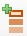 Откроется следующие окно: 

      

      В окне выбора материала, в группе **Стандартные материалы** представлен перечень материалов с расчетными характеристиками, указанными в данной нормативной методике. В других группах также представлены материалы с привязкой к соответствующему нормативному документу.

      В группе **Дополнительные материалы** может быть представлен набор индивидуальных конструктивных слоев добавленных пользователем самостоятельно. Последовательность действий по созданию слоев с индивидуальными характеристиками будет описана далее, в разделе **Библиотека материалов**.

  2. Раскройте список с наименованием **Стандартные материалы** и выберите из него требуемый материал слоя, щелкнув по его наименованию дважды левой кнопкой мыши:

      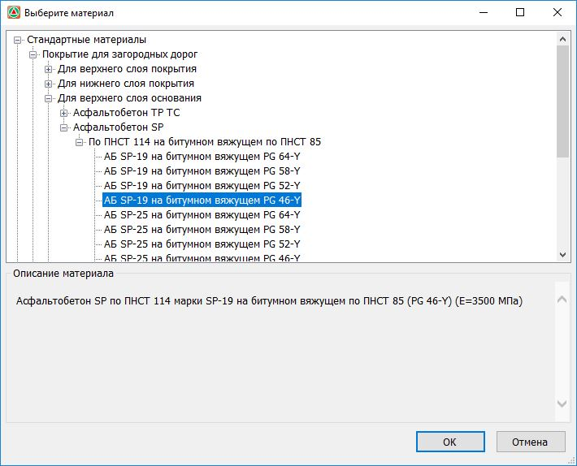

      В результате выбранный слой отобразится в поле **Наименование**:

      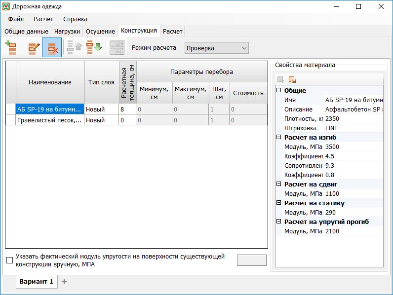 

      

      При выделенном слое в списке, все его расчетные характеристики отображаются в поле **Свойства материала**:

      

      При необходимости данные характеристики могут быть отредактированы пользователем. Последовательность действий по редактированию параметров стандартных материалов будет описана ниже в разделе **Свойства материала**.

      

  3. Выберите **Тип слоя** добавленного конструктивного материала;

  * Новый - используется для расчета новой конструкции.
  * Существующий - используется в расчете слоев усиления. Устанавливается у существующих слов конструкции.

    

    При наличии в конструкции слоев усиления, не зависимо от настройки задания значения существующего модуля упругости, расчет выполняется по критерию упругого прогиба, сдвига, статики и растяжение при изгибе. Расчет на морозоустойчивость и осушение не производится.

    

  * Выравнивающий - материал с данным типом в расчете не участвует. Но отображается в списке слоев и на чертеже.

  4. Задайте толщину добавленного конструктивного слоя в поле **Расчетная толщина**;

      

      Если поле **Расчетная толщина** не доступно для ввода данных, в списке с наименованием **Режим расчета** выставите режим **Проверка**:

       

      В данном случае станет не активна группа столбцов с наименованием Параметры перебора. Последовательность действий по подбору толщин конструктивных слоев дорожной одежды будет описана ниже в разделе [Режим расчета](#71404-2024-rezhim-rascheta).

      

  5. Используя аналогичную последовательность действий, добавьте остальные конструктивные слои дорожной одежды:

      

      

      Для грунта материала толщины, шаг перебора и условная стоимость должны быть равны нулю.

      

  **Изменение слоя** {#71404-2024-redaktirovanie-izmenenie}

  Для того чтобы изменить какой либо слой конструкции на другой, имеющийся в библиотеке материалов, выполните следующие действия:

  1. Выберите данный слой из общего списка слоев конструкции дорожной одежды и нажмите кнопку **Редактировать слой**. Откроется окно выбора материала: 

      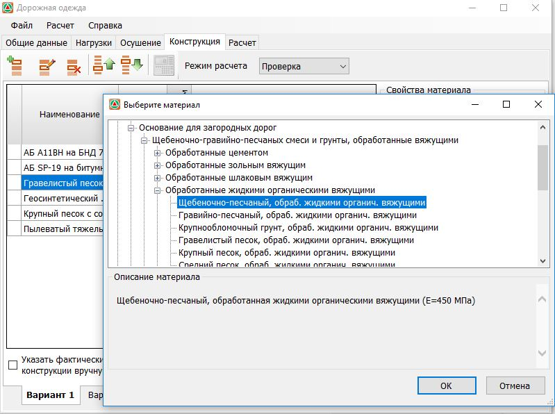 

  2. Выберите из библиотеки другой конструктивный слой, который нужно назначить вместо текущего и нажмите **ОК**.

  После изменения слоя при необходимости измените значения его толщины и условной стоимости.

  **Удаление слоя** {#71404-2024-redaktirovanie-udalenie}

  Для удаления какого-либо слоя из конструкции дорожной одежды:

  Выберите данный слой из общего списка слоев и нажмите кнопку **Удалить слой** . В результате выбранный слой будет удален из дорожной конструкции.

  **Перемещение слоя** {#71404-2024-redaktirovanie-peremeshchenie}

  Если необходимо изменить положение какого-либо конструктивного слоя относительно других:

  1. Выберите данный слой из общего списка и нажмите кнопку **Переместить слой вниз** , либо **Переместить слой вверх**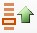 ;

  2. Выбранный слой будет перемещен на один уровень вверх, либо вниз. Для перемещения слоя еще на несколько уровней повторно воспользуйтесь данной функцией.

  

  {#71404-2024-rezhim-rascheta}

  В программе имеется возможность подбора оптимальной конструкции дорожной одежды по критерию минимальной стоимости. Для подбора конструкции дорожной одежды выполните следующие действия:

  1. Убедитесь, что на вкладке **Конструкция** в поле **Наименование** заданы все конструктивные слои дорожной одежды:

     

      

      До подбора конструкции не обязательно задавать значение толщин конструктивных слоев в поле **Расчетная толщина**.

      

  2. В выпадающем списке установите режим **Подбор**: 

     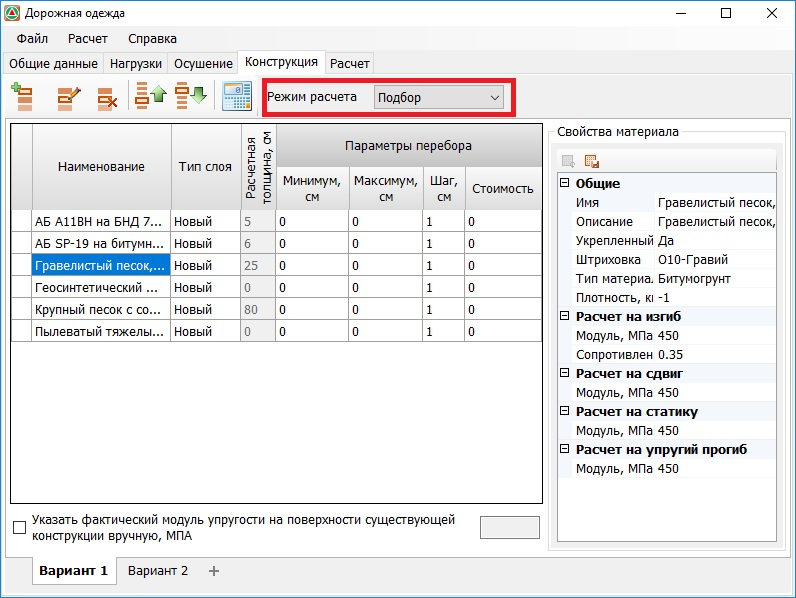

      После установления данного режима станут активны для ввода столбцы группы **Параметры подбора**.

  3. В столбцах **Параметры подбора** задайте значения **Минимальной** и **Максимальной толщины** конструктивных слоев дорожной одежды, а также шаг перебора от минимума до максимума.

  * **Шаг перебора** задается индивидуально для каждого конструктивного слоя.

    

    Не рекомендуется задавать очень малый шаг перебора для слоев, у которых сильно отличается значение Минимальной и Максимально допустимой толщины, т.к. в этом случае будет рассчитываться очень большое количество вариантов, в результате чего процедура подбора может занять долгое время.

    

  * Если какой либо конструктивный слой не участвует в подборе, то значение его **Минимальной** и **Максимальной толщины** задается одинаковой.
  * Для грунта и геосинтетического материала толщины, шаг перебора и условная стоимость не задаются, т.к. они (грунт и геосетка) не участвуют в процедуре подбора конструкции.
  * Если конструкция будет подбираться по критерию минимальной приведенной стоимости, то для каждого конструктивного слоя, также должно быть задано значение его условной стоимости. Данное значение задается в столбце **Стоимость**, в рублях или других условных единицах, для слоя толщиной 1 см. на единицу площади покрытия.

  4. После задания всех необходимых параметров для подбора конструкции нажмите кнопку **Подобрать**, расположенную в верхней части окна:

     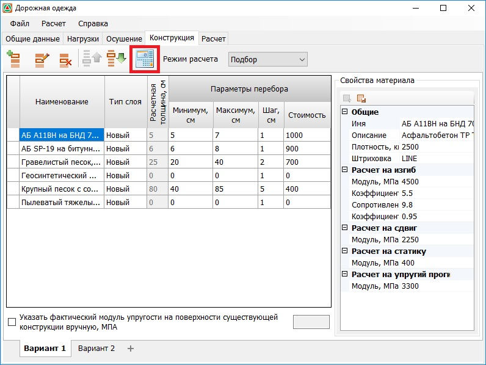

      В открывшемся окне установите опции напротив критериев расчета, которые будут учитываться при подборе конструкции и нажмите **ОК**: 

      

      

      [Настройки расчета](..\road_tasks.md?tabs=road-tasks_gost-71404-2024) были описаны ранее в соответствующем разделе.

      

  5. В результате, начнется процесс подбора вариантов конструкции: 

     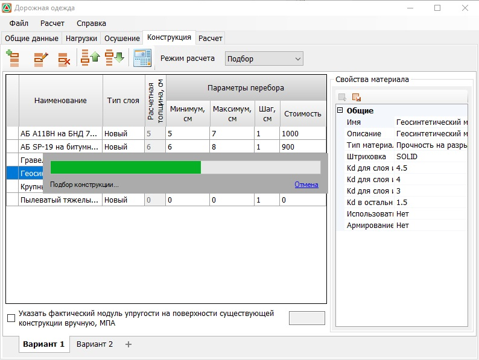

  По окончании данного процесса откроется список вариантов конструкции прошедших процедуру подбора: 

  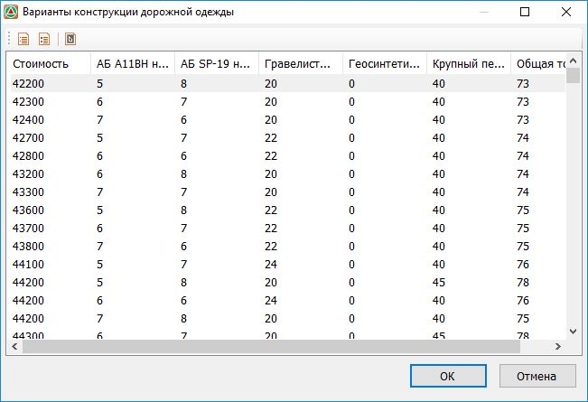

  При подборе конструкции происходит расчет всех возможных вариантов толщин слоев, с учетом заданного шага перебора. Варианты не удовлетворяющие какому либо критерию прочности отбраковываются.

  Для сортировки всех отображаемых вариантов по какому-либо критерию, щелкните левой кнопкой мыши по наименованию соответствующего столбца. К примеру, если щелкнуть по столбцу **Стоимость**, то варианты конструкций будут сгруппированы в списке в порядке нарастания суммарной условной стоимости конструкции. Если же щелкнуть по столбцу с наименованием какого-то конструктивного слоя, то будет выполнена сортировка вариантов, в порядке нарастания его толщины.

  В результате, в качестве расчетных толщин будут приняты значения соответствующие выбранному (подобранному) варианту конструкции:

  

  

  {#71404-2024-usilenie-sloya}

  Согласно п. 6.13.1 **ГОСТ Р 71404-2024** величина общего модуля упругости на поверхности рабочего слоя земляного полотна (при расчетной влажности грунта земляного полотна) в зависимости от ДКЗ должна быть не ниже следующих значений:

  * 60 МПа – в ДКЗ II;
  * 53 МПа – в ДКЗ III;
  * 45 МПа – в ДКЗ IV, V.

  Если при расчете фактический модуль упругости на поверхности рабочего слоя окажется ниже требуемого, на вкладке **Расчет** отобразится соответствующее предупреждение.

  Для увеличения общего модуля на поверхности рабочего слоя земполотна в программе предусмотрены следующие мероприятия (п. 6.13.2 **ГОСТ Р 71404-2024**):

  **Укрепление грунта верхней части рабочего слоя вяжущими или местными материалами.**

  Для этого, в окне свойств материла в разделе с наименованием **Рабочий слой** выберите параметр **Укрепление**. После этого станут доступны следующие параметры:

  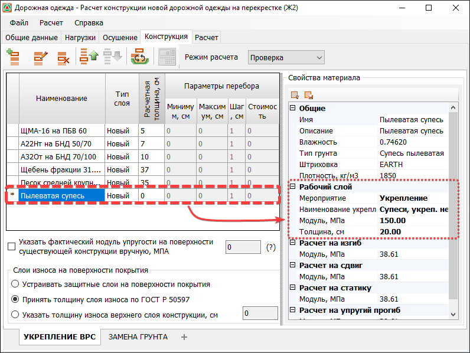

  **Наименование укрепления** – в данном поле задается материал, которым укрепляют грунт. Данный материал можно выбрать из библиотеки или ввести его название самостоятельно.

  **Модуль, Мпа** – в данном поле задаётся модуль упругости материала, которым укрепляем грунт. Если материл был выбран из библиотеки, то его модуль назначается автоматически.

  **Толщина, см** - в данном поле задаётся толщина слоя укрепления.

  После здания всех параметров модуль упругости на поверхности рабочего слоя можно проверить во вкладке **Расчет** в критерии **Упругий прогиб** . Расчет на морозоустойчивость производится с учетом толщины укрепления рабочего слоя. Расчет по условию сдвигоустойчивости при подвижной и статической нагрузке в слое грунта рабочего слоя, укрепленного вяжущим, не проводится.

  **Стабилизация грунта рабочего слоя.**

  В окне свойств материла в разделе с наименованием **Рабочий слой** выберите вариант **Стабилизация**. После этого станут доступны следующие параметры:

  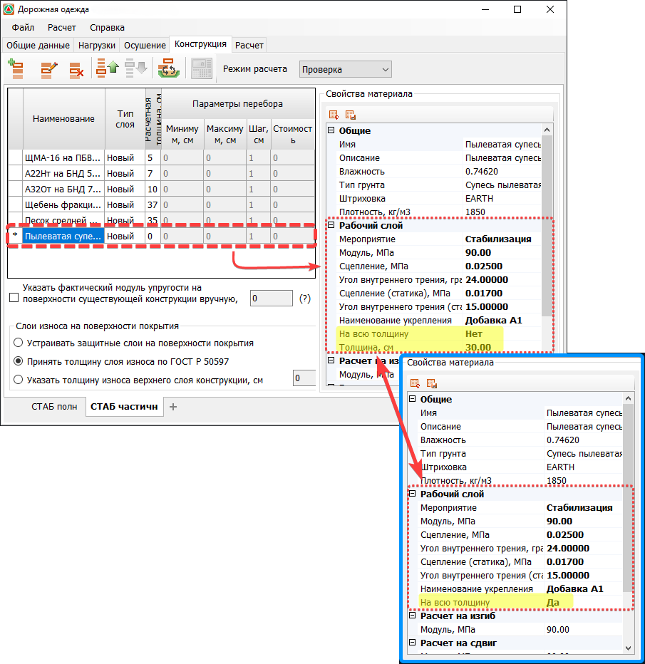

  Расчетные механические характеристики стабилизированного грунта (модуль упругости, удельное сцепление $c_N$ и угол внутреннего трения $\phi_N$) принимают в зависимости от примененного стабилизатора в соответствии с действующими нормативными документами в данной области и уточняют по данным лабораторных испытаний.

  **Наименование укрепления** – в данном поле задается материал, которым стабилизируют грунт. Данный материал можно выбрать из библиотеки или ввести его название самостоятельно.

  **На всю толщину** – данная опция позволят выбрать тип стабилизации согласно п. 6.13.4. Стабилизацию можно выполнять полностью, на всю толщину рабочего слоя, или частично, на глубину не менее 2/3 от толщины рабочего слоя, но не менее 0,30 м.

  **Толщина, см** – в данном поле задаётся толщина стабилизированного слоя.

  **Устройство рабочего слоя из непучинистых или слабопучинистых грунтов (в ДКЗ II и III)**

  В программе предусмотрены два режима расчета толщины слоя замены грунта рабочего слоя. Для того, чтобы выбрать режим необходимо перейти в окно **Настройки расчета** (меню **Расчет - Настройки расчета - Замена грунта**):

  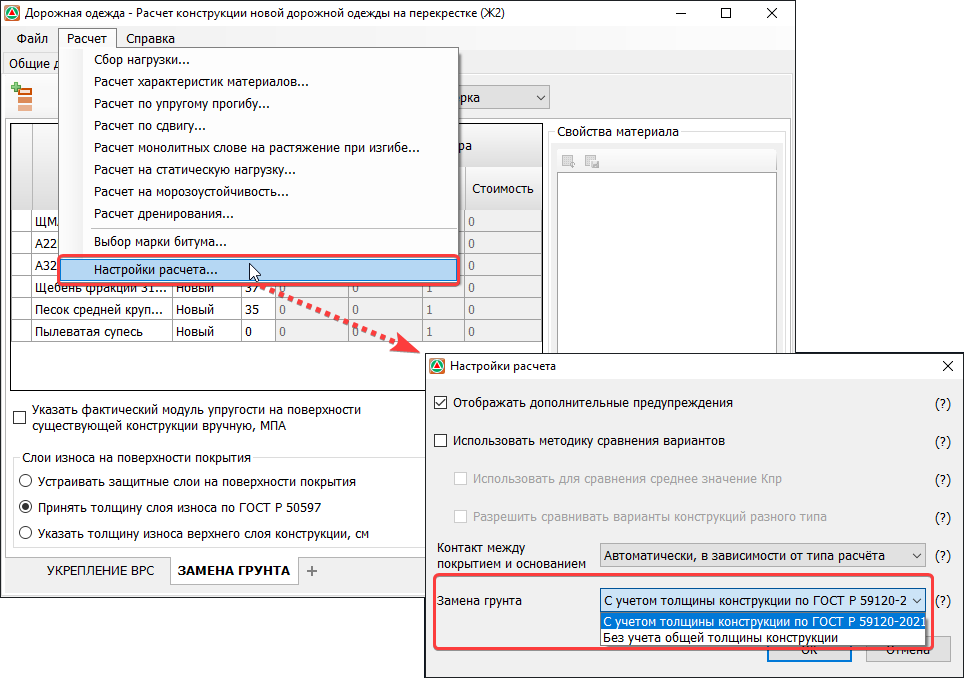

  **С учетом толщины конструкции по ГОСТ Р 59120-2021** - в данном случае программа подберет толщину слоя замены грунта исходя из того, что полная толщина конструкции должна быть не менее 150 см.

  **Без учета толщины конструкции** - данная опция игнорирует п. 3.25 ГОСТ Р 59120-2021 в пользу п. 6.13.5 ГОСТ Р 71404-2024, т.е. толщина слоя будет подобрана исходя из минимально допустимого модуля упругости на поверхности грунта замены.

  Для добавления слоя замены грунта выполните следующие действия:

  1. Нажмите кнопку **Замена грунта**. Откроется окно библиотеки материалов:

     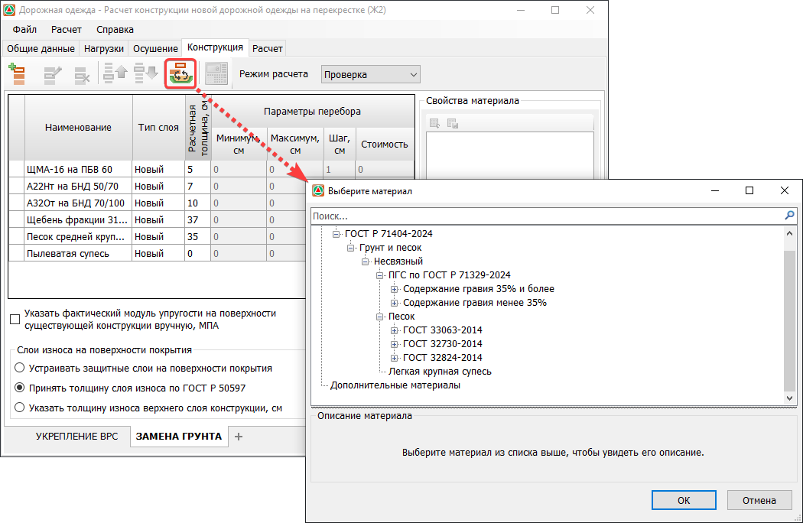

  2. Выберите материал из списка. Для подтверждения выбора нажмите **ОК**;
  
  3. Материал будет добавлен в список слоев конструкции с толщиной, рассчитанной в соответствии с выбранным режимом замены грунта:

     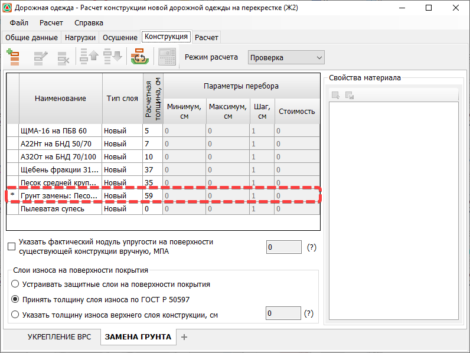

  

  {#71404-2024-modul-uprugosti-fakt}

  Согласно **ГОСТ Р 71404-2024** возможны два варианта задания исходных данных для расчета конструкции усиления – если имеются данные о фактических модулях упругости, и если нет достоверных данных.

  Если данная опция установлена, и значение фактического модуля упругости на поверхности существующей конструкции задано вручную, то программа выполняем расчет на упругий прогиб с учетом соответствующего заданного значения. Расчеты на изгиб и сдвиг выполняются только для новых слоев дорожной одежды. При этом для расчета на сдвиг используется тоже же значение фактического модуля упругости существующей конструкции.

  Если же данная опция не установлена и значение фактического модуля упругости не задано, то конструкция дорожной одежды (включая существующие слои) рассчитывается целиком. Значения прочностных характеристик для каждого слоя (как нового, так и существующего) принимается индивидуально, в соответствии со значениями заданными в библиотеки материалов программы.

  

  1. Согласно п.13.5 ГОСТ Р 71404-2024 для капитального покрытия обязательно указывать фактический модуль на поверхности существующей конструкции вручную, МПА при расчете слоев усиления.
  2. При наличии в конструкции слоев усиления, не зависимо от настройки задания значения существующего модуля упругости, расчет выполняется по критерию упругого прогиба, сдвига, статики и растяжение при изгибе. Расчет на морозоустойчивость и осушение не производится.

  

  

  {#71404-2024-sloi-iznosa}

  Расчет по **ГОСТ Р 71404-2024** может осуществляться с учетом последующей величины износа верхнего слоя покрытия. Для этого в поле **Слои износа на поверхности покрытия** нужно установить соответствующую настройку и самостоятельно задать значение величины износа.
  
  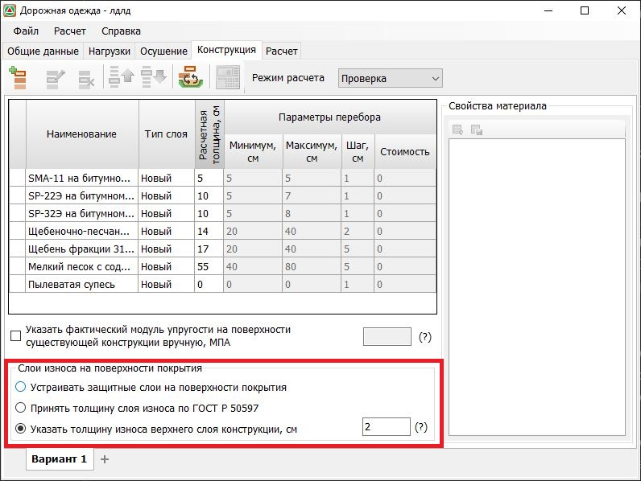
  
  В данном случае, при расчете толщина верхнего слоя будет приниматься за вычетом назначенной величины износа. Эта информация также будет отображена в выходных отчетах, где будет указана как полная толщина слоя, так и расчетная толщина с учетом износа.
  
  Опция **Устраивать защитные слои на поверхности покрытия** является информационной и не влияет на результаты расчета. При установлении данной настройки в выходных отчетах будут дополнительно добавлены требования о необходимости устройства дополнительных защитных слоев.
  
  Опция **Принять толщину слоя износа по ГОСТ Р 50597** - в данном случае толщина слоя износа принимается в соответствии с п.6.5 ГОСТ Р 71404-2024 из таблицы 5.3 ГОСТ Р 50597.

  

- ПНСТ 1006-2025 {#pnst-1006-2025}

  

  Данная вкладка предназначена для создания и редактирования конструктивных слоев дорожной одежды, задания параметров рабочего слоя или существующей конструкции и назначения слоя износа или защитного слоя.

  В верхней части данного окна расположены пиктограммы позволяющие добавлять конструктивные слои, а также удалять их, изменять их параметры или местоположение относительно других слоев дорожной одежды.

  

  Доступна функция [подбора](#1006-2025-rezhim-rascheta) толщин слоя конструкции дорожной одежды, по критерию минимальной стоимости.

  Расчет может содержать несколько [вариантов](../additionally/work_with_variants.md).

  {#1006-2025-redaktirovanie}

  **Добавление слоя** {#1006-2025-redaktirovanie-dobavlenie}

  Для добавления нового конструктивного слоя выполните следующие действия:

  1. Нажмите кнопку **Добавить слой**  Откроется следующие окно: 

     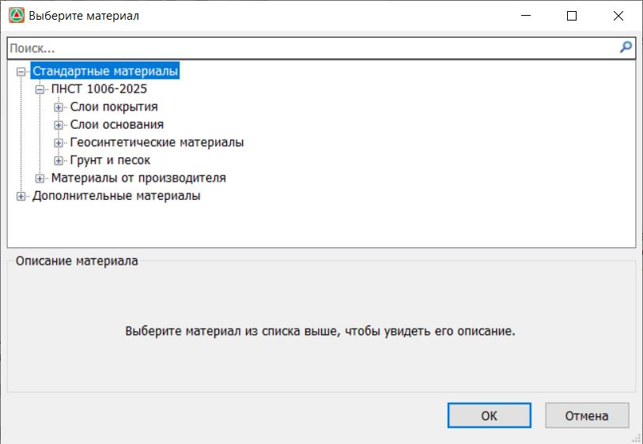

     В окне выбора материала, в группе **Стандартные материалы** представлен перечень материалов с расчетными характеристиками, указанными в данной нормативной методике. В других группах также представлены материалы с привязкой к соответствующему нормативному документу.

     В группе **Дополнительные материалы** может быть представлен набор индивидуальных конструктивных слоев добавленных пользователем самостоятельно. Последовательность действий по созданию слоев с индивидуальными характеристиками будет описана далее, в разделе **Библиотека материалов**.

  2. Раскройте список с наименованием **Стандартные материалы** и выберите из него требуемый материал слоя, щелкнув по его наименованию дважды левой кнопкой мыши: 

     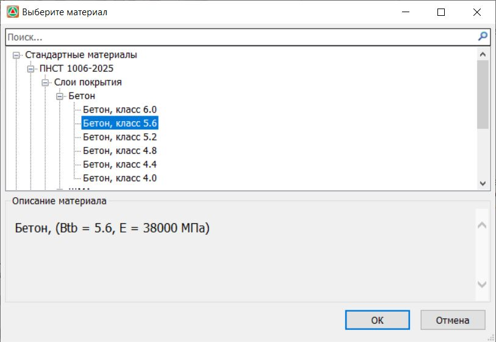

     В результате выбранный слой отобразится в поле **Наименование**:
     
     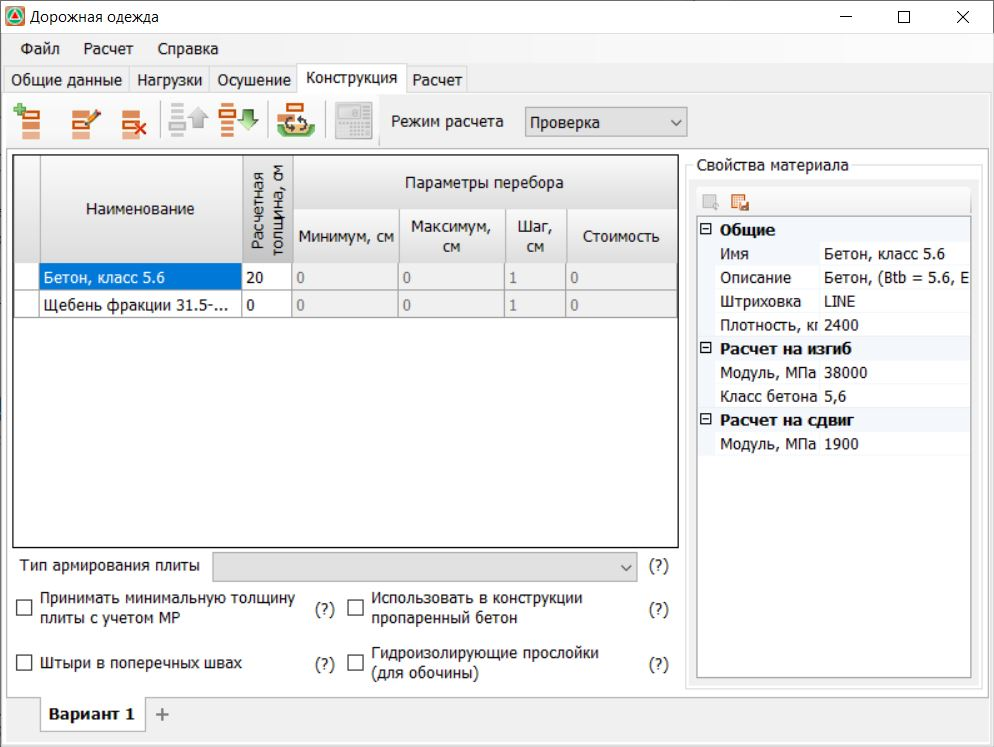 

     

     При выделенном слое в списке, все его расчетные характеристики отображаются в поле **Свойства материала**:

     

     При необходимости данные характеристики могут быть отредактированы пользователем. Последовательность действий по редактированию параметров стандартных материалов будет описана ниже в разделе **Свойства материала**.

     

  3. Выберите **Тип слоя** добавленного конструктивного материала;

  * Новый - используется для расчета новой конструкции.
  * Существующий - используется в расчете слоев усиления. Устанавливается у существующих слов конструкции.

    

    При наличии в конструкции слоев усиления, не зависимо от настройки задания значения существующего модуля упругости, расчет выполняется по критерию упругого прогиба, сдвига, статики и растяжение при изгибе. Расчет на морозоустойчивость и осушение не производится.

    

  * Выравнивающий - материал с данным типом в расчете не участвует. Но отображается в списке слоев и на чертеже.

  4. Задайте толщину добавленного конструктивного слоя в поле **Расчетная толщина**;

     

     Если поле **Расчетная толщина** не доступно для ввода данных, в списке с наименованием **Режим расчета** выставите режим **Проверка**:

      

     В данном случае станет не активна группа столбцов с наименованием Параметры перебора. Последовательность действий по подбору толщин конструктивных слоев дорожной одежды будет описана ниже в разделе [Режим расчета](#1006-2025-rezhim-rascheta).

     

  5. Используя аналогичную последовательность действий, добавьте остальные конструктивные слои дорожной одежды: 

     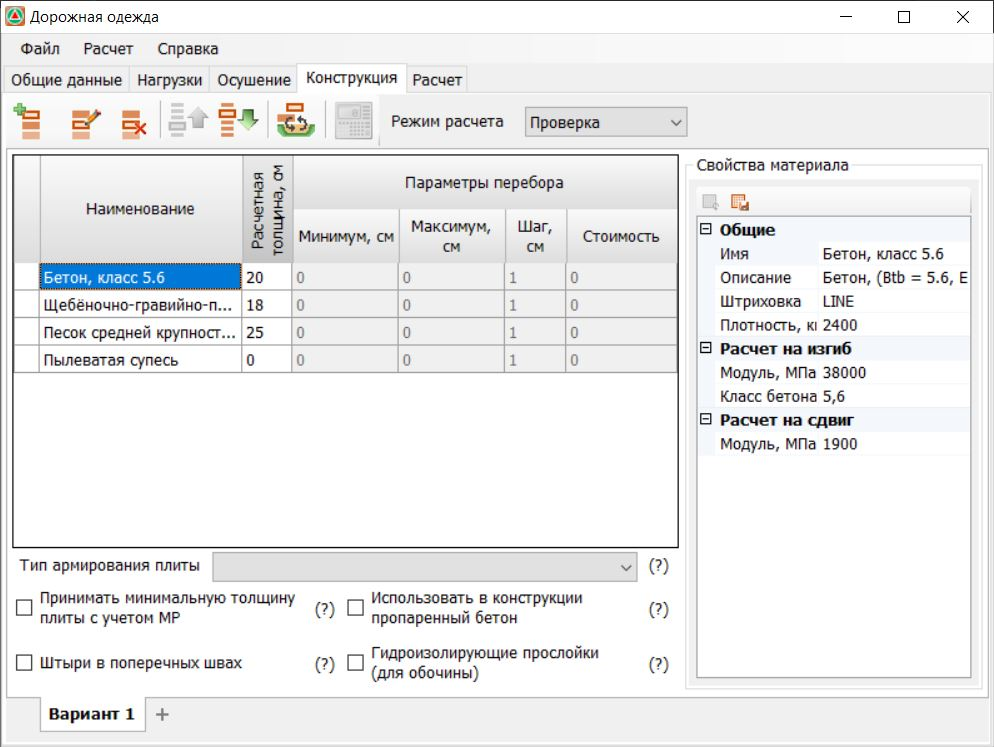

     

     Для грунта материала толщины, шаг перебора и условная стоимость должны быть равны нулю.

     

  **Изменение слоя** {#1006-2025-redaktirovanie-izmenenie}

  Для того чтобы изменить какой либо слой конструкции на другой, имеющийся в библиотеке материалов, выполните следующие действия:

  1. Выберите данный слой из общего списка слоев конструкции дорожной одежды и нажмите кнопку **Редактировать слой**. Откроется окно выбора материала:

     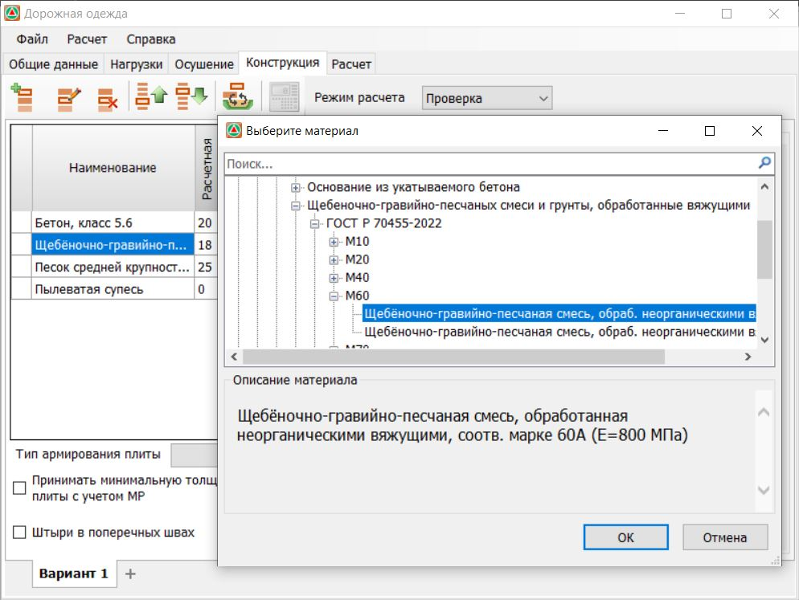 

  2. Выберите из библиотеки другой конструктивный слой, который нужно назначить вместо текущего и нажмите **ОК**.

  После изменения слоя при необходимости измените значения его толщины и условной стоимости.

  **Удаление слоя** {#1006-2025-redaktirovanie-udalenie}

  Для удаления какого-либо слоя из конструкции дорожной одежды:

  Выберите данный слой из общего списка слоев и нажмите кнопку **Удалить слой** . В результате выбранный слой будет удален из дорожной конструкции.

  **Перемещение слоя** {#1006-2025-redaktirovanie-peremeshchenie}

  Если необходимо изменить положение какого-либо конструктивного слоя относительно других:

  1. Выберите данный слой из общего списка и нажмите кнопку **Переместить слой вниз** , либо **Переместить слой вверх** ;

  2. Выбранный слой будет перемещен на один уровень вверх, либо вниз. Для перемещения слоя еще на несколько уровней повторно воспользуйтесь данной функцией.

  

  {#1006-2025-rezhim-rascheta}

  В программе имеется возможность подбора оптимальной конструкции дорожной одежды по критерию минимальной стоимости. Для подбора конструкции дорожной одежды выполните следующие действия:

  1. Убедитесь, что на вкладке **Конструкция** в поле **Наименование** заданы все конструктивные слои дорожной одежды: 

     

     

     До подбора конструкции не обязательно задавать значение толщин конструктивных слоев в поле **Расчетная толщина**.

     

  2. В выпадающем списке установите режим **Подбор**: 

  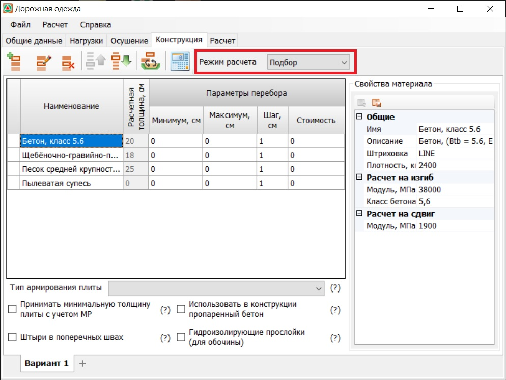

  После установления данного режима станут активны для ввода столбцы группы **Параметры подбора**.

  3. В столбцах **Параметры подбора** задайте значения **Минимальной** и **Максимальной толщины** конструктивных слоев дорожной одежды, а также шаг перебора от минимума до максимума.

  * **Шаг перебора** задается индивидуально для каждого конструктивного слоя.

    

    Не рекомендуется задавать очень малый шаг перебора для слоев, у которых сильно отличается значение Минимальной и Максимально допустимой толщины, т.к. в этом случае будет рассчитываться очень большое количество вариантов, в результате чего процедура подбора может занять долгое время.

    

  * Если какой либо конструктивный слой не участвует в подборе, то значение его **Минимальной** и **Максимальной толщины** задается одинаковой.
  * Для грунта и геосинтетического материала толщины, шаг перебора и условная стоимость не задаются, т.к. они (грунт и геосетка) не участвуют в процедуре подбора конструкции.
  * Если конструкция будет подбираться по критерию минимальной приведенной стоимости, то для каждого конструктивного слоя, также должно быть задано значение его условной стоимости. Данное значение задается в столбце **Стоимость**, в рублях или других условных единицах, для слоя толщиной 1 см. на единицу площади покрытия.

  4. После задания всех необходимых параметров для подбора конструкции нажмите кнопку **Подобрать**, расположенную в верхней части окна: 

     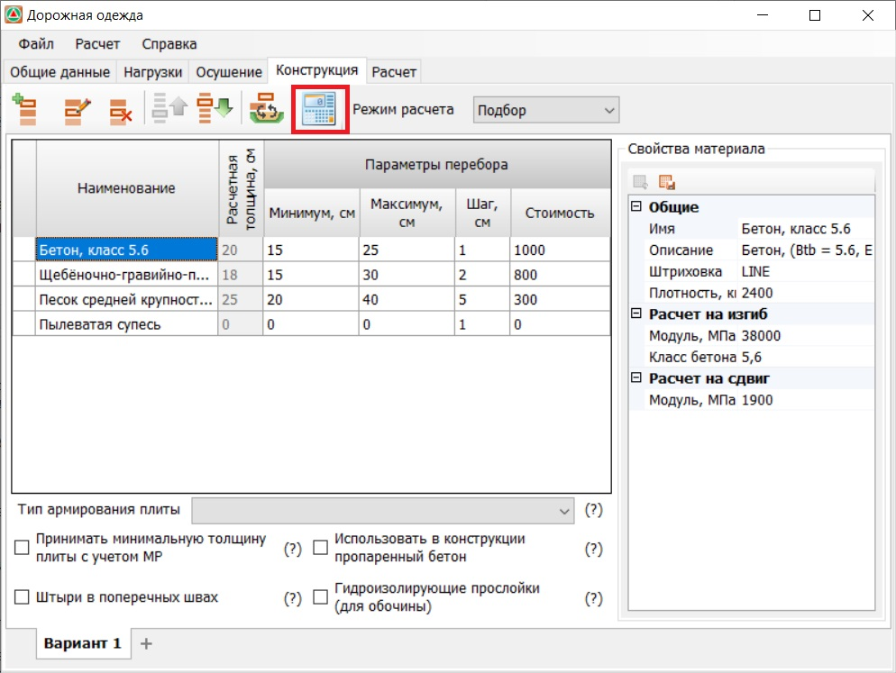

     В открывшемся окне установите опции напротив критериев расчета, которые будут учитываться при подборе конструкции и нажмите **ОК**: 

     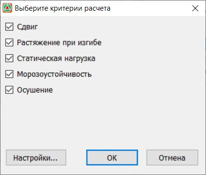

     

     [Настройки расчета](../road_tasks.md?tabs=road-tasks_pnst-1006-2025) были описаны ранее в соответствующем разделе.

     

  5. В результате, начнется процесс подбора вариантов конструкции: 

     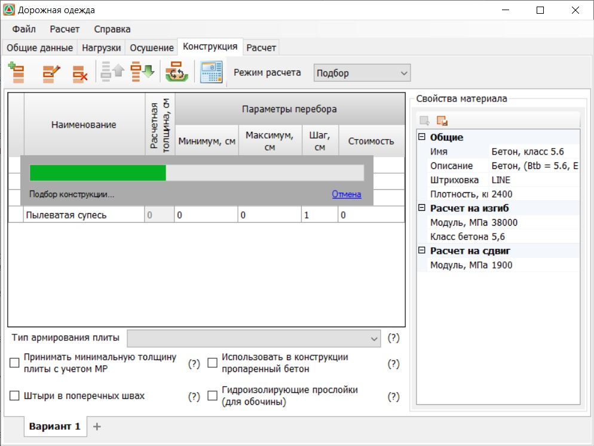

  По окончании данного процесса откроется список вариантов конструкции прошедших процедуру подбора: 

  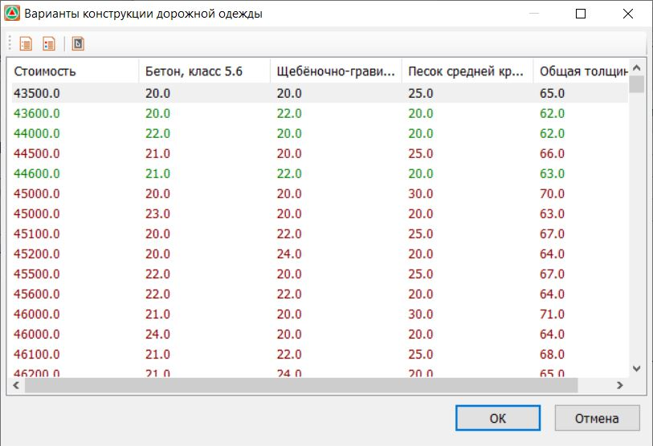

  При подборе конструкции происходит расчет всех возможных вариантов толщин слоев, с учетом заданного шага перебора. Варианты не удовлетворяющие какому либо критерию прочности отбраковываются.

  Для сортировки всех отображаемых вариантов по какому-либо критерию, щелкните левой кнопкой мыши по наименованию соответствующего столбца. К примеру, если щелкнуть по столбцу **Стоимость**, то варианты конструкций будут сгруппированы в списке в порядке нарастания суммарной условной стоимости конструкции. Если же щелкнуть по столбцу с наименованием какого-то конструктивного слоя, то будет выполнена сортировка вариантов, в порядке нарастания его толщины.

  В результате, в качестве расчетных толщин будут приняты значения соответствующие выбранному (подобранному) варианту конструкции: 

  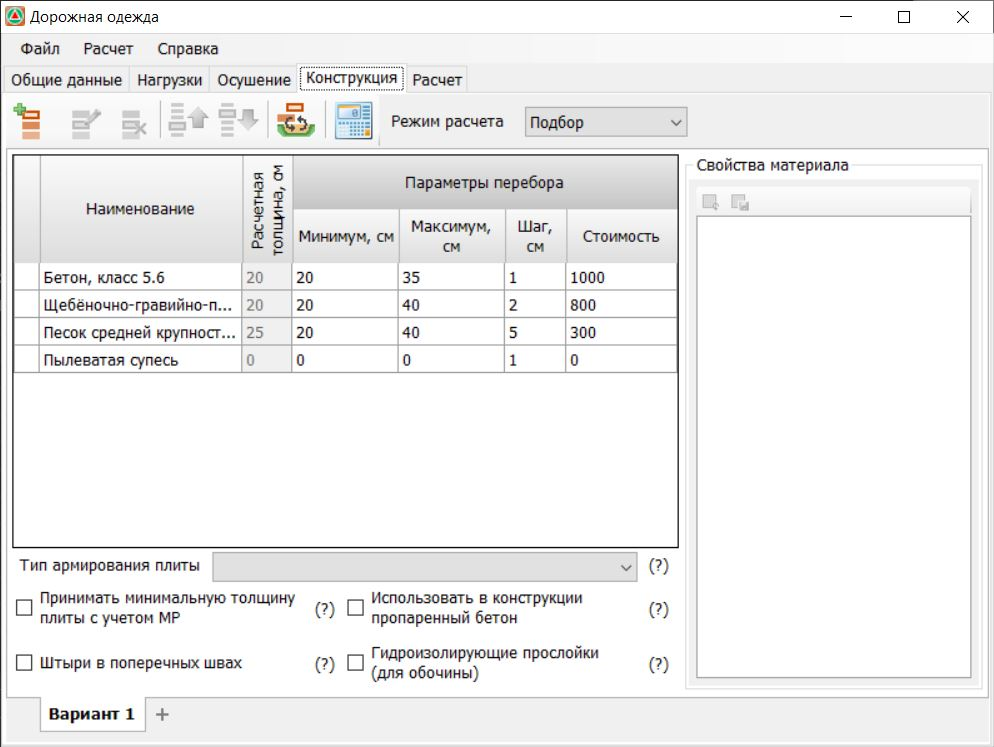

  

  {#1006-2025-raschet-pokrytiy}

  Методика ПНСТ 1006-2025 позволяет произвести расчет жестких дорожных одежд со следующими вариантами покрытий:

  * **Монолитные цементобетонные**

    * В конструкцию должен быть добавлен материал из библиотеки **Слои покрытия** - **Бетон**:

      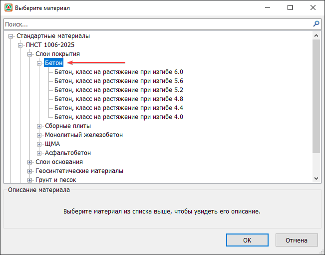

     * Дополнительно для данного вида покрытия могут быть учтены наличие [штыревых соединений](#1006-2025-shtyri) и использование [пропаренного бетона](#1006-2025-proparennyi-beton).

  * **Асфальтобетонные покрытия на цементобетонном основании**

     * В конструкцию должны быть добавлены материалы из библиотеки: **Слои покрытия** – **ЩМА** или **Асфальтобетон** и **Слои основания** - **Основание из укатываемого бетона**:

       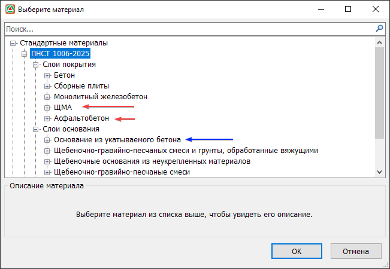

     * Дополнительно для бетонной плиты основания могут быть учтены наличие [штыревых соединений](#1006-2025-shtyri) и использование [пропаренного бетона](#1006-2025-proparennyi-beton).

   * **Сборные покрытия из плит ПАГ и 1ПДН**

     * В конструкцию должен быть добавлен материал из библиотеки **Слои покрытия** – **Сборные плиты**:

        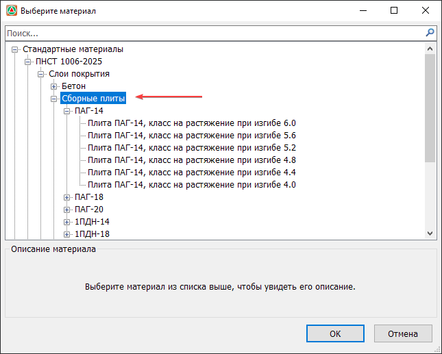

     * В данном случае толщина слоя подставляется автоматически в зависимости от типа плиты.

   * **Монолитные железобетонные**

     * В конструкцию должен быть добавлен материал из библиотеки **Слои покрытия** – **Монолитный железобетон**:
        
        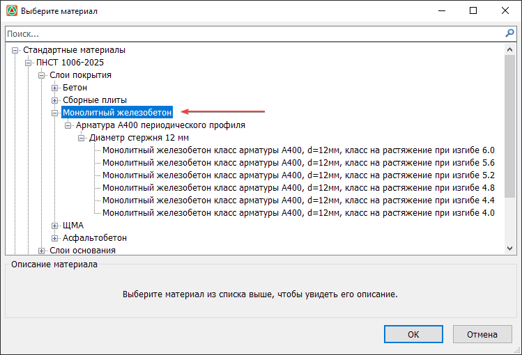

     * В стандартной библиотеке представлены варианты покрытия с арматурой класса А400, диаметром стержней 12 мм и другими характеристиками, которые могут быть изменены в свойствах материала в разделе **Параметры арматуры**, а именно:

        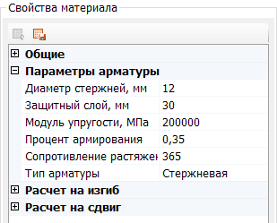

  

  {#1006-2025-usilenie-sloya}
  
  Согласно п. 5.9 **ПНСТ 1006-2025** величина общего модуля упругости на поверхности рабочего слоя земляного полотна (при расчетной влажности грунта земляного полотна) в зависимости от ДКЗ должна быть не ниже следующих значений:
  
  * 60 МПа – в ДКЗ I и II;
  * 53 МПа – в ДКЗ III;
  * 45 МПа – в ДКЗ IV, V.

  Если при расчете фактический модуль упругости на поверхности рабочего слоя окажется ниже требуемого, на вкладке **Расчет** отобразится соответствующее предупреждение.

  Для увеличения общего модуля на поверхности рабочего слоя земполотна в программе предусмотрены следующие мероприятия (п. 6.13.2 **ГОСТ Р 71404-2024**):

  **Укрепление грунта верхней части рабочего слоя вяжущими или местными материалами.**

  Для этого, в окне свойств материла в разделе с наименованием **Рабочий слой** выберите параметр **Укрепление**. После этого станут доступны следующие параметры:

  

  **Наименование укрепления** – в данном поле задается материал, которым укрепляют грунт. Данный материал можно выбрать из библиотеки или ввести его название самостоятельно.

  **Модуль, Мпа** – в данном поле задаётся модуль упругости материала, которым укрепляем грунт. Если материл был выбран из библиотеки, то его модуль назначается автоматически.

  **Толщина, см** - в данном поле задаётся толщина слоя укрепления.

  После здания всех параметров модуль упругости на поверхности рабочего слоя можно проверить во вкладке **Расчет** в критерии **Упругий прогиб** . Расчет на морозоустойчивость производится с учетом толщины укрепления рабочего слоя. Расчет по условию сдвигоустойчивости при подвижной и статической нагрузке в слое грунта рабочего слоя, укрепленного вяжущим, не проводится.

  **Стабилизация грунта рабочего слоя.**

  В окне свойств материла в разделе с наименованием **Рабочий слой** выберите вариант **Стабилизация**. После этого станут доступны следующие параметры:

  

  Расчетные механические характеристики стабилизированного грунта (модуль упругости, удельное сцепление $c_N$ и угол внутреннего трения $\phi_N$) принимают в зависимости от примененного стабилизатора в соответствии с действующими нормативными документами в данной области и уточняют по данным лабораторных испытаний.

  **Наименование укрепления** – в данном поле задается материал, которым стабилизируют грунт. Данный материал можно выбрать из библиотеки или ввести его название самостоятельно.

  **На всю толщину** – данная опция позволят выбрать тип стабилизации согласно п. 6.13.4. Стабилизацию можно выполнять полностью, на всю толщину рабочего слоя, или частично, на глубину не менее 2/3 от толщины рабочего слоя, но не менее 0,30 м.

  **Толщина, см** – в данном поле задаётся толщина стабилизированного слоя.

  **Устройство рабочего слоя из непучинистых или слабопучинистых грунтов (в ДКЗ II и III)**

  В программе предусмотрены два режима расчета толщины слоя замены грунта рабочего слоя. Для того, чтобы выбрать режим необходимо перейти в окно **Настройки расчета** (меню **Расчет - Настройки расчета - Замена грунта**):

  

  **С учетом толщины конструкции по ГОСТ Р 59120-2021** - в данном случае программа подберет толщину слоя замены грунта исходя из того, что полная толщина конструкции должна быть не менее 150 см.

  **Без учета толщины конструкции** - данная опция игнорирует п. 3.25 ГОСТ Р 59120-2021 в пользу п. 6.13.5 ГОСТ Р 71404-2024, т.е. толщина слоя будет подобрана исходя из минимально допустимого модуля упругости на поверхности грунта замены.

  Для добавления слоя замены грунта выполните следующие действия:

  1. Нажмите кнопку **Замена грунта**. Откроется окно библиотеки материалов:

     

  2. Выберите материал из списка. Для подтверждения выбора нажмите **ОК**;

  3. Материал будет добавлен в список слоев конструкции с толщиной, рассчитанной в соответствии с выбранным режимом замены грунта:

  

  

   {#1006-2025-shtyri}

  Выбор вариантов армирования используется при расчете растягивающих напряжений при изгибе плиты c помощью коэффициента $К_{шт}$, при этом учитывается влияние штыревых соединений на условия контактирования плиты с основанием (согласно **ПНСТ 1006-2025**, формула 25).

  $$\sigma^{+}_{p}=\frac{Q \cdot K_{м} \cdot 60 \cdot K_{yсл} \cdot K_{шт}}{h^2}\left ( 0.0592-0.2137\lg(\frac{l}{R}) \right )$$

  Учет штыревых соединений осуществляется следующим образом:

  * При наличии штырей в поперечных швах ($К_{шт}$=1.10);
  * При отсутствии штырей в поперечных швах ($К_{шт}$=1.05)

  

  {#1006-2025-proparennyi-beton}

  Включение данной опции используется при определении расчетного сопротивления бетона на растяжение при изгибе (согласно **ПНСТ 1006-2025**, формула 2).

  $$R_{рн}^{расч}=B_{tb}\cdot K_{н.п}\cdot K_{y}\cdot K_{F}$$

  Учитывается с помощью коэффициента набора прочности со временем Кн.п. следующим образом:

  * Для пропаренного бетона ( $К_{н.п}$=1);
  * Для непропаренного бетона $К_{н.п}$ определяется исходя из дорожно-климатической зоны (вкладка [Общие данные](common_data.md?tabs=common-data_pnst-1006-2025#1006-2025-klimat)). $К_{н.п}$ = 1.2 - для районов с умеренным климатом и $К_{н.п}$ = 1.0 - для условий сухого и жаркого климата.

  

   {#1006-2025-sloi-iznosa}

  Расчет по **ПНСТ 1006-2025** может осуществляться с учетом последующей величины износа верхнего слоя покрытия. Для этого в поле **Слои износа на поверхности покрытия** нужно установить соответствующую настройку и самостоятельно задать значение величины износа. 

  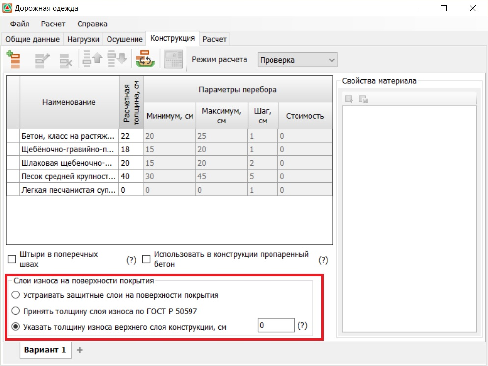

  В данном случае, при расчете толщина верхнего слоя будет приниматься за вычетом назначенной величины износа. Эта информация также будет отображена в выходных отчетах, где будет указана как полная толщина слоя, так и расчетная толщина с учетом износа.

  Опция **Устраивать защитные слои на поверхности покрытия** является информационной и не влияет на результаты расчета. При установлении данной настройки в выходных отчетах будут дополнительно добавлены требования о необходимости устройства дополнительных защитных слоев.

  Опция **Принять толщину слоя износа по ГОСТ Р 50597** - в данном случае толщина слоя износа принимается в соответствии таблицы 5.3 ГОСТ Р 50597.

  

- ГОСТ Р 71244-2024 {#gost-71244-2024}

  

  Данная вкладка предназначена для создания и редактирования конструктивных слоев дорожной одежды, задания параметров рабочего слоя и слоя покрытия.

  В верхней части данного окна расположены пиктограммы позволяющие добавлять конструктивные слои, а также удалять их, изменять их параметры или местоположение относительно других слоев дорожной одежды:

  

  Доступна функция [подбора](#71244-2024-rezhim-rascheta) толщин слоя конструкции дорожной одежды, по критерию минимальной стоимости.

  Расчет может содержать несколько [вариантов](../additionally/work_with_variants.md).

  {#71244-2024-redaktirovanie}

  **Добавление слоя** {#71244-2024-redaktirovanie-dobavlenie}

  Для добавления нового конструктивного слоя выполните следующие действия:

  1. Нажмите кнопку **Добавить слой**  Откроется следующие окно: 

     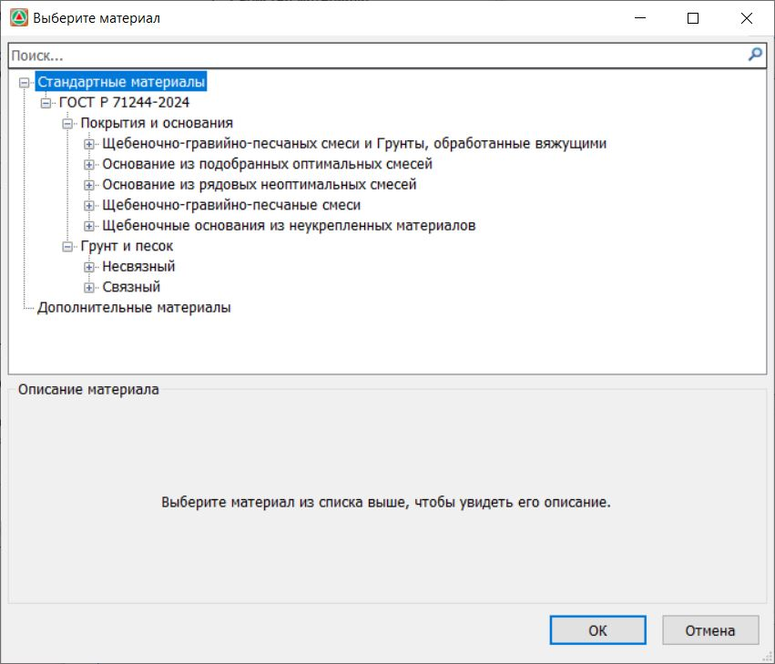

     В окне выбора материала, в группе **Стандартные материалы** представлен перечень материалов с расчетными характеристиками, указанными в данной нормативной методике. В других группах также представлены материалы с привязкой к соответствующему нормативному документу.

     В группе **Дополнительные материалы** может быть представлен набор индивидуальных конструктивных слоев добавленных пользователем самостоятельно. Последовательность действий по созданию слоев с индивидуальными характеристиками будет описана далее, в разделе **Библиотека материалов**.

  2. Раскройте список с наименованием **Стандартные материалы** и выберите из него требуемый материал слоя, щелкнув по его наименованию дважды левой кнопкой мыши: 

     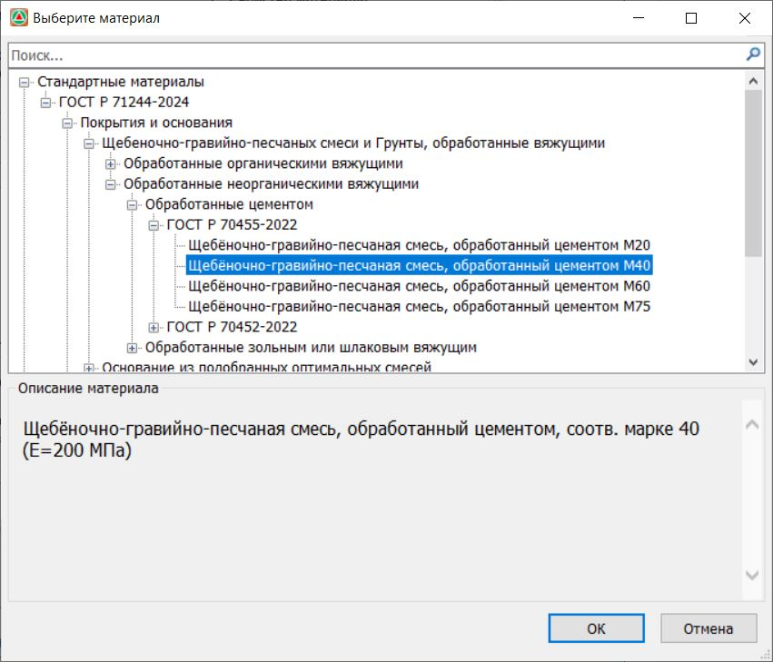

     В результате выбранный слой отобразится в поле **Наименование**: 

     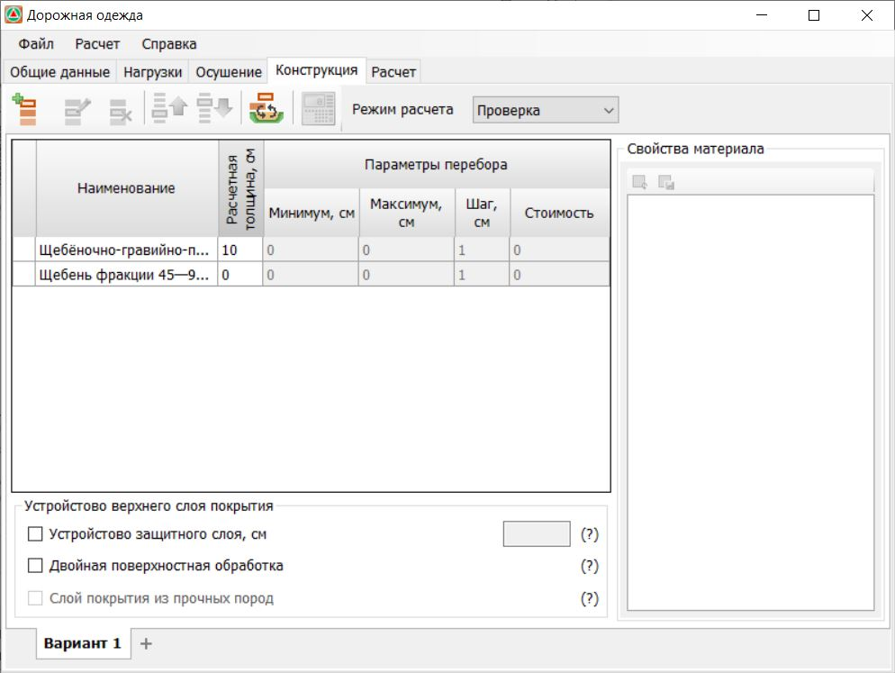 

     

     При выделенном слое в списке, все его расчетные характеристики отображаются в поле **Свойства материала**: 

     

     При необходимости данные характеристики могут быть отредактированы пользователем. Последовательность действий по редактированию параметров стандартных материалов будет описана ниже в разделе **Свойства материала**.

     

  3. Задайте толщину добавленного конструктивного слоя в поле **Расчетная толщина**;

     

     Если поле **Расчетная толщина** не доступно для ввода данных, в списке с наименованием **Режим расчета** выставите режим **Проверка**: 

     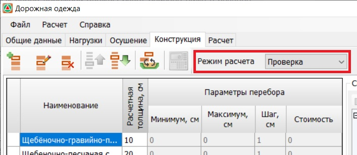 

     В данном случае станет не активна группа столбцов с наименованием Параметры перебора. Последовательность действий по подбору толщин конструктивных слоев дорожной одежды будет описана ниже в разделе [Режима расчета](#71244-2024-rezhim-rascheta).

     

  4. Используя аналогичную последовательность действий, добавьте остальные конструктивные слои дорожной одежды: 

     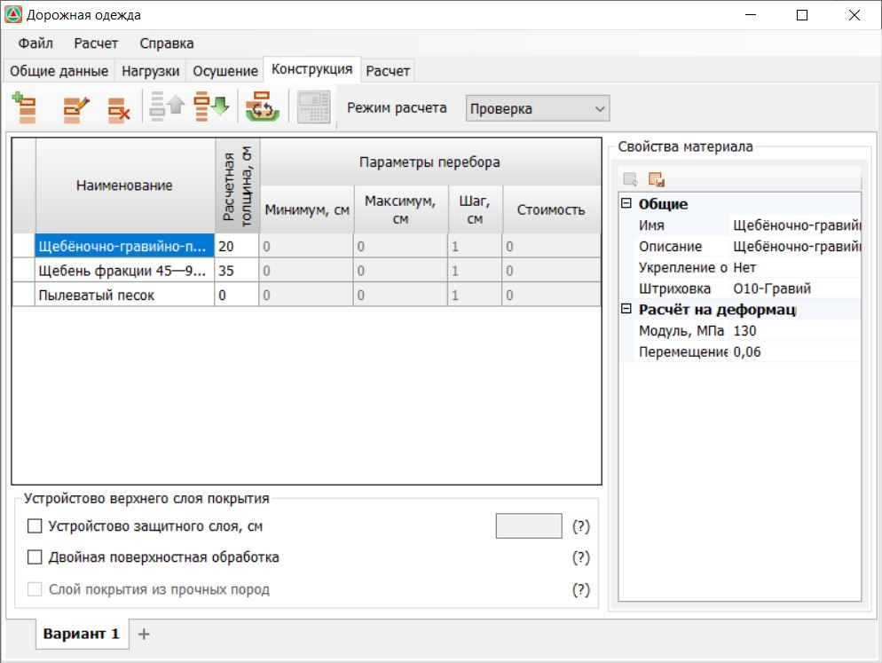 

     

     Для грунта материала толщины, шаг перебора и условная стоимость должны быть равны нулю.

     

  **Изменение слоя** {#71244-2024-redaktirovanie-izmenenie}

  Для того чтобы изменить какой либо слой конструкции на другой, имеющийся в библиотеке материалов, выполните следующие действия:

  1. Выберите данный слой из общего списка слоев конструкции дорожной одежды и нажмите кнопку **Редактировать слой**. Откроется окно выбора материала:

     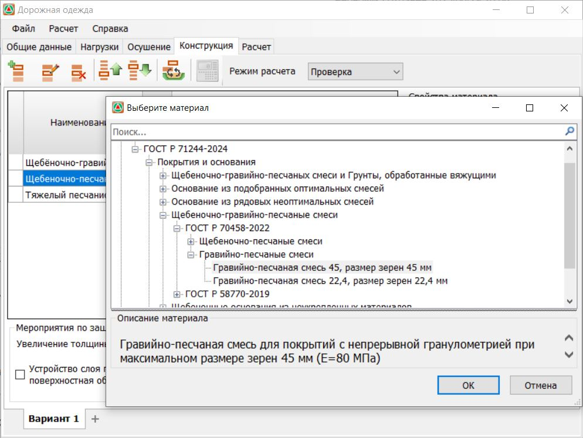

  2. Выберите из библиотеки другой конструктивный слой, который нужно назначить вместо текущего и нажмите **ОК**.

  После изменения слоя при необходимости измените значения его толщины и условной стоимости.

  **Удаление слоя** {#71244-2024-redaktirovanie-udalenie}

  Для удаления какого-либо слоя из конструкции дорожной одежды:

  Выберите данный слой из общего списка слоев и нажмите кнопку **Удалить слой** В результате выбранный слой будет удален из дорожной конструкции.

  **Перемещение слоя** {#71244-2024-redaktirovanie-peremeshchenie}

  Если необходимо изменить положение какого-либо конструктивного слоя относительно других:

  1. Выберите данный слой из общего списка и нажмите кнопку **Переместить слой вниз** , либо **Переместить слой вверх** ;

  2. Выбранный слой будет перемещен на один уровень вверх, либо вниз. Для перемещения слоя еще на несколько уровней повторно воспользуйтесь данной функцией.

  

  {#71244-2024-rezhim-rascheta}

  В программе имеется возможность подбора оптимальной конструкции дорожной одежды по критерию минимальной стоимости. Для подбора конструкции дорожной одежды выполните следующие действия:

  1. Убедитесь, что на вкладке **Конструкция** в поле **Наименование** заданы все конструктивные слои дорожной одежды:

     

     

     До подбора конструкции не обязательно задавать значение толщин конструктивных слоев в поле **Расчетная толщина**.

     

  2. В выпадающем списке установите режим **Подбор**:

     

     После установления данного режима станут активны для ввода столбцы группы **Параметры подбора**.

  3. В столбцах **Параметры подбора** задайте значения **Минимальной** и **Максимальной толщины** конструктивных слоев дорожной одежды, а также шаг перебора от минимума до максимума.

  * **Шаг перебора** задается индивидуально для каждого конструктивного слоя.

    

    Не рекомендуется задавать очень малый шаг перебора для слоев, у которых сильно отличается значение Минимальной и Максимально допустимой толщины, т.к. в этом случае будет рассчитываться очень большое количество вариантов, в результате чего процедура подбора может занять долгое время.

    

  * Если какой либо конструктивный слой не участвует в подборе, то значение его **Минимальной** и **Максимальной толщины** задается одинаковой.
  * Для грунта и геосинтетического материала толщины, шаг перебора и условная стоимость не задаются, т.к. они (грунт и геосетка) не участвуют в процедуре подбора конструкции.
  * Если конструкция будет подбираться по критерию минимальной приведенной стоимости, то для каждого конструктивного слоя, также должно быть задано значение его условной стоимости. Данное значение задается в столбце **Стоимость**, в рублях или других условных единицах, для слоя толщиной 1 см. на единицу площади покрытия.

  4. После задания всех необходимых параметров для подбора конструкции нажмите кнопку **Подобрать**, расположенную в верхней части окна: 

     

     В открывшемся окне установите опции напротив критериев расчета, которые будут учитываться при подборе конструкции и нажмите **ОК**: 

     

     

     [Настройки расчета](../road_tasks.md?tabs=road-tasks_gost-71244-2024) были описаны ранее в соответствующем разделе.

     

  5. В результате, начнется процесс подбора вариантов конструкции: 

     

  По окончании данного процесса откроется список вариантов конструкции прошедших процедуру подбора:

  

  При подборе конструкции происходит расчет всех возможных вариантов толщин слоев, с учетом заданного шага перебора. Варианты не удовлетворяющие какому либо критерию прочности отбраковываются.

  Для сортировки всех отображаемых вариантов по какому-либо критерию, щелкните левой кнопкой мыши по наименованию соответствующего столбца. К примеру, если щелкнуть по столбцу **Стоимость**, то варианты конструкций будут сгруппированы в списке в порядке нарастания суммарной условной стоимости конструкции. Если же щелкнуть по столбцу с наименованием какого-то конструктивного слоя, то будет выполнена сортировка вариантов, в порядке нарастания его толщины.

  В результате, в качестве расчетных толщин будут приняты значения соответствующие выбранному (подобранному) варианту конструкции:

  

  

  {#71244-2024-usilenie-sloya}

  Согласно п. 5.2.12 **ГОСТ Р 71244-2024** величина общего модуля деформации на поверхности рабочего слоя земляного полотна в расчетный период при максимальной влажности грунтов (весна, осень) в зависимости от ДКЗ должна быть не ниже следующих значений:

  * 15 МПа – в ДКЗ I-II;
  * 14 МПа – в ДКЗ III;
  * 13 МПа – в ДКЗ IV, V.

  Если при расчете фактический модуль деформации на поверхности рабочего слоя окажется ниже требуемого, на вкладке **Расчет** отобразится соответствующее предупреждение.

  Для увеличения общего модуля на поверхности рабочего слоя земполотна в программе предусмотрены следующие мероприятия (п. 5.2.12 **ГОСТ Р 71244-2024**):

  **Укрепление грунта верхней части рабочего слоя вяжущими или местными материалами.**

  Для этого, в окне свойств материла в разделе с наименованием **Рабочий слой** выберите параметр **Укрепление**. После этого станут доступны следующие параметры:

  

  **Наименование укрепления** – в данном поле задается материал, которым укрепляют грунт. Данный материал можно выбрать из библиотеки или ввести его название самостоятельно.

  **Модуль, Мпа** – в данном поле задаётся модуль деформации материала, которым укрепляем грунт. Если материл был выбран из библиотеки, то его модуль назначается автоматически.

  **Толщина, см** - в данном поле задаётся толщина слоя укрепления.

  После здания всех параметров модуль деформации на поверхности рабочего слоя можно проверить во вкладке **Расчет** в критерии **Деформация** . Расчет на морозоустойчивость производится с учетом толщины укрепления рабочего слоя. Расчет по условию сдвигоустойчивости при подвижной и статической нагрузке в слое грунта рабочего слоя, укрепленного вяжущим, не проводится.

  **Стабилизация грунта рабочего слоя.**

  В окне свойств материла в разделе с наименованием **Рабочий слой** выберите вариант **Стабилизация**. После этого станут доступны следующие параметры:

  

  Расчетные механические характеристики стабилизированного грунта (модуль деформации, удельное сцепление $c_N$ и угол внутреннего трения $\phi_N$) принимают в зависимости от примененного стабилизатора в соответствии с действующими нормативными документами в данной области и уточняют по данным лабораторных испытаний.

  **Наименование укрепления** – в данном поле задается материал, которым стабилизируют грунт. Данный материал можно выбрать из библиотеки или ввести его название самостоятельно.

  **На всю толщину** – данная опция позволят выбрать тип стабилизации согласно п. 6.13.4 ГОСТ 71404-2024. Стабилизацию можно выполнять полностью, на всю толщину рабочего слоя, или частично, на глубину не менее 2/3 от толщины рабочего слоя, но не менее 0,30 м.

  **Толщина, см** – в данном поле задаётся толщина стабилизированного слоя.

  **Устройство рабочего слоя из непучинистых или слабопучинистых грунтов (в ДКЗ II и III)**

  В программе предусмотрены два режима расчета толщины слоя замены грунта рабочего слоя. Для того, чтобы выбрать режим необходимо перейти в окно **Настройки расчета** (меню **Расчет - Настройки расчета - Замена грунта**):

  

  **С учетом толщины конструкции по ГОСТ Р 59120-2021** - в данном случае программа подберет толщину слоя замены грунта исходя из того, что полная толщина конструкции должна быть не менее 150 см.

  **Без учета толщины конструкции** - данная опция игнорирует п. 3.25 ГОСТ Р 59120-2021 в пользу п. 6.13.5 ГОСТ Р 71404-2024, т.е. толщина слоя будет подобрана исходя из минимально допустимого модуля деформации на поверхности грунта замены.

  Для добавления слоя замены грунта выполните следующие действия:

  1. Нажмите кнопку **Замена грунта**. Откроется окно библиотеки материалов:

     

  2. Выберите материал из списка. Для подтверждения выбора нажмите **ОК**;

  3. Материал будет добавлен в список слоев конструкции с толщиной, рассчитанной в соответствии с выбранным режимом замены грунта:

     

  

  {#71244-2024-verhnii-sloi}

  В рамках расчета по методике ГОСТ Р 71244-2024 предусмотрена проверка эксплуатационной надежности конструкции износу и колееобразованию, которая предусматривает расчет этих величин в течении периода до межремонтного срока службы дорожной одежды (вкладка **Нагрузки**, опция [Срок работ по ремонту, лет](loads.md?tabs=loads_gost-71244-2024#71244-2024-srok-rem)).

  Результаты проверки формируются в таблицы ежегодного изменения колеи и износа покрытия в процессе эксплуатации. На основании этих данных может быть проведен анализ и сделаны выводы о целесообразности использования конкретного материала покрытия в конструкции дорожной одежды, увеличении толщины покрытия, устройстве защитных слоев покрытия, устройстве поверхностной обработки и ее виде, и мероприятиях, проводимых в процессе эксплуатации (п. 7, ГОСТ Р 71244—2024).

  В нижней части окна находится блок опций **Устройство верхнего слоя покрытия**, с помощью которых есть возможность определить эксплуатационных характеристики покрытия. 

  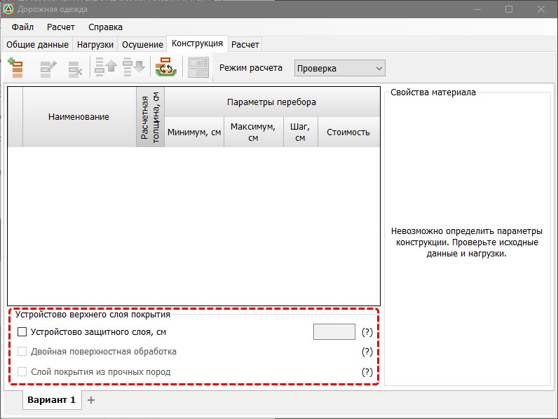

  **Проверка на колееобразование**

  Глубину колеи $h_k$ вычисляют по формуле:

  $$h_k=S+h_H$$

  где

  * $S$ — остаточная деформация слоев дорожной одежды и грунта земляного полотна;
  * $h_H$ — истирание материала верхнего слоя покрытия в полосе наката за срок службы дорожной одежды.

  Остаточную деформацию слоев дорожной одежды и грунта земляного полотна $S$ вычисляют по формуле:

  $$S=1,57PDK/E_{д.общ.}$$

  где:

  * $Р$ — удельное давление на покрытие от нормативной нагрузки, МПа;
  * $D$ — диаметр отпечатка неподвижного колеса расчетного автомобиля, м;
  * $K$ — коэффициент, отражающий агрессивность повторных нагрузок, вызывающих нарастание остаточных деформаций, определяемый по формуле (4);
  * $E_{д.общ.}$ - общий модуль деформации на поверхности покрытия, МПа.

  Истирание материала верхнего слоя покрытия в полосе наката hH вычисляют по формулe:

  $$h_H = k_ш\left(aT+\frac{b*N_{p0}*((K_И*q_1)^T-1)}{1000(K_И*q_1-1)}\right)$$

  где:

  * $k_ш$ — коэффициент, учитывающий эксплуатацию дорог автомобилями с шинами с металлическими шипами, равный 2—3 при нормативной осевой нагрузке 60 кН (для укрепленных грунтов и малопрочных каменных материалов $k_ш$ = 3; для прочных каменных материалов, при наличии поверхностной обработки $k_ш$ = 2); при нормативной осевой нагрузке 100 кН коэффициент $k_ш$ увеличивается на 25 %;
  * $a$ — коэффициент, зависящий в основном от погодоустойчивости покрытия и климатических условий;
  * $Т$ — межремонтный срок службы;
  * $b$ — коэффициент, зависящий от качества (в основном прочности) материала покрытия, степени его увлажнения, состава и скорости движения;

    Значения коэффициентов $a$ и $b$ приведены в таблице 7:

    #|
    || **Наименование покрытия** {.cell-align-center}| **Коэффициент** {.cell-align-center}|>|>||
    || ^ | **$a$, мм** {.cell-align-center}| **$b$, мм/млн брутто-тонн в зависимости от нормативной осевой нагрузки** {.cell-align-center}|>||
    || ^ | ^ | **60 кН** {.cell-align-center}| **100 кН** {.cell-align-center}||
    || **Щебеночное и гравийное, обработанное вязкими органическими вяжущими:** {.cell-align-center}|>|>|>||
    || двойной поверхностной обработкой | 1.3-2.7 {.cell-align-center}| 3.5-4.5 {.cell-align-center}| 4.5-5.5 {.cell-align-center}||
    || одиночной поверхностной обработкой | 1.4-2.8 {.cell-align-center}| 4.0-5.0 {.cell-align-center}| 5.0-6.0 {.cell-align-center}||
    || **Щебеночное:** {.cell-align-center}|>|>|>||
    || из прочных пород | 4.5-5.5 {.cell-align-center}| 15.0-17.5 {.cell-align-center}| 17.5-20.0 {.cell-align-center}||
    || из малопрочных пород | 5.5-6.5 {.cell-align-center}| 19.0-22.0 {.cell-align-center}| 22.0-25.0 {.cell-align-center}||
    || **Гравийное:** {.cell-align-center}|>|>|>||
    || из прочных пород | 3.0-4.0 {.cell-align-center}| 16.0-19.0 {.cell-align-center}| 19.0-22.0 {.cell-align-center}||
    || из малопрочных пород | 4.0-6.0 {.cell-align-center}| 20.0-25.0 {.cell-align-center}| 25.0-30.0 {.cell-align-center}||
    || Примечания:
    1. Средние значения $a$ и $b$ принимают для дорог, расположенных в зоне умеренного увлажнения (дорожно-климатическая зона III) и построенных из каменных материалов.
    2. Для дорог со щебеночными и гравийными покрытиями, расположенных в зоне избыточного увлажнения, принимают нижние пределы, а в районах с сухим климатом — верхние пределы $a$ и $b$.
    3. Если ширина проезжей части менее 6,0 м, то $b$ увеличивают на 15 %. |>|>|>||
    |# {.centered-content}

    

    1. Опции **Двойная поверхностная обработка** и **Слой покрытия из прочных пород** являются адаптивными, т.е. при наличии в конструкции соответствующего материала, будет доступен выбор только одной из опций, отвечающей за конкретный вид покрытия.
    2. Отключенные опции **Двойная поверхностная обработка** и **Слой покрытия из прочных пород** означают применение в конструкции **одиночной поверхностнvой обработки** и **слоев покрытия из малопрочных пород** соответственно.

    

  * $K_и$ — коэффициент, учитывающий изменение в составе транспортного потока (при увеличении в составе транспортного потока количества легковых автомобилей $K_и$ = 1,05, количества грузовых автомобилей $K_и$ = 1,07);

    

    В расчете коэффициент $K_и$ принимается на основании значения опции [В составе транспортного потока количество легковых автомобилей увеличено по сравнению с грузовыми](loads.md?tabs=loads_gost-71244-2024#71244-2024-passenger-car) на вкладке **Нагрузки**.

    

  * $q_1$ — показатель ежегодного роста интенсивности движения, составляющий более 1,0;
  * $N_{po}$ — интенсивность движения нормативной нагрузки $N_{p}$ на первый год эксплуатации дорожной одежды.

  **Проверка на износ** 

  Среднюю величину износа по всей площади покрытия $h_{ср}$, мм, вычисляют по формуле:

  $$h_{cp} = kh_н$$

  где:

  * $k$ — коэффициент неравномерности износа (при однополосной дороге следует принимать равным 0,7; при двухполосной — 0,6);
  * $h_н$ — истираемость материала в полосе наката, мм, вычисляемая по формуле (8).

  

  * Критерии **Износ** и **Колееобразование** не участвуют в процессе подбора конструкции;
  * На основании данных ежегодного изменения износа и колеи должны быть приняты решения по корректировке конструкции на этапе проектирования и/или мероприятия проводимые в процессе эксплуатации дорожной одежды.
  
  

  

- СП 37.13330.2012 {#sp-37-13330-2012}

  
  
  Данная вкладка предназначена для создания и редактирования конструктивных слоев дорожной одежды, а также для задания параметров рабочего слоя.

  В верхней части данного окна расположены пиктограммы позволяющие добавлять конструктивные слои, а также удалять их, изменять их параметры или местоположение относительно других слоев дорожной одежды:

  

  Расчет может содержать несколько [вариантов](../additionally/work_with_variants.md).

  {#37-13330-2012-redaktirovanie}

  **Добавление слоя** {#37-13330-2012-redaktirovanie-dobavlenie}

  Для добавления нового конструктивного слоя выполните следующие действия:

  1. Нажмите кнопку **Добавить слой**  Откроется следующие окно: 

      

      В окне выбора материала, в группе **Стандартные материалы** представлен перечень материалов с расчетными характеристиками, указанными в данной нормативной методике. В других группах также представлены материалы с привязкой к соответствующему нормативному документу.

      В группе **Дополнительные материалы** может быть представлен набор индивидуальных конструктивных слоев добавленных пользователем самостоятельно. Последовательность действий по созданию слоев с индивидуальными характеристиками будет описана далее, в разделе **Библиотека материалов**.

  2. Раскройте список с наименованием **Стандартные материалы** и выберите из него требуемый материал слоя, щелкнув по его наименованию дважды левой кнопкой мыши:

      

      В результате выбранный слой отобразится в поле **Наименование**:

       

      

      При выделенном слое в списке, все его расчетные характеристики отображаются в поле **Свойства материала**:

      

      При необходимости данные характеристики могут быть отредактированы пользователем. Последовательность действий по редактированию параметров стандартных материалов будет описана ниже в разделе **Свойства материала**.

      

  3. Выберите **Тип слоя** добавленного конструктивного материала;

  * Новый - используется для расчета новой конструкции.
  * Существующий - используется в расчете слоев усиления. Устанавливается у существующих слов конструкции.

    

    При наличии в конструкции слоев усиления, не зависимо от настройки задания значения существующего модуля упругости, расчет выполняется по критерию упругого прогиба, сдвига, статики и растяжение при изгибе. Расчет на морозоустойчивость и осушение не производится.

    

  * Выравнивающий - материал с данным типом в расчете не участвует. Но отображается в списке слоев и на чертеже.

  4. Задайте толщину добавленного конструктивного слоя в поле **Расчетная толщина**;

      

      Если поле **Расчетная толщина** не доступно для ввода данных, в списке с наименованием **Режим расчета** выставите режим **Проверка**:

       

      В данном случае станет не активна группа столбцов с наименованием Параметры перебора. Последовательность действий по подбору толщин конструктивных слоев дорожной одежды будет описана ниже в разделе [Режим расчета](#37-13330-2012-rezhim-rascheta).

      

  5. Используя аналогичную последовательность действий, добавьте остальные конструктивные слои дорожной одежды:

      

      

      Для грунта материала толщины, шаг перебора и условная стоимость должны быть равны нулю.

      

  **Изменение слоя** {#37-13330-2012-redaktirovanie-izmenenie}

  Для того чтобы изменить какой либо слой конструкции на другой, имеющийся в библиотеке материалов, выполните следующие действия:

  1. Выберите данный слой из общего списка слоев конструкции дорожной одежды и нажмите кнопку **Редактировать слой**. Откроется окно выбора материала: 

       

  2. Выберите из библиотеки другой конструктивный слой, который нужно назначить вместо текущего и нажмите **ОК**.

  После изменения слоя при необходимости измените значения его толщины и условной стоимости.

  **Удаление слоя** {#37-13330-2012-redaktirovanie-udalenie}

  Для удаления какого-либо слоя из конструкции дорожной одежды:

  Выберите данный слой из общего списка слоев и нажмите кнопку **Удалить слой** . В результате выбранный слой будет удален из дорожной конструкции.

  **Перемещение слоя** {#37-13330-2012-redaktirovanie-peremeshchenie}

  Если необходимо изменить положение какого-либо конструктивного слоя относительно других:

  1. Выберите данный слой из общего списка и нажмите кнопку **Переместить слой вниз** , либо **Переместить слой вверх** ;

  2. Выбранный слой будет перемещен на один уровень вверх, либо вниз. Для перемещения слоя еще на несколько уровней повторно воспользуйтесь данной функцией.

  

  {#37-13330-2012-rezhim-rascheta}

  В программе имеется возможность подбора оптимальной конструкции дорожной одежды по критерию минимальной стоимости. Для подбора конструкции дорожной одежды выполните следующие действия:

  1. Убедитесь, что на вкладке **Конструкция** в поле **Наименование** заданы все конструктивные слои дорожной одежды:

     

      

      До подбора конструкции не обязательно задавать значение толщин конструктивных слоев в поле **Расчетная толщина**.

      

  2. В выпадающем списке установите режим **Подбор**: 

     

      После установления данного режима станут активны для ввода столбцы группы **Параметры подбора**.

  3. В столбцах **Параметры подбора** задайте значения **Минимальной** и **Максимальной толщины** конструктивных слоев дорожной одежды, а также шаг перебора от минимума до максимума.

  * **Шаг перебора** задается индивидуально для каждого конструктивного слоя.

    

    Не рекомендуется задавать очень малый шаг перебора для слоев, у которых сильно отличается значение Минимальной и Максимально допустимой толщины, т.к. в этом случае будет рассчитываться очень большое количество вариантов, в результате чего процедура подбора может занять долгое время.

    

  * Если какой либо конструктивный слой не участвует в подборе, то значение его **Минимальной** и **Максимальной толщины** задается одинаковой.
  * Для грунта и геосинтетического материала толщины, шаг перебора и условная стоимость не задаются, т.к. они (грунт и геосетка) не участвуют в процедуре подбора конструкции.
  * Если конструкция будет подбираться по критерию минимальной приведенной стоимости, то для каждого конструктивного слоя, также должно быть задано значение его условной стоимости. Данное значение задается в столбце **Стоимость**, в рублях или других условных единицах, для слоя толщиной 1 см. на единицу площади покрытия.

  4. После задания всех необходимых параметров для подбора конструкции нажмите кнопку **Подобрать**, расположенную в верхней части окна:

     

      В открывшемся окне установите опции напротив критериев расчета, которые будут учитываться при подборе конструкции и нажмите **ОК**: 

      

      

      [Настройки расчета](..\road_tasks.md?tabs=road-tasks_gost-71404-2024) были описаны ранее в соответствующем разделе.

      

  5. В результате, начнется процесс подбора вариантов конструкции: 

     

  По окончании данного процесса откроется список вариантов конструкции прошедших процедуру подбора: 

  

  При подборе конструкции происходит расчет всех возможных вариантов толщин слоев, с учетом заданного шага перебора. Варианты не удовлетворяющие какому либо критерию прочности отбраковываются.

  Для сортировки всех отображаемых вариантов по какому-либо критерию, щелкните левой кнопкой мыши по наименованию соответствующего столбца. К примеру, если щелкнуть по столбцу **Стоимость**, то варианты конструкций будут сгруппированы в списке в порядке нарастания суммарной условной стоимости конструкции. Если же щелкнуть по столбцу с наименованием какого-то конструктивного слоя, то будет выполнена сортировка вариантов, в порядке нарастания его толщины.

  В результате, в качестве расчетных толщин будут приняты значения соответствующие выбранному (подобранному) варианту конструкции:

  

  

  {#37-13330-2012-raschet-vlazhnosti}

  По умолчанию для данного расчета влажность связного грунта рабочего слоя должна быть задана в явном виде в свойствах материала.

   Опционально предусмотрен расчет влажности для связных грунтов в соответствии с методикой **ГОСТ Р 71404-2024**, прил. В, формула В.1. Для этого должна быть активирована опция **Рассчитывать влажность грунта автоматически по ГОСТ Р 71404** в нижней части окна.

  

