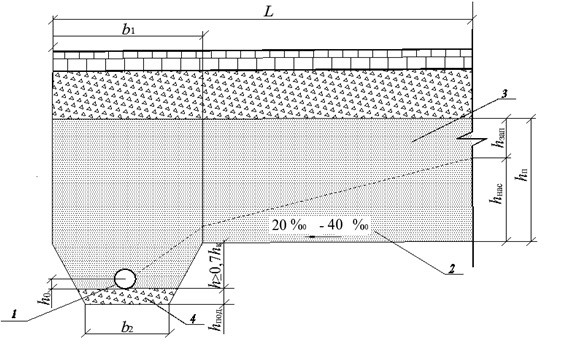

# Осушение



- ГОСТ Р 71404-2024 {#gost-71404-2024}

  

  На данной вкладке выбираются способы расчета по критерию Осушение. Также задаются характеристики, используемые для расчета требуемой толщины дренирующего слоя.

  {#71404-2024-raschet-metod}

  В зависимости от конкретных условий дренажная конструкция может быть рассчитана на один из вариантов работы (согласно **ГОСТ Р 71404-2024**, пункт 11.4 и 11.10):

  * Работа на осушение;
  * Работа на осушение по способу поглощения;
  * Работа на осушение в дренажом в ровике.

  Критерии расчета выбираются в поле **Способ расчета** установлением соответствующей опции.

  

  {#71404-2024-otmetka-nasypi}

  Используется при определении объема воды, поступающей в основание дорожной одежды за сутки (согласно **ГОСТ Р 71404-2024**,примечание к табл.13)

  #|
  || **Дорожно-климатическая зона** {.cell-align-center}| **Схема увлажнения рабочего слоя** {.cell-align-center}| **Объем воды, поступающей в основание дорожной одежды из грунта Q/q** {.cell-align-center}| > | > | > ||
  || ^ | ^ | **супеси легкой и песка пылеватого** {.cell-align-center}| **суглинка легкого и тяжелого и глины** {.cell-align-center}| **суглинка легкого пылеватого и тяжелого пылеватого** {.cell-align-center}| **супеси пылеватой и супеси тяжелой пылеватой** {.cell-align-center}||
  || II {.cell-align-center}| 1 {.cell-align-center}| 15/2,5 {.cell-align-center}| 20/2 {.cell-align-center}| 35/3 {.cell-align-center}| 80/3,5 {.cell-align-center}||
  || ^ | 2 {.cell-align-center}| 25/3 {.cell-align-center}| 50/3 {.cell-align-center}| 80/4 {.cell-align-center}| 130/4,5 {.cell-align-center}||
  || ^ | 3 {.cell-align-center}| 60/3,5 {.cell-align-center}| 90/4 {.cell-align-center}| 130/4,5 {.cell-align-center}| 180/5 {.cell-align-center}||
  || III {.cell-align-center}| 1 {.cell-align-center}| 10/1,5 {.cell-align-center}| 10/1,5 {.cell-align-center}| 15/2 {.cell-align-center}| 30/3 {.cell-align-center}||
  || ^ | 2 {.cell-align-center}| 15/2 {.cell-align-center}| 25/2 {.cell-align-center}| 30/2,5 {.cell-align-center}| 40/3 {.cell-align-center}||
  || ^ | 3 {.cell-align-center}| 25/2,5 {.cell-align-center}| 40/2,5 {.cell-align-center}| 50/3,5 {.cell-align-center}| 60/4 {.cell-align-center}||
  || IV и V {.cell-align-center}| 3 {.cell-align-center}| 20/2 {.cell-align-center}| 20/2 {.cell-align-center}| 30/2,5 {.cell-align-center}| 40/3 {.cell-align-center}||
  |#

  

  1. В числителе приведен объем воды Q (л/м^2^) покрытия, поступающей в основание дорожной одежды за весь расчетный период, в знаменателе q л/(м^2^·сут).
  2. Для насыпей, возведенных из непылеватых грунтов, высотой более требуемой (см. таблицу 9) в ДКЗ II принимают средний приток воды на 1 м^2^ проезжей части в сутки q, равный 1,5 л/(м^2^·сут).
  3. При наличии разделительной полосы для участков, проходящих в нулевых отметках, насыпей высотой менее требуемой (см. таблицу 9) в ДКЗ II, расчетные значения среднего притока воды на 1 м^2^ проезжей части в сутки q повышают на 20 %.

  

  

  {#71404-2024-uklon-niz}

  В данном поле задается значение поперечного уклона низа дренирующего слоя. Данная величина используются для расчета толщины дренирующего слоя (согласно **ГОСТ Р 71404-2024**, рис. 13, рис. 14).

  #|
  ||  {.cell-align-center}||
  || $i$ — поперечный уклон низа дренирующего слоя; $L$ — длина пути фильтрации; $q'$ — погонный приток воды; $К_ф$ — коэффициент фильтрации песка, м/сут. 
  
  **Номограмма для расчета толщины дренирующего слоя, полностью насыщенного водой, $h_{нас}$ из мелких песков, песков средней крупности и крупных песков с коэффициентом фильтрации менее 10 м/сут**||
  |#

  #|
  ||  {.cell-align-center}||
  || $i$ — поперечный уклон низа дренирующего слоя; $L$ — длина пути фильтрации; $q_{p}$ — расчетный объем притока воды, м^3^/м^2^ в сутки;
  $К_ф$ — коэффициент фильтрации песка, м/сут. 
  
  **Номограмма для расчета толщины дренирующего слоя, полностью насыщенного водой, $h_{нас}$ из крупных песков с коэффициентом фильтрации более 10 м/сут**||
  |#

  

  {#71404-2024-regulirovanie}

  Выбираются установлением соответствующих опций, в зависимости от конструктивных особенностей обочин или слоев основания дорожной одежды. Данные опции используются при определении коэффициента снижения притока воды в дренирующий слой ( согласно **ГОСТ Р 71404-2024**, табл. 15).

  Значения коэффициента $К_{p}$ учитывающего снижение притока воды в дренирующий слой.

  #|
  || **Мероприятие** {.cell-align-center}| **Схема увлажнения** {.cell-align-center}| **$К_{p}$ для грунта рабочего слоя** {.cell-align-center}| > | > ||
  || ^ | ^ | **легкой песчанистой супеси, очень тонкого песка** {.cell-align-center}| **легкого песчанистого суглинка** {.cell-align-center}| **тяжелого песчанистого суглинка, глины** {.cell-align-center}||
  || Укрепление обочин | 1 {.cell-align-center}| 0,70 {.cell-align-center}| 0,75 {.cell-align-center}| 0,80 {.cell-align-center}||
  || ^ | 2 и 3 {.cell-align-center}| 0,85 {.cell-align-center}| 0,95 {.cell-align-center}| 0,95 {.cell-align-center}||
  || Устройство монолитных слоев основания, укрепление верхней части рабочего слоя с содержанием воздушных пустот материала до 5 % | 1 {.cell-align-center}| 0,80 {.cell-align-center}| 0,80 {.cell-align-center}| 0,80 {.cell-align-center}||
  || ^ | 2 и 3 {.cell-align-center}| 0,90 {.cell-align-center}| 0,90 {.cell-align-center}| 0,90 {.cell-align-center}||
  || Устройство монолитных слоев основания, укрепление верхней части рабочего слоя с содержанием воздушных пустот материала от 5 % до 10 % | 1 {.cell-align-center}| 0,90 {.cell-align-center}| 0,90 {.cell-align-center}| 0,90 {.cell-align-center}||
  || ^ | 2 и 3 {.cell-align-center}| 0,95 {.cell-align-center}| 0,95 {.cell-align-center}| 0,95 {.cell-align-center}||
  |#

  

  1. При применении пылеватых грунтов коэффициент $К_{p}$ = 1,0.
  2. Если предусмотрено несколько мероприятий, то каждое из них учитывают в отдельности по формуле (26).

  

  

  {#71404-2024-uklon-prodolnyi}

  В данных полях могут задаваться значения продольных уклонов до перелома и после перелома продольного профиля. Продольные уклоны направленные вниз вводятся со знаком «+», а вверх со знаком «–». Данные величины используются для расчета коэффициента увеличения объема воды в дренирующем слое (согласно **ГОСТ Р 71404-2024**, рис. 11).

  #|
  ||  {.cell-align-center}||
  || $i_1$ и $i_2$ — продольные уклоны выше и ниже перелома продольного профиля; $К_ф$ — коэффициент фильтрации, м/сут; $n$ — пористость дренирующего слоя в долях единицы (значения уклонов принимаются по абсолютной величине). 
  
  **Номограмма для определения коэффициента $К_{вог}$, учитывающего накопление воды в местах изменения вогнутого профиля**||
  |#

  

  {#71404-2024-filtraciya}

  Значение коэффициента фильтрации устанавливают по данным испытаний применяемого песка из карьера в соответствии с ГОСТ 25584 или ПГС в соответствии с ГОСТ Р 71329.
  
  При этом дренирующий слой, работающий по принципу осушения, необходимо устраивать из песков и других пористых материалов с коэффициентом фильтрации не менее 2 м/сут, по принципу поглощения – не менее 1 м/сут.

  Используется для расчета параметров осушения (согласно **ГОСТ Р 71404-2024**, рис. 11, рис. 13, рис. 14).

  #|
  ||  {.cell-align-center}||
  || $i_1$ и $i_2$ — продольные уклоны выше и ниже перелома продольного профиля; $К_ф$ — коэффициент фильтрации, м/сут; $n$ — пористость дренирующего слоя в долях единицы (значения уклонов принимаются по абсолютной величине). 
  
  **Номограмма для определения коэффициента $К_{вог}$, учитывающего накопление воды в местах изменения вогнутого профиля**||
  |#

  #|
  ||  {.cell-align-center}||
  || $i$ — поперечный уклон низа дренирующего слоя; $L$ — длина пути фильтрации; $q'$ — погонный приток воды; $К_ф$ — коэффициент фильтрации песка, м/сут.
  
  **Номограмма для расчета толщины дренирующего слоя, полностью насыщенного водой, $h_{нас}$ из мелких песков, песков средней крупности и крупных песков с коэффициентом фильтрации менее 10 м/сут**||
  |#

  #|
  ||  {.cell-align-center}||
  || $i$ — поперечный уклон низа дренирующего слоя; $L$ — длина пути фильтрации; $q_{p}$ — расчетный объем притока воды, м^3^/м^2^ в сутки; $К_ф$ — коэффициент фильтрации песка, м/сут 
  
  **Номограмма для расчета толщины дренирующего слоя, полностью насыщенного водой, $h_{нас}$ из крупных песков с коэффициентом фильтрации более 10 м/сут**||
  |#
  
  

  {#71404-2024-zapazdyvanie}

  В данном поле задается средняя продолжительность задержки начала работы водоотводящих устройств. Для II дорожно-климатической зоны она принимается 4-6 сут, а для III дорожно-климатической зоны 3-4 сут. (большее значение - для мелких песков). Данные величины приняты согласно **ГОСТ Р 71404-2024**, п.11.6.

  

  {#71404-2024-poristost}

  Используется для расчета параметров осушения (согласно **ГОСТ Р 71404-2024**, рис. 11).
  
  #|
  ||  {.cell-align-center}||
  || $i_1$ и $i_2$ — продольные уклоны выше и ниже перелома продольного профиля; $К_ф$ — коэффициент фильтрации, м/сут; $n$ — пористость дренирующего слоя в долях единицы (значения уклонов принимаются по абсолютной величине). 
  
  **Номограмма для определения коэффициента $К_{вог}$, учитывающего накопление воды в местах изменения вогнутого профиля**||
  |#

  

  {#71404-2024-put-filtracii}

  Используется для расчета параметров осушения (согласно **ГОСТ Р 71404-2024**, рис. 13, рис. 14).
  
  #|
  ||  {.cell-align-center}||
  || $i$ — поперечный уклон низа дренирующего слоя; $L$ — длина пути фильтрации; $q'$ — погонный приток воды; $К_ф$ — коэффициент фильтрации песка, м/сут.
  
  **Номограмма для расчета толщины дренирующего слоя, полностью насыщенного водой, $h_{нас}$ из мелких песков, песков средней крупности и крупных песков с коэффициентом фильтрации менее 10 м/сут**||
  |#

  #|
  ||  {.cell-align-center}||
  || $i$ — поперечный уклон низа дренирующего слоя; $L$ — длина пути фильтрации; $q_{p}$ — расчетный объем притока воды, м^3^/м^2^ в сутки; $К_ф$ — коэффициент фильтрации песка, м/сут 
  
  **Номограмма для расчета толщины дренирующего слоя, полностью насыщенного водой, $h_{нас}$ из крупных песков с коэффициентом фильтрации более 10 м/сут**||
  |#

  

  {#71404-2024-poperechnik}

  Используется для расчета параметров осушения (согласно **ГОСТ Р 71404-2024**, рис. 13, рис. 14).
  
  #|
  ||  {.cell-align-center}||
  || $i$ — поперечный уклон низа дренирующего слоя; $L$ — длина пути фильтрации; $q'$ — погонный приток воды; $К_ф$ — коэффициент фильтрации песка, м/сут.
  
  **Номограмма для расчета толщины дренирующего слоя, полностью насыщенного водой, $h_{нас}$ из мелких песков, песков средней крупности и крупных песков с коэффициентом фильтрации менее 10 м/сут**||
  |#

  #|
  ||  {.cell-align-center}||
  || $i$ — поперечный уклон низа дренирующего слоя; $L$ — длина пути фильтрации; $q_{p}$ — расчетный объем притока воды, м^3^/м^2^ в сутки; $К_ф$ — коэффициент фильтрации песка, м/сут 
  
  **Номограмма для расчета толщины дренирующего слоя, полностью насыщенного водой, $h_{нас}$ из крупных песков с коэффициентом фильтрации более 10 м/сут**||
  |#

  

  {#71404-2024-razdelitelnaya-polosa}

  Включение данной опции учитывает прим.3, табл. 13, ГОСТ Р 71404-2024:

  * При наличии разделительной полосы для участков, проходящих в нулевых отметках, насыпей высотой менее требуемой (см. таблицу 9) в ДКЗ II, расчетные значения среднего притока воды на $1{м^2}$ проезжей части в сутки q повышают на 20%.

  

  {#71404-2024-metodika-osusheniya}

  При включенной опции расчет по принципу осушения в ровике ведется согласно методики Союздорнии от 1974, формула 14.

  $$K_ф=\frac{q_р Z^2}{\bigtriangleup H(h_{нас}+h_{зап}\beta_1)}$$

  * $Z$ - наибольшая длина пути фильтрации, м;
  * $q_p$ - расчетная величина притока воды в дренирующий слой, м^3^/м^2^/сутки;
  * $\bigtriangleup H$ - разность напоров, м;

  $$\bigtriangleup H = h_{нас}+(L^\prime - в_о)i+h-h_0$$

  * $i$ - поперечный уклон низа дренирующего слоя в долях единицы;
  * $L^\prime$ - расстояние от оси дороги до внешней бровки ровика, м;
  * $в_о$ - ширина ровика поверху, м;
  * $h_0$ - глубина фильтрационного потока в дренирующем слое непосредственно у продольной дрены;
    для песков средней крупности $h_0$ = 0,03 м;
    для мелких песков  $h_0$ = 0,05 м;
  * $h$ - глубина ровика;
  * $h_{нac}$ - глубина фильтрационного потока по оси проезжей части, м;
  * $h_{зап}$ - дополнительная толщина дренирующего слоя, м;
  * $\beta_1$ - коэффициент расхода воды в капиллярной зоне; для мелких песков = 0,3, а для песков средней крупности = 0,4.

  

  Если данная опция выключена, то расчет производится согласно номограммам **ГОСТ Р 71404-2024**.

  

  

  {#71404-2024-rovik}

  **Конструкция дренажа с ровиком**
  
  
  
  * 1 — дренажная труба;
  * 2 — зона движения свободной воды;
  * 3 — зона движения капиллярной воды,
  * 4 — щебеночная (песчаная) подготовка под дренажную трубу;
  * $h_к$ — высота капиллярного поднятия воды в материале дренирующего слоя
  
  

  

- ПНСТ 1006-2025 {#pnst-1006-2025}

  

  При расчете дорожной конструкции по принципу осушения предусмотрен [учет наличия геосинтетического материала](../additionally/geosynthetic.md#draining) укладываемого на земляное полотно, в соответствии с п. 7.7.7 и п. 7.7.10.

  Также задаются характеристики, используемые для расчета требуемой толщины дренирующего слоя.

  {#1006-2025-raschet-metod}

  В зависимости от конкретных условий дренажная конструкция может быть рассчитана на один из вариантов работы (согласно **ПНСТ 1006-2025**, пункт 7.7.4 и 7.7.9):

  * Работа на осушение;
  * Работа на осушение по способу поглощения;
  * Работа на осушение в дренажом в ровике.

  Критерии расчета выбираются в поле **Способ расчета** установлением соответствующей опции.

  

  {#1006-2025-otmetka-nasypi}

  Используется при определении объема воды, поступающей в основание дорожной одежды за сутки (согласно **ПНСТ 1006-2025**, примечание к табл.9)

  #|
  || **Дорожно-климатическая зона** {.cell-align-center}| **Схема увлажнения рабочего слоя** {.cell-align-center}| **Объем воды, поступающей в основание дорожной одежды из грунта Q/q** {.cell-align-center}|>|>|>||
  || ^ | ^ | легкой песчанистой супеси, очень тонкого и пылеватого песка с $К_ф$<0,5 {.cell-align-center}| легкого песчанистого и тяжелого песчанистого суглинка, глины {.cell-align-center}| легкого пылеватого и тяжелого пылеватого суглинка | пылеватой и тяжелой пылеватой супеси {.cell-align-center}||
  || II {.cell-align-center}| 1 {.cell-align-center}| 15/2,5 {.cell-align-center}| 20/2 {.cell-align-center}| 35/3 {.cell-align-center}| 80/3,5 {.cell-align-center}||
  || ^ | 2 {.cell-align-center}| 25/3 {.cell-align-center}| 50/3 {.cell-align-center}| 80/4 {.cell-align-center}| 130/4,5 {.cell-align-center}||
  || ^ | 3 {.cell-align-center}| 60/3,5 {.cell-align-center}| 90/4 {.cell-align-center}| 130/4,5 {.cell-align-center}| 180/5 {.cell-align-center}||
  || III {.cell-align-center}| 1 {.cell-align-center}| 10/1,5 {.cell-align-center}| 10/1,5 {.cell-align-center}| 15/2 {.cell-align-center}| 30/3 {.cell-align-center}||
  || ^ | 2 {.cell-align-center}| 15/2 {.cell-align-center}| 25/2 {.cell-align-center}| 30/2,5 {.cell-align-center}| 40/3 {.cell-align-center}||
  || ^ | 3 {.cell-align-center}| 25/2,5 {.cell-align-center}| 40/2,5 {.cell-align-center}| 50/3,5 {.cell-align-center}| 60/4 {.cell-align-center}||
  || IV и V {.cell-align-center}| 3 {.cell-align-center}| 20/2 {.cell-align-center}| 20/2 {.cell-align-center}| 30/2,5 {.cell-align-center}| 40/3 {.cell-align-center}||
  |#

  

  1. В числителе приведен объем воды Q (л/м^2^), поступающей в основание дорожной одежды за весь расчетный период, в знаменателе — средний приток воды за сутки g л/(м^2^•сут).
  2. Для насыпей, возведенных из не пылеватых грунтов, высотой более требуемой (см. таблицу 9 ГОСТ Р 71404—2024) в ДКЗ II принимают средний приток воды на 1 м^2^ проезжей части в сутки g, равный 1,5 л/(м^2^•сут).
  3. При наличии разделительной полосы для участков, проходящих в нулевых отметках, насыпей высотой менее требуемой (см. таблицу 9 ГОСТ Р 71404—2024) в ДКЗ II, расчетные значения среднего притока воды на 1 м^2^ проезжей части в сутки g повышают на 20 %.

  

  

  {#1006-2025-uklon-niz}

  В данном поле задается значение поперечного уклона низа дренирующего слоя. Данная величина используются для расчета толщины дренирующего слоя (согласно **ПНСТ 1006-2025**, рис. 16, рис. 17).

  #|
  ||  {.cell-align-center}||
  || $i$ — поперечный уклон низа дренирующего слоя; $L$ — длина пути фильтрации; $q'$ — погонный приток воды;  $К_ф$ — коэффициент фильтрации песка, м/сут. 
  
  **Номограмма для расчета толщины дренирующего слоя, полностью насыщенного водой, $h_{нас}$ из мелких песков, песков средней крупности и крупных песков с коэффициентом фильтрации менее 10 м/сут**||
  |#

  #|
  ||  {.cell-align-center}||
  || $i$ — поперечный уклон низа дренирующего слоя; $L$ — длина пути фильтрации; $q_p$ — расчетный объем притока воды, м^3^/м^2^ в сутки; $К_ф$ — коэффициент фильтрации песка, м/сут. 
  
  **Номограмма для расчета толщины дренирующего слоя, полностью насыщенного водой, $h_{нас}$ из крупных песков с коэффициентом фильтрации более 10 м/сут**||
  |#

  

  {#1006-2025-regulirovanie}

  Выбираются установлением соответствующих опций, в зависимости от конструктивных особенностей обочин или слоев основания дорожной одежды. Данные опции используются при определении коэффициента снижения притока воды в дренирующий слой ( согласно **ПНСТ 1006-2025**, табл. 11).

  Значения коэффициента $К_{p}$ учитывающего снижение притока воды в дренирующий слой.

  #|
  || **Мероприятие** {.cell-align-center}| **Схема увлажнения** {.cell-align-center}| **$К_{p}$ для грунта рабочего слоя** {.cell-align-center}|>|>||
  || ^ | ^ | легкой песчанистой супеси, очень тонкого песка {.cell-align-center}| легкого песчанистого суглинка {.cell-align-center}| тяжелого песчанистого суглинка, глины {.cell-align-center}||
  || Укрепление обочин | 1 {.cell-align-center}| 0,70 {.cell-align-center}| 0,75 {.cell-align-center}| 0,80 {.cell-align-center}||
  || ^ | 2 и 3 {.cell-align-center}| 0,85 {.cell-align-center}| 0,95 {.cell-align-center}| 0,95 {.cell-align-center}||
  || Устройство монолитных слоев основания, укрепление верхней части рабочего слоя с содержанием воздушных пустот материала до 5 % | 1 {.cell-align-center}| 0,80 {.cell-align-center}| 0,80 {.cell-align-center}| 0,80 {.cell-align-center}||
  || ^ | 2 и 3 {.cell-align-center}| 0,90 {.cell-align-center}| 0,90 {.cell-align-center}| 0,90 {.cell-align-center}||
  || Устройство монолитных слоев основания, укрепление верхней части рабочего слоя с содержанием воздушных пустот материала от 5 % до 10 % | 1 {.cell-align-center}| 0,90 {.cell-align-center}| 0,90 {.cell-align-center}| 0,90 {.cell-align-center}||
  || ^ | 2 и 3 {.cell-align-center}| 0,95 {.cell-align-center}| 0,95 {.cell-align-center}| 0,95 {.cell-align-center}||
  |#

  

  1. При применении пылеватых грунтов коэффициент $К_{p}$ = 1,0.
  2. Если предусмотрено несколько мероприятий, то каждое из них учитывают в отдельности по формуле (50).

  

  

  {#1006-2025-uklon-prodolnyi}

  В данных полях могут задаваться значения продольных уклонов до перелома и после перелома продольного профиля. Продольные уклоны направленные вниз вводятся со знаком «+», а вверх со знаком «–». Данные величины используются для расчета коэффициента увеличения объема воды в дренирующем слое (согласно **ПНСТ 1006-2025**, рис. 15).

  #|
  ||  {.cell-align-center}||
  || $i_1$ и $i_2$ — продольные уклоны выше и ниже перелома продольного профиля; $К_ф$ — коэффициент фильтрации, м/сут; $n$ — пористость дренирующего слоя в долях единицы (значения уклонов принимаются по абсолютной величине).
  
  **Номограмма для определения коэффициента $К_{вог}$, учитывающего накопление воды в местах изменения вогнутого профиля**||
  |#

  

  {#1006-2025-filtraciya}

  Значение коэффициента фильтрации устанавливают по данным испытаний применяемого песка из карьера в соответствии с ГОСТ 25584 или ПГС в соответствии с ГОСТ Р 71329.

  При этом дренирующий слой, работающий по принципу осушения, необходимо устраивать из песков и других пористых материалов с коэффициентом фильтрации не менее 2 м/сут, по принципу поглощения – не менее 1 м/сут.

  Используется для расчета параметров осушения (согласно **ПНСТ 1006-2025**, рис. 15, рис. 16, рис. 17).

  #|
  ||  {.cell-align-center}||
  || $i_1$ и $i_2$ — продольные уклоны выше и ниже перелома продольного профиля; $К_ф$ — коэффициент фильтрации, м/сут; $n$ — пористость дренирующего слоя в долях единицы (значения уклонов принимаются по абсолютной величине).
  
  **Номограмма для определения коэффициента $К_{вог}$, учитывающего накопление воды в местах изменения вогнутого профиля**||
  |#

  #|
  ||  {.cell-align-center}||
  || $i$ — поперечный уклон низа дренирующего слоя; $L$ — длина пути фильтрации; $q'$ — погонный приток воды; $К_ф$ — коэффициент фильтрации песка, м/сут. 

  **Номограмма для расчета толщины дренирующего слоя, полностью насыщенного водой, $h_{нас}$ из мелких песков, песков средней крупности и крупных песков с коэффициентом фильтрации менее 10 м/сут**||
  |#

  #|
  ||  {.cell-align-center}||
  || $i$ — поперечный уклон низа дренирующего слоя; $L$ — длина пути фильтрации; $q_p$ — расчетный объем притока воды, м^3^/м^2^ в сутки; $К_ф$ — коэффициент фильтрации песка, м/сут. 

  **Номограмма для расчета толщины дренирующего слоя, полностью насыщенного водой, $h_{нас}$ из крупных песков с коэффициентом фильтрации более 10 м/сут**||
  |#

  

  {#1006-2025-zapazdyvanie}

  В данном поле задается средняя продолжительность задержки начала работы водоотводящих устройств. Для II дорожно-климатической зоны она принимается 4-6 сут, а для III дорожно-климатической зоны 3-4 сут. (большее значение - для мелких песков). Данные величины приняты согласно **ПНСТ 1006-2025**, п.7.7.6.

  

  {#1006-2025-poristost}

  Используется для расчета параметров осушения (согласно **ПНСТ 1006-2025**, рис. 15).

  #|
  ||  {.cell-align-center}||
  || $i_1$ и $i_2$ — продольные уклоны выше и ниже перелома продольного профиля; $К_ф$ — коэффициент фильтрации, м/сут; $n$ — пористость дренирующего слоя в долях единицы (значения уклонов принимаются по абсолютной величине). 
  
  **Номограмма для определения коэффициента $К_{вог}$, учитывающего накопление воды в местах изменения вогнутого профиля**||
  |#

  

  {#1006-2025-put-filtracii}

  Определяют по формуле:

  $$L=B/2+c+\sigma$$

  где:

  * $В$ — ширина проезжей части;
  * $с$ — ширина обочины;
  * $\sigma$ — средняя длина участка дренирующего слоя, расположенная в откосной части земляного полотна, равная сумме толщины дорожной одежды и половине толщины дренирующего слоя, умноженной на заложение откоса.

  Используется для расчета параметров осушения (согласно **ПНСТ 1006-2025**, рис. 16, рис. 17).

  #|
  ||  {.cell-align-center}||
  || $i$ — поперечный уклон низа дренирующего слоя; $L$ — длина пути фильтрации; $q'$ — погонный приток воды; $К_ф$ — коэффициент фильтрации песка, м/сут.

  **Номограмма для расчета толщины дренирующего слоя, полностью насыщенного водой, $h_{нас}$ из мелких песков, песков средней крупности и крупных песков с коэффициентом фильтрации менее 10 м/сут**||
  |#

  #|
  ||   {.cell-align-center}||
  || $i$ — поперечный уклон низа дренирующего слоя; $L$ — длина пути фильтрации; $q_p$ — расчетный объем притока воды, м^3^/м^2^ в сутки; $К_ф$ — коэффициент фильтрации песка, м/сут. 
  
  **Номограмма для расчета толщины дренирующего слоя, полностью насыщенного водой, $h_{нас}$ из крупных песков с коэффициентом фильтрации более 10 м/сут**||
  |#

  

  {#1006-2025-poperechnik}

  Используется для расчета параметров осушения (согласно **ПНСТ 1006-2025**, рис. 16, рис. 17). Влияет на расчет погонного притока воды за сутки.

  #|
  ||  {.cell-align-center}||
  || $i$ — поперечный уклон низа дренирующего слоя; $L$ — длина пути фильтрации; $q'$ — погонный приток воды; $К_ф$ — коэффициент фильтрации песка, м/сут. 

  **Номограмма для расчета толщины дренирующего слоя, полностью насыщенного водой, $h_{нас}$ из мелких песков, песков средней крупности и крупных песков с коэффициентом фильтрации менее 10 м/сут**||
  |#

  #|
  ||  ||
  || $i$ — поперечный уклон низа дренирующего слоя; $L$ — длина пути фильтрации; $q_p$ — расчетный объем притока воды, м^3^/м^2^ в сутки; $К_ф$ — коэффициент фильтрации песка, м/сут. 
  
  **Номограмма для расчета толщины дренирующего слоя, полностью насыщенного водой, $h_{нас}$ из крупных песков с коэффициентом фильтрации более 10 м/сут**||
  |#

  

  {#1006-2025-razdelitelnaya-polosa}

  Включение данной опции учитывает прим.3, табл. 9, ПНСТ 1006-2025:

  * При наличии разделительной полосы для участков, проходящих в нулевых отметках, насыпей высотой менее требуемой (см. таблицу 9 ГОСТ Р 71404-224) в ДКЗ II, расчетные значения среднего притока воды на $1 {м^2}$ проезжей части в сутки q повышают на 20%.

  

  {#1006-2025-metodika-osusheniya}

  При включенной опции расчет по принципу осушения в ровике ведется согласно методики Союздорнии от 1974, формула 14.

  $$K_ф=\frac{q_р Z^2}{\bigtriangleup H(h_{нас}+h_{зап}\beta_1)}$$

  * $Z$ - наибольшая длина пути фильтрации, м;
  * $q_p$ - расчетная величина притока воды в дренирующий слой, м^3^/м^2^/сутки;
  * $\bigtriangleup H$ - разность напоров, м;

  $$\bigtriangleup H = h_{нас}+(L^\prime - в_о)i+h-h_0$$

  * $i$ - поперечный уклон низа дренирующего слоя в долях единицы;
  * $L^\prime$ - расстояние от оси дороги до внешней бровки ровика, м;
  * $в_о$ - ширина ровика поверху, м;
  * $h_0$ - глубина фильтрационного потока в дренирующем слое непосредственно у продольной дрены; для песков средней крупности $h_0$ = 0,03 м, для мелких песков $h_0$ = 0,05 м;
  * $h$ - глубина ровика.
  * $h_{нac}$ - глубина фильтрационного потока по оси проезжей части, м;
  * $h_{зап}$ - дополнительная толщина дренирующего слоя, м;
  * $\beta_1$ - коэффициент расхода воды в капиллярной зоне; для мелких песков = 0,3, а для песков средней крупности = 0,4;

  

  Если данная опция выключена, то расчет производится согласно номограммам **ГОСТ Р 71404-2024**.

  

  

  {#1006-2025-rovik}

  **Конструкция дренажа с ровиком**
  
  
  
  * 1 — дренажная труба;
  * 2 — зона движения свободной воды;
  * 3 — зона движения капиллярной воды,
  * 4 — щебеночная (песчаная) подготовка под дренажную трубу;
  * $h_к$ — высота капиллярного поднятия воды в материале дренирующего слоя
  
    

  

- ГОСТ Р 71244-2024 {#gost-71244-2024}

  

  На данной вкладке выбираются способы расчета по критерию Осушение. Также задаются характеристики, используемые для расчета требуемой толщины дренирующего слоя.

  {#71244-2024-raschet-metod}

  Расчет производим согласно ОДМ 218.2.055—2015.

  В зависимости от конкретных условий дренажная конструкция может быть рассчитана на один из вариантов работы:

  * Работа на осушение;
  * Работа на осушение по способу поглощения;
  * Работа на осушение в дренажом в ровике.

  Критерии расчета выбираются в поле **Способ расчета** установлением соответствующей опции.

  

  {#71244-2024-otmetka-nasypi}

  Используется при определении объема воды, поступающей в основание дорожной одежды за сутки (согласно **ГОСТ Р 71404-2024**,примечание к табл.13).

  #|
  || **Дорожно-климатическая зона** {.cell-align-center}| **Схема увлажнения рабочего слоя** {.cell-align-center}| **Объем воды, поступающей в основание дорожной одежды из грунта Q/q** {.cell-align-center}|>|>|>||
  || ^ | ^ | супеси легкой и песка пылеватого | суглинка легкого и тяжелого и глины {.cell-align-center}| суглинка легкого пылеватого и тяжелого пылеватого {.cell-align-center}| супеси пылеватой и супеси тяжелой пылеватой {.cell-align-center}||
  || II {.cell-align-center}| 1 {.cell-align-center}| 15/2,5 {.cell-align-center}| 20/2 {.cell-align-center}| 35/3 {.cell-align-center}| 80/3,5 {.cell-align-center}||
  || ^ | 2 {.cell-align-center}| 25/3 {.cell-align-center}| 50/3 {.cell-align-center}| 80/4 {.cell-align-center}| 130/4,5 {.cell-align-center}||
  || ^ | 3 {.cell-align-center}| 60/3,5 {.cell-align-center}| 90/4 {.cell-align-center}| 130/4,5 {.cell-align-center}| 180/5 {.cell-align-center}||
  || III {.cell-align-center}| 1 {.cell-align-center}| 10/1,5 {.cell-align-center}| 10/1,5 {.cell-align-center}| 15/2 {.cell-align-center}| 30/3 {.cell-align-center}||
  || ^ | 2 {.cell-align-center}| 15/2 {.cell-align-center}| 25/2 {.cell-align-center}| 30/2,5 {.cell-align-center}| 40/3 {.cell-align-center}||
  || ^ | 3 {.cell-align-center}| 25/2,5 {.cell-align-center}| 40/2,5 {.cell-align-center}| 50/3,5 {.cell-align-center}| 60/4 {.cell-align-center}||
  || IV и V {.cell-align-center}| 3 {.cell-align-center}| 20/2 {.cell-align-center}| 20/2 {.cell-align-center}| 30/2,5 {.cell-align-center}| 40/3 {.cell-align-center}||
  |#

  

  1. В числителе приведен объем воды Q (л/м^2^) покрытия, поступающей в основание дорожной одежды за весь расчетный период, в знаменателе q л/(м^2^·сут).
  2. Для насыпей, возведенных из непылеватых грунтов, высотой более требуемой (см. таблицу 9) в ДКЗ II принимают средний приток воды на 1 м^2^ проезжей части в сутки q, равный 1,5 л/(м^2^·сут).
  3. При наличии разделительной полосы для участков, проходящих в нулевых отметках, насыпей высотой менее требуемой (см. таблицу 9) в ДКЗ II, расчетные значения среднего притока воды на 1 м^2^ проезжей части в сутки q повышают на 20 %.

  

  

  {#71244-2024-uklon-niz}

  В данном поле задается значение поперечного уклона низа дренирующего слоя. Данная величина используются для расчета толщины дренирующего слоя (согласно **ГОСТ Р 71404-2024**, рис. 13, рис. 14).

  #|
  ||  {.cell-align-center}||
  || $i$ — поперечный уклон низа дренирующего слоя; $L$ — длина пути фильтрации; $q'$ — погонный приток воды; $К_ф$ — коэффициент фильтрации песка, м/сут.
  
  **Номограмма для расчета толщины дренирующего слоя, полностью насыщенного водой, $h_{нас}$ из мелких песков, песков средней крупности и крупных песков с коэффициентом фильтрации менее 10 м/сут**||
  |#

  #|
  ||  {.cell-align-center}||
  || $i$ — поперечный уклон низа дренирующего слоя; $L$ — длина пути фильтрации; $q_p$ — расчетный объем притока воды, м^3^/м^2^ в сутки; $К_ф$ — коэффициент фильтрации песка, м/сут.
  
  **Номограмма для расчета толщины дренирующего слоя, полностью насыщенного водой, $h_{нас}$ из крупных песков с коэффициентом фильтрации более 10 м/сут**||
  |#

  

  {#71244-2024-regulirovanie}

  Выбираются установлением соответствующих опций, в зависимости от конструктивных особенностей обочин или слоев основания дорожной одежды. Данные опции используются при определении коэффициента снижения притока воды в дренирующий слой ( согласно **ГОСТ Р 71404-2024**, табл. 15).

  Значения коэффициента $К_{p}$ учитывающего снижение притока воды в дренирующий слой.

  #|
  || **Мероприятие** {.cell-align-center}| **Схема увлажнения** {.cell-align-center}| **$К_{p}$ для грунта рабочего слоя** {.cell-align-center}|>|>||
  || ^ | ^ | легкой песчанистой супеси, очень тонкого песка {.cell-align-center}| легкого песчанистого суглинка {.cell-align-center}| тяжелого песчанистого суглинка, глины {.cell-align-center}||
  || Укрепление обочин | 1 {.cell-align-center}| 0,70 {.cell-align-center}| 0,75 {.cell-align-center}| 0,80 {.cell-align-center}||
  || ^ | 2 и 3 {.cell-align-center}| 0,85 {.cell-align-center}| 0,95 {.cell-align-center}| 0,95 {.cell-align-center}||
  || Устройство монолитных слоев основания, укрепление верхней части рабочего слоя с содержанием воздушных пустот материала до 5 % | 1 {.cell-align-center}| 0,80 {.cell-align-center}| 0,80 {.cell-align-center}| 0,80 {.cell-align-center}||
  || ^ | 2 и 3 {.cell-align-center}| 0,90 {.cell-align-center}| 0,90 {.cell-align-center}| 0,90 {.cell-align-center}||
  || Устройство монолитных слоев основания, укрепление верхней части рабочего слоя с содержанием воздушных пустот материала от 5 % до 10 % | 1 {.cell-align-center}| 0,90 {.cell-align-center}| 0,90 {.cell-align-center}| 0,90 {.cell-align-center}||
  || ^ | 2 и 3 {.cell-align-center}| 0,95 {.cell-align-center}| 0,95 {.cell-align-center}| 0,95 {.cell-align-center}||
  |#

  

  1. При применении пылеватых грунтов коэффициент $К_{p}$ = 1,0.
  2. Если предусмотрено несколько мероприятий, то каждое из них учитывают в отдельности по формуле (26).

  

  

  {#71244-2024-uklon-prodolnyi}

  В данных полях могут задаваться значения продольных уклонов до перелома и после перелома продольного профиля. Продольные уклоны направленные вниз вводятся со знаком «+», а вверх со знаком «–». Данные величины используются для расчета коэффициента увеличения объема воды в дренирующем слое (согласно **ГОСТ Р 71404-2024**, рис. 11).

  #|
  ||  {.cell-align-center}||
  || $i_1$ и $i_2$ — продольные уклоны выше и ниже перелома продольного профиля; $К_ф$ — коэффициент фильтрации, м/сут; $n$ — пористость дренирующего слоя в долях единицы (значения уклонов принимаются по абсолютной величине).
  
  **Номограмма для определения коэффициента $К_{вог}$, учитывающего накопление воды в местах изменения вогнутого профиля**||
  |#

  

  {#71244-2024-filtraciya}

  Значение коэффициента фильтрации устанавливают по данным испытаний применяемого песка из карьера в соответствии с ГОСТ 25584 или ПГС в соответствии с ГОСТ Р 71329.

  При этом дренирующий слой, работающий по принципу осушения, необходимо устраивать из песков и других пористых материалов с коэффициентом фильтрации не менее 2 м/сут, по принципу поглощения – не менее 1 м/сут.

  Используется для расчета параметров осушения (согласно **ГОСТ Р 71404-2024**, рис. 11, рис. 13, рис. 14).

  #|
  ||  {.cell-align-center}||
  || $i_1$ и $i_2$ — продольные уклоны выше и ниже перелома продольного профиля; 
  $К_ф$ — коэффициент фильтрации, м/сут; $n$ — пористость дренирующего слоя в долях единицы (значения уклонов принимаются по абсолютной величине).
  
  **Номограмма для определения коэффициента $К_{вог}$, учитывающего накопление воды в местах изменения вогнутого профиля**||
  |#

  **Номограмма для определения коэффициента $К_{вог}$, учитывающего накопление воды в местах изменения вогнутого профиля**

  #|
  ||  {.cell-align-center}||
  || $i$ — поперечный уклон низа дренирующего слоя; $L$ — длина пути фильтрации; $q'$ — погонный приток воды; $К_ф$ — коэффициент фильтрации песка, м/сут.

  **Номограмма для расчета толщины дренирующего слоя, полностью насыщенного водой, $h_{нас}$ из мелких песков, песков средней крупности и крупных песков с коэффициентом фильтрации менее 10 м/сут**||
  |#

  #|
  ||  {.cell-align-center}||
  || $i$ — поперечный уклон низа дренирующего слоя; $L$ — длина пути фильтрации; $q_p$ — расчетный объем притока воды, м^3^/м^2^ в сутки; $К_ф$ — коэффициент фильтрации песка, м/сут.
  
  **Номограмма для расчета толщины дренирующего слоя, полностью насыщенного водой, $h_{нас}$ из крупных песков с коэффициентом фильтрации более 10 м/сут**||
  |#

  

  {#71244-2024-zapazdyvanie}

  В данном поле задается средняя продолжительность задержки начала работы водоотводящих устройств. Для II дорожно-климатической зоны она принимается 4-6 сут, а для III дорожно-климатической зоны 3-4 сут. (большее значение - для мелких песков). Данные величины приняты согласно **ГОСТ Р 71404-2024**, п.11.6.

  

  {#71244-2024-poristost}

  Используется для расчета параметров осушения (согласно **ГОСТ Р 71404-2024**, рис. 11).

  #|
  ||  {.cell-align-center}||
  || $i_1$ и $i_2$ — продольные уклоны выше и ниже перелома продольного профиля; $К_ф$ — коэффициент фильтрации, м/сут; $n$ — пористость дренирующего слоя в долях единицы (значения уклонов принимаются по абсолютной величине).
  
  **Номограмма для определения коэффициента $К_{вог}$, учитывающего накопление воды в местах изменения вогнутого профиля**||
  |#

  

  {#71244-2024-put-filtracii}

  Используется для расчета параметров осушения (согласно **ГОСТ Р 71404-2024**, рис. 13, рис. 14).

  #|
  ||  {.cell-align-center}||
  || $i$ — поперечный уклон низа дренирующего слоя; $L$ — длина пути фильтрации; $q'$ — погонный приток воды;
  $К_ф$ — коэффициент фильтрации песка, м/сут.
  
  **Номограмма для расчета толщины дренирующего слоя, полностью насыщенного водой, $h_{нас}$ из мелких песков, песков средней крупности и крупных песков с коэффициентом фильтрации менее 10 м/сут**||
  |#

  #|
  ||  {.cell-align-center}||
  || $i$ — поперечный уклон низа дренирующего слоя; $L$ — длина пути фильтрации; $q_p$ — расчетный объем притока воды, м^3^/м^2^ в сутки; $К_ф$ — коэффициент фильтрации песка, м/сут.
  
  **Номограмма для расчета толщины дренирующего слоя, полностью насыщенного водой, $h_{нас}$ из крупных песков с коэффициентом фильтрации более 10 м/сут**||
  |#

  

  {#71244-2024-poperechnik}

  Используется для расчета параметров осушения (согласно **ГОСТ Р 71404-2024**, рис. 13, рис. 14).

  #|
  ||  {.cell-align-center}||
  || $i$ — поперечный уклон низа дренирующего слоя; $L$ — длина пути фильтрации; $q'$ — погонный приток воды; $К_ф$ — коэффициент фильтрации песка, м/сут.
  
  **Номограмма для расчета толщины дренирующего слоя, полностью насыщенного водой, $h_{нас}$ из мелких песков, песков средней крупности и крупных песков с коэффициентом фильтрации менее 10 м/сут**||
  |#
  
  #|
  ||  {.cell-align-center}||
  || $i$ — поперечный уклон низа дренирующего слоя; $L$ — длина пути фильтрации; $q_p$ — расчетный объем притока воды, м^3^/м^2^ в сутки; $К_ф$ — коэффициент фильтрации песка, м/сут
  
  **Номограмма для расчета толщины дренирующего слоя, полностью насыщенного водой, $h_{нас}$ из крупных песков с коэффициентом фильтрации более 10 м/сут**||
  |#

  

  {#71244-2024-razdelitelnaya-polosa}

  Включение данной опции учитывает прим.3, табл. 13, ГОСТ Р 71404-2024:

  * При наличии разделительной полосы для участков, проходящих в нулевых отметках, насыпей высотой менее требуемой (см. таблицу 9) в ДКЗ II, расчетные значения среднего притока воды на $1{м^2}$ проезжей части в сутки q повышают на 20%.

  

  {#71244-2024-metodika-osusheniya}

  При включенной опции расчет по принципу осушения в ровике ведется согласно методики Союздорнии от 1974, формула 14.

  $$K_ф=\frac{q_р Z^2}{\bigtriangleup H(h_{нас}+h_{зап}\beta_1)}$$

  * $Z$ - наибольшая длина пути фильтрации, м;
  * $q_p$ - расчетная величина притока воды в дренирующий слой, м^3^/м^2^/сутки;
  * $\bigtriangleup H$ - разность напоров, м;

  $$\bigtriangleup H = h_{нас}+(L^\prime - в_о)i+h-h_0$$

  * $i$ - поперечный уклон низа дренирующего слоя в долях единицы;
  * $L^\prime$ - расстояние от оси дороги до внешней бровки ровика, м;
  * $в_о$ - ширина ровика поверху, м;
  * $h_0$ - глубина фильтрационного потока в дренирующем слое непосредственно у продольной дрены; для песков средней крупности $h_0$ = 0,03 м, для мелких песков $h_0$ = 0,05 м;
  * $h$ - глубина ровика.
  * $h_{нac}$ - глубина фильтрационного потока по оси проезжей части, м;
  * $h_{зап}$ - дополнительная толщина дренирующего слоя, м;
  * $\beta_1$ - коэффициент расхода воды в капиллярной зоне; для мелких песков = 0,3, а для песков средней крупности = 0,4;

  

  Если данная опция выключена, то расчет производится согласно номограммам **ГОСТ Р 71404-2024**.

  

  

  {#71244-2024-rovik}

  **Конструкция дренажа с ровиком**
  
  
  
  * 1 — дренажная труба;
  * 2 — зона движения свободной воды;
  * 3 — зона движения капиллярной воды,
  * 4 — щебеночная (песчаная) подготовка под дренажную трубу;
  * $h_к$ — высота капиллярного поднятия воды в материале дренирующего слоя
  
  

  

- СП 37.13330.2012 {#sp-37-13330-2012}

  

  На данной вкладке выбираются способы расчета по критерию Осушение. Также задаются характеристики, используемые для расчета требуемой толщины дренирующего слоя.

  {#37-13330-2012-raschet-metod}

  В зависимости от конкретных условий дренажная конструкция может быть рассчитана на один из вариантов работы (согласно **ГОСТ Р 71404-2024**, пункт 11.4 и 11.10):

  * Работа на осушение;
  * Работа на осушение по способу поглощения;
  * Работа на осушение в дренажом в ровике.

  Критерии расчета выбираются в поле **Способ расчета** установлением соответствующей опции.

  

  {#37-13330-2012-otmetka-nasypi}

  Используется при определении объема воды, поступающей в основание дорожной одежды за сутки (согласно **ГОСТ Р 71404-2024**,примечание к табл.13)

  #|
  || **Дорожно-климатическая зона** {.cell-align-center}| **Схема увлажнения рабочего слоя** {.cell-align-center}| **Объем воды, поступающей в основание дорожной одежды из грунта Q/q** {.cell-align-center}| > | > | > ||
  || ^ | ^ | **супеси легкой и песка пылеватого** {.cell-align-center}| **суглинка легкого и тяжелого и глины** {.cell-align-center}| **суглинка легкого пылеватого и тяжелого пылеватого** {.cell-align-center}| **супеси пылеватой и супеси тяжелой пылеватой** {.cell-align-center}||
  || II {.cell-align-center}| 1 {.cell-align-center}| 15/2,5 {.cell-align-center}| 20/2 {.cell-align-center}| 35/3 {.cell-align-center}| 80/3,5 {.cell-align-center}||
  || ^ | 2 {.cell-align-center}| 25/3 {.cell-align-center}| 50/3 {.cell-align-center}| 80/4 {.cell-align-center}| 130/4,5 {.cell-align-center}||
  || ^ | 3 {.cell-align-center}| 60/3,5 {.cell-align-center}| 90/4 {.cell-align-center}| 130/4,5 {.cell-align-center}| 180/5 {.cell-align-center}||
  || III {.cell-align-center}| 1 {.cell-align-center}| 10/1,5 {.cell-align-center}| 10/1,5 {.cell-align-center}| 15/2 {.cell-align-center}| 30/3 {.cell-align-center}||
  || ^ | 2 {.cell-align-center}| 15/2 {.cell-align-center}| 25/2 {.cell-align-center}| 30/2,5 {.cell-align-center}| 40/3 {.cell-align-center}||
  || ^ | 3 {.cell-align-center}| 25/2,5 {.cell-align-center}| 40/2,5 {.cell-align-center}| 50/3,5 {.cell-align-center}| 60/4 {.cell-align-center}||
  || IV и V {.cell-align-center}| 3 {.cell-align-center}| 20/2 {.cell-align-center}| 20/2 {.cell-align-center}| 30/2,5 {.cell-align-center}| 40/3 {.cell-align-center}||
  |#

  

  1. В числителе приведен объем воды Q (л/м^2^) покрытия, поступающей в основание дорожной одежды за весь расчетный период, в знаменателе q л/(м^2^·сут).
  2. Для насыпей, возведенных из непылеватых грунтов, высотой более требуемой (см. таблицу 9) в ДКЗ II принимают средний приток воды на 1 м^2^ проезжей части в сутки q, равный 1,5 л/(м^2^·сут).
  3. При наличии разделительной полосы для участков, проходящих в нулевых отметках, насыпей высотой менее требуемой (см. таблицу 9) в ДКЗ II, расчетные значения среднего притока воды на 1 м^2^ проезжей части в сутки q повышают на 20 %.

  

  

  {#37-13330-2012-uklon-niz}

  В данном поле задается значение поперечного уклона низа дренирующего слоя. Данная величина используются для расчета толщины дренирующего слоя (согласно **ГОСТ Р 71404-2024**, рис. 13, рис. 14).

  #|
  ||  {.cell-align-center}||
  || $i$ — поперечный уклон низа дренирующего слоя; $L$ — длина пути фильтрации; $q'$ — погонный приток воды; $К_ф$ — коэффициент фильтрации песка, м/сут. 
  
  **Номограмма для расчета толщины дренирующего слоя, полностью насыщенного водой, $h_{нас}$ из мелких песков, песков средней крупности и крупных песков с коэффициентом фильтрации менее 10 м/сут**||
  |#

  #|
  ||  {.cell-align-center}||
  || $i$ — поперечный уклон низа дренирующего слоя; $L$ — длина пути фильтрации; $q_{p}$ — расчетный объем притока воды, м^3^/м^2^ в сутки;
  $К_ф$ — коэффициент фильтрации песка, м/сут. 
  
  **Номограмма для расчета толщины дренирующего слоя, полностью насыщенного водой, $h_{нас}$ из крупных песков с коэффициентом фильтрации более 10 м/сут**||
  |#

  

  {#37-13330-2012-regulirovanie}

  Выбираются установлением соответствующих опций, в зависимости от конструктивных особенностей обочин или слоев основания дорожной одежды. Данные опции используются при определении коэффициента снижения притока воды в дренирующий слой ( согласно **ГОСТ Р 71404-2024**, табл. 15).

  Значения коэффициента $К_{p}$ учитывающего снижение притока воды в дренирующий слой.

  #|
  || **Мероприятие** {.cell-align-center}| **Схема увлажнения** {.cell-align-center}| **$К_{p}$ для грунта рабочего слоя** {.cell-align-center}| > | > ||
  || ^ | ^ | **легкой песчанистой супеси, очень тонкого песка** {.cell-align-center}| **легкого песчанистого суглинка** {.cell-align-center}| **тяжелого песчанистого суглинка, глины** {.cell-align-center}||
  || Укрепление обочин | 1 {.cell-align-center}| 0,70 {.cell-align-center}| 0,75 {.cell-align-center}| 0,80 {.cell-align-center}||
  || ^ | 2 и 3 {.cell-align-center}| 0,85 {.cell-align-center}| 0,95 {.cell-align-center}| 0,95 {.cell-align-center}||
  || Устройство монолитных слоев основания, укрепление верхней части рабочего слоя с содержанием воздушных пустот материала до 5 % | 1 {.cell-align-center}| 0,80 {.cell-align-center}| 0,80 {.cell-align-center}| 0,80 {.cell-align-center}||
  || ^ | 2 и 3 {.cell-align-center}| 0,90 {.cell-align-center}| 0,90 {.cell-align-center}| 0,90 {.cell-align-center}||
  || Устройство монолитных слоев основания, укрепление верхней части рабочего слоя с содержанием воздушных пустот материала от 5 % до 10 % | 1 {.cell-align-center}| 0,90 {.cell-align-center}| 0,90 {.cell-align-center}| 0,90 {.cell-align-center}||
  || ^ | 2 и 3 {.cell-align-center}| 0,95 {.cell-align-center}| 0,95 {.cell-align-center}| 0,95 {.cell-align-center}||
  |#

  

  1. При применении пылеватых грунтов коэффициент $К_{p}$ = 1,0.
  2. Если предусмотрено несколько мероприятий, то каждое из них учитывают в отдельности по формуле (26).

  

  

  {#37-13330-2012-uklon-prodolnyi}

  В данных полях могут задаваться значения продольных уклонов до перелома и после перелома продольного профиля. Продольные уклоны направленные вниз вводятся со знаком «+», а вверх со знаком «–». Данные величины используются для расчета коэффициента увеличения объема воды в дренирующем слое (согласно **ГОСТ Р 71404-2024**, рис. 11).

  #|
  ||  {.cell-align-center}||
  || $i_1$ и $i_2$ — продольные уклоны выше и ниже перелома продольного профиля; $К_ф$ — коэффициент фильтрации, м/сут; $n$ — пористость дренирующего слоя в долях единицы (значения уклонов принимаются по абсолютной величине). 
  
  **Номограмма для определения коэффициента $К_{вог}$, учитывающего накопление воды в местах изменения вогнутого профиля**||
  |#

  

  {#37-13330-2012-filtraciya}

  Значение коэффициента фильтрации устанавливают по данным испытаний применяемого песка из карьера в соответствии с ГОСТ 25584 или ПГС в соответствии с ГОСТ Р 71329.
  
  При этом дренирующий слой, работающий по принципу осушения, необходимо устраивать из песков и других пористых материалов с коэффициентом фильтрации не менее 2 м/сут, по принципу поглощения – не менее 1 м/сут.

  Используется для расчета параметров осушения (согласно **ГОСТ Р 71404-2024**, рис. 11, рис. 13, рис. 14).

  #|
  ||  {.cell-align-center}||
  || $i_1$ и $i_2$ — продольные уклоны выше и ниже перелома продольного профиля; $К_ф$ — коэффициент фильтрации, м/сут; $n$ — пористость дренирующего слоя в долях единицы (значения уклонов принимаются по абсолютной величине). 
  
  **Номограмма для определения коэффициента $К_{вог}$, учитывающего накопление воды в местах изменения вогнутого профиля**||
  |#

  #|
  ||  {.cell-align-center}||
  || $i$ — поперечный уклон низа дренирующего слоя; $L$ — длина пути фильтрации; $q'$ — погонный приток воды; $К_ф$ — коэффициент фильтрации песка, м/сут.
  
  **Номограмма для расчета толщины дренирующего слоя, полностью насыщенного водой, $h_{нас}$ из мелких песков, песков средней крупности и крупных песков с коэффициентом фильтрации менее 10 м/сут**||
  |#

  #|
  ||  {.cell-align-center}||
  || $i$ — поперечный уклон низа дренирующего слоя; $L$ — длина пути фильтрации; $q_{p}$ — расчетный объем притока воды, м^3^/м^2^ в сутки; $К_ф$ — коэффициент фильтрации песка, м/сут 
  
  **Номограмма для расчета толщины дренирующего слоя, полностью насыщенного водой, $h_{нас}$ из крупных песков с коэффициентом фильтрации более 10 м/сут**||
  |#
  
  

  {#37-13330-2012-zapazdyvanie}

  В данном поле задается средняя продолжительность задержки начала работы водоотводящих устройств. Для II дорожно-климатической зоны она принимается 4-6 сут, а для III дорожно-климатической зоны 3-4 сут. (большее значение - для мелких песков). Данные величины приняты согласно **ГОСТ Р 71404-2024**, п.11.6.

  

  {#37-13330-2012-poristost}

  Используется для расчета параметров осушения (согласно **ГОСТ Р 71404-2024**, рис. 11).
  
  #|
  ||  {.cell-align-center}||
  || $i_1$ и $i_2$ — продольные уклоны выше и ниже перелома продольного профиля; $К_ф$ — коэффициент фильтрации, м/сут; $n$ — пористость дренирующего слоя в долях единицы (значения уклонов принимаются по абсолютной величине). 
  
  **Номограмма для определения коэффициента $К_{вог}$, учитывающего накопление воды в местах изменения вогнутого профиля**||
  |#

  

  {#37-13330-2012-put-filtracii}

  Используется для расчета параметров осушения (согласно **ГОСТ Р 71404-2024**, рис. 13, рис. 14).
  
  #|
  ||  {.cell-align-center}||
  || $i$ — поперечный уклон низа дренирующего слоя; $L$ — длина пути фильтрации; $q'$ — погонный приток воды; $К_ф$ — коэффициент фильтрации песка, м/сут.
  
  **Номограмма для расчета толщины дренирующего слоя, полностью насыщенного водой, $h_{нас}$ из мелких песков, песков средней крупности и крупных песков с коэффициентом фильтрации менее 10 м/сут**||
  |#

  #|
  ||  {.cell-align-center}||
  || $i$ — поперечный уклон низа дренирующего слоя; $L$ — длина пути фильтрации; $q_{p}$ — расчетный объем притока воды, м^3^/м^2^ в сутки; $К_ф$ — коэффициент фильтрации песка, м/сут 
  
  **Номограмма для расчета толщины дренирующего слоя, полностью насыщенного водой, $h_{нас}$ из крупных песков с коэффициентом фильтрации более 10 м/сут**||
  |#

  

  {#37-13330-2012-poperechnik}

  Используется для расчета параметров осушения (согласно **ГОСТ Р 71404-2024**, рис. 13, рис. 14).
  
  #|
  ||  {.cell-align-center}||
  || $i$ — поперечный уклон низа дренирующего слоя; $L$ — длина пути фильтрации; $q'$ — погонный приток воды; $К_ф$ — коэффициент фильтрации песка, м/сут.
  
  **Номограмма для расчета толщины дренирующего слоя, полностью насыщенного водой, $h_{нас}$ из мелких песков, песков средней крупности и крупных песков с коэффициентом фильтрации менее 10 м/сут**||
  |#

  #|
  ||  {.cell-align-center}||
  || $i$ — поперечный уклон низа дренирующего слоя; $L$ — длина пути фильтрации; $q_{p}$ — расчетный объем притока воды, м^3^/м^2^ в сутки; $К_ф$ — коэффициент фильтрации песка, м/сут 
  
  **Номограмма для расчета толщины дренирующего слоя, полностью насыщенного водой, $h_{нас}$ из крупных песков с коэффициентом фильтрации более 10 м/сут**||
  |#

  

  {#37-13330-2012-razdelitelnaya-polosa}

  Включение данной опции учитывает прим.3, табл. 13, ГОСТ Р 71404-2024:

  * При наличии разделительной полосы для участков, проходящих в нулевых отметках, насыпей высотой менее требуемой (см. таблицу 9) в ДКЗ II, расчетные значения среднего притока воды на $1{м^2}$ проезжей части в сутки q повышают на 20%.

  

  {#37-13330-2012-metodika-osusheniya}

  При включенной опции расчет по принципу осушения в ровике ведется согласно методики Союздорнии от 1974, формула 14.

  $$K_ф=\frac{q_р Z^2}{\bigtriangleup H(h_{нас}+h_{зап}\beta_1)}$$

  * $Z$ - наибольшая длина пути фильтрации, м;
  * $q_p$ - расчетная величина притока воды в дренирующий слой, м^3^/м^2^/сутки;
  * $\bigtriangleup H$ - разность напоров, м;

  $$\bigtriangleup H = h_{нас}+(L^\prime - в_о)i+h-h_0$$

  * $i$ - поперечный уклон низа дренирующего слоя в долях единицы;
  * $L^\prime$ - расстояние от оси дороги до внешней бровки ровика, м;
  * $в_о$ - ширина ровика поверху, м;
  * $h_0$ - глубина фильтрационного потока в дренирующем слое непосредственно у продольной дрены;
    для песков средней крупности $h_0$ = 0,03 м;
    для мелких песков  $h_0$ = 0,05 м;
  * $h$ - глубина ровика;
  * $h_{нac}$ - глубина фильтрационного потока по оси проезжей части, м;
  * $h_{зап}$ - дополнительная толщина дренирующего слоя, м;
  * $\beta_1$ - коэффициент расхода воды в капиллярной зоне; для мелких песков = 0,3, а для песков средней крупности = 0,4.

  

  Если данная опция выключена, то расчет производится согласно номограммам **ГОСТ Р 71404-2024**.

  

  

  {#37-13330-2012-rovik}

  **Конструкция дренажа с ровиком**
  
  
  
  * 1 — дренажная труба;
  * 2 — зона движения свободной воды;
  * 3 — зона движения капиллярной воды,
  * 4 — щебеночная (песчаная) подготовка под дренажную трубу;
  * $h_к$ — высота капиллярного поднятия воды в материале дренирующего слоя
  
  

  

