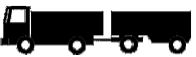
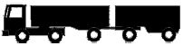

# Нагрузки



- ГОСТ Р 71404-2024 {#gost-71404-2024}

  

  На данной вкладке задаются характеристики нагрузок, а также способ вычисления суммарного числа приложений расчетной нагрузки за срок службы дорожной одежды.

  {#71404-2024-gruppa-nagruzki}

  Расчетная нагрузка выбирается из выпадающего списка. Предусмотрены следующие типы нагрузок (согласно **ГОСТ Р 71404-2024**):

  * **А-11.5** – (с нормированной статической нагрузкой на ось 115 кН и давлением в шине 0,8 Мпа, для автомобильных дорог с капитальными дорожными одеждами);
  * **А-10** – (с нормированной статической нагрузкой на ось 100 кН и давлением в шине 0,6 Мпа, для автомобильных дорог с облегчёнными и переходного типа дорожными одеждами).

  В качестве расчетной нагрузки также может быть выбрана другая нагрузка, в случае, когда в составе движения проектируемой дороги предусматривается регулярное обращение автомобилей с осевой нагрузкой, превышающей нормативную нагрузку АК более чем на 5 %, в количестве более 5 %. В данном случае, за расчетную осевую нагрузку допускается принимать максимальную нагрузку на наиболее нагруженную ось автомобиля.

  Для другой нагрузки необходимо задать соответствующие ей расчетные параметры:

  * Номинальная статическая нагрузка на колесо
  * Давление воздуха в шинах.

  По этим данным определяются статические и динамические диаметры отпечатка шины (согласно **ГОСТ Р 71404-2024**, формула 1 и 2).

  $$D_{ст}=\sqrt \frac{40Q_{ст}}{\pi p}$$

  $$D_{Д}=\sqrt {k_{дин}D_{ст}},$$

  где:

  * $Q_{ст}$ — нагрузка на колесо наиболее загруженной оси, кН;
  * $р$ — давление на покрытие, МПа;
  * $k_{дин}$ — коэффициент динамичности, равный 1,3.

  

  {#71404-2024-koleso}

  Данное значение учитывается при расчете растягивающего напряжения, с помощью дополнительного коэффициента Кв (согласно **ГОСТ Р 71404-2024**, п.9.5.3. ), учитывающего особенности напряженного состояния покрытия конструкции под спаренным баллоном. Его принимают равным 0,85 для спаренного баллона, а при расчете на однобаллонное колесо данный коэффициент принимают равным 1,00.

  

  {#71404-2024-nagruzka-stat}

  Величина для задания Другой нагрузки и определения статических и динамических диаметров отпечатка шины (Согласно **ГОСТ Р 71404-2024**, формула 1 и 2). Для другой нагрузки необходимо задать соответствующие ей расчетные параметры:

  * $Q_n$ - номинальная статическая нагрузка на колесо наиболее загруженной оси, кН;
  * $p$ - давление воздуха в шинах, МПа.

  По этим данным $Q_n$ и $p$ определяются $D_{ст}$ и $D_{Д}$ статические и динамические диаметры отпечатка шины, приведенного к кругу отпечатка следа соответственно неподвижного и подвижного автомобилей:

  $$D_{ст}=\sqrt \frac{40Q_{ст}}{\pi p}$$

  $$D_{Д}=\sqrt {k_{дин}D_{ст}}$$

  где:

  * $Q_{ст}$ — нагрузка на колесо наиболее загруженной оси, кН;
  * $р$ — давление на покрытие, МПа;
  * $k_{дин}$ — коэффициент динамичности, равный 1,3.

  

  {#71404-2024-davlenie}

  Величина для задания Другой нагрузки и определения статических и динамических диаметров отпечатка шины (Согласно **ГОСТ Р 71404-2024**, формула 1 и 2). Для другой нагрузки необходимо задать соответствующие ей расчетные параметры:

  * $Q_n$ - номинальная статическая нагрузка на колесо наиболее загруженной оси, кН;
  * $p$ - давление воздуха в шинах, МПа.

  По этим данным $Q_n$ и $p$ определяются $D_{ст}$ и $D_{Д}$ статические и динамические диаметры отпечатка шины, приведенного к кругу отпечатка следа соответственно неподвижного и подвижного автомобилей:

  $$D_{ст}=\sqrt \frac{40Q_{ст}}{\pi p}$$

  $$D_{Д}=\sqrt {k_{дин}D_{ст}}$$

  где:

  * $Q_{ст}$ — нагрузка на колесо наиболее загруженной оси, кН;
  * $р$ — давление на покрытие, МПа;
  * $k_{дин}$ — коэффициент динамичности, равный 1,3.

  

  {#71404-2024-intensivnost-izmen}

  Показатель изменения интенсивности $q$ – знаменатель геометрической прогрессии, характеризующий прирост интенсивности движения, определяемый по формуле:

  $$q=1±r/100$$

  где:
  
  * $r$ – ежегодный прирост интенсивности движения в долях единицы (“+” – при ежегодном увеличении интенсивности движения, “–“ – при ежегодном уменьшении интенсивности движения).

  

  {#71404-2024-odnostoronnee}

  Принимается согласно заданию на проектирование.

  В зависимости от количества полос движения назначается коэффициент полостности (согласно **ГОСТ Р 71404-2024**, табл. 2)

  #|
  || **Количество полос движения** {.cell-align-center} | **Коэффициент распределения интенсивности движения для самой нагруженной полосы движения $f_{пол}$** {.cell-align-center} |> ||
  || ^ | **Движение в обоих направлениях** {.cell-align-center} | **Одностороннее движение** {.cell-align-center} ||
  || 1 {.cell-align-center} | 1,00 {.cell-align-center} | 1,00 {.cell-align-center} ||
  || 2 {.cell-align-center} | 0,55 {.cell-align-center} | 0,90 {.cell-align-center} ||
  || 3 {.cell-align-center} | 0,50 {.cell-align-center} | 0,70 {.cell-align-center} ||
  || 4 {.cell-align-center} | 0,45 {.cell-align-center} | 0,70 {.cell-align-center}||
  || 5 {.cell-align-center} | 0,40 {.cell-align-center} | - {.cell-align-center} ||
  || 6 и более {.cell-align-center} | 0.35 {.cell-align-center} | - {.cell-align-center} ||
  |#

  

  Допускается назначать коэффициенты распределения интенсивности по данным фактических замеров.

  На перекрестках и подходах к ним (в местах перестройки потока автомобилей для выполнения левых поворотов и др.) при расчете одежды в пределах всех полос движения следует принимать $f_{пол}$ = 0,50, если общее число полос проезжей части проектируемой дороги три и более.

  

  Данный коэффициент учитывается при определении приведенной интенсивности движения к воздействию расчетной нагрузки на полосу движения на конец межремонтного срока проведения работ по капитальному ремонту (формула 3).

  

  {#71404-2024-srok-kaprem}

  Срок службы дорожной одежды между капитальными ремонтами в годах. Срок службы указывается в задании на проектирование или принимается согласно **ГОСТ Р 58861-2020**, табл. 2.

  Используется при определении величины расчетного числа приложений приведенной расчетной нагрузки на полосу движения (согласно **ГОСТ Р 71404-2024**, формула 6).

  

  {#71404-2024-srok-rem}

  Срок службы дорожной одежды между ремонтами в годах. Принимается согласно **ГОСТ Р 58861-2020, табл.2**.

  Учитывается при определении марки вяжущего согласно методике **ГОСТ Р 71404-2024** прил. Б, формула 6.

  

  {#71404-2024-raspredelenie-polos}

  Принимается согласно заданию на проектирование.

  В зависимости от количества полос движения назначается коэффициент полостности (согласно **ГОСТ Р 71404-2024**, табл. 2)

  #|
  || **Количество полос движения** {.cell-align-center} | **Коэффициент распределения интенсивности движения для самой нагруженной полосы движения $f_{пол}$** {.cell-align-center} |> ||
  || ^ | **Движение в обоих направлениях** {.cell-align-center} | **Одностороннее движение** {.cell-align-center} ||
  || 1 {.cell-align-center} | 1,00 {.cell-align-center} | 1,00 {.cell-align-center} ||
  || 2 {.cell-align-center} | 0,55 {.cell-align-center} | 0,90 {.cell-align-center} ||
  || 3 {.cell-align-center} | 0,50 {.cell-align-center} | 0,70 {.cell-align-center} ||
  || 4 {.cell-align-center} | 0,45 {.cell-align-center} | 0,70 {.cell-align-center} ||
  || 5 {.cell-align-center} | 0,40 {.cell-align-center} | - {.cell-align-center} ||
  || 6 и более {.cell-align-center}  | 0.35 {.cell-align-center} | - {.cell-align-center} ||
  |#

  

  Допускается назначать коэффициенты распределения интенсивности по данным фактических замеров.

  На перекрестках и подходах к ним (в местах перестройки потока автомобилей для выполнения левых поворотов и др.) при расчете одежды в пределах всех полос движения следует принимать $f_{пол}$ = 0,50, если общее число полос проезжей части проектируемой дороги три и более.

  

  Данный коэффициент учитывается при определении приведенной интенсивности движения к воздействию расчетной нагрузки на полосу движения на конец межремонтного срока проведения работ по капитальному ремонту (формула 3).

  

  {#71404-2024-summa-prilozheniy}

  Определяется следующими способами:
  
  * Непосредственным заданием  величины $Σ N_р$ суммарного расчетного числа приложений приведенной расчетной нагрузки к точке на поверхности покрытия за нормативный срок службы дорожной одежды, авт;
  
    
    
    Имеется возможность определения суммарного расчетного числа приложений расчетной нагрузки за срок службы, при задании величины требуемого модуля упругости. Для этого нажмите кнопку [Подобрать по модулю](#71404-2024-modul).
    
    
  
  * Заданием $N_р$ приведенной к расчетной нагрузки интенсивности движения на одну полосу, на произвольный год , авт/сут;
  
    На основе этой приведенной суточной интенсивности движения далее рассчитывается суммарное число приложений расчетной нагрузки, согласно **ГОСТ Р 71404-2024**, формула 6:
  
  $$\sum N_p = 0,7N_p \frac{K_c}{q^{(T_{сл}-1)}}T_{рдг}k_n$$
  
  * Заданием состава движения (грузовых автомобилей и автобусов) для любого года эксплуатации дорожной одежды, от первого до последнего (перед капитальным ремонтом). Фактическая интенсивность задается по следующим группам автомобилей (согласно **ГОСТ Р 71405-2024**, приложение А табл.А1 и А2):
  
  #|
  || **Категория транспортного средства** {.cell-align-center} | **Схема** {.cell-align-center} | **Тип транспортного средства** {.cell-align-center} | **$S_i$ для капитального типа дорожной одежды (для нагрузки А-11,5)** {.cell-align-center} | **$S_i$ для облегченного и переходного типов дорожной одежды (для нагрузки А-10)** {.cell-align-center} ||
  || B {.cell-align-center} |   | Легковые автомобили, небольшие грузовики (фургоны) и другие автомобили с прицепом и без него | 0,0015 {.cell-align-center} | 0,013 {.cell-align-center} ||
  || C1 {.cell-align-center} |   | Двухосные грузовые автомобили | 1,81 {.cell-align-center} | 2,29 {.cell-align-center} ||
  || С2 {.cell-align-center} |   | Трехосные грузовые автомобили | 2,84 {.cell-align-center} | 2,87 {.cell-align-center} ||
  || С3 {.cell-align-center} |   | Четырехосные грузовые автомобили | 3,51 {.cell-align-center} | 3,64 {.cell-align-center} ||
  || С4 {.cell-align-center} |   | Четырехосные автопоезда (двухосный грузовой автомобиль с прицепом) | 2,65 {.cell-align-center} | 4,00 {.cell-align-center} ||
  || С5 {.cell-align-center} |   | Пятиосные автопоезда (трехосный грузовой автомобиль с прицепом) | 3,28 {.cell-align-center} | 4,75 {.cell-align-center} ||
  || С6 {.cell-align-center} |   | Трехосные седельные автопоезда (двухосный седельный тягач с полуприцепом) | 2,90 {.cell-align-center} | 3,91 {.cell-align-center} ||
  || С7 {.cell-align-center} |   | Четырехосные седельные автопоезда(двухосный седельный тягач с полуприцепом) | 3,67 {.cell-align-center} | 4,13 {.cell-align-center} ||
  || С8 {.cell-align-center} |   | Пятиосные седельные автопоезда(двухосный седельный тягач с полуприцепом) | 3,76 {.cell-align-center} | 4,85 {.cell-align-center} ||
  || С9 {.cell-align-center} |   | Пятиосные седельные автопоезда (трехосный седельный тягач с полуприцепом) | 4,13 {.cell-align-center} | 5,23 {.cell-align-center} ||
  || С10 {.cell-align-center} |   | Шестиосные седельные автопоезда | 2,99 {.cell-align-center} | 4,65 {.cell-align-center} ||
  || С11 {.cell-align-center} |   | Автомобили с семью и более осями и др. | 2,19 {.cell-align-center} | 4,18 {.cell-align-center} ||
  || D {.cell-align-center} |   | Автобусы | 1,81 {.cell-align-center} | 2,29 {.cell-align-center} ||
  |#
  
  Далее, на основе этих данных, происходит расчет приведенной интенсивности, согласно **ГОСТ Р 71404-2024**, формула 3:
  
  $$N_p = f_{пол} \sum\limits^{n}_{i=1} {N_i S_i}$$
  
  где:
  
  * $f_{пол}$ — коэффициент распределения интенсивности движения для самой нагруженной полосы движения, зависящий от числа полос движения, принимаемый при отсутствии данных натурных наблюдений по таблице 2.
  * $N_i$ — число автомобилей i-й марки в одном или в обоих направлениях на конец срока службы дорожных одежд, авт/сут;
  * $S_i$ — коэффициент приведения воздействия на дорожную одежду транспортного средства i-й марки с нагрузкой на колесо $P_i$ к расчетной нагрузке в соответствии с **ГОСТ Р 71405-2024**;
  * $n$ – общее число различных марок транспортных средств в составе транспортного потока.
  
  А затем, рассчитывается суммарное число приложений приведенной нагрузки, согласно **ГОСТ Р 71404-2024**, формула. 6:
  
  $$\sum N_p = 0,7N_p \frac{K_c}{q^{(T_{сл}-1)}}T_{рдг}k_n$$
  
  В двух последних случаях одновременно задаются следующие данные:
  
  * [Срок работ по капитальному ремонту, лет](#71404-2024-srok-kaprem) – нормативный межремонтный срок службы дорожной одежды между капитальными ремонтами в годах. Если год, на который задана интенсивность, не является последним, то в таком случае в знаменателе формулы $\sum N_p$ в качестве $Т_{сл}$ используется год, на который задана интенсивность;
  * [Год, на который задана интенсивность](#71404-2024-intensivnost-god) – номер года, для которого задана интенсивность движения;
  * [Показатель изменения интенсивности](#71404-2024-intensivnost-izmen) – знаменатель геометрической прогрессии, характеризующий прирост интенсивности движения.

  

  {#71404-2024-modul}

  Функция позволяет осуществить подбор суммарного числа приложений расчетной нагрузки за срок службы $ΣN_p$ без указания состава транспортного потока. Подбор может быть осуществлен или по величине минимального требуемого модуля упругости $E_{min}$  или по величине общего модуля упругости на поверхности $E_{общ}$.

  Для того чтобы воспользоваться автоматическим подбором:
  1.	Нажмите на кнопку **Подобрать по модулю...**;
  2.	В открывшемся окне выберите величину подбора и введите ее значение:
      
           a. При выборе варианта **Минимальный требуемый модуль упругости** программой будет применено преобразование формулы 9, ГОСТ Р 71404-2024, с выводом значения $ΣN_p$  через известное $E_{min}$:
           $$Е_{min} = \sqrt {\frac{p}{0.6}} 98,65 (lg\sum N_p - c)$$
           где:
           * $p$ — расчетное давление на покрытие в соответствии с ГОСТ 32960;
           * $ΣN_p$ — суммарное расчетное число приложений приведенной расчетной нагрузки на полосу движения за нормативный межремонтный срок службы проведения работ по капитальному ремонту [см. формулы (4) и (6)];
           * $c$ — эмпирический параметр, равный для расчетной нагрузки: А-10 — 3,55; А-11,5 — 3,20.
           
           b.	При выборе варианта **Общий модуль упругости на поверхности** программой будет применено преобразование условия 8 совместно с формулой 9, ГОСТ Р 71404-2024, с выводом значения $ΣN_p$  через известное $E_{общ}$:
           $$E_{общ}≥E_{min}K_{пр}^{тр}$$
           где:
           
           * $K_{пр}^{тр}$  - требуемый коэффициент прочности, определяемый по таблице 5 в зависимости от типа дорожной одежды и категории дороги.

  3. Подтвердите изменения, нажав ОК.

  В результате в поле **Задать суммарное число приложений расчетной нагрузки** будет автоматически записан рассчитанный результат $ΣN_p$.

  

  Требуемый минимальный модуль упругости $E_{min}$ должен быть не менее указанного в таблице 7 ГОСТ Р 71404-2024 независимо от результата расчета, полученного по формуле 9 ГОСТ Р 71404-2024.

  #|
  || **Категория дороги** {.cell-align-center}| **Минимальный требуемый модуль упругости дорожной одежды $Е_{min}$, МПа, в зависимости от типа дорожных одежд** {.cell-align-center}| >  | >  ||
  || ^ | капитальный {.cell-align-center} | облегченный {.cell-align-center} | переходный {.cell-align-center} ||
  || IА, IБ, IВ {.cell-align-center} | 330 {.cell-align-center} | - {.cell-align-center} | - {.cell-align-center} ||
  || II {.cell-align-center} | 325 {.cell-align-center} | - {.cell-align-center} | - {.cell-align-center} ||
  || III {.cell-align-center} | 310 {.cell-align-center} | 235 {.cell-align-center} | - {.cell-align-center} ||
  || IV {.cell-align-center} | 250 {.cell-align-center} | 180 {.cell-align-center} | 110 {.cell-align-center} ||
  |#

  

  

  {#71404-2024-intensivnost-priv}

  На основе этой приведенной суточной интенсивности движения далее рассчитывается суммарное число приложений расчетной нагрузки, согласно **ГОСТ Р 71404-2024**, формула 6:

  $$\sum N_p = 0,7N_p \frac{K_c}{q^{(T_{сл}-1)}}T_{рдг}k_n$$

  В двух последних случаях одновременно задаются следующие данные:

  * [Срок работ по капитальному ремонту, лет](#71404-2024-srok-kaprem) – нормативный межремонтный срок службы дорожной одежды между капитальными ремонтами в годах; Если год, на который задана интенсивность, не является последним, то в таком случае в знаменателе формулы $\sum N_p$ в качестве $Т_{сл}$ используется год (t), на который задана интенсивность;
  * [Год, на который задана интенсивность](#71404-2024-intensivnost-god) – номер года, для которого задана интенсивность движения;
  * [Показатель изменения интенсивности](#71404-2024-intensivnost-izmen) – знаменатель геометрической прогрессии, характеризующий прирост интенсивности движения.

  

  {#71404-2024-intensivnost-god}

  Номер года, для которого задана интенсивность движения (может задаваться в пределах от 1 и до расчетного года наступления капитального ремонта).

  

  {#71404-2024-koeff-priv}

  Фактическая интенсивность задается по следующим группам автомобилей (согласно **ГОСТ Р 71405-2024**, приложение А табл.А1 и А2):
  
  #|tbl-col-align: center center left center center
  || **Категория транспортного средства** {.cell-align-center} | **Схема** {.cell-align-center} | **Тип транспортного средства** {.cell-align-center} | **$S_i$ для капитального типа дорожной одежды (для нагрузки А-11,5)** | **$S_i$ для облегченного и переходного типов дорожной одежды (для нагрузки А-10)** ||
  || B {.cell-align-center} |   | Легковые автомобили, небольшие грузовики (фургоны) и другие автомобили с прицепом и без него | 0,0015 {.cell-align-center} | 0,013 {.cell-align-center} ||
  || C1 {.cell-align-center} |  | Двухосные грузовые автомобили | 1,81 {.cell-align-center} | 2,29 {.cell-align-center} ||
  || С2 {.cell-align-center} |  | Трехосные грузовые автомобили | 2,84 {.cell-align-center} | 2,87 {.cell-align-center} ||
  || С3 {.cell-align-center} |  | Четырехосные грузовые автомобили | 3,51 {.cell-align-center} | 3,64 {.cell-align-center} ||
  || С4 {.cell-align-center} |  | Четырехосные автопоезда (двухосный грузовой автомобиль с прицепом) | 2,65 {.cell-align-center} | 4,00 {.cell-align-center} ||
  || С5 {.cell-align-center} |  | Пятиосные автопоезда (трехосный грузовой автомобиль с прицепом) | 3,28 {.cell-align-center} | 4,75 {.cell-align-center} ||
  || С6 {.cell-align-center} |  | Трехосные седельные автопоезда (двухосный седельный тягач с полуприцепом) | 2,90 {.cell-align-center} | 3,91 {.cell-align-center} ||
  || С7 {.cell-align-center} |  | Четырехосные седельные автопоезда(двухосный седельный тягач с полуприцепом) | 3,67 {.cell-align-center} | 4,13 {.cell-align-center} ||
  || С8 {.cell-align-center} |  | Пятиосные седельные автопоезда(двухосный седельный тягач с полуприцепом) | 3,76 {.cell-align-center} | 4,85 {.cell-align-center} ||
  || С9 {.cell-align-center} |  | Пятиосные седельные автопоезда (трехосный седельный тягач с полуприцепом) | 4,13 {.cell-align-center} | 5,23 {.cell-align-center} ||
  || С10 {.cell-align-center} |  | Шестиосные седельные автопоезда | 2,99 {.cell-align-center} | 4,65 {.cell-align-center} ||
  || С11 {.cell-align-center} |   | Автомобили с семью и более осями и др. | 2,19 {.cell-align-center} | 4,18 {.cell-align-center} ||
  || D {.cell-align-center} |   | Автобусы | 1,81 {.cell-align-center} | 2,29 {.cell-align-center} ||
  |#

  

  1. Согласно данной таблицы принимаются коэффициенты приведения каждой группы автомобилей к расчетному автомобилю A-11.5 или А-10
  2. В случаях расчета на нагрузку, отличную от А-11,5 или A-10 расчет приведенной интенсивности движения, осуществляется тоже с помощью коэффициентов приведения для соответствующей расчетной нагрузки.
  3. При необходимости приведения фактической суточной интенсивности движения к расчетной нагрузке, стандартные категории автомобилей по грузоподъемности и соответствующие им коэффициенты приведения могут быть отредактированы. Для этого перейдите на вкладку Другие коэффициенты и внесите необходимые изменения.

  

  Далее, на основе этих данных, происходит расчет приведенной интенсивности, согласно **ГОСТ Р 71404-2024**, формула 3:

  $$N_p = f_{пол} \sum\limits^{n}_{i=1} {N_i K_i}$$

  где:

  * $f_{пол}$ — коэффициент распределения интенсивности движения для самой нагруженной полосы движения, зависящий от числа полос движения, принимаемый при отсутствии данных натурных наблюдений по таблице 2;
  * $N_i$ — число автомобилей i-й марки в одном или в обоих направлениях на конец срока службы дорожных одежд, авт/сут;
  * $K_i$ — коэффициент приведения воздействия на дорожную одежду транспортного средства i-й марки с нагрузкой на колесо $P_i$ к расчетной нагрузке в соответствии с **ГОСТ Р 71405-2024**;
  * $n$ – общее число различных марок транспортных средств в составе транспортного потока.

  А затем, рассчитывается суммарное число приложений приведенной нагрузки, согласно **ГОСТ Р 71404-2024**, формула. 6:

  $$\sum N_p = 0,7N_p \frac{K_c}{q^{(T_{сл}-1)}}T_{рдг}k_n$$

  В данном случае также задаются следующие данные:

  * [Срок работ по капитальному ремонту, лет](#71404-2024-srok-kaprem) – нормативный межремонтный срок службы дорожной одежды между капитальными ремонтами в годах;
  * [Год, на который задана интенсивность](#71404-2024-intensivnost-god) – номер года, для которого задана интенсивность движения;
  * [Показатель изменения интенсивности](#71404-2024-intensivnost-izmen) – знаменатель геометрической прогрессии, характеризующий прирост интенсивности движения.

  
 
  {#71404-2024-koeff-drugie}

  При необходимости приведения фактической суточной интенсивности движения к расчетной нагрузке, стандартные категории автомобилей по грузоподъемности и соответствующие им коэффициенты приведения (задаваемые согласно **ГОСТ Р 71405— 2024**, табл. А.1 и А.2) могут быть отредактированы. Для этого выберите из выпадающего списка с наименованием **Набор коэффициентов приведения** пункт **Другие коэффициенты**.

  В данном случае помимо поля Значение для редактирования станут доступны поля **Наименование** и **Коэффициент**.

  Также над списком групп автомобилей станет активна панель .

  * Для создания дополнительной группы автомобилей нажмите кнопку . Новая группа появится внизу списка. Задайте ей соответствующие наименование, коэффициент приведения к расчетной нагрузки и значение суточной интенсивности движения.
  * Для удаления какой - либо группы автомобилей из списка выделите ее и нажмите клавишу ;
  * Отредактированный список групп автомобилей сохраняется в текущем расчете. При необходимости он может быть сохранен в стандартную библиотеку коэффициентов приведения и использоваться в других расчетах. Для сохранения текущего списка в библиотеку нажмите кнопку.

  

  1. Работа с типовыми библиотеками подробно описана в соответствующем разделе документации
  2. Коэффициент приведения группы автомобилей или конкретного автомобиля имеющегося в составе потока к расчетному может быть рассчитан на основе его технических характеристик (нагрузки на ось, количество осей и расстояния между ними).

  

  

- ПНСТ 1006-2025 {#pnst-1006-2025}

  

  На данной вкладке задаются характеристики нагрузок, а также способ вычисления суммарного числа приложений расчетной нагрузки за срок службы дорожной одежды.

  {#1006-2025-gruppa-nagruzki}

  Расчетная нагрузка выбирается из выпадающего списка. Предусмотрены следующие типы нагрузок (согласно п.5.8 **ПНСТ 1006-2025**):

  * **А-11.5** – (с нормированной статической нагрузкой на ось 115 кН и давлением в шине 0,8 Мпа, для автомобильных дорог с капитальными дорожными одеждами).

  В качестве расчетной нагрузки также может быть выбрана другая нагрузка, в случае, когда в составе движения проектируемой дороги предусматривается регулярное обращение автомобилей с осевой нагрузкой, превышающей нормативную нагрузку АК более чем на 5 %, в количестве более 5 %. В данном случае, за расчетную осевую нагрузку допускается принимать максимальную нагрузку на наиболее нагруженную ось автомобиля.

  Для другой нагрузки необходимо задать соответствующие ей расчетные параметры:

  * Номинальная статическая нагрузка на колесо
  * Давление воздуха в шинах.

  По этим данным определяются статические и динамические диаметры отпечатка шины (согласно **ГОСТ Р 71404-2024**, формула 1 и 2).

  $$D_{ст}=\sqrt {\frac{40Q_{ст}}{\pi p}}$$

  $$D_{Д}=\sqrt{k_{дин}D_{ст}}$$

  где:

  * $Q_{ст}$ — нагрузка на колесо наиболее загруженной оси, кН;
  * $р$ — давление на покрытие, МПа;
  * $k_{дин}$ — коэффициент динамичности, равный 1,3.

  

  {#1006-2025-nagruzka-stat}

  Величина для задания Другой нагрузки и определения статических и динамических диаметров отпечатка шины (Согласно **ГОСТ Р 71404-2024**, формула 1 и 2). Для другой нагрузки необходимо задать соответствующие ей расчетные параметры:

  * $Q_n$ - номинальная статическая нагрузка на колесо наиболее загруженной оси, кН;
  * $p$ - давление воздуха в шинах, МПа.

  По этим данным $Q{_n}$ и $p$ определяются $D_{ст}$ и $D_{Д}$ статические и динамические диаметры отпечатка шины, приведенного к кругу отпечатка следа соответственно неподвижного и подвижного автомобилей:

  $$D_{ст}=\sqrt{\frac{40Q_{ст}}{\pi p}}$$

  $$D_{Д}=\sqrt{k_{дин}D_{ст}}$$

  где:

  * $Q_{ст}$ — нагрузка на колесо наиболее загруженной оси, кН;
  * $р$ — давление на покрытие, МПа;
  * $k_{дин}$ — коэффициент динамичности, равный 1,3.

  

  {#1006-2025-davlenie}

  Величина для задания Другой нагрузки и определения статических и динамических диаметров отпечатка шины (Согласно **ГОСТ Р 71404-2024**, формула 1 и 2). Для другой нагрузки необходимо задать соответствующие ей расчетные параметры:

  * $Q_n$ - номинальная статическая нагрузка на колесо наиболее загруженной оси, кН;
  * $p$ - давление воздуха в шинах, МПа.

  По этим данным $Q_n$ и $p$ определяются $D_{ст}$ и $D_{Д}$ статические и динамические диаметры отпечатка шины, приведенного к кругу отпечатка следа соответственно неподвижного и подвижного автомобилей:

  $$D_{ст}=\sqrt{\frac{40Q_{ст}}{\pi p}}$$

  $$D_{Д}=\sqrt{k_{дин}D_{ст}}$$

  где:

  * $Q_{ст}$ — нагрузка на колесо наиболее загруженной оси, кН;
  * $р$ — давление на покрытие, МПа;
  * $k_{дин}$ — коэффициент динамичности, равный 1,3.

  

  {#1006-2025-intensivnost-izmen}

  Показатель изменения интенсивности $q$ – знаменатель геометрической прогрессии, характеризующий прирост интенсивности движения, определяемый по формуле:

  $$q=1±r/100$$

  где:
  
  * $r$ – ежегодный прирост интенсивности движения в долях единицы (“+” – при ежегодном увеличении интенсивности движения, “–“ – при ежегодном уменьшении интенсивности движения).

  

  {#1006-2025-odnostoronnee}

  Принимается согласно заданию на проектирование.

  В зависимости от количества полос движения назначается коэффициент полостности (согласно **ПНСТ 1006-2025**, табл. 4)

  #|
  || **Количество полос движения** | **Коэффициент распределения интенсивности движения для самой нагруженной полосы движения $f_{пол}$** |>||
  || ^ | **Движение в обоих направлениях** | **Одностороннее движение** ||
  || 1 {.cell-align-center} | 1,00 {.cell-align-center} | 1,00 {.cell-align-center} ||
  || 2 {.cell-align-center} | 0,55 {.cell-align-center} | 0,90 {.cell-align-center} ||
  || 3 {.cell-align-center} | 0,50 {.cell-align-center} | 0,70 {.cell-align-center} ||
  || 4 {.cell-align-center} | 0,45 {.cell-align-center} | 0,70 {.cell-align-center} ||
  || 5 {.cell-align-center} | 0,40 {.cell-align-center} | - {.cell-align-center} ||
  || 6 и более {.cell-align-center} | 0.35 {.cell-align-center} | - {.cell-align-center}||
  |#

  

  Допускается назначать коэффициенты распределения интенсивности по данным фактических замеров.

  

  Данный коэффициент учитывается при определении приведенной интенсивности движения к воздействию расчетной нагрузки на полосу движения на конец межремонтного срока проведения работ по капитальному ремонту (формула 4).

  

  {#1006-2025-srok-kaprem}

  Срок службы дорожной одежды между капитальными ремонтами в годах. Срок службы указывается в задании на проектирование или принимается согласно **ГОСТ Р 58861-2020**, табл. 2.

  Используется при определении величины расчетного числа приложений приведенной расчетной нагрузки на полосу движения (согласно **ПНСТ 1006-2025**, формула 5).

  

  {#1006-2025-srok-rem}

  Срок службы дорожной одежды между ремонтами в годах. Принимается согласно **ГОСТ Р 58861-2020, табл.2**.
  
  В частности, срок работ по ремонту используется при [определении марки битума](../additionally/determining_brand_binder.md) для асфальтобетонных слоев полужестких конструкций.

  

  {#1006-2025-raspredelenie-polos}

  Данный коэффициент учитывается при определении приведенной интенсивности движения к воздействию расчетной нагрузки на полосу движения на конец межремонтного срока проведения работ по капитальному ремонту (формула 7 **ПНСТ 1006-2025**).

  $$N_p = f_{пол} \sum\limits^{n}_{i=1} {N_i S_i}$$

  где:

  * $f_{пол}$ — коэффициент распределения интенсивности движения для самой нагруженной полосы движения, зависящий от числа полос движения, принимаемый при отсутствии данных натурных наблюдений по таблице 4. На перекрестках и подходах к ним (в местах перестроения потока автомобилей для выполнения левых поворотов и др.) при расчете одежды в пределах всех полос движения следует принимать $f_{пол}$ =0,50, если общее количество полос проезжей части проектируемой дороги три и более в обоих направлениях, в остальных случаях – по таблице 4;
  * $N_i$ — количество автомобилей i-й марки в одном или в обоих направлениях на конец срока службы дорожных одежд, ед./сут;
  * $S_i$ — коэффициент приведения воздействия на дорожную одежду транспортного средства i-й марки с нагрузкой на колесо $P_i$ к расчетной нагрузке в соответствии с **ГОСТ Р 71405-2024**;
  * $n$ – общее количество различных марок транспортных средств в составе транспортного потока.

  **Одностороннее движение**

  Параметр учитывает коэффициент распределения интенсивности движения согласно **ПНСТ1006-2025**, табл. 4.

  #|
  || **Количество полос движения** {.cell-align-center}| **Коэффициент распределения интенсивности движения для самой нагруженной полосы движения $f_{пол}$** |>||
  || ^ | **Движение в обоих направлениях** {.cell-align-center}| **Одностороннее движение** {.cell-align-center}||
  || 1 {.cell-align-center}| 1,00 {.cell-align-center}| 1,00 {.cell-align-center}||
  || 2 {.cell-align-center}| 0,55 {.cell-align-center}| 0,90 {.cell-align-center}||
  || 3 {.cell-align-center}| 0,50 {.cell-align-center}| 0,70 {.cell-align-center}||
  || 4 {.cell-align-center}| 0,45 {.cell-align-center}| 0,70 {.cell-align-center}||
  || 5 {.cell-align-center}| 0,40 {.cell-align-center}| - {.cell-align-center}||
  || 6 и более {.cell-align-center}| 0.35 {.cell-align-center}| - {.cell-align-center}||
  |#

  **Задать коэффициент распределения по полосам по данным фактических замеров**

  Согласно таблице 4 **ПНСТ 1006-2025** допускается назначать коэффициенты распределения интенсивности по данным фактических замеров.

  

  {#1006-2025-summa-prilozheniy}

  Определяется следующими способами:
  
  * Непосредственным заданием  величины $Σ N_р$ суммарного расчетного числа приложений приведенной расчетной нагрузки к точке на поверхности покрытия за нормативный срок службы дорожной одежды, авт;
  * Заданием $N_р$ приведенной к расчетной нагрузки интенсивности движения на одну полосу, на произвольный год , авт/сут;
  
  На основе этой приведенной суточной интенсивности движения далее рассчитывается суммарное число приложений расчетной нагрузки, согласно **ПНСТ 1006-2025**, формула 5:
  
  $$\sum N_p = 0,7N_p \frac{K_c}{q^{(T_{сл}-1)}}T_{рдг}k_n$$
  
  * Заданием состава движения (грузовых автомобилей и автобусов) для любого года эксплуатации дорожной одежды, от первого до последнего (перед капитальным ремонтом). Фактическая интенсивность задается по следующим группам автомобилей (согласно **ГОСТ Р 71405-2024**, приложение А табл.А1 и А2):
  
  #|
  || **Категория транспортного средства** {.cell-align-center}| **Схема** {.cell-align-center}| **Тип транспортного средства** {.cell-align-center}| **$S_i$ для капитального типа дорожной одежды (для нагрузки А-11,5)** {.cell-align-center}||
  || B {.cell-align-center}|  | Легковые автомобили, небольшие грузовики (фургоны) и другие автомобили с прицепом и без него | 0,0015 {.cell-align-center}||
  || C1 {.cell-align-center}|  | Двухосные грузовые автомобили | 1,81 {.cell-align-center}||
  || С2 {.cell-align-center}|  | Трехосные грузовые автомобили | 2,84 {.cell-align-center}||
  || С3 {.cell-align-center}|  | Четырехосные грузовые автомобили | 3,51 {.cell-align-center}||
  || С4 {.cell-align-center}|  | Четырехосные автопоезда (двухосный грузовой автомобиль с прицепом) | 2,65 {.cell-align-center}||
  || С5 {.cell-align-center}|  | Пятиосные автопоезда (трехосный грузовой автомобиль с прицепом) | 3,28 {.cell-align-center}||
  || С6 {.cell-align-center}|  | Трехосные седельные автопоезда (двухосный седельный тягач с полуприцепом) | 2,90 {.cell-align-center}||
  || С7 {.cell-align-center}|  | Четырехосные седельные автопоезда(двухосный седельный тягач с полуприцепом) | 3,67 {.cell-align-center}||
  || С8 {.cell-align-center}|  | Пятиосные седельные автопоезда(двухосный седельный тягач с полуприцепом) | 3,76 {.cell-align-center}||
  || С9 {.cell-align-center}|  | Пятиосные седельные автопоезда (трехосный седельный тягач с полуприцепом) | 4,13 {.cell-align-center}||
  || С10 {.cell-align-center}|  | Шестиосные седельные автопоезда | 2,99 {.cell-align-center}||
  || С11 {.cell-align-center}|  | Автомобили с семью и более осями и др. | 2,19 {.cell-align-center}||
  || D {.cell-align-center}|  | Автобусы | 1,81 {.cell-align-center}||
  |#
  
  Далее, на основе этих данных, происходит расчет приведенной интенсивности, согласно **ПНСТ 1006-2025**, формула 7:
  
  $$N_p = f_{пол} \sum\limits^{n}_{i=1} {N_i S_i}$$
  
  где:
  
  * $f_{пол}$ — коэффициент распределения интенсивности движения для самой нагруженной полосы движения, зависящий от числа полос движения, принимаемый при отсутствии данных натурных наблюдений по таблице 7.
  * $N_i$ — число автомобилей i-й марки в одном или в обоих направлениях на конец срока службы дорожных одежд, авт/сут;
  * $S_i$ — коэффициент приведения воздействия на дорожную одежду транспортного средства i-й марки с нагрузкой на колесо $P_i$ к расчетной нагрузке в соответствии с **ГОСТ Р 71405-2024**;
  * $n$ – общее число различных марок транспортных средств в составе транспортного потока.
  
  А затем, рассчитывается суммарное число приложений приведенной нагрузки, согласно **ПНСТ 1006-2025**, формула. 5:
  
  $$\sum N_p = 0,7N_p \frac{K_c}{q^{(T_{сл}-1)}}T_{рдг}k_n$$
  
  В двух последних случаях одновременно задаются следующие данные:
  
  * [Срок работ по капитальному ремонту, лет](#1006-2025-srok-kaprem) – нормативный межремонтный срок службы дорожной одежды между капитальными ремонтами в годах. Если год, на который задана интенсивность, не является последним, то в таком случае в знаменателе формулы $\sum N_p$ в качестве $Т_{сл}$ используется год, на который задана интенсивность;
  * [Год, на который задана интенсивность](#1006-2025-intensivnost-god) – номер года, для которого задана интенсивность движения;
  * [Показатель изменения интенсивности](#1006-2025-intensivnost-izmen) – знаменатель геометрической прогрессии, характеризующий прирост интенсивности движения.

  

  {#1006-2025-intensivnost-priv}

  На основе этой приведенной суточной интенсивности движения далее рассчитывается суммарное число приложений расчетной нагрузки, согласно **ПНСТ 1006-2025**, формула 5:
  
  $$\sum N_p = 0,7N_p \frac{K_c}{q^{(T_{сл}-1)}}T_{рдг}k_n$$
  
  В двух последних случаях одновременно задаются следующие данные:
  
  * [Срок работ по капитальному ремонту, лет](#1006-2025-srok-kaprem) – нормативный межремонтный срок службы дорожной одежды между капитальными ремонтами в годах; Если год, на который задана интенсивность, не является последним, то в таком случае в знаменателе формулы $\sum N_p$ в качестве $Т_{сл}$ используется год (t), на который задана интенсивность;
  * [Год, на который задана интенсивность](#1006-2025-intensivnost-god) – номер года, для которого задана интенсивность движения;
  * [Показатель изменения интенсивности](#1006-2025-intensivnost-izmen) – знаменатель геометрической прогрессии, характеризующий прирост интенсивности движения.

  

  {#1006-2025-intensivnost-god}

  Номер года, для которого задана интенсивность движения (может задаваться в пределах от 1 и до расчетного года наступления капитального ремонта).

  

  {#1006-2025-koeff-priv}

  Фактическая интенсивность задается по следующим группам автомобилей (согласно **ГОСТ Р 71405-2024**, приложение А табл.А1 и А2):
  
  #|
  || **Категория транспортного средства** {.cell-align-center}| **Схема** {.cell-align-center}| **Тип транспортного средства** {.cell-align-center}| **$S_i$ для капитального типа дорожной одежды (для нагрузки А-11,5)** {.cell-align-center}||
  || B {.cell-align-center}|  | Легковые автомобили, небольшие грузовики (фургоны) и другие автомобили с прицепом и без него | 0,0015 {.cell-align-center}||
  || C1 {.cell-align-center}|  | Двухосные грузовые автомобили | 1,81 {.cell-align-center}||
  || С2 {.cell-align-center}|  | Трехосные грузовые автомобили | 2,84 {.cell-align-center}||
  || С3 {.cell-align-center}|  | Четырехосные грузовые автомобили | 3,51 {.cell-align-center}||
  || С4 {.cell-align-center}|  | Четырехосные автопоезда (двухосный грузовой автомобиль с прицепом) | 2,65 {.cell-align-center}||
  || С5 {.cell-align-center}|  | Пятиосные автопоезда (трехосный грузовой автомобиль с прицепом) | 3,28 {.cell-align-center}||
  || С6 {.cell-align-center}|  | Трехосные седельные автопоезда (двухосный седельный тягач с полуприцепом) | 2,90 {.cell-align-center}||
  || С7 {.cell-align-center}|  | Четырехосные седельные автопоезда(двухосный седельный тягач с полуприцепом) | 3,67 {.cell-align-center}||
  || С8 {.cell-align-center}|  | Пятиосные седельные автопоезда(двухосный седельный тягач с полуприцепом) | 3,76 {.cell-align-center}||
  || С9 {.cell-align-center}|  | Пятиосные седельные автопоезда (трехосный седельный тягач с полуприцепом) | 4,13 {.cell-align-center}||
  || С10 {.cell-align-center}|  | Шестиосные седельные автопоезда | 2,99 {.cell-align-center}||
  || С11 {.cell-align-center}|  | Автомобили с семью и более осями и др. | 2,19 {.cell-align-center}||
  || D {.cell-align-center}|  | Автобусы | 1,81 {.cell-align-center}||
  |#
    
  
  
  1. Согласно данной таблицы принимаются коэффициенты приведения каждой группы автомобилей к расчетному автомобилю A-11.5
  2. В случаях расчета на нагрузку, отличную от А-11,5 расчет приведенной интенсивности движения, осуществляется тоже с помощью коэффициентов приведения для соответствующей расчетной нагрузки.
  3. При необходимости приведения фактической суточной интенсивности движения к расчетной нагрузке, стандартные категории автомобилей по грузоподъемности и соответствующие им коэффициенты приведения могут быть отредактированы. Для этого перейдите на вкладку Другие коэффициенты и внесите необходимые изменения.
  
  
  
  Далее, на основе этих данных, происходит расчет приведенной интенсивности, согласно **ПНСТ 1006-2025**, формула 7:
  
  $$N_p = f_{пол} \sum\limits^{n}_{i=1} {N_i K_i}$$
  
  где:
  
  * $f_{пол}$ — коэффициент распределения интенсивности движения для самой нагруженной полосы движения, зависящий от числа полос движения, принимаемый при отсутствии данных натурных наблюдений по таблице 4;
  * $N_i$ — число автомобилей i-й марки в одном или в обоих направлениях на конец срока службы дорожных одежд, авт/сут;
  * $K_i$ — коэффициент приведения воздействия на дорожную одежду транспортного средства i-й марки с нагрузкой на колесо $P_i$ к расчетной нагрузке в соответствии с **ГОСТ Р 71405-2024**;
  * $n$ – общее число различных марок транспортных средств в составе транспортного потока.
  
  А затем, рассчитывается суммарное число приложений приведенной нагрузки, согласно **ПНСТ 1006-2025**, формула. 5:
  
  $$\sum N_p = 0,7N_p \frac{K_c}{q^{(T_{сл}-1)}}T_{рдг}k_n$$
  
  В данном случае также задаются следующие данные:
  
  * [Срок работ по капитальному ремонту, лет](#1006-2025-srok-kaprem) – нормативный межремонтный срок службы дорожной одежды между капитальными ремонтами в годах;
  * [Год, на который задана интенсивность](#1006-2025-intensivnost-god) – номер года, для которого задана интенсивность движения;
  * [Показатель изменения интенсивности](#1006-2025-intensivnost-izmen) – знаменатель геометрической прогрессии, характеризующий прирост интенсивности движения.

  

  {#1006-2025-koeff-drugie}

  При необходимости приведения фактической суточной интенсивности движения к расчетной нагрузке, стандартные категории автомобилей по грузоподъемности и соответствующие им коэффициенты приведения (задаваемые согласно **ГОСТ Р 71405— 2024**, табл. А.1 и А.2) могут быть отредактированы. Для этого выберите из выпадающего списка с наименованием **Набор коэффициентов приведения** пункт **Другие коэффициенты**.

  В данном случае помимо поля Значение для редактирования станут доступны поля **Наименование** и **Коэффициент**.

  Также над списком групп автомобилей станет активна панель .

  * Для создания дополнительной группы автомобилей нажмите кнопку . Новая группа появится внизу списка. Задайте ей соответствующие наименование, коэффициент приведения к расчетной нагрузки и значение суточной интенсивности движения.
  * Для удаления какой - либо группы автомобилей из списка выделите ее и нажмите клавишу ;
  * Отредактированный список групп автомобилей сохраняется в текущем расчете. При необходимости он может быть сохранен в стандартную библиотеку коэффициентов приведения и использоваться в других расчетах. Для сохранения текущего списка в библиотеку нажмите кнопку.

  

  1. Работа с типовыми библиотеками подробно описана в соответствующем разделе документации
  2. Коэффициент приведения группы автомобилей или конкретного автомобиля имеющегося в составе потока к расчетному может быть рассчитан на основе его технических характеристик (нагрузки на ось, количество осей и расстояния между ними).

  

  

- ГОСТ Р 71244-2024 {#gost-71244-2024}

  

  На данной вкладке задаются характеристики нагрузок, а также способ вычисления суммарного числа приложений расчетной нагрузки за срок службы дорожной одежды.

  {#71244-2024-gruppa-nagruzki}

  Расчетная нагрузка выбирается из выпадающего списка. Предусмотрены следующие типы нагрузок (согласно **ГОСТ Р 71244-2024**):

  * **60 кН** – (с нормированной статической нагрузкой на ось 60 кН и давлением в шине 0,6 Мпа, для автомобильных дорог с низшим типом дорожной одежды и категории VБ);
  * **100 кН** – (с нормированной статической нагрузкой на ось 100 кН и давлением в шине 0,6 Мпа, для автомобильных дорог переходного типа дорожной одежды и категорий IVБ-п VА).

  

  {#71244-2024-intensivnost-izmen}

  Показатель изменения интенсивности $q$ – знаменатель геометрической прогрессии, характеризующий прирост интенсивности движения, определяемый по формуле:

  $$q=1±r/100$$

  где:
  
  * $r$ – ежегодный прирост интенсивности движения в долях единицы (“+” – при ежегодном увеличении интенсивности движения, “–“ – при ежегодном уменьшении интенсивности движения).

  

  {#71244-2024-srok-kaprem}

  Срок службы дорожной одежды между капитальными ремонтами в годах. Срок службы указывается в задании на проектирование или принимается согласно **ГОСТ Р 58861-2020**, табл. 2.

  Используется при определении величины расчетного числа приложений приведенной расчетной нагрузки на полосу движения (согласно **ГОСТ Р 71244-2024**, формула 4).

  

  {#71244-2024-srok-rem}

  Срок службы дорожной одежды между ремонтами в годах. Принимается согласно **ГОСТ Р 58861-2020, табл.2**.

  Влияет на срок, в течении которого проводится проверка на эксплуатационную надежность (износ, колееобразование)

  

  {#71244-2024-passenger-car}

  Данная опция влияет на значение коэффициента $K_и$, учитывающего изменение в составе транспортного потока, формула 8, ГОСТ Р 71244—2024.

  Опцию необходимо включить, если в составе транспортного потока увеличено количеств грузовых автомобилей. В таком случае в расчете будет принято $K_и$=1,07. При отключении опции принимается $K_и$=1,05, как для случая увеличенного количества легковых автомобилей в составе транспортного потока.

  

  {#71244-2024-intensivnost-priv}

  На основе этой приведенной суточной интенсивности движения далее рассчитывается суммарное число приложений расчетной нагрузки, согласно **ГОСТ Р 71244-2024**:
  
  $$\sum N_p = N_p \frac{q^{(T_{сл}-1)}}{q^{(T-1)}}$$
  
  В двух последних случаях одновременно задаются следующие данные:
  
  * [Срок работ по капитальному ремонту, лет](#71244-2024-srok-kaprem) – нормативный межремонтный срок службы дорожной одежды между капитальными ремонтами в годах; Если год, на который задана интенсивность, не является последним, то в таком случае в знаменателе формулы $\sum N_p$ в качестве $Т_{сл}$ используется год (t), на который задана интенсивность;
  * [Год, на который задана интенсивность](#71244-2024-intensivnost-god) – номер года, для которого задана интенсивность движения;
  * [Показатель изменения интенсивности](#71244-2024-intensivnost-izmen) – знаменатель геометрической прогрессии, характеризующий прирост интенсивности движения.

  

  {#71244-2024-intensivnost-god}

  Номер года, для которого задана интенсивность движения (может задаваться в пределах от 1 и до расчетного года наступления капитального ремонта).

  

  {#71244-2024-koeff-priv}

  В зависимости от [Группы расчетной нагрузки](#71244-2024-gruppa-nagruzki) необходимо выбрать соответствующий **Набор коэффициентов приведения** из выпадающего списка.
  
  После выбора необходимого набора коэффициентов в нижней части окна появится список транспортных средств, для которых необходимо заполнить значения фактической интенсивности транспортных средств в графе **Интенсивность**.
  
  Рекомендуемый состав транспортных средств в соответствии с ГОСТ Р 52051 с осевыми нагрузками и коэффициентами приведения к осевой нагрузке (ГОСТ Р 71244-2024, таблица Г.1.):
  
  #|
  || **Категория транспортного средства** {.cell-align-center}| **Схема** {.cell-align-center}| **Тип транспортного средства** {.cell-align-center}| **Суммарный коэффициент приведения к нагрузке на ось** {.cell-align-center}|> ||  
  || ^ | ^ | ^ | **6т (низший тип)** {.cell-align-center}| **10т (переходный тип)** {.cell-align-center}||
  || $M_1$ $N_1$ {.cell-align-center}|  | Легковые автомобили, небольшие грузовики (фургоны) и другие автомобили с прицепом и без него | 0,067 {.cell-align-center}| 0,013 {.cell-align-center}||
  || $M_2$ $N_2$ {.cell-align-center}|  | Двухосные грузовые автомобили | 8,19 {.cell-align-center}| 1,76 {.cell-align-center}||
  || $N_3$ {.cell-align-center}|  | Трехосные грузовые автомобили | 11,23 {.cell-align-center}| 2,43 {.cell-align-center}||
  || $N_3$ {.cell-align-center}|  | Четырехосные грузовые автомобили | 12,54 {.cell-align-center}| 2,72 {.cell-align-center}||
  || $N_3$ {.cell-align-center}|  | Четырехосные автопоезда (двухосный грузовой автомобиль с прицепом) | 16,6 {.cell-align-center}| 3,67 {.cell-align-center}||
  || $N_3$ {.cell-align-center}|  | Пятиосные автопоезда (трехосный грузовой автомобиль с прицепом) | 18,02 {.cell-align-center}| 3,92 {.cell-align-center}||
  || $N_3$ {.cell-align-center}|  | Трехосные седельные автопоезда (двухосный седельный тягач с полуприцепом) | 14,48 {.cell-align-center}| 3,14 {.cell-align-center}||
  || $N_3$ {.cell-align-center}|  | Четырехосные седельные автопоезда(двухосный седельный тягач с полуприцепом) | 15,04 {.cell-align-center}| 3,25 {.cell-align-center}||
  || $N_3$ {.cell-align-center}|  | Пятиосные седельные автопоезда(двухосный седельный тягач с полуприцепом) | 17,05 {.cell-align-center}| 3,69 {.cell-align-center}||
  || $N_3$ {.cell-align-center}|  | Пятиосные седельные автопоезда (трехосный седельный тягач с полуприцепом) | 22,67 {.cell-align-center}| 3,73 {.cell-align-center}||
  || $N_3$ {.cell-align-center}|  | Шестиосные седельные автопоезда | 18,63 {.cell-align-center}| 4,03 {.cell-align-center}||
  || $N_3$ {.cell-align-center}|  | Автомобили с семью и более осями и др. | 14,94 {.cell-align-center}| 3,41 {.cell-align-center}||
  || $M_3$ {.cell-align-center}|  | Автобусы | 9,12 {.cell-align-center}| 1,98 {.cell-align-center}||
  |#

  Дальнейший расчет происходит с учетом того, что интенсивность движения транспортных средств в программе может быть задана на любой указанный год $t$ с дальнейшим переходом к первому и последнему году:

  1. Определяется интенсивность движения к воздействию расчетной нагрузки $N_{pt}$ на последний год службы $t$, согласно **ГОСТ Р 71244-2024** (формулы 5 и 9):

      $$N_{pt} = f_{пол} \sum\limits^{n}_{m=1} {N_m S_m}$$

      где:

      * $f_{пол}$ — коэффициент, учитывающий число полос движения: 1 — для однополосной проезжей части дороги; 0,55 — для двухполосной;
      * $N_i$ — число автомобилей m-й марки в обоих направлениях на год службы $t$, авт/сут;
      * $S_i$ — коэффициент приведения воздействия на дорожную одежду транспортного средства m-й марки с нагрузкой на колесо $P_i$ к расчетной нагрузке в соответствии с **ГОСТ Р 71245-2024**;
      * $n$ – общее число различных марок транспортных средств в составе транспортного потока.

  2. Определяется интенсивность движения $\sum N_p$ за срок службы до капитального ремонта $T_{сл}$, при известной приведенной интенсивности движения к расчетной нагрузке $N_{pt}$ на год  эксплуатации дороги $t$:

      $$N_p = N_{pt} \frac{q^{(T_{сл}-1)}}{q^{(t-1)}}$$
  
      где:

      * $q$ — показатель изменения интенсивности.

  3. Определяется интенсивность движения $\sum N_{p0}$ на первый год эксплуатации, при известной приведенной интенсивности движения к расчетной нагрузке $N_{pt}$ на год эксплуатации дороги $t$:

      $$N_{p0} = N_{pt} \frac{1}{q^{(t-1)}}$$

  Связанные разделы:
  
  * [Срок работ по капитальному ремонту, лет](#71244-2024-srok-kaprem) – $T_{сл}$ – нормативный межремонтный срок службы дорожной одежды между капитальными ремонтами в годах;
  * [Год, на который задана интенсивность](#71244-2024-intensivnost-god) – $t$ – номер года, для которого задана интенсивность движения;
  * [Показатель изменения интенсивности](#71244-2024-intensivnost-izmen) – $q$ – знаменатель геометрической прогрессии, характеризующий прирост интенсивности движения.

  

- СП 37.13330.2012 {#sp-37-13330-2012}

  

  На данной вкладке задаются характеристики нагрузок, а также способ вычисления суммарного числа приложений расчетной нагрузки за срок службы дорожной одежды.

  {#37-13330-2012-srok-kaprem}

  Значение $T_{сл}$ используется при определении расчетного суммарного числа приложений расчетной нагрузки ($\sum N_p$) и принимается в соответствии с таблицей К.5 (приложение К, СП 37.13330.2012):

  #|
  || **Категория дороги** {.cell-align-center}| **Тип дорожной одежды** {.cell-align-center}|**Срок службы в дорожно-климатических зонах $T_{сл}$, лет** {.cell-align-center}|>|>||
  ||^|^|I, II{.cell-align-center}|III{.cell-align-center}|IV, V{.cell-align-center}||
  || I-к {.cell-align-center}| Капитальные {.cell-align-center}|10 - 12 {.cell-align-center}|11 - 14 {.cell-align-center}|12 - 15 {.cell-align-center}||
  || II-к {.cell-align-center}| Капитальные {.cell-align-center}|8-10 {.cell-align-center}|9-11 {.cell-align-center}|10-12 {.cell-align-center}||
  || ^ | Облегченные {.cell-align-center}|7-9 {.cell-align-center}|7-9 {.cell-align-center}|5-11 {.cell-align-center}||
  || III-к {.cell-align-center}| Капитальные {.cell-align-center}|8-10 {.cell-align-center}|9-11 {.cell-align-center}|10-12 {.cell-align-center}||
  || ^ | Облегченные {.cell-align-center}|7-9 {.cell-align-center}|7-9 {.cell-align-center}|8-11 {.cell-align-center}||
  || IV-к {.cell-align-center}| Переходные {.cell-align-center}|3-4 {.cell-align-center}|3-4 {.cell-align-center}|4-5 {.cell-align-center}||
  || ^ | Переходные {.cell-align-center}|3-4 {.cell-align-center}|4-5 {.cell-align-center}|4-5 {.cell-align-center}||
  |#

  

  {#37-13330-2012-summa-prilozheniy}

  В программе реализована возможность производить расчет конструкции относительно непосредственно заданного значения расчетного суммарного числа приложений расчетной нагрузки ($\sum N_p$). Для активации данного режима необходимо установить флажок напротив опции **Задать суммарное число приложений расчетной нагрузки** и указать значение в поле напротив.

  В результате программа будет игнорировать алгоритм расчета суммарного числа приложений расчетной нагрузки по формуле К.5 и использовать значение, указанное пользователем. 
  
  

  {#37-13330-2012-koeff-priv}

  В выпадающем списке представлены системные и пользовательские наборы коэффициентов приведения фактических транспортных средств к расчетному.

  В качестве расчетной нагрузки принята нагрузка на заднее колесо груженого автомобиля грузоподъемностью 130 т.
  
  Коэффициенты приведения определяются по формуле К.6 отдельно для передней и задней оси автомобиля:

  $$ S = \left(\frac{D_ф^2 P_ф}{D_p^2 P_p}\right)^\alpha $$

  где: 
  
  * $D_ф$  - диаметр отпечатка колеса приводимого (фактического) автомобиля, см;
  * $D_р$  - диаметр отпечатка колеса расчетного автомобиля, см;
  * $P_ф$  - удельное давление на покрытие от приводимого (фактического) автомобиля, МПа;
  * $P_р$  - удельное давление на покрытие от расчетного автомобиля, МПа;
  * $\alpha$ - коэффициент приведения, принимаемый равным:
    * 4,4 - для капитальных дорожных одежд;
    * 3,0 - для облегченных дорожных одежд;
    * 2,0 - для переходных дорожных одежд.

  В таблице автомобилей отображается их **Наименование**, **Коэффициенты приведения нагрузок передней и задней осей** к расчетной. Графа **Интенсивность** должна быть заполнена в соответствии с фактическими данными.

  Системная библиотека коэффициентов приведения заполнена согласно таблице К.3.

  #|
  ||::{align="center"} **Г/п автомобиля, т** |::{align="center"} **Удельное давление на покрытие, МПа** |::{align="center"} **Диаметр отпечатка** | > | > | > ||
  || ^ | ^ |::{align="center"} **Порожний автомобиль** | > |::{align="center"} **Груженый автомобиль** | > ||
  || ^ | ^ |::{align="center"} Переднее колесо |::{align="center"} Заднее колесо |::{align="center"} Переднее колесо |::{align="center"} Заднее колесо ||
  ||::{align="center"} 30 |::{align="center"} 0,6 |::{align="center"} 38 |::{align="center"} 34 |::{align="center"} 48 |::{align="center"} 57 ||
  ||::{align="center"} 45 |::{align="center"} 0,57 |::{align="center"} 46 |::{align="center"} 41 |::{align="center"} 60 |::{align="center"} 66 ||
  ||::{align="center"} 90 |::{align="center"} 0,6 |::{align="center"} 70 |::{align="center"} 54 |::{align="center"} 84 |::{align="center"} 88 ||
  ||::{align="center"} **130*** |::{align="center"} **0,5*** |::{align="center"} 94 |::{align="center"} 78 |::{align="center"} 113 |::{align="center"} **124*** ||
  ||::{align="center"} 180 |::{align="center"} 0,55 |::{align="center"} 100 |::{align="center"} 90 |::{align="center"} 124 |::{align="center"} 140 ||
  ||::{align="center"} 240 |::{align="center"} 0,7 |::{align="center"} 91 |::{align="center"} 88 |::{align="center"} 123 |::{align="center"} 139 ||
  ||::{align="center"} 360 |::{align="center"} 0,7 |::{align="center"} 121 |::{align="center"} 120 |::{align="center"} 153 |::{align="center"} 191 ||
  ||::{align="center"} 450 |::{align="center"} 0,7 |::{align="center"} 210 |::{align="center"} 96 |::{align="center"} 187 |::{align="center"} 187 ||
  || * Расчетная нагрузка | > | > | > | > | > ||
  |#

  **Другие коэффициенты**

  При выборе из выпадающего списка варианта набора **Другие коэффициенты** становится возможным в уже имеющийся список автомобилей добавить пользовательские транспортные средства непосредственно на этапе задания нагрузок в конкретном расчете.

  Для добавления нового автомобиля:
  1.	Нажмите на кнопку **Добавить коэффициент** , которая находится над таблицей автомобилей;
  2.	В открывшемся окне необходимо заполнить следующую информацию:
  
        a.	Наименование транспортного автомобиля;
        b.	Удельное давление на покрытие P, МПа;
        c.	Диаметры отпечатка переднего и заднего колеса автомобиля $D_ф$, см.
        
  3.	Подтвердите изменения нажав ОК;
  4.	В результате в таблицу будет добавлена новая строка с ранее введенным наименованием автомобиля, при этом коэффициенты приведения для передней и задней осей будут рассчитаны автоматически по формуле К.6.

  Для удаления автомобиля из списка:
  1.	Выберите удаляемый автомобиль нажав на него левой кнопкой мыши, строка должна подсветиться синим цветом;
  2.	Нажмите на кнопку **Удалить коэффициент** , которая находится над таблицей автомобилей.
  
  Для того чтобы сохранить набор коэффициентов созданный непосредственно на вкладке Нагрузки в библиотеку коэффициентов приведения нажмите на кнопку **Сохранить набор** . Сохраненный набор в дальнейшем будет доступен для использования и в других расчетах.

  

