# Стандартные библиотеки

В программе для некоторых типов данных предусмотрены библиотеки, т.е. имеется библиотека **Нагрузок**, **Коэффициентов приведения** и **Материалов**. Наличие данных библиотек и возможность их пополнения и редактирования позволяет использовать в расчете дорожных одежд нестандартные данные, что обеспечивает дополнительную гибкость расчета.

Каждая библиотека данных представляет собой отдельный файл с расширением `*.rbd`.

Для каждой расчетной методики имеется свой набор файлов библиотек.

При установке программы Топоматик Robur - Дорожная одежда 5.х файлы копируются в каталог `C:\ProgramData\Topomatic\RoadBed\5.х\Library`:

При редактировании библиотек, например, при добавлении Пользовательской нагрузки или новых Материалов, пользовательские файлы библиотек с внесенными изменениями копируются в следующий каталог: `С:\Users\Папка_пользователя\AppData\Roaming\Topomatic\RoadBed\5.1\Library`

Все данные, которые дополнительно внесены в библиотеки и используются в текущем расчете (выбранные в качестве расчетной нагрузки, материалов в конструкции и т.д.), будут сохранены непосредственно в самом файле расчета (`.rbdx`).



Это необходимо для того, чтобы при открытии файла расчета на другом компьютере все необходимые исходные данные присутствовали в расчете, а также чтобы была возможность выполнения подбора конструкции без дополнительного копирования файлов библиотек.





   В данной библиотеке хранятся **Группы расчетных нагрузок**. Имеется возможность просмотра стандартных параметров нагрузок, а также добавления новых с индивидуальными расчетными параметрами. Для этого:

   1. Выберите меню **Справка – Библиотеки – Библиотека нагрузок**. Откроется окно библиотеки:

      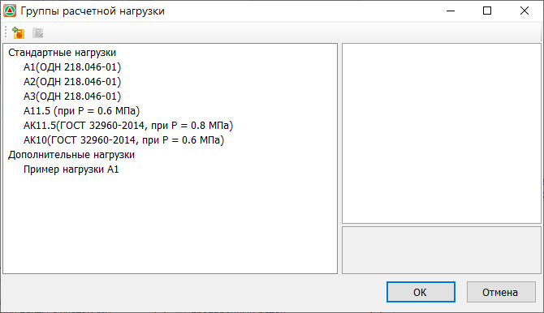

      

      1. Раздел библиотеки «Стандартные нагрузки» доступен только для просмотра, возможность добавления индивидуальных параметров имеется в разделе «Дополнительные нагрузки».
      2. Состав библиотеки нагрузок может отличаться в зависимости от используемой методики расчета (ОДН 218.046-01, ПНСТ 265-2018 и т.д.)

      

   2. Для создания пользовательской расчетной нагрузки нажмите кнопку . Откроется окно, в котором необходимо ввести параметры индивидуальной расчетной нагрузки:

      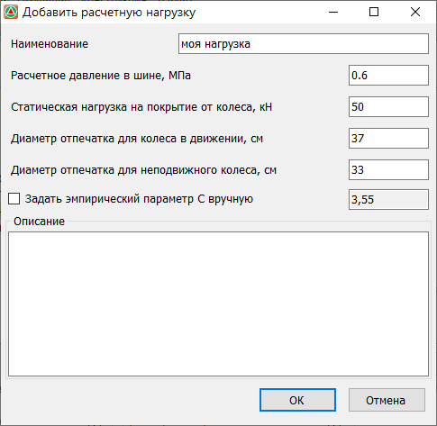

      Задайте в соответствующих полях параметры нагрузки и нажмите **ОК**.

   3. В результате в библиотеку будет добавлена новая нагрузка, которая может быть выбрана в соответствующем выпадающем списке и использована в качестве расчетной:

      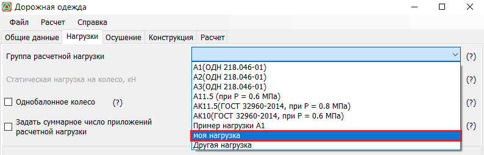





   В группе Стандартные материалы представлен перечень материалов с характеристиками, указанными в соответствующих нормативных документах ( согласно **ОДН 218.046-01**, **ПНСТ 265-2018**, и т.п.). В библиотеке имеется возможность просмотра параметров стандартных материалов, а также добавления новых с индивидуальными расчетными характеристиками.

   

   Добавлять материалы в библиотеку можно также через окно Свойств выделенного материала, на вкладке Конструкция. Подробнее см. п. [Свойства материалов](../roadbed/additionally/advanced_view.md#properties-material).

   

   Для добавления материала в библиотеку:

   1. Выберите меню **Справка – Библиотеки – Библиотека материалов**, откроется окно библиотеки:

      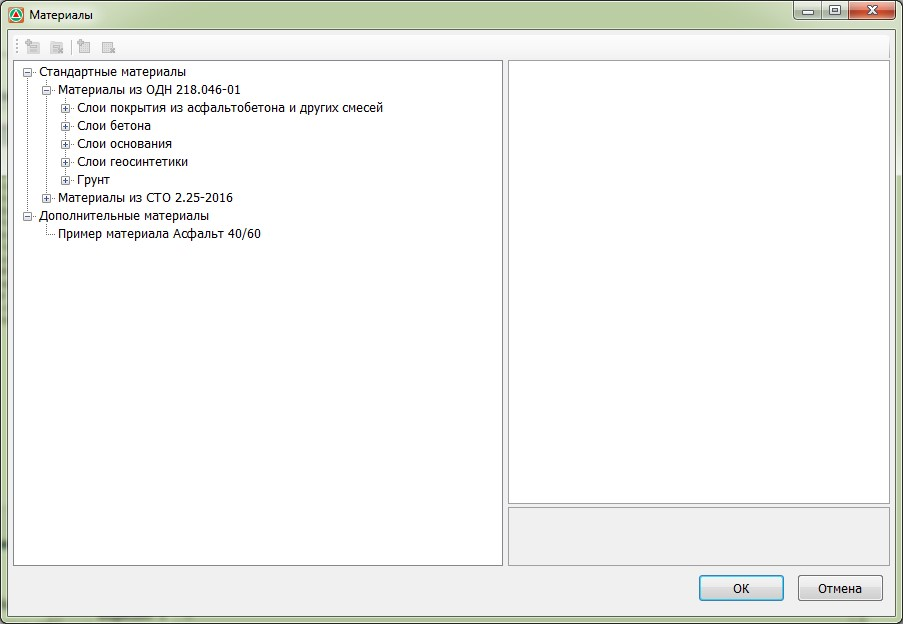

   2. Выделив левой кнопкой мыши раздел **Дополнительные материалы**, нажмите кнопку, откроется диалоговое окно добавления новой группы материалов:

      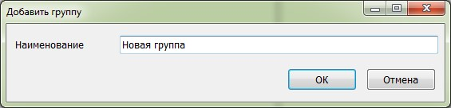

      Введите наименование создаваемой группы материалов и нажмите **ОК**.

   3. Нажмите кнопку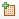 , откроется диалоговое окно создания нового материала:

      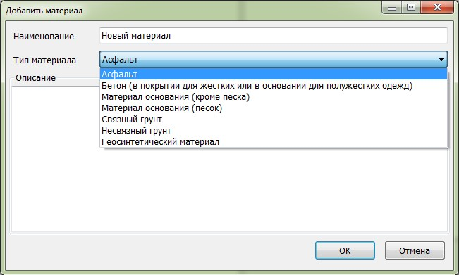

      Задайте **Наименование** и выберите **Тип материала**.

      

      В зависимости от выбранного Типа материала задается используемый в расчете набор свойств.

      

   4. В открывшемся окне **Свойства материала** задайте необходимые параметры и нажмите **ОК**:

      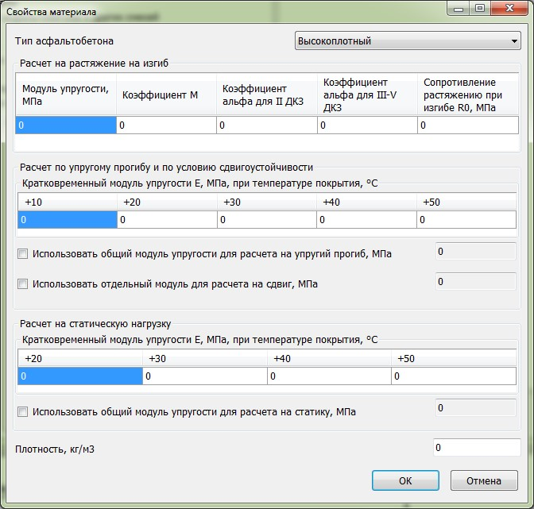

      Включение опции **Использовать общий модуль упругости** позволяет задать и использовать единое значение модуля упругости вне зависимости от температурного режима.

      Опция **Использовать отдельный модуль для расчета на сдвиг** позволяет задать для создаваемого материала отдельное значение модуля для расчета на сдвиг.

   5. В результате в соответствующем разделе и группе добавится новый материал, который с помощью соответствующей кнопки может быть добавлен в рассчитываемую конструкцию дорожной одежды:

      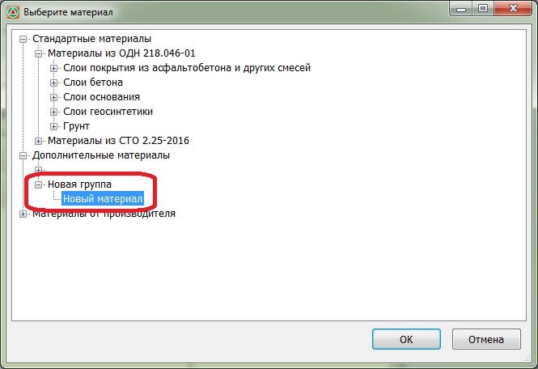





   В данной библиотеке хранятся коэффициенты приведения к расчетному автомобилю. Имеется возможность просмотра стандартных коэффициентов, а также добавления новых с индивидуальными расчетными параметрами.

   Для этого:

   1. Выберите меню **Справка – Библиотеки – Библиотека коэффициентов приведения**. Откроется окно библиотеки:

      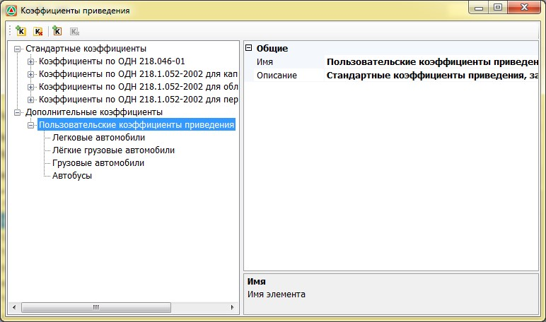

      

      1. Раздел библиотеки «Стандартные коэффициенты» доступен только для просмотра, возможность добавления индивидуальных параметров имеется в разделе «Дополнительные коэффициенты».
      2. Состав данной библиотеки может отличаться в зависимости от используемой методики расчета (ОДН 218.046-01,ПНСТ 265-2018 и т.д.)

      

   2. Для добавления новой группы коэффициентов нажмите кнопку, в открывшемся окне введите ее **Название** и **Описание** и нажмите **ОК**:

      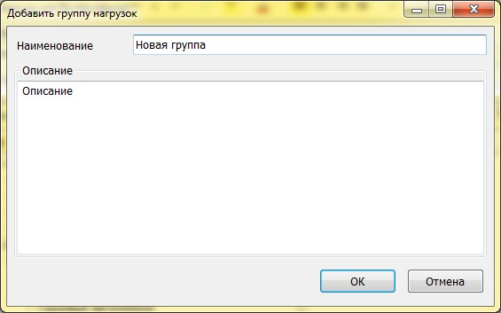

   3. Для добавления новой категории или марки автомобиля и соответствующего ей коэффициента приведения к расчетной нагрузке, нажмите кнопку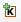, в открывшемся окне задайте **Наименование** и **Коэффициент приведения**:

      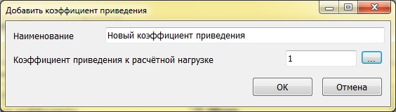

   4. Для создания новой группы автомобилей с рассчитанным коэффициентом приведения нажмите **ОК**.

   5. В результате созданная группа коэффициентов приведения может быть выбрана в соответствующем селекторе:

      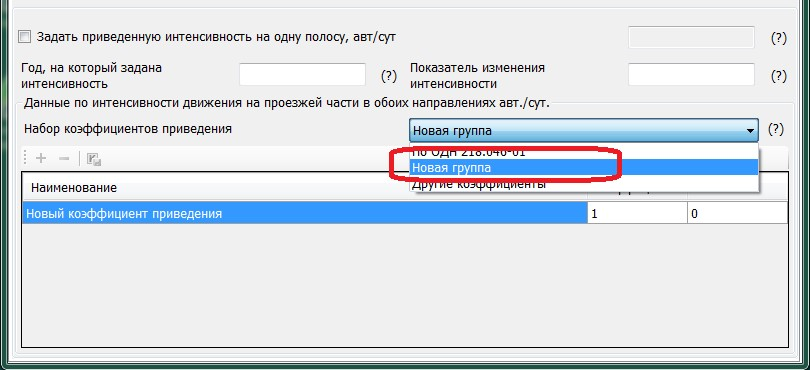

